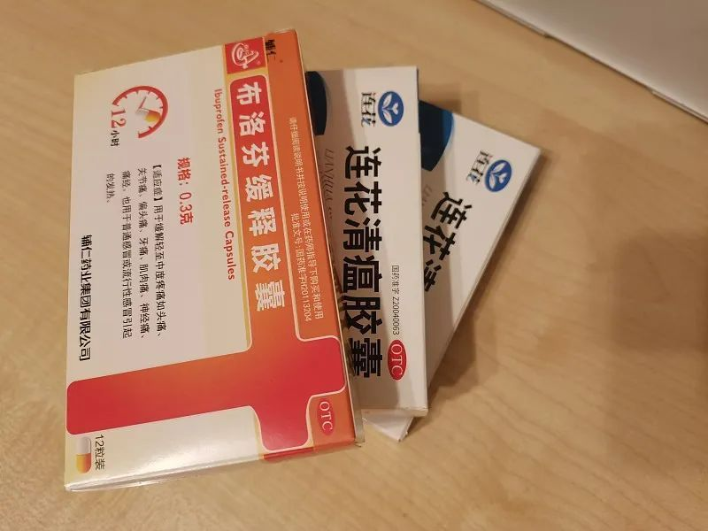
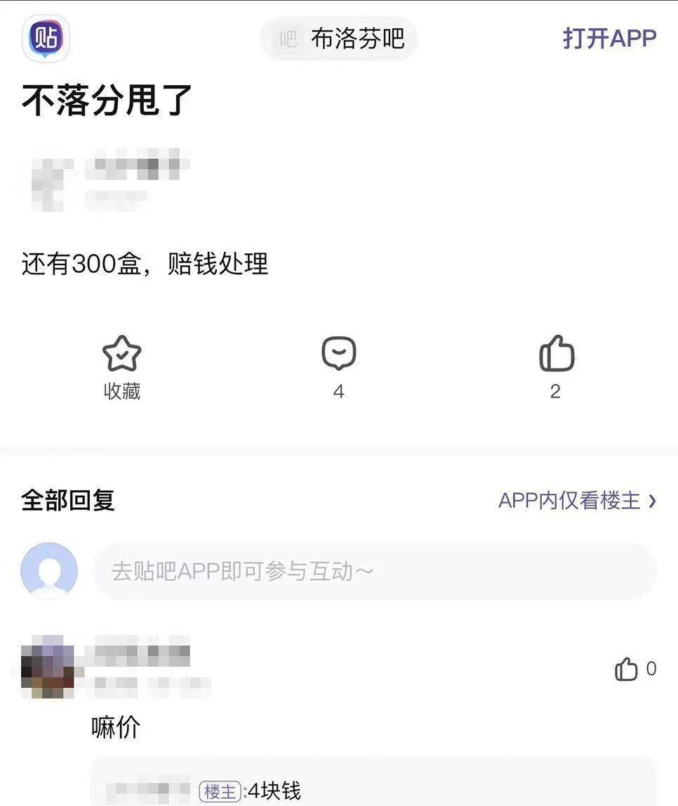
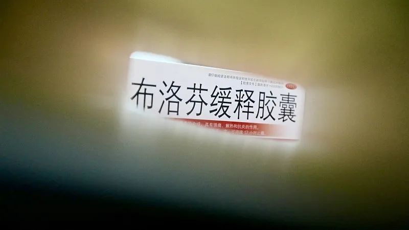
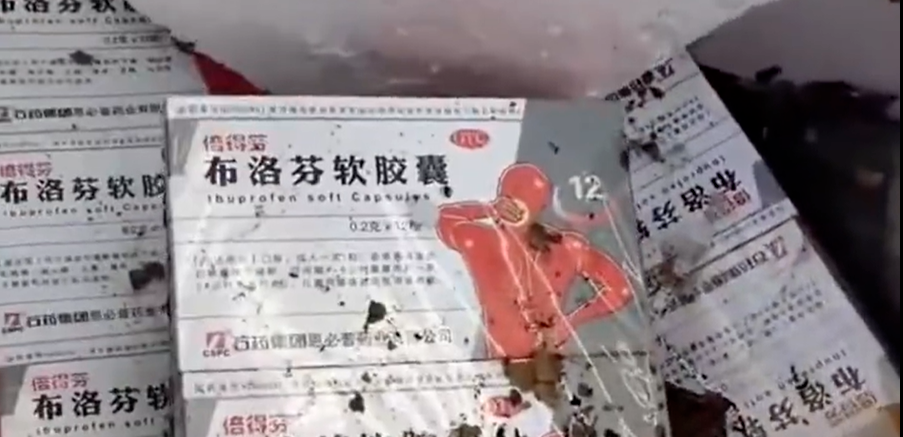
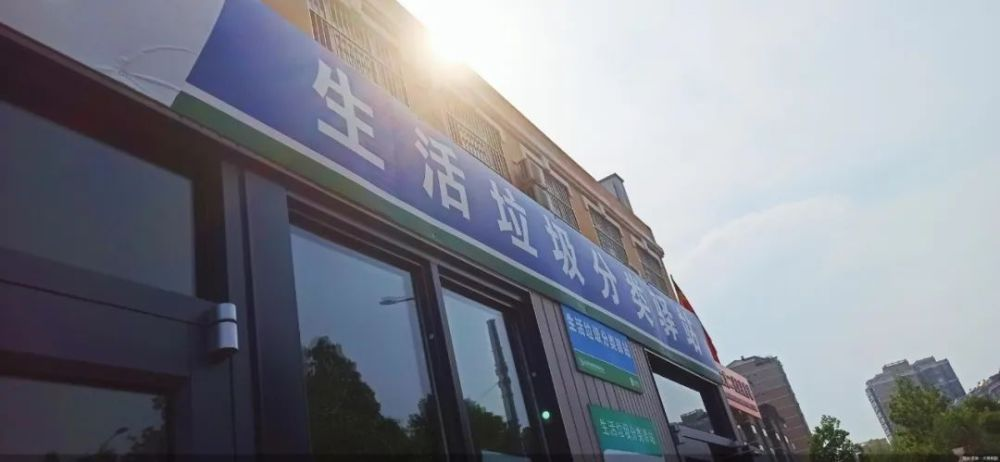
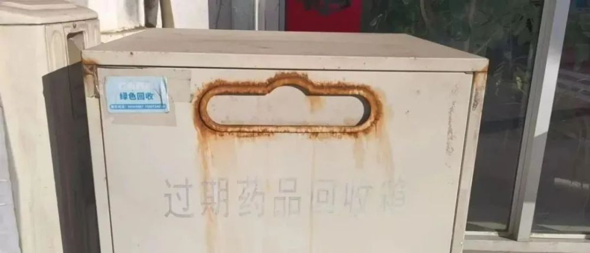
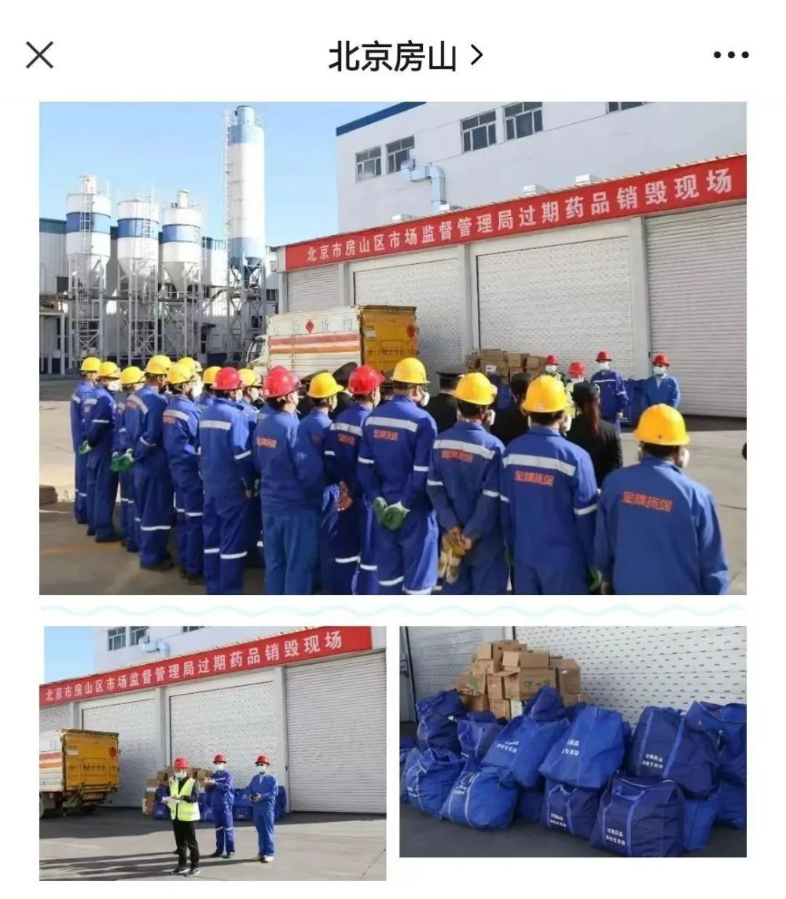

# “4块钱一盒”！被囤防疫药品正隐秘回流市场

全文共4203字，阅读大约需要12分钟

“不落分（布洛芬）甩了，还有300盒，赔钱处理。”贴吧上一位河北网友发帖称。“抢药潮”之后，曾经被炒到上千元一盒的布洛芬开始被低价转售。

此外，囤药潮后，剩余药被扔，过期药如何处理成为市场关注重点。

一段视频日前在网上引发关注，一居民将大量退烧药连同其他药品一起扔在居民楼的垃圾桶里。然而，随意丢弃的药品中的化学物质可能对环境造成污染。

**隐秘的低价转让**

北京商报记者调查发现，在多种社交平台上，都有网友发帖转售彼时曾被抢购的各类防疫药品。除了贴吧里的上述河北网友，也有IP地址在北京、上海、福建、中国澳门等地的网友发出转售消息。

在微博、小红书等上也存在相同的情况。在“布洛芬”微博超话中，自去年12月底开始，便不断有人开始转售防疫药品，转售价格也随着时间的推移逐渐下降。

例如，去年12月27日，一位江西网友以65元的价格转售购入时实付款为38元的布洛芬缓释胶囊（28粒装）。

今年1月8日，即不到两周后，布洛芬缓释胶囊（56粒装）被一位黑龙江网友以56元的价格进行转售。此外，对乙酰氨基酚、蒙脱石散、布洛芬混悬液等一度被
“疯抢”的药品在上述平台中均有人转售。

“如今许多人低价转售防疫药品，原因无非两个：一方面，主要是在疫情期间出现药品短缺的信息刺激下过量囤药造成的；另一方面，是因为许多人对疫情后期形势有良好的预期，觉得囤积的药用不完，时间久了会过期，这让囤药者产生了一些保质期焦虑。”中国科普作协医学专委会青年学组副组长李津告诉北京商报记者。

这或许正是不少转售药品者的心理。“1月到手的，到现在一次也没用过。”小红书上一位转售布洛芬片的“卖家”立立（化名）向北京商报记者介绍，“当时很多人抢都抢不到，我跟着一起抢了4盒，之后一直没有用上就忘了，昨晚打扫的时候才想起来，所以就挂出来准备亏本卖出去回回血。”

“回血”心理或许无可厚非，但转售药品的人并未意识到这一行为已经踩上法律红线。根据《中华人民共和国药品管理法（2019修订）》第五十一条的规定，从事药品零售活动，应当经所在地县级以上地方人民政府药品监督管理部门批准，取得药品经营许可证。无药品经营许可证的，不得经营药品。

同时，《药品网络销售监督管理办法》第七条也明确，从事药品网络销售的，应当是具备保证网络销售药品安全能力的药品上市许可持有人或者药品经营企业，所以一般自然人是不能在互联网上销售药品的。

**过期药品危害大**

然而，囤药潮后，不能买卖又放过期的药品到底应该怎么处理，很多人并不了解。

听过旧衣服、旧玩具回收，但市民小刘直言并不知道过期药还能回收。对于家里过期的药品，小刘都是将其扔进了垃圾桶。优优在去年的囤药潮中也抢购了一波，但最后几乎都没有用上。面对剩余的药品，优优并不知道如何处置。而以前放过期的药，优优通常的做法也是随垃圾扔进了小区垃圾桶。

近日一段视频在网上热议，某网友发现，大量布洛芬连同其他药物一起被扔在楼下垃圾桶里，这些药品均未拆封，保守估计有上百盒，这则视频被发布到网上。另外，有网友晒出自己购买的1000片退烧药，因到货较晚，失去了用途。

_图片来源：新浪微博@大众网潍坊视频截图_

曾一药难求的药品如今被丢弃，污染是首先面对的问题。药品在《药品管理法》里的释义，是指用于预防、治疗、诊断人的疾病，有目的地调节人的生理机能并规定有适应症或者功能主治、用法和用量的物质，包括中药、化学药和生物制品等。而根据我国《国家危险废物名录》（2021年版）附录《危险废物豁免管理清单》规定，家庭日常生活或者为日常生活提供服务的活动中产生的废药品属于生活垃圾中的危险废物。

1.5万吨约是全国一年产生的过期药品数量。据《中国家庭过期药品回收白皮书》，我国约有78.6%的家庭备有家庭小药箱，却有80%以上的家庭没有定期清理药箱的习惯，全国一年因此产生的过期药品约1.5万吨。

过期药品的药效、品性稳定等都可能出现问题。IPG中国首席经济学家柏文喜表示，出现问题的药品导致原先标示的用法、用量等失去参考意义，除了影响预期疗效之外，对过期药品的不恰当处理和随意抛弃等都可能带来对人、动物、环境等方面的污染、误食等危险。

安心医药会客厅主理人安心认为，如果将过期药品倾倒在水源或者土壤中，可能会对当地的生态环境造成负面影响。过期药品还可能被动物或儿童误食，导致不良影响。

**如何正确处理**

随意扔进垃圾桶是大多数人处理过期药的做法，那么对过期药的正确处理方式是什么呢？

丽水市中心医院在官微撰文提到，处理过期药的方法有三种。一是送至回收点；二是丢入红色有害垃圾桶；三是维生素类、矿物质类、调节水、电解质及酸碱平衡药可自行处理。维生素类、矿物质类、调节水、电解质及酸碱平衡药的处理办法是，将包装盒撕毁，防止被他人再次使用，然后将药品从内包装里取出，放在纸袋中，投入到其他垃圾桶。眼药水、溶液剂等液体制剂，将里面的液体倒入下水道，或把液体挤出来混入生活垃圾处理。

而对于过期药的处理，北京市药监局相关人士对北京商报记者表示，需要投放到有害垃圾桶。

部分医疗机构、医药企业和零售药店设有过期药品回收点，将过期药品尤其是抗肿瘤药、毒性较大的药品及《医疗用毒性药品管理办法》所列的毒性中药送至回收点是最简单的处置方法。

早在2006年，北京市房山区就启动了过期药品回收工作，选择了一批管理规范、诚信度好的医疗机构、药品零售企业以及大型社区的居委会等，作为定点回收单位。目前全区的回收点共176个，遍及24个乡、镇、街道，回收过期失效药品40余吨。

多地都曾出台过居民家庭过期药品回收工作实施方案。2022年5月，临汾市市场监督管理局发布消息，全市设立131个家庭过期药品集中回收站点。据悉，苏州市也在多家零售药店和医疗机构设立了1281个过期药品回收点。

海南博鳌医疗科技有限公司总经理邓之东在北京商报记者采访时表示，安全起见，过期药品不能再继续食用。比较专业的处理方法是投放到医院医疗废弃物回收站或药店专用的过期药品回收桶，由相关部门统一集中处理。

“我们应该正确地处理过期药品。”安心也认为，过期药正确的处理方法可能包括将其送往药店或药品回收中心进行回收和处理，或者按照指定的方法将其处理为无害物质。同时，消费者应该定期清理家中的药品储藏室，及时清理和处理过期药品，避免不必要的风险和危害。

**回收意识仍存空白**

尽管送至回收点是过期药最简单的处置方法，但北京商报记者发现，大多数药店机构并没有过期药回收站点。北京某三甲医院宣传科相关人士告诉北京商报记者，并未听过院内有过期药回收点。记者致电朝阳区一国大药房，药房工作人员称，药房不负责药品回收，过期药需消费者自行处理。

“如果回收点离我家20公里，我不会专门过去扔过期药，垃圾桶不是更方便吗？”小刘对北京商报记者说道。

除了便利性外，北京商报记者了解到，部分消费者的回收意识薄弱。2月20日，北京商报记者在北京市房山区一过期药品回收定点单位看到，门口设置的白色过期药品回收箱已经褪色，隐约可见“房山分局监制”的字样，而投放口已经生锈。

药店老板告诉北京商报记者，回收箱放了有7、8年，药监局有专门的科室定期来收，但周边市民的回收意识不强，几乎很少有人过问回收箱的用处，有的市民甚至担心需要收费。

代金券激励是部分药店调动市民积极性的做法。2021年7月，有报道称，湖北省部分药店针对未开封的完整包装过期药物，持该店会员卡可兑换零售价50%金额的代金券，非会员可抵20%代金券，市民需凭身份证登记，一年仅可兑换一次，回收的药品会送到相关主管部门集中销毁。

然而，部分过期药回收仅是阶段性项目。由成都市武侯区市场监督管理局开发的“武侯过期药品回收登记平台”小程序显示，区域内共有30家回收点。北京商报记者致电其中一药店，其工作人员告诉记者，如果家里有过期药的话，需要自行处理，药店目前没有接到通知。“我们去年有回收过，但不是我们发起的，药店只是帮忙收一下，政府牵头，他们进行统一销毁。”

北京商报记者从知情人士了解到，由临汾市设立的131个家庭过期药品集中回收截至2022年12月31日。“今年还有没有开展，我就不太清楚了。”该人士说道。

**回收痛点在哪**

一般来说，药企对过期药品的处置是交给第三方机构进行销毁。一医药企业相关负责人告诉北京商报记者，公司过期的药品需要先走一个销毁审批流程，走完后，药品放在危废库，联系第三方处理机构进行销毁。

对于社会面的过期药回收来说，这个链条就显得更长了。曾参与政府主导回收项目的医药企业负责人告诉北京商报记者，首先需要选择诚信度好的定点单位，比如说零售药店。定好回收点后，政府再确定信誉良好的批发企业，将药品收回来，最后进行销毁。选择信誉良好企业的考量是防止不合格药品流弊事件发生。

过期药品为不合格药品，属于危废垃圾，需要指定的销毁单位进行处理。因此，社会面的过期药回收涉及到零售药店、医疗机构等回收点，药品运输单位以及销毁单位。

2020年10月，房山区市场监管局将2019年以来罚没的不合格药品及回收来的家庭过期药品进行了销毁，本次销毁的药品绝大多数是2019年以来房山区市场监管局在全区设立的170余家过期药品回收点收集的家庭过期药品，共销毁10余吨。这些过期药品在具有医疗废物处理资质的北京生态岛科技有限公司进行了密闭焚烧无害化处理。

_图片来源：北京房山微信公众号截图_

针对过期药销毁等问题，北京商报记者联系了北京生态岛科技有限公司、房山区市场监管局方面，但截至发稿未收到回复。

某参与过政府回收项目的销毁公司相关人士告诉北京商报记者，过期药焚烧首先需要入库，然后人工分拣打包，最后从专用的设备投到水泥窑协同处置。

销毁的费用由省局或者市局负担，但也存在个别公司自费的情况。据北京生态岛科技有限公司某区域经理介绍，目前过期药品危废垃圾的销毁为6000元/吨，单次运费为1500元（不超过3吨），超过3吨后，运费按照500元/吨收费。

在业内人士看来，过期药回收的难点一方面在于公众意识不强，另一方面，对于回收方来说，无利可图。作为定点回收过期药的药店，除了需要设置统一的过期药回收箱，还需安排专人负责回收和专册登记，同时还要做好过期药的仓储等管理工作等。此外，由于过期药的特殊性，需要用专业销毁方式进行销毁，但很多地方销毁费用过于昂贵，不菲的销毁费用可能是制约部分企业继续进行公益事业的瓶颈。

记者丨方彬楠 冉黎黎 姚倩

编辑丨林琴

图片丨北京商报、百度贴吧截图、新浪微博@大众网潍坊视频截图、北京房山微信公众号截图、乐普护生堂供图等

