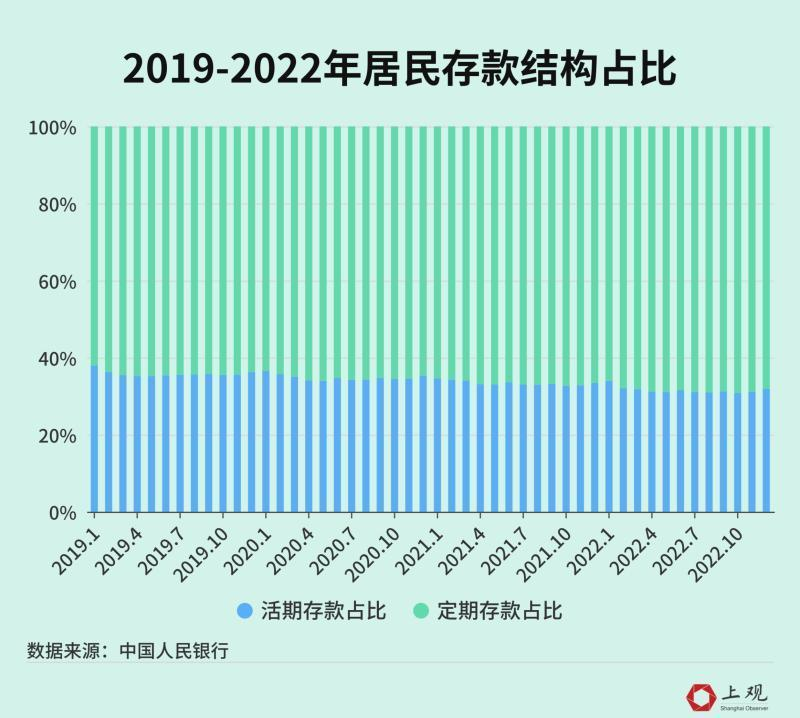

# 中国人存款增长太快？相比绝对值，这些数据更值得重视

近日，“超额存款”相关话题引发网友热议。

人民银行近日披露的1月份金融数据显示，1月份人民币存款增加6.87万亿元，同比多增3.05万亿元。其中，住户存款增加6.2万亿元，创历史同期新高，同比多增7900亿元。

这样的趋势在去年就出现了。2022年人民币存款增加26.26万亿元，同比多增6.59万亿元。其中，居民存款增加17.84万亿元，增速显著高于往年水平。

**人均存款不足9万元**

那么，怎么看待居民存款大幅增加这个现象？

首先来简单看看数字本身。

如果看人均值，可能并没有大家想象那么多。

根据央行公布的1月金融数据，国内住户存款余额为126.2万亿元，若按照最新人口数据，国民人均存款约8.94万元。

如果按照一家三口算，每户也就是30万不到，而根据疫情前美联储和联邦存款保险公司公布的数据来看，美国家庭（每户平均也是三人左右）的平均存款在疫情前为17.5万美元左右，算下来中国家庭仅有其四分之一，考虑到美元和人民币实际购买力，那么这个差距会缩小一半，也就是中国家庭的户均存款，是美国家庭的一半左右。

还要看到，存款还存在地区不平等， **人均住户存款北京、上海、浙江、江苏位列前四**
，分别为26.78万元、21.15万元、12.58万元、10.72万元（注：以本外币住户存款余额除以各地常住人口计算得出，有一定偏差）。

而其他省份都低于人均10万元，还有少数省份低于5万元。

**值得关注的资产配置逻辑变化**

存款快速增长引发了一些担忧，比如有人担忧老百姓不花钱也不投资了。

但也有专家指出，存款是一个货币现象，不能简单对应到经济现象本身，抽象看存款数值的变化没有意义，而更应该细究背后资产配置的逻辑。

从数据上来看，有几个数据值得重视。

一是定期存款占比不断攀升，2022年10月达到69.2%，为近年来新高。这说明 **预防性存款增多，**
或与居民短期消费需求下降有关，同时也可能意味着疫情期间低收入人群收入的下降，因为通常定期存款更多是由高收入人群贡献的。

另一方面，居民存款增多的同时，贷款却在收缩。

根据中国人民银行的数据，2022年居民存款增长规模远超贷款，两者增速呈现剪刀差的态势，贷款增加份额仅占存款的21%左右。

并且，存贷款差额也创新高。相比于2019年，2022年存贷差提高了49.05%， **投资风险偏好呈现保守趋势。**

除了居民外，作为市场另一重要主体， **非金融企业部门也呈现相似的逻辑改变，表现为投资意愿有所下降。**

2022年全年利率维持下行趋势，企业部门的加权平均贷款利率更是降至改革开放以来的最低水平。但即便如此，2022年固定资产投资增速仅有5.1%，低于疫情前的增长水平。

其中， **房地产投资增幅下降最为严重** ，从4月起持续负增长，全年增速为-10%；而经济支柱之一的制造业投资也增长乏力，同比增幅有所下降。

**“资产负债表衰退”压力**

为什么居民、企业在消费和投资行为上的结构性改变，更值得注意呢？

经济学家辜朝明提出过“资产负债表衰退”这一概念，指企业和家庭部门的一种持续性的去杠杆行为，通过减少消费、投资来减少债务、增加储蓄，从“利润最大化”转向“负债最小化”，这会导致信贷循环陷入停滞，从而引起经济衰退。

日本曾在上世纪90年代出现“资产负债表衰退”的现象，无论政府采取多宽松的财政政策与货币政策，GDP中私人消费的增长力明显放缓，投资增速也大幅下降。

在杠杆率上，则表现为居民部门杠杆率长期“躺平”，非金融企业部门杠杆率快速收缩。进入上世纪90年代后，日本居民部门杠杆率冻结在68%左右，非金融企业部门杠杆率更是不断下降，从峰值143%（1993年9月）降至21世纪初的99%左右。

另一方面，为了刺激经济，政府的杠杆率增幅十分明显，政府杠杆率从1990年的47.4%上升至2000年的99.1%，超过了当时世界上大多数国家。

疫情后国内相关数据也出现了类似苗头。

疫情前，我国居民部门、非金融企业部门杠杆率年年涨，十年间共增长106.33%。但自2020年第四季度以来，我国居民杠杆率便不再增加。并且，若扣除个人经营性贷款（包括个体商户贷款和企业股东以个人名义为企业筹集的经营性贷款，实际上应属于企业贷款性质），居民杠杆率已连续下降8个季度。

具体而言，除去个人经营性贷款， **房贷与消费性贷款增速都处于历史上的较低水平** ，分别为1.8%、2.8%。

非金融企业部门杠杆率近期虽有回升，但也无显著增长。2022年杠杆率仅上升6.8个百分点，并且从2022年各季度来看，增幅不断下降，四季度增幅为-0.1%。

而在政府部门杠杆率上，这几年则出现了增加的迹象。政府部门杠杆率，即政府部门债务占GDP比重，从2021年末的46.8%攀升至2022年的50.4%。其中，地方政府杠杆率上升2.5%，中央政府杠杆率上升1.1%。

不过，尽管上世纪90年代日本政府提高杠杆率的行为后续带来了风险，但是需要注意到，当时日本政府杠杆率在国际上已处于极高的水平，而目前中国政府杠杆率远低于日本政府当年的数值。

**我国宏观杠杆率仍有上升空间**

那么，是不是能推断出，中国可能有进入“资产负债表衰退”的风险呢？

**目前来看，这个判断为期过早。**

首先，虽然在2022年后受政府财政政策的影响，政府杠杆率提高，以及GDP增速放缓的原因，我国宏观杠杆率（2022年6月）相比2021年年底提高了9.1%。但
**从全球范围来看，我国宏观杠杆率并不算高。**

并且，由于我国国民储蓄率较高，各部门在债务增加的同时也累积了较高质量与数量的资产，安全性更高，金融周期的上行空间更大。

分部门看， **中国居民部门负债率为61.9%，在全球处于中等水平**
，略高于新兴市场的平均水平，但仍远低于发达国家的平均水平，更显著低于日本、美国在危机时期的峰值。

由于中国居民杠杆率还统计了类似于企业债务的具有自偿性的经营性债务，拉高了居民杠杆率。剔除了这部分债务后的居民杠杆率进一步降低。

**我国政府杠杆率相对于发达经济体也处于偏低水平**
，根据国际清算银行的数据，截至2022年6月1日，发达经济体政府部门的杠杆率为105.6%，欧元区为94.3%，而我国仅为50.4%，债务风险总体可控。

相比之下， **处于较高水平的是我国的企业杠杆率**
。一方面，国有企业前几年的负债率下降趋势有所减缓，2022年1-12月，根据财政部的统计数据，国有企业资产负债率为64.4%，同比增加0.4%。另一方面，因为疫情，民营企业的负债率有所上升，尤其在地产等受影响较大的行业，
**中小企业、民营企业的现金流风险值得关注。**

总体而言， **中国的债务结构呈现出企业部门债务水平过高，而居民和政府部门仍有加杠杆空间的特点，**
这为未来调整资产负债结构、投资转化提供了基础。根本性的问题还是要提高预期、强化信心，让老百姓敢花钱。

财政部在2022年度财政收支情况网上新闻发布会上指出，在居民部门杠杆率有所下降、企业部门资产负债接近衰退的背景下，为实现经济稳增长目标，政府部门在宏观杠杆率方面应更加积极，即政府部门加杠杆，以增强私人部门的信心，实现经济复苏。

