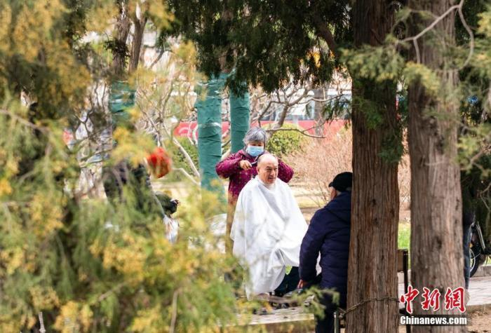

# 二月二“龙抬头”，这个“龙”从何而来？

中新网北京2月21日电(记者 上官云)“二月二，龙抬头，风调雨顺好年头。”热热闹闹的元宵节过后，春龙节来了，也就是人们常说的“龙抬头”。

它是一个传统节日，在农业上也具有重要的象征意义。春回大地，万物生机勃勃，春耕有序展开。对外经济贸易大学中文学院讲师赵运涛表示，“龙抬头”的由来与自然天象有关，它的习俗丰富多样，有舞龙、社戏以及各种庙会。

饮食习俗更是有趣。老北京人要吃春饼，称为“吃龙麟”。此外，吃面条又被称为“吃龙须”，吃饺子被称为“吃龙耳”，吃馄饨叫“吃龙眼”等等。

_资料图：图为舞龙队员进行精彩舞龙表演。陈鑫
摄_

**源于自然天象崇拜？**

“龙抬头”是一个重要的传统节日。有观点认为，它起源于自然天象崇拜，与上古时代人们对星辰运行的认识以及农耕文化有关。

中国二十八星宿中，古人将东方七宿角、亢、氐、房、心、尾、箕的组合想象成龙的形象，按阴阳五行给五方配色之说，认为东方为木，属青色，故称其为“青龙”或“苍龙”。

《说文解字》称：“龙，鳞虫之长，能幽能明，能细能巨，能短能长，春分而登天，秋分而潜渊。”而当地平线上渐渐露出龙“角”，说明春天来了，即民谚所言“龙抬头”。

也就是说，“苍龙七宿”冬季时隐没在地平线下，等到农历二月初以后，黄昏时，角宿就从东方地平线上出现，但苍龙的身体仍隐没在地平线之下，所以是“龙抬头”。

赵运涛说，龙有很多吉祥的寓意。在古代，尽管礼制森严，但平民百姓并没有放弃对龙的喜好和崇拜，节日里要有龙，如正月十五要耍龙灯、舞龙；二月二“龙抬头”等等。

**一个祈求风调雨顺的日子**

不过，需要注意的是，这个节日也经历了一个有趣的演变过程。

赵运涛表示，大约在唐宋时期，人们已经开始过“二月二”，只不过最初“二月二”和“龙抬头”还没有太大关系，其习俗主要是挑菜、踏青等。

等到南宋时期，出现了有关“龙抬头”的记载，如“今朝二月二，暂放龙抬头”。元代《析津志》提到，“二月二日，谓之龙抬头”。

在明清时期记载岁时节日的典籍中，“二月二日龙抬头”的说法更为明确一些。如明代的《帝京景物略》记载：”二月二日曰龙抬头”。

_资料图：正值农历二月初二，湖南长沙石燕湖举行“龙抬头”龙舟赛。杨华峰
摄_

从节日内涵以及习俗上来看，自古以来人们便将“龙抬头日”作为一个祈求风调雨顺、驱邪攘灾、纳祥转运的日子。

**阳气生发，万物复苏**

在农业上，“龙抬头”也具有重要的象征意义。

赵运涛举例，比如“二月二，龙抬头”象征着万物复苏，接下来的一个节气就是惊蛰，古人认为，龙是百虫之长，它得先醒来，到了惊蛰，才能春雷乍动、唤醒万物。

当然，有些害虫醒来后，有可能会危害人或者庄稼。所以人们会在这一天“熏虫”，将害虫提前消灭掉。

古人认为“二月二”迎来青龙，龙主管着下雨，此后雨水也就越来越多了，适合耕种的季节就此到来。恰如民谚所说“二月二，龙抬头，大家小户使耕牛”。

南方此时有祭祀社神的习俗，祭祀社神继承的是传统“春社”的习俗，春天是耕种的开始，人们祭祀土地神，希望秋天能有个好收成。

赵运涛认为，北方比较缺水，古人认为龙主管降雨，所以北方地区的人们往往对龙的崇拜更高一些，而南方雨水比较充足，人们对土地的依赖更高一些。

所以，同样都是过“二月二”，北方地区的习俗大多是将饮食、舞龙等习俗与“龙”结合起来，希望多下雨；南方地区则是“土地崇拜”，会有祭社神等种种习俗。

_资料图：图为舞龙现场。赵玉梅
摄_

在农耕文化中，“龙抬头”标示着阳气生发，万物复苏，春耕生产渐次展开。所以，这个节日又被称为“春耕节”“农事节”“春龙节”等等。

**饮食习俗有哪些？**

正因为人们喜欢龙，所以“二月二”时的很多饮食都以龙“冠名”，极富生活气息。

清朝《帝京岁时纪胜》里说：“都人用黍面枣糕麦米等物油煎为食”，也就是说那时北京人要吃一种类似煎饼的食物，这大概就是民间说的“吃龙皮”。

另外，老北京人还要吃春饼，春饼卷起各种菜，一层一层的，称为“吃龙麟”。有趣的是，吃面条又被称为“吃龙须”，吃饺子被称为“吃龙耳”，吃馄饨叫“吃龙眼”等等。

也有些人家会准备炒糖豆的原料，到了“二月二”早上，用糖炒花生和黄豆，香甜可口。有些地方讲究煎焖子、吃猪头肉。很多习俗都寄托了人们祈龙赐福的愿望。

为何人们会把这一天吃的东西跟“龙”联系起来？赵运涛认为，这实际寓意“唤龙”，嘴里不断念叨“龙”字，龙听到后就会醒来，开始一年的工作，比如降雨。

在上海、江苏等地要吃撑腰糕，据说吃了以后未来一年都不会腰疼；有的地方要吃芥菜煮成的粥，据说可以明目，不生疮疖。

**舞龙、社戏……热闹的节日**

饮食之外，“二月二，龙抬头”其实非常热闹，有舞龙、社戏以及各种庙会等等。

_资料图：北京市民在街头休闲区理发。当天是中国农历二月初二，民间有“二月二，剃龙头”的传统习俗，寓意辞旧迎新，带来好兆头。
中新社记者 侯宇 摄_

据明朝《帝京景物略》记载，“小儿以木二寸，制如枣核，置地而棒之，一击令起，随一击令远，以近为负，曰打柭柭”，这是一种小孩子的比赛，大概类似打棒球。

“龙抬头”之日，人们用草木灰从院子里蜿蜒撒到屋里，并围绕水缸转一圈，这叫“引龙过”或者叫“引龙回”，把龙引到自己家水缸，就不会缺水，也有保佑一家平安吉祥之意。

每逢农历二月初二，人们还用草木灰在庭院内或者菜地等处，画出仓囤的样子，里面放上钱币或者五谷粮食，称为“打灰囤”，寓意来年钱粮满仓、五谷丰登。

过去，人们认为“二月二”是一年开耕的起始，都愿意讨个好兆头，民谚说“二月二，龙抬头，大仓满，小仓流。”南方祭祀社神，仪式虽然不同，但也是同样的寓意。

《帝京岁时纪胜》记载，“(二月)二日为龙抬头日……小儿辈懒学，是日始进书房，曰占鳌头。”此时小孩上学入书房，叫“占鳌头”，举行开笔礼，祝愿孩子长大断文识字。

二月初二儿童理发，则叫做剃“喜头”，借龙抬头之吉时，保佑孩子健康成长；大人理发，希望带来好运，新的一年顺顺利利。

赵运涛认为，总的来说，各地虽有习俗上的差异，但在“二月二”祈盼风调雨顺、健康平安的愿望是相同的，这一节日，寄托了人们对未来的美好希望。(完)

