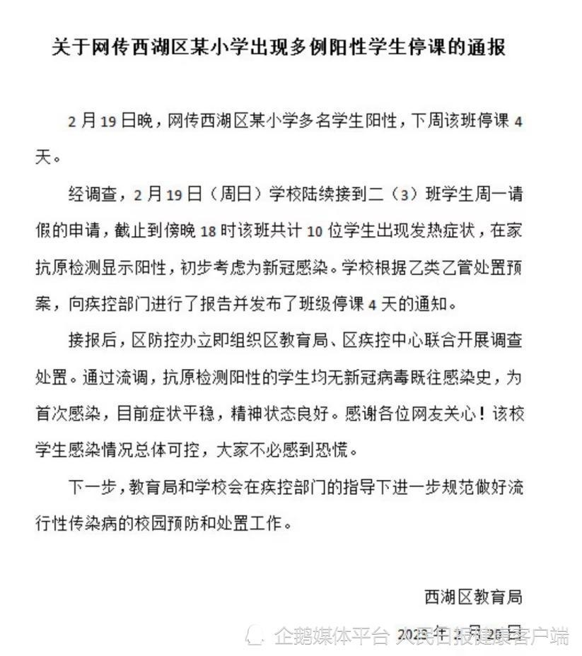

# 多地学校因新冠、甲流等停课，专家：稳妥做法不必慌

**人民日报健康客户端记者 徐诗瑜**

最近，多地学校因新冠感染、甲流等发布停课通知。

2月20日，据浙江省杭州市西湖区教育局通报，截至2月19日18时，西湖区某小学二（3）班共有10位学生出现发热症状，抗原检测阳性，初步考虑为新冠感染。学校根据“乙类乙管”处置预案，发布班级停课4天的通知。

据《新民晚报》2月21日报道，上海青浦一小学某班级确诊4例流感，多名学生发热，有流感症状。自2月20日至23日停课4天，改为线上教学。青浦区教育局表示，学生们患的是甲流，并非新冠。

2月以来，上海青浦、天津北辰、浙江宁波、浙江金华等地也出现部分学校部分班级因学生发烧停课的情况，发烧原因为甲型流感。

**“因麻疹、水痘、流感、手足口病等传染病导致的停课是很常见的疫情应对方式，当学校内出现一定数量的病例后，为避免校园内疫情的进一步扩散，学校会采取小范围停课的方式来应对，大众不必因为‘停课’二字而过度恐慌。”**
南方科技大学公共卫生及应急管理学院流行病学教授魏晟告诉人民日报健康客户端记者，新冠纳入“乙类乙管”后，也应采取类似的方式来应对新冠疫情。在新冠疫情发生时，最重要的是各地要具有相应的救治能力，只要救治不发生挤兑，对于整个社会的影响相对较小。

**“学生需要聚集上课，而教室是封闭环境，因此学生是呼吸道传染病最容易被感染的群体之一。这种情况在其他呼吸道传染病流行过程中也会发生，还不能说是新一波流行的开始。”**
南方医科大学公共卫生学院生物安全研究中心主任赵卫在接受人民日报健康客户端记者采访时表示，学校在征询当地教育局以及疾控中心的意见后，做出停课4天的决定，是谨慎和稳妥的做法，学生及家长不必恐慌。在这4天里可以对感染学生的临床症状进行观察，如果和既往没有大的变化，再重新恢复线下教学，对新冠感染这个公众关注的话题来说，有助于缓解本班和其他班级未感染学生的恐慌情绪。

赵卫介绍，甲流和新冠病毒感染的首发症状较为相似，均会出现发热、咳嗽等症状，需要通过核酸或抗原检测的方法才能区分。这两种传染病均是在确诊以后需要居家隔离。同时，家长也要密切关注孩子的症状变化，一旦加重，尽快到医院治疗。甲流在我国属于丙类传染病，引起的疫情没有新冠严重，当前流行甲流的致病力和传播力还有待于观察。

此外，赵卫表示，不同的传染病、不同的地区停课标准有一定的差异，如有的地区规定，对于手足口病，一周内同一班级或宿舍发生2例及以上手足口病病例可建议班级停课，有3个班级分别发生2例及以上手足口病病例可建议全校停课。总之，学校要在及时上报疫情的同时根据专业防疫人员的建议做决定。

