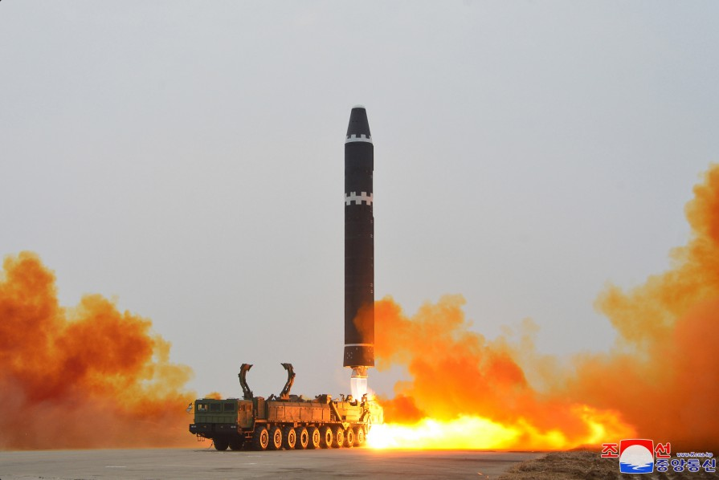
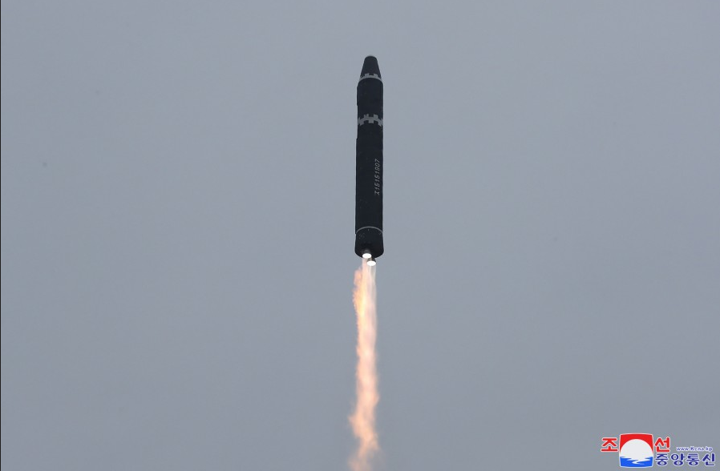
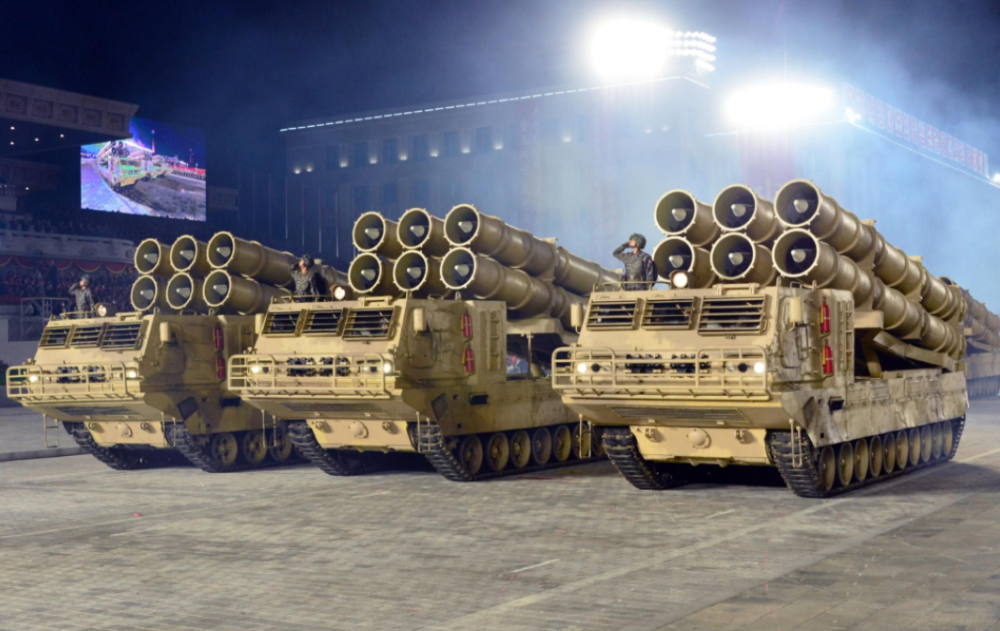
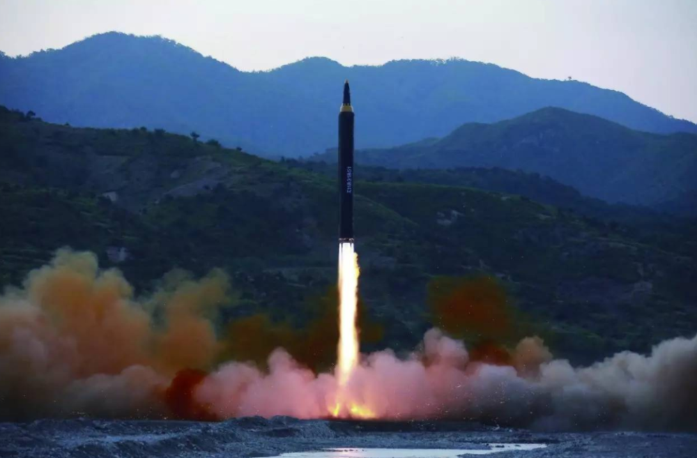

# 朝鲜连续试射导弹，“将太平洋当作射击场”言论释放何种信号

射导VS联合演习，朝鲜与韩美上演新一轮对抗。

继18日进行发射洲际导弹训练后，朝鲜在2月20日上午进行火箭炮射击训练，回应美韩联合空中演习。朝鲜称，该火箭炮属于“战术核攻击手段”。

韩国联合参谋本部19日表示，韩美当天在朝鲜半岛上空实施了联合空演，并投入了美国战略武器，美空军B-1B轰炸机参加了演习。

_“火星”-15导弹发射升空。_

**出人意料的“火星”-15发射**

在朝鲜官媒正式发布“火星”-15导弹发射训练新闻之前，韩国军方和日本自卫队最先向外界公布朝鲜发射导弹的信息。

韩国联合参谋本部18日发布消息称，韩军方探测到朝鲜在平壤顺安一带向半岛东部海域发射一枚疑似远程弹道导弹。军方和情报部门认为，朝鲜很可能发射“火星”-17型洲际导弹，正就具体参数进行精密分析。

据日本防卫省推测，导弹可能落在北海道渡岛大岛以西的海域，飞行距离约900公里，最高飞行高度为5700公里。

由于朝鲜在2月8日阅兵式上首次公开了疑似采用固体火箭发动机的新型洲际导弹，因此，除了韩军猜测的“火星”-17导弹，外界还猜测可能试射了新型固体洲际导弹。

2月8日晚，庆祝朝鲜人民军成立75周年阅兵式在平壤金日成广场举行，阅兵式上展示了多种新型武器，其中首次亮相的新型洲际导弹和12辆“火星”-17导弹发射车的集中展示引发外界高度关注。

但出人意料的是，朝鲜19日公布的照片显示，此次发射使用的是“火星”15导弹。

根据朝中社公布的信息，朝鲜18日下午在平壤国际机场高角度发射一枚“火星”-15洲际弹道导弹。报道称，此次发射系按照18日凌晨的紧急指示以及当天上午朝鲜最高领导人金正恩下达的命令书紧急组织进行的，导弹精确打击了位于朝鲜东部公海的目标水域。

据报道，发射训练由朝军导弹总局指导，由洲际弹道导弹运营部队中发射经验丰富的第一红旗英雄连参加。导弹上升至最高顶点高度5768.5公里，用4015秒时间飞行距离989公里，精确打击朝鲜东海公海上的目标水域，被评为“优”。

_“火星”-15采用液体火箭发动机。_

朝中社指出，通过突袭发射训练再次确认和验证武器系统的可信度，同时突显朝鲜核武力的备战状态，证明对国家核遏制力组成部分的正确的运行性、反应性、信赖性、效果性和战斗性的确信和保证。朝鲜劳动党中央军事委员会高度评价洲际弹道导弹部队具备灵活而威力强大的反击准备状态的实战能力。

随着“火星”-17和新型洲际导弹的出现，外界对“火星”-15导弹的关注度大幅下降。2017年11月，朝鲜首次试射“火星”-15导弹。朝鲜中央电视台报道称，“火星”-15洲际弹道导弹可以打击到美国本土，各方面性能比“火星”-14洲际弹道导弹大幅提高。

2019年，驻韩美军司令部发布了《驻韩美军2019战略概要》，对朝鲜多种弹道导弹进行了评估。评估认为“火星”-15导弹射程超过1.2万公里，覆盖美国本土大多数地区。

日本防卫大臣滨田靖一18日表示，推测导弹实际飞行69分钟，射程最远可超1.5万公里。在这种情况下，可涵盖美国本土。

导弹专家李文盛告诉澎湃新闻（www.thepaper.cn），此次朝鲜官媒报道“火星”-15导弹发射使用“训练”一词值得关注，向外界传递的信息是：这是该导弹发射是部队的一次发射训练，不是导弹测试，外界应习惯朝鲜常态化导弹发射活动。

军事专家韩东分析认为，此次朝鲜进行“火星”-15导弹发射活动有两个方面值得关注：一是此次导弹发射是该型导弹最远的一次，根据朝鲜官媒公布数据估算，导弹射程至少超过1.4万公里，比之前外界估计的1.2万公里又更远一些，覆盖美国本土；二是“训练”一词意味着朝鲜“火星”-15已经批量装备部队，是朝鲜战略核力量的主力，能够承担核反击的重任。

_朝鲜在阅兵式上展示的超大口径火箭炮。_

**“将太平洋当作射击场”言论引发关注**

除了进行洲际导弹发射，朝鲜在2月20日上午还进行火箭炮射击训练。根据朝中社报道，此次射击训练动用了600毫米超大口径火箭炮，发射的两枚火箭弹击中了395公里和337公里外的海上目标。报道称，600毫米火箭炮是朝军最新型多连装精密攻击武器系统，属于“战术核攻击手段”。

朝军曾在去年12月对这款超大型火箭炮进行性能验收试射，朝鲜最高领导人金正恩出席交付仪式时表示，这款口径为600毫米的超大型火箭炮是朝鲜武装力量的“核心攻击武器”，具备强大的地形克服能力、机动性和连续精确突击打击能力。据称，这款火箭炮可携带战术核弹头。

“18日进行可携带战略核弹头的洲际导弹发射，20日进行可携带战术核弹头的火箭炮发射，两次发射向外界展示了朝鲜的战略和战术核打击能力。”韩东介绍说。

朝中社指出，火箭炮射击训练是对韩美19日联合空中演习的回应。

韩国联合参谋本部19日表示，韩美当天在朝鲜半岛上空实施了联合空演，并投入了美国战略武器。韩国空军出动了F-35A和F-15K战机，美国空军F-16战机，为进入韩国防空识别区的美军B-1B战略轰炸机进行护航并实施联合编队飞行。10余架两国战斗机参演，这些战机从半岛西部海域穿越南部地区飞往东部海域。

2月17日，朝鲜外务省发言人当天发表谈话，谴责美国和韩国从2023年初大搞严重侵害朝鲜安全利益的武力示威。发言人表示，美韩筹划今年进行20余次各种联合军演，预示着朝鲜半岛和地区局势将会再次陷入严重的紧张激化漩涡，朝方不得不作出反应。

_朝鲜试射“火星”-12导弹，该导弹射程超过4000公里。_

2月16日，韩国国防部发布新版国防白皮书，其中明确称“朝鲜政权及军队是我们的敌人”。这是韩国在2016年国防白皮书后时隔6年再次在国防白皮书中称朝鲜为“敌人”。

对于导弹和火箭炮发射训练，朝鲜劳动党中央委员会副部长金与正20日发表谈话，称朝鲜将太平洋当作本国射击场的频率取决于美军行动的性质。

据朝中社20日报道，金与正强调，朝鲜已拥有了令人满意的弹道导弹技术和能力，现在剩下的只是致力于增加其数量。她表示，韩国与其为别人的技术怀疑或担心，不如花点心思提升自己的防御措施。

金与正表示，朝方很清楚美军在朝鲜半岛地区的战略打击行动日益活跃。朝方正在缜密分析相关行动对国家安全的影响。金与正指出，我们借此机会重申，只要认定这将给朝方带来任何直接和间接的担忧，我们就会予以相应的应对，朝鲜将太平洋当作本国射击场的频率取决于美军行动的性质。

这是朝鲜官方首次在讲话中提及“将太平洋当作本国射击场”，这也引发了外界对朝鲜是否会向太平洋深处发射洲际导弹的讨论，朝鲜试射中远程和洲际导弹通常以高角度进行，导弹落点均在日本海，比如此次试射的“火星”-15也采用了高角度发射。分析认为，朝鲜采用高角度发射是为了避免刺激周边国家，采用高角度发射可以缩短飞行距离。

但朝鲜也曾两次进行正常角度发射中远程导弹。2017年8月，朝鲜发射
“火星”-12导弹，导弹飞越日本北海道上空，落入北海道以东1180公里的太平洋海域；去年10月，朝鲜“火星”-12导弹发射再次选择正常角度，导弹飞越日本上空，飞行距离超过4000公里。

“日本海也属于太平洋的一部分，金与正‘朝鲜将太平洋当作本国射击场’的言论是传递准备向太平洋深处进行导弹发射活动还是向日本海发射导弹，还有待进一步观察。”韩东分析指出，“朝鲜还未向太平洋深处进行洲际导弹发射活动，若以正常弹道进行洲际导弹发射，那将是朝鲜洲际导弹发展方面的一个突破。”

