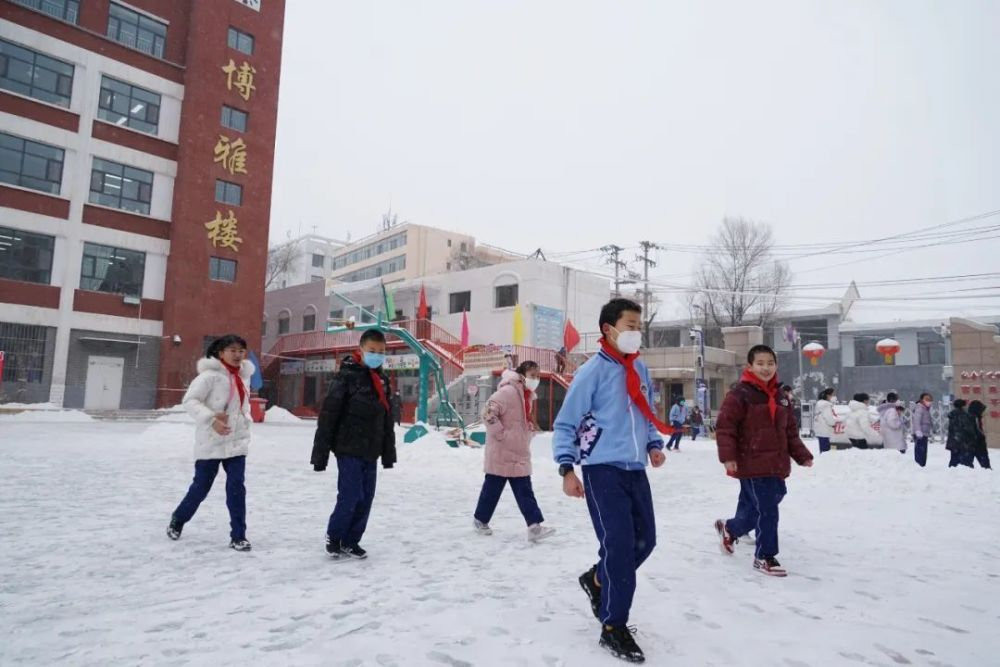

# 杭州学校现15例阳性病例，专家：新冠没有消失

2月19日，一则“杭州两学校班级多人发热，下周停课”的消息引发关注。据当地政府部门20日最新通报，目前涉及杭州三所学校，分别是西湖区某小学（共出现10例）、拱墅区某中学（共出现5例）；另外，上城区某小学12名学生有发热症状，为流感聚集性传播。

根据杭州市西湖区教育局20日的最新通报，2月19日，学校陆续接到某校二（3）班学生周一请假的申请，截止到傍晚18时，该班共计10位学生出现发热症状，在家抗原检测显示阳性，初步考虑为新冠感染。学校根据“乙类乙管”处置预案，向疾控部门进行了报告，并发布了班级停课四天的通知。

目前，西湖区防控办已经组织区教育局、区疾控中心联合开展调查处置。通过流调，抗原检测阳性的学生均无新冠病毒既往感染史，为首次感染。《中国新闻周刊》试图联系西湖区疫情防控指挥部门，截至发稿，电话一直未有人接听。

新冠并没有消失。根据中国疾控中心2月18日最新发布的《全国新型冠状病毒疫情情况》，自从去年12月的疫情高峰以来，新冠病毒感染人数虽已大幅降低，但是新冠感染人数仍然存在。2月3日到2月16日，全国每天新增感染者都在5000例以上。

校园是疫情防控的重点场所，在整个社会处于新冠低流行水平的背景下，多大程度上放开校园管控措施值得商榷。中国疾控中心一位专家在接受《中国新闻周刊》采访时表示，对于新冠病毒，他认为，从防控到关注度，社会应该把握一个合适的尺度，要根据不同的人群、季节和场所等进行适度调整，不能从过分紧绷到彻底放任自流。

学生为首次感染，并不是第二波疫情

学校出现阳性病例，是第二波感染来了吗？

根据杭州官方发布的最新信息，杭州这次个别班级出现学生感染新冠病毒，均为首次感染，属于正常现象，并不代表新一波流行的开始。杭州市疫情防控指挥部相关负责人介绍，目前甲流、诺如病毒感染也已经进入多发期，即便孩子出现发烧等症状，也不一定是由新冠病毒引起。

“无论是社会上还是医院里，零星的新冠病毒感染，也就是低水平的流行一直都在，全国每天至少还有几千人检测出新冠阳性。学生恢复线下教学，再聚集之后，就容易出现新的感染。”杭州市富阳区疾控中心主任医师李欢龙告诉《中国新闻周刊》。

整个社会中，新冠病毒并没有消失。根据中国疾控中心2月18日发布的最新数据，从新冠核酸检测情况来看，检测阳性率在2022年12月25日达到高峰（29.2%）后波动下降，2月16日为1.1%。

2月以来，中国疾控中心已发布了6次《全国新型冠状病毒感染疫情情况》。依据中疾控通报，1月30日核酸检测阳性数2.4万例，2月6日核酸检测阳性数为0.9万例，2月13日为8847例，2月16日为10720例。此外，从2月16日数据来看，全国发热门诊就诊人数有12.4万人次，在院新冠病毒感染者有2万人，重症患者56例。

中国疾控中心一位流行病专家告诉《中国新闻周刊》，除了极个别的人，整个人群感染新冠病毒的概率是一直存在的，只是早晚而已。之前没有被感染的人群里面，确实会形成小的一些波峰或者局部的小流行，这种情况是正常的。

另一方面，像校园、养老院这样人员密集、脆弱人群集中的地方，这位中国疾控中心专家指出，过去防控比较严格，很多人得以避开病毒、推迟了感染时间。社会整体放松之后，除非继续保持与过去一样的防控强度，否则此起彼伏的小规模疫情，基本上是很难避免的。

虽然都经历过大流行，但不同的省份感染率也存在一定差别。2月19日，北京大学公共卫生学院教授李立明等人发表在《中华流行病学杂志》的一篇文章通过问卷调查，了解部分高校公共卫生学院教职工和学生中，新冠感染的新近流行现况。2022年12月20日至23日，研究者们在国内23个省份32座城市的39个高校公共卫生学院开展了调查，实际共回收问卷34400余份。

这次调查发现，各省份感染率差异较大，师生感染率分布前三位的省份为北京、天津、河北，均已超过65.00%；南方的一些省份，包括上海、江苏、江浙、贵州等地区，学生感染率比较低。其中，在浙江省收到的1027份问卷中，只有180名学生感染过，感染率为17.53%，在被调查省份中，学生感染率为倒数第三。

李欢龙分析，过去一段时间，国内从去年底到今年初有90%以上的人感染，且几乎是同步感染，建立了比较强大的免疫屏障。这一次这些感染的学生，也被确认过此前没有被感染，说明人群对新冠病毒的免疫力还是有效的，至少从目前来看，并不是第二波新冠感染潮来袭。

在2月9日的国务院联防联控机制新闻发布会上，中国疾控中心流行病学首席专家吴尊友指出，这个时段，全国范围内人群的免疫保护力处于较高的时期，新冠疫情在未来可能会断断续续在局部地区、部分人群、一段时间内发生，全国出现短时间集中大规模流行的可能性比较小。

不过，突变株可能是一个值得关注的变量。根据中疾控监测，2022年9月26日至2023年2月16日，全国共报送约2.6万例本土病例新冠病毒基因组序列，均为奥密克戎变异株，共存在78个进化分支，主要流行株为BA.5和
BF.7。

近来，关于“国内首次本土检出XBB.1.5”的相关报道引起广泛关注。根据中疾控2月18日的通报，2022年12月以来，全国共发现本土重点关注变异株15例，包括1例XBB.1，1例XBB.1.5，1例BQ.1，5例BQ.1.1。其中1例BQ.1，为本周期新增变异株病例。2月15日发布的通报中还新增了1例XBB.1.5毒株。

多位受访疾控人士表示，要重点关注此次感染学生所感染的病毒株；如果基因测序结果显示是新的突变株，那么情况就值得引起警惕，要观察其会不会扩散，引起周围的学生、家长，尤其是那些已经感染过的密接人群的再次感染。在对新变异株不了解的情况下，前期防控措施更应快速、谨慎一些。

不能彻底忽视新冠，强化重点场所防控

2月13日起，各地陆续迎来新冠病毒感染“乙类乙管”后首个开学季，近3亿师生将大规模集中返校。

_2月13日，青海省西宁市昆仑路小学。当日，青海省西宁市中小学全面开学。
中新社记者 马铭言 摄_

前述中国疾控中心专家指出，尽管看起来全社会已经很大程度上放松了新冠疫情防控措施，对于学生，尤其是低龄儿童来说，校园防控措施的相应强度不该大幅下降，甚至是要加强的。

一方面，他说，这部分人群在过去三年的高强度防控中，减少了与各种病毒、细菌的接触，免疫力有所下降，是更加易感的人群，可以称之为疫情后的“免疫债”；另一方面，秋冬、初春又是流感、合胞病毒等各种呼吸道疾病高发的季节，叠加新冠流行，会加重疾病负担。北京儿研所这样的机构最近就诊人数又变得爆满，就反映了这样的情况。

在整个社会很少谈论新冠疫情、几乎认为已经走出了疫情阴影的当下，他表示，其实针对重点场所、重点人群、重点季节，反而有必要强化一些警惕意识，因为一旦新的突变株开始传播开来、或者有病毒变异正在酝酿，那么这些人群密集的地方都是最脆弱的。

今年1月7日，国务院联防联控机制印发《新型冠状病毒感染疫情防控操作指南》，文件提出，高校师生出入校门和校园公共区域不要求提供核酸证明。根据实际需要和当地条件，中小学校和幼儿园开展师生筛检、轮检、抽检等适宜的抗原或核酸检测。

根据该指南，疫情流行高峰期间，中小学校、幼儿园采取严格的封闭管理，高校可实施分区管理。中小学校以班级为单位，出现感染者后，由学校所在县（区）级教育行政部门会同卫生健康、疾控等部门提出并实施防控措施。指南提到，当感染者占比较大时，可以班级或年级为单位停止线下上课、实施线上教学。疫情解除后，学校要及时恢复正常教育教学秩序。

即便距离去年春天的大流行已经过去将近一年，香港大学生物医学学院教授、病毒学专家金冬雁告诉《中国新闻周刊》，香港中小学生每天上学前要测抗原，以后可能考虑只有那些出现症状的学生才需要检测。香港教育局2月11日表示，如果中学、小学、幼稚园恢复全日面授课后的运作畅顺、疫情稳定，在咨询专家意见后，有望在3月取消上学前快测的要求。

金冬雁分析说，在香港，中小学的一些班级也会因疫情而停课，如果一个班级有十分之一的学生上报抗原结果显示阳性，可以对这个班级实行停课一周的措施，以防疫情进一步扩散。

对整个社会来说，中国疾控中心的专家强调，对于新冠病毒的认识不应该“矫枉过正”——从过分担忧到彻底忽视，认为病毒消失了，下一次感染不会来了，又或者即便感染也并不会有什么疾病负担，而是要重新构建起一个合适的心理尺度。更不用说，现在长新冠到底会带来多大的健康负担，依然是西方大流行之后的重要研究问题。

在措施层面，对于社会普通场所，科学地发挥当下的这套监测手段就可以应对；而对于薄弱环节、重点空间，比如偏远地区、校园、养老院等，他建议，有条件的地区应该探索出一些可行的、常态化方案，然后形成经验向社会共享，为未来的应对做好准备。

在前述有关师生感染情况调查的论文中，李立明等人写道，由于不再实施大范围的核酸和抗原检测，官方报告的每日新增感染数等和实际情况有所差异，防控部门无法及时准确掌握疫情发展态势，对疫情发展研判十分不利。亟待在全国范围内开展有代表性的新冠流行病学调查，以了解中国不同地域的流行现况和特点。

（实习生李金津对本文亦有贡献。）

记者：彭丹妮

