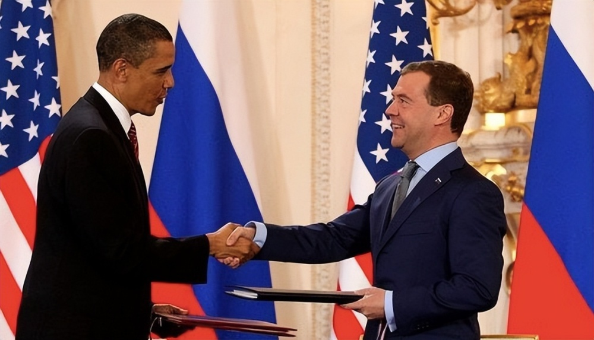
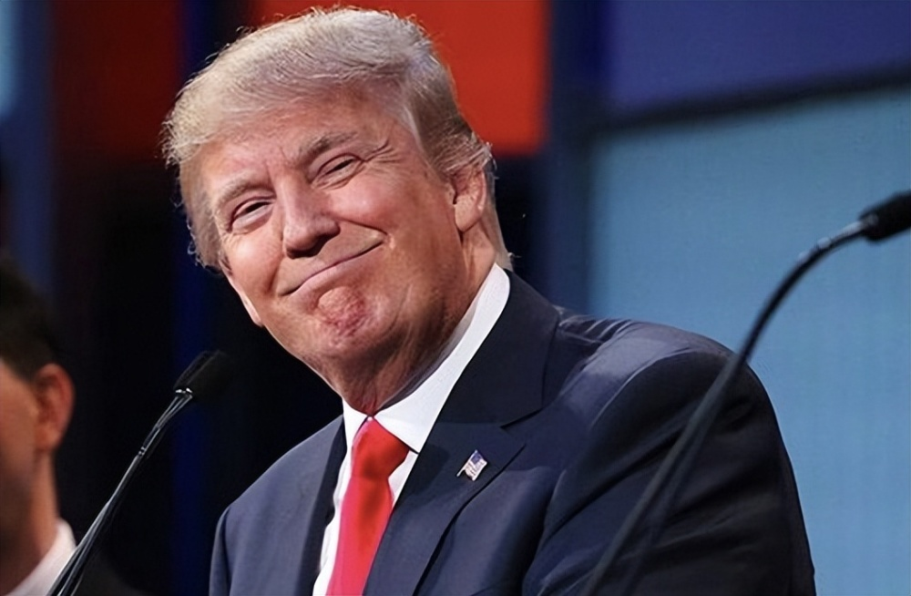

# 特殊时刻，普京宣布一件特殊的事：走特朗普的老路，暂停履约

据环球网报道称，当地时间2月21日中午，在俄乌冲突爆发1周年即将到来之际，普京发表了最新的国情咨文演讲，这场演讲几乎受到全世界的瞩目，其几乎是媒体的头版头条，普京的国情咨文演讲之所以会受重视也很容易理解，俄乌冲突即将达到1年，但目前的战事仍然看不到结束的迹象，所以外界普遍预估，此次普京的国情咨文演讲将会在很大篇幅上涉及到目前的俄乌冲突，甚至还要涉及今后俄乌冲突的走向。

_普京发表国情咨文_

果然，在国情咨文演讲中，通篇基本上都与俄乌冲突有关，但大部分内容基本上都是老调重弹，包括为何要发动军事行动，俄罗斯与西方的关系等等，不过在国情咨文演说即将结束之际，普京突然抛出了一个重磅消息，俄罗斯要暂停《新削减战略武器条约》的履行，普京还在现场特地强调了两遍。

**《新削减战略武器条约》曾是美俄在军事上保持战略稳定的重要支柱**

那么什么是《新削减战略武器条约》呢？《新削减战略武器条约》是2010年美俄两国所达成的一份双边核裁军条约，不过从条约的名称来看，这项双边核裁军条约在某种程度上讲，可以使美俄在战略上保持一种相对稳定性。

这份条约在达成背景恐怕要追溯到冷战。冷战时期，美俄展开核竞赛，虽然在当时的美苏关系缓和期内，双方也曾达成相关的军控条约，例如《反弹道导弹条约》，但双方的核武器数量仍然在不断剧增，最终美苏两国庞大的核武库已经超过了双方战略威慑的需要，甚至还成为一种经济负担。要知道，庞大的核武器每年都是需要花钱去保养的，而上世纪80年代末、90年代初，苏联的经济遭遇了大困难，再加上当时美苏关系地走近，最终美苏两国在苏联解体前夕达成并签署了一项《削减战略武器条约》。1991年12月，苏联解体，但《削减战略武器条约》仍然在3年后生效，只不过执行人出现了变化，从苏联变成了俄罗斯。

根据《削减战略武器条约》的规定，这份军控条约的有效期为15年，至2009年12月5日截止。值得注意的是，当时除了《削减战略武器条约》外，美俄之间还曾签署了《第二阶段削减战略武器条约》等军控条约，2002年两国还签署了《战略攻击性武器削减条约》，根据这项条约，双方各自将核弹头数量固定在1700枚至2200枚之间。

但由于美俄两国的分歧，实际上应该是两国间的互不信任，这些条约在执行的过程中并不顺利。所以，在《削减战略武器条约》到期之际，美俄两国需要一份新的、更具法律约束力、内容更广泛的军控条约，在此背景下，《新削减战略武器条约》出炉。

_奥巴马与梅德韦杰夫_

2009年4月，当时的美国总统奥巴马与时任俄罗斯总统的梅德韦杰夫在伦敦进行了首次会晤，在这次会晤中，二人都表示，要在《削减战略武器条约》尽快达成一份新的军控条约。

最终经过多轮谈判，美俄两国最终于2010年达成并签署了一项《新削减战略武器条约》，2011年2月正式生效。这份新的军控条约涉及的内容非常广泛，包括对美俄两国核弹头、运载工具、洲际弹道导弹、潜射弹道导弹、战略轰炸机等都进行了严格的数量控制。这份条约的有效期为10年。

就此，《新削减战略武器条约》与《中导条约》曾被认为是美俄军事上保持战略稳定的两根重要支柱。不过情况在特朗普时期发生了变化。特朗普上台后，开启了“退群”模式，其中《中导条约》就是重要的一项。自特朗普政府退出《中导条约》后至今，《新削减战略武器条约》就成了美俄之间现存的唯一一项军控条约。

**特朗普曾想，《新削减战略武器条约》到期后不再续约**

不过当时特朗普的退群可不是仅仅只有《中导条约》，其甚至还想退出《新削减战略武器条约》，因为当时《新削减战略武器条约》即将要到期，但特朗普政府始终没有要开启新的军控条约的意向，这被外界认为是特朗普准备再次退群的信号。所以普京并不是第一个准备在《新削减战略武器条约》上做文章，因为特朗普比他还早，而且这次普京是暂停，而当时特朗普则是退出。

_特朗普_

2021年，拜登上台后，该条约即将到期，再谈已经来不及，所以美俄双方表示自动续约5年，在这5年时间内，美俄两国准备再谈一项新的军控条约。

不过后续的情况似乎很不顺利，根据美联社的报道称，2022年8月，俄罗斯决定退出《新削减战略武器条约》的核查机制，这可是一个大信号，如果双方不能进行相互核查的话，如何能确定对方是否履约呢？所以事实上，从此刻起，这项条约基本上已经是名存实亡。

那么这项军控条约在美俄之间执行的情况究竟如何呢？2021年4月，美俄在决定该条约5年后曾首次交换各自的核武库信息，根据当时美国国务院公布的信息，在核弹头方面，美俄的履约情况都不错，都没有超过条约中所规定的1550枚，在核载具方面，美俄也都超过条约所规定的800具，例如俄罗斯是764具，美国是800具。

所以如果从这一信息看的话，此前美俄两国在履行该军控条约方面似乎都执行得不错，但俄乌冲突打破了这一切，去年8月份俄罗斯退出核查机制实际上已经标志该条约出现了大问题，堪称名存实亡，所以这次普京宣布暂停履约也不意外。

**俄乌冲突背景下，普京暂停履行这项军控条约**

不过有意思的是，为何普京会在此时宣布退出该军控条约呢？普京在讲话中提到了这么几项：其一，普京指责北约参与了乌克兰袭击俄罗斯航天军事基地的行动，而从理论上讲，俄罗斯的航天军事基地也是该军控条约的核查地点，因为战略轰炸机的数量也是一项重要的内容，在目前俄乌冲突的背景下，俄罗斯怎么会允许这么做呢，尽管俄罗斯已经退出了核查机制，但这次的举动恐怕是告诉西方，在俄乌冲突的背景下，想要再履行该军控条约，已经不可能。

_普京发表国情咨文_

其二，普京在讲话中强调，北约国家中不仅仅只有美国一个国家有核武库，英国、法国都有，他们也应该进入这项军控条约。

其三，普京在演讲中还提到，美国可能正在考虑进行新的核武器测试，新型核武器的改进让俄罗斯不得不重新考虑这项军控条约。

如果盘点这次普京国情咨文演讲的话，最大的看点莫过于暂停履行美俄之间唯一的军控条约。

