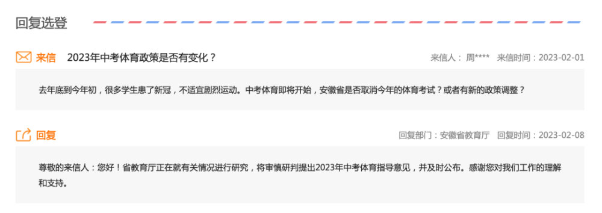
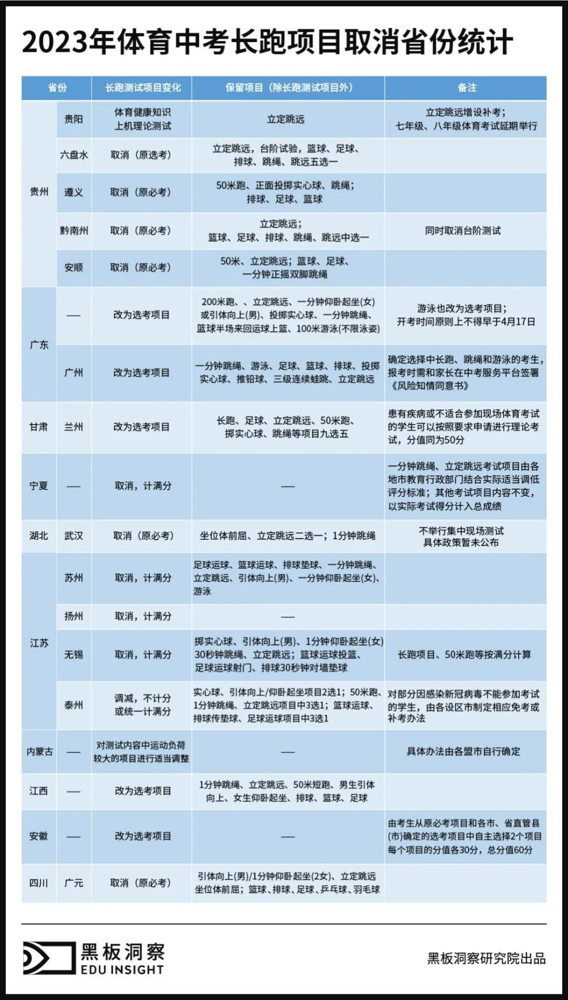
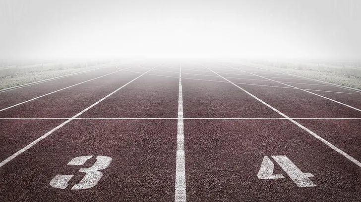
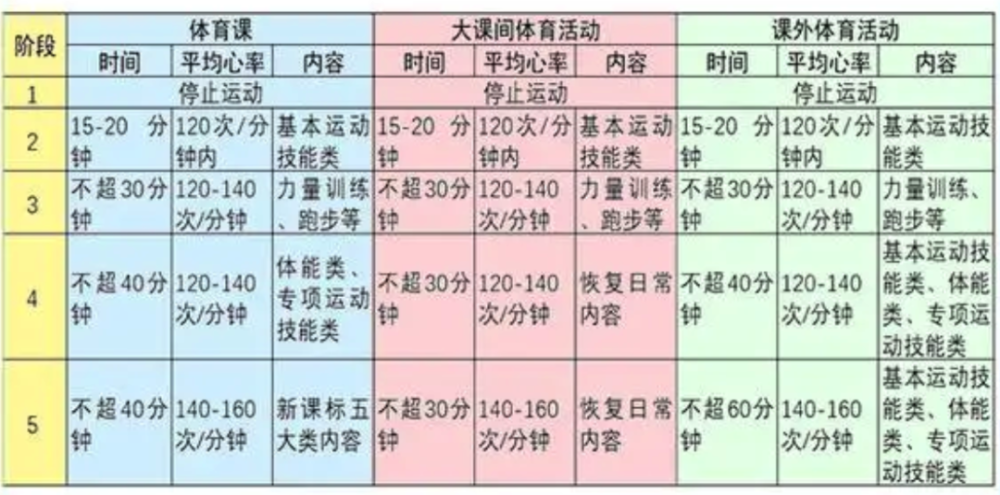

# 经历三年网课的初中生要去体育中考了，中考长跑项目究竟能否取消？

体育中考长跑项目是去是留？

自 2019
年底新冠疫情爆发后，全国多地均对当年体育中考作出了相应调整，如改为合格性考试、变为选考、取消考试计为满分等等。与此同时，各类线下考试也多推迟或取消，对考生产生了一定影响。

而随着疫情逐渐放开，“阳康”学生越来越多，线下考试恢复正常，体育中考自然也在其中。但由于感染后，会对人体心肺功能、肌肉力量等方面造成一定损伤，是否为了几个月后的体育中考，尤其是长跑项目不间断备考，答案在家长心中，几乎都是否定的。

_截图源安徽省教育厅_

从去年年底开始，就有家长向当地教育局留言呼吁取消或推迟体育中考。随着新学期的开始，这类声音愈发增大。截止到发稿时，已经有贵州、广东、宁夏、江苏、内蒙古等多地表示将调整长跑测试项目（即男生
1000 米，女生 800
米）。另考虑到，如到考试时有因感染新冠病毒不能参加考试的学生，将制定相应免考或补考办法。其中广州表示，确定选择中长跑、跳绳和游泳的考生，在报考时需和家长在中考服务平台签署《风险知情同意书》。

在全国范围内，明确“取消”体育中考长跑项目的地区还属少数。不过，当有“躲过八百、一千”的苗头出现后，其余地区学生及家长就更坐不住了。

从加试到主课，体育中考的40余年

时间向前追溯，在新冠疫情出现以前，我国唯一一次较大范围取消体育中考，是在2003年非典期间。其余时间体育中考一直在大踏步向前。

1979 年，中考加试体育第一次出现在上海崇明中学。两年后，全国已有 24 个省市地区进行了该模式的尝试。1990
年，我国发布《学校教育工作条例》，第一次在全国范围内明确指出“体育课是学生毕业、升学考试科目”。体育中考自此迈向正轨。

在其发展的 40 余年间，我国体育中考不断成熟起来，纳入考试范围的项目逐渐增多，如游泳、足球、排球等。其在中考所占分值基本上呈上涨趋势。2020
年，云南省更是决定将体育中考分值与语数英科目同等，均为 100 分。体育教育重视程度迈向全新阶段。教育部表示，未来绝大多数省份体育中考分值都将大幅提升。

除有特殊情况的考生外，大部分考生都能够在体育中考时拿到中高分段成绩。随着其分值加高，部分家长开始焦虑，将目光投向课外培训，以求加练。近年来，新东方等教育企业也顺势而为，开设相关培训课程，部分健身房也悄然上架针对中考体育的训练课程。某体育机构的责任透人露，“阳康”初期，学员人数有明显减少，不过新年后已经慢慢恢复往常。不过也不排除“幸存者偏差”，能够坚持锻炼的孩子，恢复能力、体能水平等或许确实要强于一般学生。

取消长跑项目不等同于取消长跑

体育中考不仅是考核学生身体素质的一种手段，还承担了中考生的升学分值。为夺高分、为夺满分，在训练时，认为自己暂有余力的学生无疑都会拼尽全力。嘴里的血腥味、一百七八的心率和第二天疼痛的双腿都是证明。

有专家认为，“取消长跑，就是对此前努力训练的学生的不公”。如果仅从分数角度考虑，“删减送分题”固然令人十分“气愤”，但或许体能优异的学生在其余保留项目中同样出彩。从身体角度考虑，训练的积累带给学生的不仅仅是分数，更有身体健康。成为“应试教育”的长跑训练不应只为应试。

同时，还有人认为，“‘政策早一天落地，学生们也就早一天停止锻炼’。随着体育中考的政策公布，学生们的日常体育锻炼马上就会作出相应的改变。”此外该专家也表示，长跑项目也可以采取降低难度的策略，但不可取消。

取消长跑项目，就是停止锻炼？答案可能是否定的。整体来看，之所以会出现取消长跑项目的声音，究其原因，还是因为其对学生身体的心肺功能产生不小的挑战，负荷量较大。而取消体育中考长跑项目不等同于取消长跑。经过了解，多数学校虽对减少了学生运动量，但跑操、慢跑这一运动方式并未取消。

“保时不保量”的体育课

广州市教育局曾在今年一月初发布了《新型冠状病毒感染学生康复期间体育锻炼指南》，其中明确表示在康复初期不能进行剧烈运动，并针对学校内的体育课、大课间体育活动等进行了阶梯式的运动量总结。

在此指南中，是以每位学生自身的 **RPE 值** （Rating of Perceived
Exertion，自觉疲劳程度量表）进行阶段评估。也就是说，无论是学生还是成人群体，其是否能够进行一些高强度运动，只有自己才能够清晰感知。

而较低年级学生不具备清晰明确表达身体状况的能力，所以需要家长与校方进行管理和干预。一小学体育老师表示，新学期刚刚开始，已经发现有大部分学生体重增加，学生体能大幅下降，更有学生进行小强度小运动量运动时，还会出现头晕等不适症状……所以针对“阳康”、“没阳过”、“刚刚阳康”等等情况的学生实行分层教学，布置不同运动量的体育活动，较此前学期体育课强度均有明显减少。相应地，大课间活动量也已经调整完毕，减小了跑操圈数。

视线回到初中，一中学体育老师告诉我们，当地是否取消体育中考的政策悬而未决。九年级在利用慢跑恢复体能的基础上，增加了立定跳远、跳绳、实心球等强度较小的练习，也算是在为体育中考做持续准备。七八年级则以恢复身体机能为主，体育课上多进行体育游戏，了解学生的身体状况，因人而异。

同样是经历体育大考，需要进行体育单招的体育特长生们显然没有“取消”的选项。2023 年体育单招招生人数达 18478
人。在绝大部分人都在做体育“减法”时，他们只能加训，首先多进行力量训练，以求恢复此前身体水平，再逐渐增加耐力训练，迎接即将到来的体育单招。

结语

即将要经历体育中考的学生们，他们的初中生涯几乎都是在网课中度过。没有足够的场地、薛定谔的课外活动时间……留给他们交上满分长跑答卷的时间仅有两三个月。或许彼时学生身体素质能够恢复至正常水平，但高强度的体育运动，不应急于一时。

