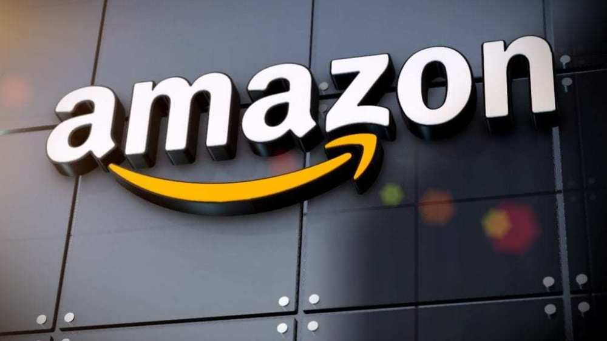

# 股价跌不停，裁员后亚马逊员工又面临“减薪”

中新经纬2月21日电 据《华尔街日报》当地时间20日报道，知情人士透露，由于过去一年亚马逊股票的大幅下跌，导致员工的实际薪酬大大低于目标薪酬。

报道称，亚马逊以限制性股票支付公司员工的大部分年薪，而 **公司股价的下跌导致实际薪酬比员工的预期低15%至50%** 。

“我们的薪酬模式旨在鼓励员工像所有者一样思考，这也是为什么将总薪酬与公司的长期业绩联系起来。”亚马逊发言人在一份电子邮件中声明称，因为股价的波动，这种模式伴随着上涨和一定的风险，但从历史上看，亚马逊对于有长远眼光的人来说一直很成功。

上述报道指出，亚马逊历来给予员工的基本薪酬低于其他大型科技同行，但通过授予多年的股票奖励弥补了这一差距。有员工表示，亚马逊的员工在公司的工作时间越长，薪酬对于股票激励就越依赖，有些人的股票收入占总收入的比例超过50%。

知情人士表示，当亚马逊向员工发行限制性股票作为总薪酬一部分时，前提是亚马逊的股票每年至少升值15%。报道显示，这在2022年以前很大程度上都符合上述前提，2017年至2022年初，亚马逊股价平均每年上涨约30%。而在过去的一年里，由于零售业务增长放缓等因素，亚马逊股价跌超35%。

报道称，一份亚马逊的培训材料显示，亚马逊的人力资源团队最近向管理人员发送了培训文件，内容涉及如何有效地向员工传达关于“减薪”的内容。根据材料，管理人员应关注员工对公司长期业绩的投资，在公司股价回升之前，将持有限制性股票的时间变得更长。

亚马逊正面临公司历史上最艰难的财务困境。去年11月，随着疲软的零售需求以及公司多年的大规模招聘，亚马逊开启了有史以来最大规模的一轮裁员，到今年1月，公司已裁员18000人。亚马逊CEO最近在公司总部的全体会议上表示，“薪酬受到影响，一切都很困难，但我乐观地认为，我们有机会从这个充满挑战的时代中脱颖而出。”(中新经纬APP)

