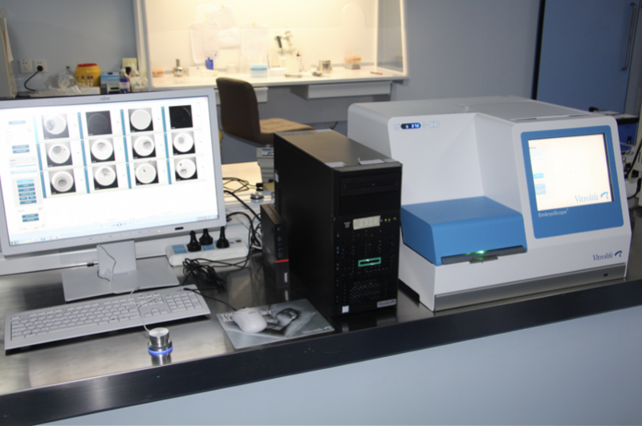

# 试管婴儿出生8年后被发现放错胚胎？当地有关部门：已在了解情况

2月20日，“试管婴儿出生8年后被发现放错胚胎”的消息，登上微博热搜，引发广泛关注。南都记者了解到，来自安徽合肥的60岁男子刘文（化名）与当时的妻子孙芳（化名）于11年前在安徽医科大学第一附属医院生殖中心通过试管技术生下一个男婴。8年后，他们意外发现儿子与他俩并无血缘关系。目前，法院就该案一审判决涉事医院承担100%的赔偿责任。同日，南都记者多次联系涉事医院，均被挂断电话。当地有关部门工作人员则回应南都记者，“相关情况已在了解中，有关部门将适时介入调查。”

**夫妻产下试管婴儿8年后发现无血缘关系**

该案一审裁判文书显示，2010年9月，刘文和孙芳因婚后不育，至安徽医科大学第一附属医院生殖中心接受治疗，后分别于2010年10月和2011年2月在该中心进行新鲜胚胎移植，未孕。后又于2011年6月至该中心再次行冻融胚胎移植，获单胎妊娠，近10个月后，孙芳在安徽省妇幼保健院分娩出一健康男婴。

在养育儿子期间，刘文发现孩子长相和他没有丝毫相似之处。2020年7月，刘文和孙芳以及孩子一同做了亲子鉴定，结果发现孩子与父母双方均无血缘关系。为弄清事情原委，刘文和孙芳以侵犯他俩的生育权和知情权，将生殖中心和安徽省妇幼保健院列为被告。2022年6月，合肥市蜀山区法院开庭审理此案。

_涉事医院_

法院一审指出，依据现有材料，安徽省妇幼保健院未见程序性缺陷，在该院内发生抱错行为的可能性极低。而法院委托北京法源司法科学证据中心出具的鉴定报告则显示，依据现有病历材料，生殖中心在胚胎冻存及提取过程中，无法保证每组胚胎编号的唯一指向性，也无法体现解冻提取过程中准确溯源和核对，存在缺陷，具有导致提取非指向性胚胎的极大可能性，并导致非预期的辅助生殖受孕后果，因此存在医疗过错。

上述裁判文书指出，被告安徽医科大学第一附属医院的诊疗、护理行为存在过错，虽其错与原告主张的损害后果是否存在因果关系无法明确，仅能说明被告医院的过错与发生原告主张的损害后果之间具有高度盖然性（即极大可能性）。但根据原告提供的证据和安徽医科大学第一附属医院诊疗行为的过错情况分析，结合日常生活经验，可以高度盖然性地推定安徽医科大学第一附属医院的医疗过错行为与原告主张的损害后果存在因果关系。

法院认定，确定被告安徽医科大学第一附属医院对原告主张的损害后果产生的损失承担100%的赔偿责任。

**当地称有关部门将适时介入调查**

刘文和孙芳的胚胎去向、孩子的生物学父母是谁等问题，目前尚无定论。2月20日，南都记者就该案件的最新进展情况联系刘文，暂未获得回应。

同日，南都记者拨通了安徽医科大学第一附属医院生殖中心的电话，对方了解记者来意后，就立刻表示“不清楚”，并挂断电话。

随后，当地有关部门工作人员就该案件回应南都记者称，“相关情况已在了解中，有关部门将适时介入调查”。

安徽省卫健委妇幼健康处工作人员则告诉南都记者，“相关情况卫健委领导已经在开会研究，并且会根据研究结果向社会进行通报。”

_涉事生殖中心_

官方资料显示，安徽医科大学第一附属医院生殖医学中心创立于1998年，于2000年10月诞生了安徽省首例“试管婴儿”，2003年10月成为安徽省首家卫生部正式准入的生殖医学中心。据悉，迄今为止，该中心通过辅助生殖技术已经诞生10000多名婴儿，其中7000多名“试管婴儿”，中心接待不孕不育就诊患者8万余人次。

采写：南都记者 余毅菁 实习生 陈宇龙

