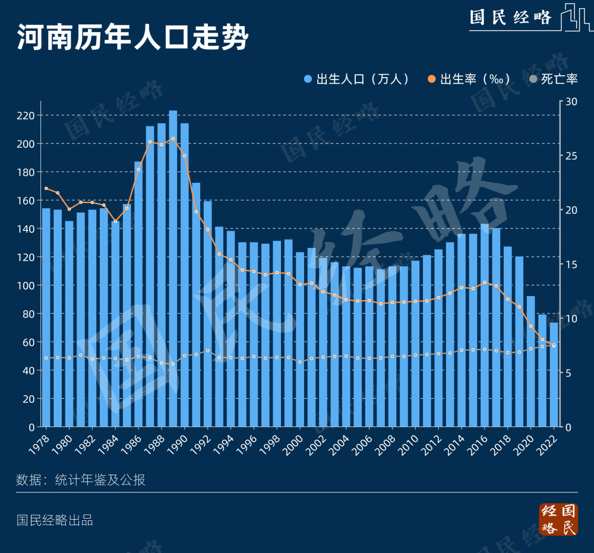
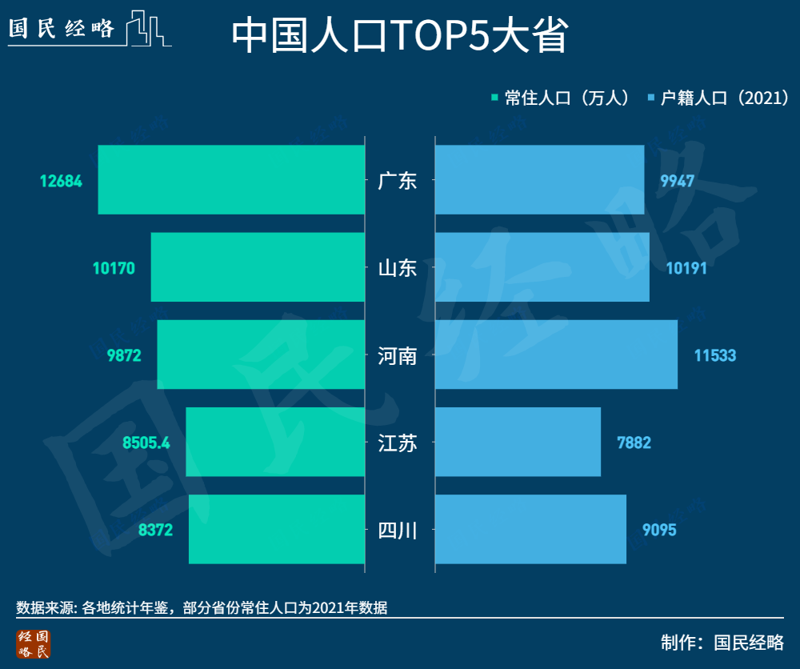
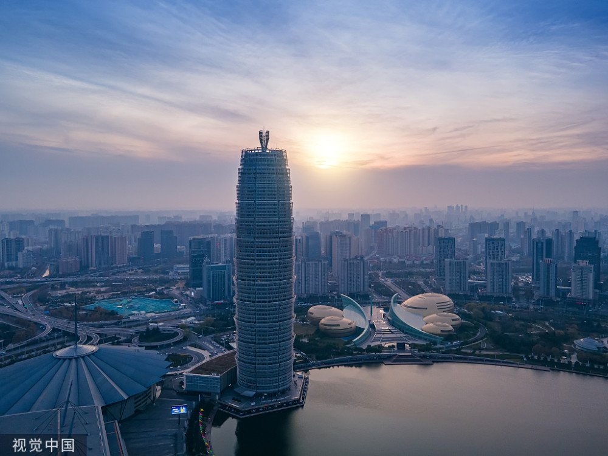
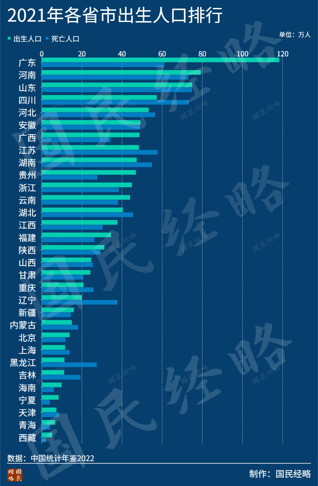
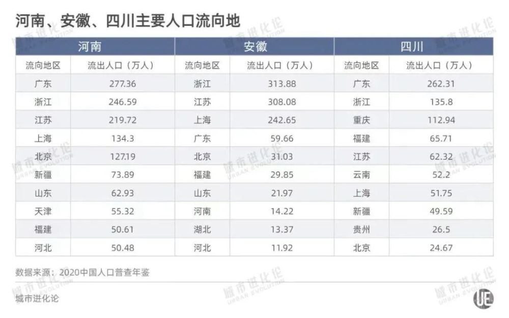
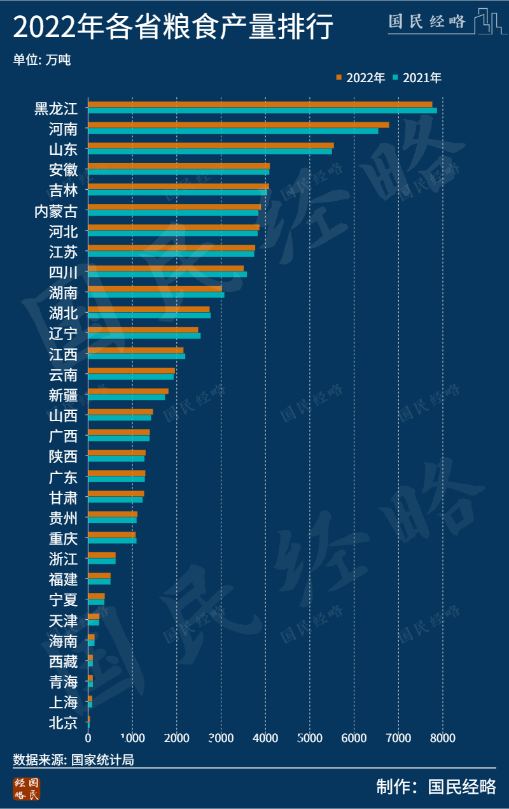
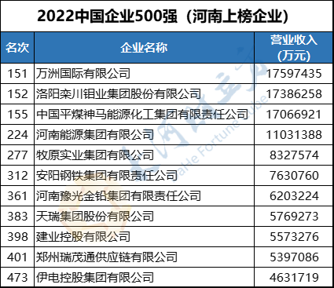
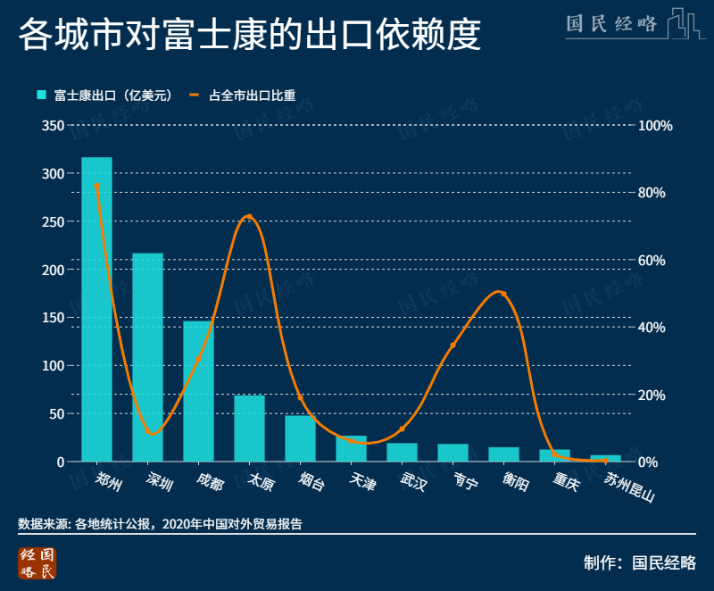

# 负增长！人口第一省，也顶不住了

**文|凯风**

人口形势，开始逆转了。

**01**

继全国总人口负增长之后，中国户籍人口第一省，也遭遇转折点。

日前，河南省公布2022年人口数据，全省常住人口9872万人，比上一年减少11万人，连续第二年减少。

其中，全省出生人口73.3万人，死亡人口74.1万人，自然增长人口为负0.8万人， **为62年来（自1961年开始）首次负增长。**

作为中原地区，河南是中国的缩影； **河南人口形势，也是大国人口形势的缩影。**

我国有两个人口第一大省，一个是广东，一个是河南。

**广东是常住人口第一大省。** 得益于外来人口持续涌入，广东常住人口高达1.27亿人，远超户籍人口的9946万人。

**河南则是户籍人口第一大省。** 河南户籍人口超过1.15亿人，远超常住人口的9872万人，户籍人口在全国遥遥领先。

在户籍人口与常住人口之间，有着1600多万的缺口，正是户籍在河南而居住工作在其他省份的外流人口。

人口外流，对于河南来说已是常态。但长期以来，靠着自然人口高增长，河南依旧能维持总人口的扩张。

如今，这一切也变了。自然人口负增长，叠加人口外流，给中原大省带来致命一击。

**02**

河南，一度是全国“最敢生”的省份。

上世纪八十年代末期， **河南出生人口连续4年超过200万人，为全国之最。**

这一形势，80后应该深有体会。尤其是1987年到1990年出生的一代，无论在上学还是找工作，都感受到人口膨胀带来的冲击。

然而，1990年代以来，随着生育政策全面收紧，河南出生人口一路下滑。从2000年到2010年，一直维持在110-120万的水平。

最近十年来，虽然单独二孩、全面二孩、全面三孩的政策红利持续不断，河南出生人口一度反弹到140万的高位，但仍难以与历史高峰相匹敌。

更难的是，政策红利的支撑效应仅仅持续了几年，一切又恢复到常态。

2017年至今，河南出生人口从143万，迅速下落到73.3万，呈现腰斩之势，堪称断崖式下滑。

即使如此， **河南依旧是出生人口第二多的省份，超过山东，仅次于广东。**

在广东、山东、河南三个人口大省之外，绝大多数省份的出生人口已经低于50万人，而东北的吉林、黑龙江只有10来万人，远低于死亡人口。

当人口大省“为国生娃”的动力开始衰竭，全国人口大盘形势可想而知。

**03**

人口第一省，为什么“不敢生”了？

**生育意愿下滑，** 是所有省份都会遇到的共同难题，但河南的形势似乎显得更为严峻。

退一步讲，即使生育意愿保持在高位，河南出生人口也难以维持过去的局面。

这背后的核心原因在于， **育龄妇女人数大幅缩减，而结婚率创下历史新低。**

一般而言，20-30岁为生育旺盛期，对应的差不多是1992年-2002年的出生人口。

这一时期，恰好是从生育高峰掉头直下的阶段。河南出生人口从最高223万锐减到2002年的119万，出生人口少了一半。

历史总在特殊时刻重逢。过去种下了什么，自然就结出什么。

相比生育意愿，河南还始终承受着 **人口外流** 的重压。

根据最新普查年鉴，河南户籍人口在外省的总量达1610万人，这些人多数奔向了长三角、珠三角， **以广东、浙江、江苏、上海、北京为最。**

要知道， **外流的多数都是年轻人。**

随着全国各地取消落户限制，这些人已有大部分在长三角和珠三角工作、定居乃至结婚生子。

在为沿海地区贡献出生人口的同时，也加速了河南本土生育形势的下滑。

广东能够成为全国人口第一大省，并且超越河南、山东成为全国“最敢生”的省份，同时还是养老金最为充沛的大省，背后不无来自全国各地年轻人的贡献。

**04**

河南为什么留不住人？

说起河南，最常提及的是 **农业大省和粮食大省** 的身份，很少有人认为是工业大省。

作为农业大省，河南被赋予作为大国粮食“压舱石”的角色。

河南 **粮食总产量位居全国第二，农业总产值位居全国第一** ，更是仅有的5个粮食净调出省份之一。

在养活了1亿本土人口的同时，每年还能外调原粮及制成品600亿斤，可谓殊为不易。

然而，粮食大省本身又是一重束缚。

毕竟，根据《中国城市大趋势》一书的分析，国际形势复杂多变，地缘局势冲突不已，
**粮食安全变得空前重要，守好耕地底线就是端好饭碗，全国农业及粮食格局不会轻易变迁。**

这也决定了，粮食大省被赋予了极其重要的地位，却难以得到与这一地位相应的高回报。

毕竟， **农业产值难以与工业及高端服务业相提并论。**

根据《中央一号文件出炉！这些省份，越来越重要了》一文分析，作为农业第一省的河南，农业总产值超过6000亿元，包括农林牧渔在内的第一产业总产值超过1万亿元，但贡献的增加值仅有5800亿元。

与之对比，作为中国工业第一大省的广东，工业总产值超过17万亿，增加值超过4.5万亿元，体现了独一无二的经济支撑力。

当然，总要有人种地，总要有人守护粮食安全，这是河南不应该被低估的付出和贡献。

**05**

与农业大省相比，河南制造业不尽发达，也是必须承认的事实。

论工业规模，河南并不算低。数据显示，2022年，河南工业增加值突破2万亿元，位居全国第五。

但这些产值，除了 **以富士康为代表的电子信息产业** 外，绝大多数都是 **钢铁、化工、有色金属** 等传统产业贡献的。

在中国企业500强中，河南上榜的不是重化工业，就是与农业相关的食品行业。

根据2022年榜单， **河南共有11家中国500强企业**
，除了万洲国际、牧原实业以农牧业为主，其他绝大多数都属于能源化工范畴，包括洛阳钼业、平煤能化、河南能源、安阳钢铁等等。

显然，先进制造业，尤其是战略性新兴产业的缺乏，让河南无法涵养巨大的劳动力人口，不得不面对年轻人外流的局面。

这一局面， **凸显了富士康之于郑州及河南的重要性。**

一个郑州富士康工厂，就贡献河南一半以上的外贸总额，更带动数十万人的就业。

如果河南有10个富士康这样的工厂，劳动力人口回流就不会是难事。

事实上，这些年， **四川、安徽、湖南等劳动力大省，人口已经开始逐步回流。**

一个原因是 **产业层面的** ，千亿级乃至万亿级产业的崛起，带动人口回流。如四川的电子信息产业总规模已达到1.5万亿，对于“留人”贡献不菲。

另一个原因在于 **强省会** 。一个地方如果连一个能“打”的大城市都没有，自然难以在产业竞争、抢人大战乃至国家战略竞夺中抢得先机。

所以，作为省会的郑州，有必要做大做强，肩负起这一重任。

