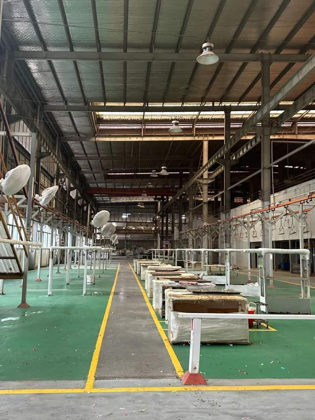
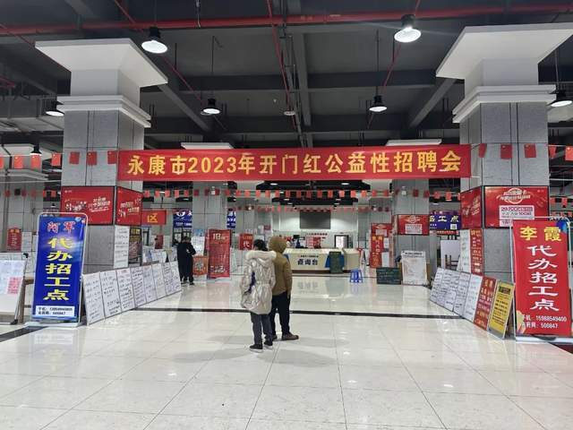

# 00后不愿进工厂了，以后就靠机器人？

划重点：

  * _1_ 往年元宵节后，是复工、返工热潮的开始，但多个企业反映，“今年比去年招工更难、更慢”。
  * _2_ 年轻人不是难招，是难留，年轻人的流失主要在长达2至6个月的试用期。
  * _3_ 即使技术工人每月能赚到一万元以上，对年轻人的吸引力也并不强烈。

中国五金人力资源产业园位于浙江省永康市东部，附近有当地最大的人才市场。从正月初八到正月二十六，这里的春季“开门红”招聘会人头攒动。不过，熟悉当地人才市场的人很清楚，这已与数年前大相径庭。

几年前，每年春季招聘会吸引的务工者“人山人海”，由于人流量大，招聘效果好，当时每个展位要收费800元，“企业可能要找关系才能报上名”。当时，招聘会由一家国企运营，一场招聘会下来，收入有时能达上百万元。

而现在，因为人流量锐减，对企业的吸引力下降，国企退出经营，取而代之的是租用场地的劳务中介。人社局下属的人力资源服务中心要免费为企业做好海报、布置好位置，鼓励企业来参加。在招聘会门口，还设置了“招工礼包”，吸引工人前来参与。

在永康的人才市场，传统制造业的招聘占了半壁江山。永康是浙江金华代管的县级市，以“五金之都”闻名，中国80％的保温杯、70％的门和40％的电动工具都来自永康。这也引来了云南、贵州、湖南等多个省份的务工人员，2022年，永康户籍人口62.1万人，登记外来流动人口54.95万人。

往年元宵节后，是复工、返工热潮的开始，但多个企业反映，“今年比去年招工更难、更慢”。工人大多在观望，“两三年没回家，加上去年行情不好，很多人感觉赚不到钱，今年可能就不出来了。”

“宁愿送外卖，不愿进工厂。”曾支撑中国成为世界工厂的传统制造企业，为何与新工人渐行渐远？00后工人“不稳定”由何而来？机器换人会是解决办法吗？

_2月10日（农历正月二十），永康市有些工厂还没开工。摄影/蒋芷毓_

**“今年比去年招工更难”**

武潇是永康市一家知名运动器材企业的副总经理。开年到现在，他只完成了招聘目标的30％。“我们想招18至40周岁的，但这个年龄段在市面上并不好招，真正有求职需求、很稳定的，往往是40至60周岁的。”

“40岁以上的工人培训时间长，文化程度也相对更低，除非实在招不到人，才会放宽年龄限制。”武潇说，年轻人求职方向广，很多岗位和行业都可以尝试，传统制造业对他们的吸引力已经越来越小了。

他需要招聘100名装配工，这是每年流动率最高的岗位之一，也是流水线的非技术岗位，“年轻人只要手脚灵活，上岗培训两三天就可以做了。”正因如此，装配工可选择行业更多，经常在工厂间自由流动。

“年轻人不是难招，是难留。”王力安防人力资源部招聘经理应真聪告诉《中国新闻周刊》，年轻人的流失主要在长达2至6个月的试用期。

_正月里永康市的人才市场招聘会。摄影/蒋芷毓_

王力是中国知名门锁品牌，于2021年在A股上市，被称为“中国门锁第一股”。应真聪在2014年开始加入王力集团负责招聘。他回忆，那时候，每年招聘都不用出公司，在门口贴张照片，就有工人来等着被挑。这两年，应真聪不仅需要去本地各个人才市场招揽，还要跟着政府前往外地“抢人”。

步阳集团副总经理程明松春节后一直忙于招聘和开工事宜，到正月十八，工厂新招了近300名员工。程明松说，高强度体力劳动和技术类岗位，都缺人。工业模具等技术类岗位很难招到人，电路机械工这类复合型技术人才也非常缺乏，即便薪水达到一万四千元左右，也难以招到合适的人才。

程明松加入步阳已经二十多年，当年，正月初三工厂门口就排了长队。“2000年前，农民要进入城市，正是人口红利期。到了2008年金融危机以后，慢慢地，工厂需要花力气去招年轻人了。”新工人多是“老乡带老乡”，这也更加稳定。对于难招的岗位，步阳会给予员工600元介绍费，新员工稳定后，所属车间的工段长也会得到200元奖励。

步阳集团是门业知名品牌，还涉足汽配、房地产等多个行业，旗下的步阳国际在去年12月赴港上市。程明松表示，近年来工厂销售额每年都实现增长，步阳也连续多年位居永康市纳税百强企业榜首，去年步阳的一线员工薪水在7100元左右，每年工厂员工的流动率在10％以下。

相较于王力、步阳等大型企业，许多中小企业招聘情况则不如人意。春节后，一家户外箱包制品企业的行政部经理袁永华就泡在了工厂附近的劳务市场里招人。他的工厂需要招40名装配工、30名组架工，以及冲床工、包装工、清洁工等数十名一线员工。这些装配工每天工作八九个小时，薪水完全按计件制，每月薪水多在5000~8000元之间。袁永华的工厂里，目前还有至少20％的人员缺口，尤为缺乏的是25岁以下的年轻人。

永康的务工人员多来自云南、贵州等地。“如果没有云南贵州的劳务输出，（永康）很多厂可以关掉了。”袁永华说。近年来随着云贵等地区扶贫工作的进展，贫困人口减少，愿意跨省打工的人也少了。以云南为例，永康市人力资源中心的工作人员透露，云南镇雄是永康的主要人口来源地，高峰期时，仅镇雄前往永康务工的人群就接近20万人。

“今年比去年招工更难。”袁永华也在分析原因，一方面，去年返乡人数远没有今年多；另一方面，工厂订单不稳定，真正复工复产的只有几家大企业，中小企业都还没上轨道。“去年很多厂子生意都不好做，很早就放假了，现在这个时候，员工都还没有信心。很多去年离开的员工，今年还在观望。”

**00后不愿进工厂，“4050人员”易被淘汰**

袁永华估计，从当地劳动市场的情况来看，25岁以下的年轻人比起去年少了20％。00后工人和70后、80后不同，大多是独生子女，有父母帮衬，只要手里有钱吃饭，受约束更小，“想辞职就辞”。

提起现在的新工人，受访企业负责人提到最多的印象之一是，“很多人没有闯劲了”。这种变化是怎么发生的？

王力安防制造基地生产总监李廷钱是80后，来自云南。2000年，年仅18岁时，他只身一人来到永康。到永康第一天，他买了一瓶红茶，吃了一顿饭，兜里就只剩5块钱了。第二天，他跑到王力工厂门口排队应聘。时隔二十多年，他还清楚记得那天下着小雨，起码一百多人排成两排，全是年轻小伙子，等着工厂来挑人。“当时工厂很难进，有的还要找关系，招聘的人看看手，看看体型，最后就挑了二三十个。”

李廷钱应聘上的是一线装配工，选上了可以预支菜票，还有一袋大米，接下来的一个月生活有了保障。进工厂后，他非常勤奋，最多的时候一个月拿了2600元。当时，体制内在编教师每月薪资才700元。“当时每月的速度奖、质量奖，各300元，都是我和同事承包，一直都是双第一。”

因为表现好，李廷钱从一线装配工不断升职，2006年他成为班长，又升职车间主任。2014年，他做了厂长。现在，他是王力安防制造基地的生产总监。王力安防有不少像李廷钱一样从普工升职为管理层的员工。三年前，王力集团统计在职20年以上的员工，就有四五十个。2021年，王力安防赴港上市，李廷钱也分得了股权，“公司很多老员工都有股权激励，对公司管理和技术上有贡献的还能额外增加股权。”

而如今，房地产企业不复当年，与之配套的门业也受到影响。1月30日，王力安防发布业绩预告，预计2022年年度净利润为-2500万元到-3700万元。

应真聪说，王力安防员工的流失率一般在2％左右，年底年初的时候可能会达到3％至5％，超过5％时，人力资源部会调研反省。不过，年轻工人在试用期满之前离职的现象也很常见。

相比外卖、快递等行业，工厂更像是一所学校。早晚要打卡，工人要开早会、晚会，上班时间不能出工厂。不过，即使技术工人每月能赚到一万元以上，对年轻人的吸引力也并不强烈。“技术工种需要时间投入，学成了才会有工资回报。时间长的要做半年以上学徒，很多年轻人等不及。”应真聪说，年轻人更偏向打零工，即使是进工厂的年轻人，也常常做一个月就走了。

另一方面，不少年轻人无法忍受传统制造业的工作环境。由于传统制造业的生产限制，部分工序生产环境较为恶劣，噪音高、污染大、长期搬运重物，时间长了对身体难免有所损害，都会“劝退工人”。

永康被称为“中国门都”，以门业为例，10年前，在防盗门生产的一线，有大批工人等着做“转印”。转印是防盗门生产的工序之一，工人在门和门框上涂上底粉，粘贴转印纸，把图案印在门和门框上。在过去，从事这项工作的多是女性，现在这批工人步入中年，却难等到接班人。车间工作相当耗损身体，有些员工即使满意这份工作，但到了年龄，身体实在干不动了，也不得不放弃。

这也容易大幅提前工人的“退休时间”。在招聘市场，“4050人员”是就业困难户，即女性40岁以上，男性50岁以上，自身就业条件较差、技能单一，许多工厂避之不及。

**代工厂内卷加剧**

同样是18岁出来闯荡的，还有来自湖北恩施的90后王猛。他是浙江聚贤圈杯业有限公司的创始人，企业主要生产保温杯。作为年轻创业者，他也吸引了一批年龄相仿的员工，工厂有接近1/3的00后员工。“00后毕竟年轻，也有父母扶持，对待工作更放荡不羁，所以流动性比较大。”

王猛初入社会时，也过了好一阵“放荡不羁的生活”。直到2013年他开了一家保温杯贸易公司，赚工厂和客户之间的差价。当时，他只有21岁。2019年，通过贸易公司积累了一笔资金后，王猛开始投入保温杯生产。三年来，销售额每年至少保持20％以上增长，在去年疫情最严重的时候，依旧有40％左右增长。现在，工厂有150多名员工，流水线一天最多能生产3万个保温杯。

今年开年，王猛的公司订单量相比去年同期又增加了30％。正月初八，工厂就开工了。但王猛深知，“现在生意没那么好做了”。销量上去了，但利润没上去。王猛刚开始做保温杯时，一个杯子很容易拿到三五元利润，但现在“甚至能用三五毛来形容”。

保温杯行业并不是技术门槛很高的行业，这也催生了一大批保温杯企业。仅在永康，就有近千家保温杯企业。由于毗邻义乌，中小型保温杯企业大多为电商平台代工，在这条生态链中，品牌方是无可争议的顶端，“一般来说代工厂与品牌方三七开，甚至二八开的都有”。

近年来，代工厂之间内卷加剧。“一个杯子售价几十元，我们代加工就拿十多元。”王猛说，甚至有商家亏本将保温杯卖到9块9包邮，“这对行业生态来说损害很大”。

“为了竞争，相同的款式我们必须质量更好，相同的质量我们价格更低，相同的价格我们服务更到位。”开工厂后，王猛感觉压力很大。做贸易生意时，行情好一些，也没有太大库存压力，没有那么多工人要养。

即便是中国保温杯龙头企业，品牌化的升级之路仍然是艰难的。总部在永康的浙江哈尔斯真空器皿股份有限公司是中国保温杯上市第一股，于2011年上市。作为保温杯行业领头羊，哈尔斯在行业里无人不知，但目前自有品牌也只占销售总量的30％左右。

哈尔斯60％以上的订单，是为美国知名杯壶企业代工生产。哈尔斯副总裁吴兴告诉《中国新闻周刊》，美国前十大杯壶企业中，有七八家都由哈尔斯代工，星巴克也是由哈尔斯代工。

“作为代工企业，我们是达到国际品牌生产标准的，生产技术不比国外差。”吴兴说，哈尔斯倡导的轻量化协作技术，将杯身材料做到0.1毫米薄，使得保温杯轻便易携带。

然而，在哈尔斯上市的十年来，自主品牌的销量占比却迟迟未能提升。“行业里都知道哈尔斯，我们常常说自己只是一个工业品牌，不是消费者品牌，很多消费者对我们还是不了解。”

相比眼下的“用工荒”，未来可能出现的“订单荒”才是当地工厂最大的危机。由于国际形势的影响，哈尔斯在海外的销量有所下滑。但尽管四季度订单有所下滑，哈尔斯早已于初九开工。记者在永康走访时发现，直到正月二十，当地数家企业仍未复工复产。一家规模以上企业负责人告诉《中国新闻周刊》，工厂正月二十三正式开工，相比于往年晚了许多。不过，这并不是“用工荒”导致的，工厂已经招到足够的员工，而是订单还没来。“销售人员正月十八才外出抢单，现在订单还没确定。”

**机器换人，是最优解吗？**

“用工荒”背后是代工模式下日益逼仄的劳动环境。“现在永康租房至少要六七百元一间，但工资只有五千元左右，在中西部可能也能拿到这么多钱，很多人过完年就不愿意来了。”袁永华说。

对于普通工人来说，想要定居永康，则是难上加难。永康曾在2021年上榜中国房价最贵县城榜第四位，仅次于隔壁的义乌和海南的陵水、万宁，平均房价达21860元/平方米。高昂生活成本降低了这座工业强县对年轻人的吸引力，对于在上海、杭州等大城市求学的大学生来说，回到永康的意愿并不强烈。有人笑称，“永康已经是人才流出的地方”。

除了人才，有企业也从永康外迁到周边地区，“永康的房租太贵了，同样是1万多平方米厂房，在永康可能要贵50万元以上，道路也相对拥挤。”

为缓解住房问题，永康市人社局人力资源服务中心主任兰兰告诉《中国新闻周刊》，永康市推出了金蓝领公寓，对符合条件、在永康工作的非永康市户籍人员提供政策性住房。按地段不同，售价分别为6800元/平方米或8980元/平方米。目前推出了约3000套房源。

人力资源服务中心还计划了2023年全年的“引才计划”，包含春季“开门红”系列招聘会，还将在2023年前往江西、湖南、云南等多个地区的高校举办超百场专题招聘会。“我们会邀请企业一起去，企业人事经理的住宿费、路费都由我们负责。”兰兰说。

_总部在永康市的浙江哈尔斯集团工厂内部，部分生产线实现了机器换人、智能化设备运作。摄影/蒋芷毓_

用工短缺加速了当地企业“生产智能化”进程。永康以五金产业著称，这是劳动力密集产业，有较强的智能化需求。哈尔斯在近年来加速布局智能化生产，保温杯制作分为前道和后道，前道主要是五金成形、产品成形，是机器换人替代率最高的环节。“19条流水线，以往每条线有十二三人，目前智能化覆盖率达到60％~70％，总共只有几十号员工。”吴兴说。

哈尔斯上市多年，财力雄厚，此前收购了设备厂，有生产智能化机器的能力。“机械臂则是在市场采购，这部分技术现在也很成熟。”吴兴透露，智能化项目目前都是投资两年回收成本。

在过去，哈尔斯工厂的流水线上密密麻麻都是人，现在人员精简，生产工序也逐渐“由长变短”。吴兴介绍，通过工序整合，在不影响成品的前提下，流水线上的工序减少，所需工人数量减少，生产效率也得到提升。

在王力安防，智能化从2015年开始布局。“降低成本，提高品质，缩短交期。”李廷钱说，智能化投资大，5台冲床就花费了2000多万元，目前王力安防在多道工序实现了机器换人。

中央民族大学民族学系副教授黄瑜长期关注制造业机器换人，据她观察，智能化并没有提升工人的技术能力，反而呈现“去技术化”。自动化缩短了技能培训的时间，劳动分工也出现了变化。“机器换人”以后，普通工人就负责简单的上下料，技术员负责机器人的调试与维护。

上述几家智能化程度较高的企业中，被机器替代的员工中有大量技术工人。“以前焊接瓶口瓶底是技术上较难的岗位，现在通过智能化设备，对员工的技术要求反而低了，而对于能维护自动化设备的员工需求提升。”吴兴说。

但一些企业要推广机器换人也存在技术难点。以门业为例，由于防盗门不像保温杯等产品标准化，每天要生产几百个不同批次，每个批次里还有各种规格型号，机器难以制造几千种不同类型的门。

对于附加值低、产量小的产品来说，智能化成本太高。“例如十多块钱的箱包，用机器生产不划算，很多企业不敢投入。”袁永华说。

袁永华透露，如果是远销欧美、利润高的产品，机器换人的收益也高，很多大型企业已经投入智能化。但对于中小企业，即使有政府补贴，也难以转型升级。“我们企业冲床岗位部分智能化了，但装配还没有智能化，不光投入大，而且可能还没有人工效率高。”

（应受访者要求，武潇、李永华为化名）

记者：蒋芷毓

