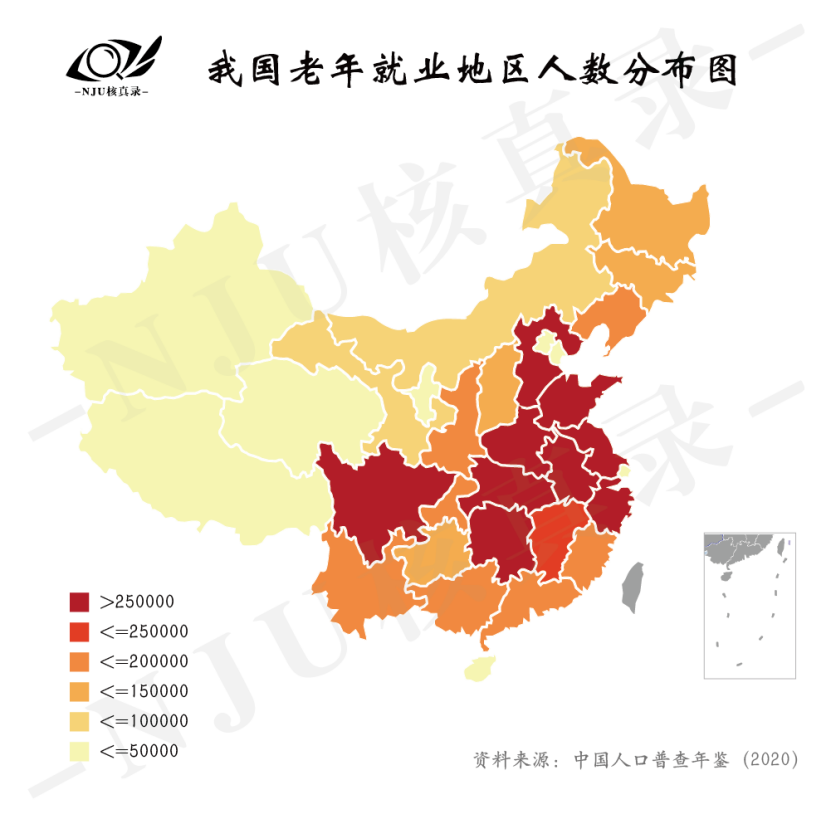
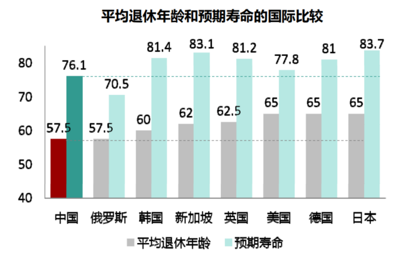
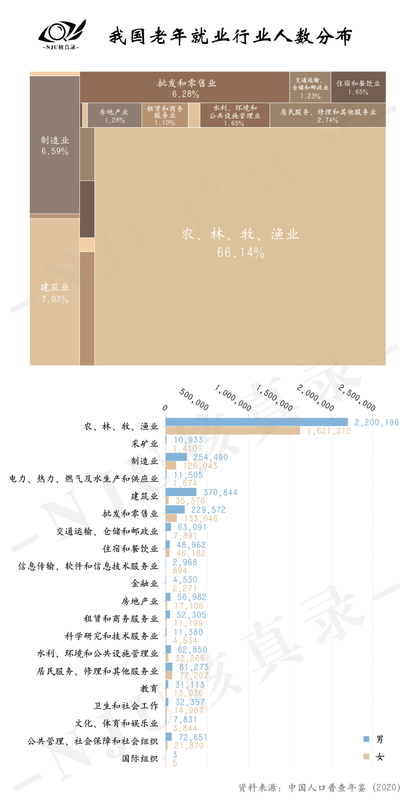
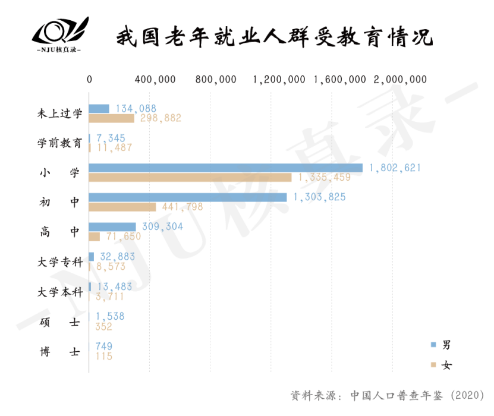

# 25%的老年人仍在打工，有70岁以上的老人还在上网求职

文字 | 南大新传未来编辑部·核真录 学生

王蓼汀 沈文豪 潘笑 吴馨怡

编辑 |王蓼汀 邓伊雯

2月20日，“60岁中通快递分拣工凌晨在岗位猝死”一事冲上微博热搜。

根据沸点新闻报道，孙先生60岁的大伯仍在从事快递分拣工作。2月15日凌晨3:50分左右，孙先生大伯晕倒，最终因心脏骤停猝死在岗位。
视频中，老人在晕倒前仍在分拣快递，右手边的传送带还在转动。病例也显示，患者被发现时心跳呼吸骤停40余分钟。

随着中国社会老龄化进程加快，老龄人口问题也越显突出。第七次人口普查数据显示，我国60岁及以上人口数量2.64亿人，占总人口18.7%，中国已经处于深度老龄化社会的边缘。

近年来，“老年就业”成为社会各界关注的话题。2022年11月4日，人力资源社会保障部、财政部、国家税务总局、银保监会、证监会联合印发了《个人养老金实施办法》。同日，银保监会发布了《商业银行和理财公司个人养老金业务管理暂行办法（征求意见稿）》。2022年8月24日，中国老年人才网正式上线，标志着我国老年人才信息库和老年人才信息服务平台启动建设。网站首页的标语是：“新时代，新老年，新作为”。

_图1
中华人民共和国中央人民政府官网截图_

对近年来新出现的老年人就业问题，本期核真录将梳理以下三个问题：

**第一， 我国老年人口就业现状如何？**

**第二， 我国老年就业存在哪些困境？**

**第三， 我国对老年人口就业有哪些政策、法律支持？**

一、8个省份高龄就业人口均超250万

核真录根据中国国家统计局于2020年公布的《中国人口普查年鉴》和智联招聘于2021年发布的《中高龄求职者就业问题研究报告》，对老年就业的总体情况进行了梳理。
**根据我国《老年人权益保障法》第二条，老年人指六十周岁以上的公民。**

需要说明的是，第七次全国人口普查中的就业人口数据采取抽样采集的方法，在全部住户中抽取10%的户（不包括港澳台居民和外籍人员）填报，人口总数以及各种人口结构数据的抽样比会存在略微差异。
**本文在估算时采取将抽样数据乘10的方式，制图时则保留原数据。**

我国老年就业人数总体约6600万人，占我国老年人口的25%。在地区分布上， **我国老年就业人群集中在中部和东部地区**
，其中山东省老年就业人数以约600.9万位列第一，四川、河南、江苏紧随其后，共有八个省份迈过了250万大关。西藏、青海、宁夏等地区的老年就业人数则较少，其中西藏的老年就业人数最少，仅有约3.9万人。

整体来看，老年就业人群的地区分布与就业人群的地区分布较为接近。但就业人数最多（6200万）的广东省，其老年就业人数仅有195.1万人，排在全国第11位。

_图2
我国老年就业地区人数分布图_

**中国老年潜在就业人口具有基数大、增速快的特点。**
2021年1月智联招聘发布的《中高龄求职者就业问题研究报告》显示，2020年2月到9月，50岁及以上中高龄求职者同比增长32.4%，增速为35岁以下求职者的四倍以上。
**较早的退休年龄也让中国有更多潜在老年就业人口。**
北大汇丰高龄社会创研所发布的《中国中老年就业创业2020年调研报告》显示，中国的平均退休年龄为57.5岁。而美国、德国、日本的平均退休年龄为65岁。

_图3
《中国中老年就业创业2020年调研报告》截图_

二、老年再就业：意愿高、渠道少

前程无忧在《2022 老龄群体退休再就业调研报告》中指出，有68%的老龄群体在退休后有强烈的就业意愿。然而，老年人再就业过程中面临着不少难题。

首先便是渠道问题。市面上的招聘网站、中介公司等提供给老年人的机会较少。单位返聘、亲友推荐又十分依赖于人脉资源。据《中国劳动统计年鉴2017》显示，老年人寻找工作的方法主要是委托亲友。60～64
岁的老年人有 59.5%的依靠这种办法，65 岁以上的则有 58.3%。

**其次，年龄歧视将大量老年求职者拒之门外。**
在中国的二级劳动力市场上，年龄歧视普遍存在。有研究者指出，诸多市场主体为扩大企业生产经营效益，在人事招聘中设定“35岁”硬性年龄门槛。这一现象在部分行业较为明显。有学者通过实证研究发现，服务类职位低年龄化特征明显，主要集中在20~40岁，50岁以上年龄段几乎没有任何服务类职位提供。技术类职位低年龄化与服务类相似。

**在经济结构转型、产业结构调整和淘汰落后产能的共同作用下，老年人更易进入劳动密集型产业。** 在全部老年就业人口中，从事第一产业的 60岁以上人口占
66.14%，从事制造业的人占6.59%，从事批发与零售业的人占 6.28%。

_图4
我国老年就业行业人数分布_

**此外，老年劳动者的受教育程度也成为了阻碍老年就业的重要因素。**
根据《2020中国人口普查年鉴》，我国老年就业人口受教育程度低，老年人力资源质量较差。2020
年，92.34%的60岁以上就业人员只具备初中及以下的学历，54.31%集中在小学学历。相较于年轻工作者来说，大多数老年劳动者本已不具备体力上的优势。并且，由于老年就业人口的受教育程度低，专业知识和专业技能相对陈旧，习得新知识的能力也较弱，因而难以适应城市的职位需求，只能选择从事较为基础的农林牧渔业。这一现象在农村老年就业人口中更为突出。

_图5
我国老年就业人群受教育情况_

**我国政策和文化环境尚没有形成鼓励老年群体就业的氛围。**
在立法层面，我国确立了劳动者达到法定年龄退出工作岗位的规则，设立了限制延迟退休制度，并对退休返聘进行限制。此外，受传统“孝老”观念的影响，老年劳动者倾向于在家养老而不是外出工作。

在促进老年人就业的法律保障上，我国现行规定散见于《宪法》《劳动法》《就业促进法》《老年人权益保障法》和《职业教育法》等法律规范中。
**但现有规定都属于原则性规定，缺乏具体细化措施。**

日本作为较早进入老龄化社会的发达国家，较早推出了一系列保护老年就业者的措施，如1971年颁布的《高龄者雇佣安定法》，1986年颁布的《高龄社会对策大纲》，内容涉及男女雇佣平等、开发补贴金制度、高龄者雇用补贴金等方面。为了解决年龄歧视，日本在2004年修改《高龄者雇佣安定法》时将65岁退休确定为一项企业努力义务，并在2007年通过立法强化了法律规定的强制性，禁止就业年龄歧视成为企业必须遵守的规则。这些做法或可提供一些借鉴。

三、老年人就业：重视、探索、完善

**关于老年人就业，国家已有明确的政策导向。**
2021年11月，中共中央国务院印发《关于加强新时代老龄工作的意见》明确提出要“完善就业、志愿服务、社区治理等政策措施，充分发挥低龄老年人作用”以及“探索适合老年人灵活就业的模式”。

2022年8月，“中国老年人才网”正式上线，其中不仅涵盖了老年人关心的人才政策、技能知识等内容，还专门开辟了“求职招聘”板块，供企业发布招聘信息、老人上传求职意向。

_图6“中国老年人才网”官网_

11月9日，在“中国老年人才网”的求职页面上能看到205条求职信息，其中50~60岁的求职者较多，也有个别求职者的年龄在70岁以上。不少求职者具备本科以上学历，工作经历包含医药公司化验员、财务总监、机械工程师等等。招聘页面则有69条信息，招聘岗位覆盖行业顾问、技术专家、会计助理、记者等行业领域。招聘公司大多位于北京和广州，学历要求大多在本科以下，不少岗位无学历要求。老年人才信息库则暂无数据公布。

参考文献

[1]陶建国.日本禁止就业年龄歧视法律制度对中高龄劳动者的保护[J].人口与发展,2010,16(01):104-109.

[2]余嘉勉,陈玲.高龄劳动者就业保障的国际经验与借鉴[J].宁夏社会科学,2021,(03):50-57.

[3]田亚飞.高龄劳动者就业问题[J].市场周刊,2021,34(01):174-176.

[4]范围.从排斥到促进：中国高龄劳动者就业规制的反思与转型[J].中国劳动关系学院学报,2020,34(02):43-59.

[5]喻术红.老龄化背景下的高龄劳动者就业促进问题[J].武汉大学学报(哲学社会科学),2017,70(05):30-41.DOI:10.14086/j.cnki.wujss.2017.05.004.

[6] 专题报告 | 中国中老年就业创业2020年调研报告 - 专题报告 - 北大汇丰智库 (pku.edu.cn)

