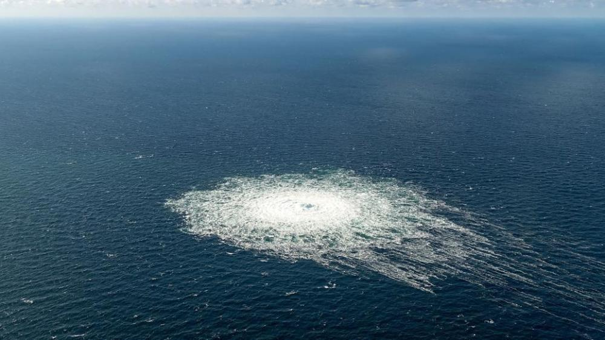

# 俄方在安理会北溪事件会议上指欧洲灭证袒护美国，美方：阴谋论

_“北溪”天然气管道发生泄漏。视觉中国
资料图_

当地时间2月21日，应俄罗斯要求，联合国安理会就去年9月连接俄罗斯与德国的“北溪”天然气管道爆炸事件举行公开会议。

据半岛电视台与美联社报道，在会议召开之前，德国、瑞典和丹麦在给安理会的一封联名信中说，他们的调查已经证实北溪管道是因为“蓄意造成的强烈爆炸”而出现大面积破坏，并重申破坏输油管道的行为是“不可接受的，危及国际安全”。信中表示，德国、瑞典和丹麦尚不清楚调查何时能够结束，俄罗斯当局也被告知该情况。

据俄罗斯卫星通讯社22日报道，俄罗斯常驻联合国代表瓦西里∙涅边贾在联合国安理会会议上表示，根据关于成立调查“北溪”管道破坏事件的委员会决议草案的第一轮磋商，西方国家没有表现出合作的意愿。涅边贾还称，丹麦、瑞典和德国对北溪天然气管道爆炸事件的调查不仅不透明，而且是在消灭罪证，袒护华盛顿，莫斯科方面要求进行独立调查。

据联合国新闻网站消息，美国常驻联合国代表约翰•凯利（John
Kelley）在会议上表示，俄罗斯此次要求召开会议，是迫切希望改变话题，公然企图分散人们对俄乌冲突一周年的注意力。约翰•凯利指责称，俄罗斯滥用其作为安理会成员的地位在会议平台上散布阴谋论，有关美国参与破坏行为的指控“完全是错误的”。约翰•凯利表明，当各国不愿或无法进行调查时，应保留联合国调查的资源。

据半岛电视台报道，此次会议正式召开前，俄罗斯方面就曾控诉称美国是“北溪”管道爆炸的幕后黑手，并称这次破坏行动“是在美国领导层一再威胁北溪之后发生的”。美国方面则否认了这一指控。美国国务院发言人奈德•普莱斯（Ned
Price）上周回应称，有关美国参与打击“北溪”管道的说法“纯属虚假信息”。

据联合国新闻网站消息，联合国主管政治和建设和平事务的副秘书长迪卡洛（Rosemary
DiCarlo）在会上对安理会表示，目前围绕“北溪”管道爆炸事件存在猜测，事件本身也具有敏感性，联合国因此敦促各相关方保持克制，避免做出任何可能令地区紧张局势进一步升级的无端指责。迪卡洛在发言中强调，联合国已得知由瑞典、德国和丹麦各自展开的调查仍在进行中，“联合国无法核实或确认与该事件有关的任何指控，我们等待正在进行中的国家调查取得结果”。

中国常驻联合国代表张军出席会议并发言表示，中方支持加快调查进程，迅速查明事实真相。任何对跨国基础设施的蓄意破坏都是恶性行为。如果不能查明“北溪”管道被破坏的原委和责任者，将会发出错误信号，让那些图谋不轨者认为他们可以为所欲为。对此事开展客观、公正、专业的调查，尽早公布调查结果，并追究有关责任，不仅关乎事件本身，也关乎全球跨国基础设施安全，与每个国家的利益和关切都息息相关。联合国作为最具权威性和代表性的国际机构，可以为开展国际调查、保障跨国基础设施安全发挥积极、建设性作用。中方欢迎俄罗斯在安理会提出的决议草案，认为就“北溪”管道被破坏问题授权开展国际调查有重要意义。

据联合国新闻网站资料显示，2022年9月26日至29日期间，在波罗的海博恩霍尔姆岛附近的两条“北溪”海底输气管道中先后发现了共四处泄漏。当时这两条管道均未处于运行状态，“北溪-1”管道的供气在9月已经停止，而“北溪-2”管道从未投入使用。不过，据称在事件发生时，涉事管道中储存着数亿立方米的天然气。2022年10月18日，丹麦哥本哈根警方报告称，对泄漏事件的初步调查发现，造成管道损坏的原因是“强烈的爆炸”。

