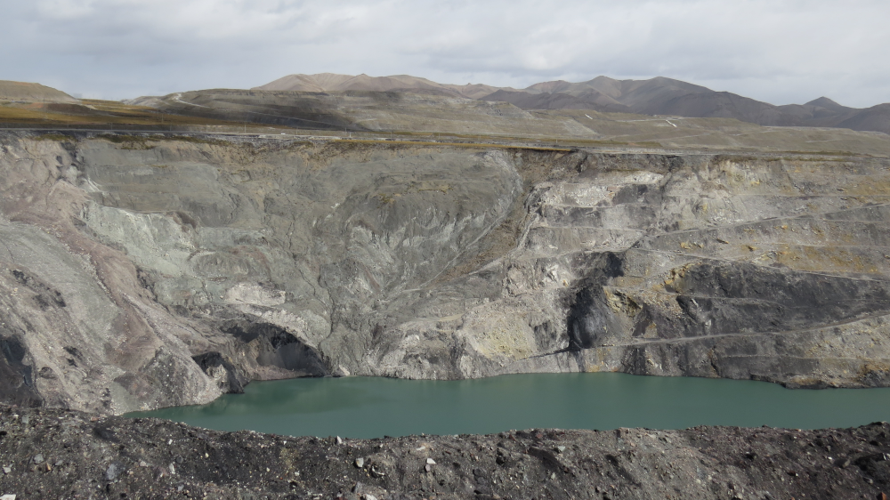
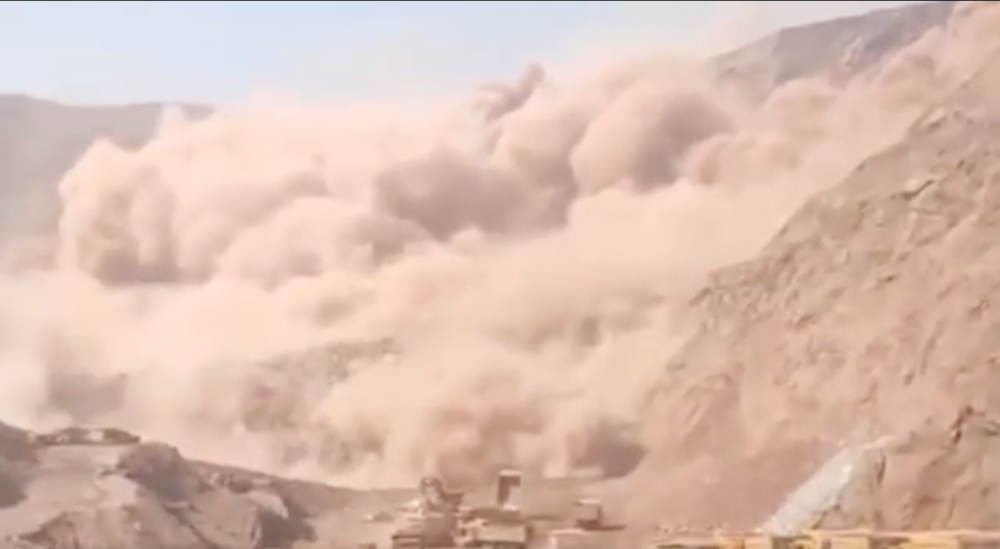

# 内蒙古露天矿坍塌：边坡失稳是最大安全隐患，救援中谨防二次坍塌

2月22日，内蒙古阿拉善盟左旗新井煤业有限公司一露天煤矿发生大面积坍塌，造成人员伤亡，目前救援工作正在开展中。

事故发生后，不少网友对于露天煤矿的开采方式和风险提出了许多疑问。《一起来唠科》连线成都理工大学地质灾害防治与地质环境保护国家重点实验室副主任赵建军教授，对部分话题做出解答。

**一、露天煤矿是什么？它和地下采煤的方式有何不同？**

**赵建军：**
露天煤矿是指采用露天开采技术的煤矿，开采这种煤矿时会沿着煤层出露的方向布置一个坑，将煤层周围、特别是煤层上面的这些岩石和土剥离开，然后从地表开始一个一个台阶往下挖，最后会形成一个很大的坑。采煤人员一般会围绕坑壁在边坡上修一条路，把挖出来的煤通过卡车拉走。

青海某露天矿（图源：赵建军）

而地下采煤我们比较熟悉，基本上都是在地下开采。二者相比，有以下几个特别之处：

1.开采方式不同：地下煤矿采用井下开采，而露天煤矿则是在地面上进行采矿，因此开采方式有很大的差异。

2.采矿效率高：露天煤矿采用的是机械化大规模开采，采煤效率非常高，每天可以开采大量的煤炭，而地下煤矿采用的则是手工开采和机械化开采，效率相对较低。

3.产生环境影响：露天煤矿在开采过程中会产生大量的煤矸石和废渣，同时也会对周围环境产生一定的影响，例如地形改变、水源污染等。而地下煤矿在开采过程中对环境的影响相对较小。

4.需要更多的土地：露天煤矿需要占用大量的土地，对周围的生态环境和农田产生一定的影响。而地下煤矿在占地面积上相对较小。

**二、和地下采矿相比，露天采矿有哪些特殊的安全隐患？**

**赵建军：** 露天矿要挖坑，是从上往下挖的，在往下采煤的过程中，挖出来的边坡高度是不断增加的，而且这个坑往往是长条型，四周都是边坡。

在底下挖的时候，坡高会不断增加。而且在下方挖的过程中，还会对上方产生扰动。而挖掘机司机、卡车司机都在哪呢？都在边坡坡脚的矿坑里面作业，所以他们是在最底下的。那么一旦露天矿的边坡出现垮塌或者滑坡，就容易对底下在坑里面作业的这些工人造成威胁。这次出现的这种事故，有可能就是这种情况。

而地下采煤也会影响到地表，会产生沉陷盆地，里面的房子会出现开裂，或者是往下塌成一个坑，我们叫做地面塌陷。这种变形和滑坡不一样，它往往有一个缓慢的变形过程。如果是在山区里进行地下采煤，它也会引起边坡变形。但是从采煤以后变形传递到地表，出现边坡变形到最终形成滑坡，往往有一个非常长的时间周期，而且在形成滑坡之前，往往会有很多地表裂缝，这个时候人们就基本上能发现了。

所以露天矿和地下矿相比，它特殊的边坡结构不断被改造，坡高不断在增大，其边坡的稳定性也就是滑坡问题，关键是坡脚的矿坑里一直有人员在作业活动，必须要高度重视。

**三、这种特殊性是否意味着，露天煤矿作业的安全性是否更低？**

**赵建军：**
露天矿的安全性也不是说更差，只能说它们的安全风险是不同的。比如露天矿的安全隐患核心在哪儿呢？实际上只要边坡不出现滑坡，那就能够保证底下的安全开采。
**所以露天矿最大的安全风险，就在于边坡的稳定性。**

内蒙古煤矿坍塌瞬间画面（来源：新京报我们视频）

地下采矿的影响因素更多，例如会遇到顶板的稳定问题，采煤井壁会发生变形，甚至有可能会发生煤和瓦斯的突然泄漏，还有地下水的突袭。所以二者并不是说哪个更安全哪个更危险。实际上不管是露天矿还是地下矿，它都有相应的安全规程和管理手段。

**四、露天煤矿坍塌和地下矿井相比，哪种情况更难抢救？**

**赵建军：**
我们常见的地下矿井如果出现了井下事故，造成人员被困，这种时候往往还有抢救的机会。因为地下矿井有较大的生存空间，人在生存的极限空间以内，把人救出来的几率还是比较大的。我们在新闻里也经常见到矿井发生坍塌，成功救援的案例非常多。

露天矿的坍塌，实际上可以理解为一个滑坡事件。如果把人埋了，或是造成矿坑底人员失踪，救援难度会更大一些。
**因为人被埋到岩石和土里面之后，呼吸的空间很少，生存几率相对于地下矿井来讲会更小，也更难抢救。**
但无论如何我们还是要相信，总会有奇迹发生的。目前我们也看到，内蒙古这个事故中已经有人被救出。

那么需要特别强调的是，在抢救过程中，要注意哪些问题呢？

**露天煤矿的坍塌抢救过程中，一定要防止二次垮塌的发生。**
因为救援人员要下到矿坑底下，而且要动用大型机械去把土石方挖开，这个过程中，实际上救援人员就在矿坑底下，上面边坡垮了后后壁松动了，岩石和土也有可能再次发生垮塌，所以这有可能会影响到下面救援人员的安全。

我们在抢救过程中一定要密切监测边坡的变形，特别是已经发生过垮塌的部位，一定要对周边部位的稳定性进行预警。一旦发现有要发生破坏的条件，要及时发出预警，把底下的人撤走，防止发生二次事故，这个非常重要。
**再次强调：在抢险过程中一定要做好边坡的应急监测预警，防止二次垮塌造成的二次伤害。**

**五、除了边坡失稳外，这一类的露天煤矿可能还会有哪些安全隐患？**

**赵建军：** 露天矿垮塌的影响因素，主要有这几类：

首先，边坡的基础内在地质条件，从物质成分上我们把岩石分成软的、硬的、软硬组合的。软的岩石稳定性就更差，这种先天不足更容易发生滑坡。

在露天煤矿开采的过程中，实际上煤层和周围的岩石比起来就是一个偏软的软岩，它的稳定性是比较差的。如果我们的煤埋在底下，上面又有一些硬的岩石，这时候底下的煤就会形成一个软弱基座。就相当于你一脚踩到一个厚的泥巴上面，这时候你的身体会往下沉，底下的这个软岩就会受到压缩，带动上面那些硬的岩石发生变形，最终加速坍塌。所以露天矿的这种内在条件，就决定了边坡容易发生变形。

另外一个就是边坡的结构，岩体是否完整、是不是有容易滑动的面，等等这些都是内在影响因素。

第二个因素就是降雨。集中降雨特别是长期降雨后，会降低岩土的稳定性，那也有可能会诱发边坡变形破坏。

第三，有可能在下面挖的过程中，对上面边坡的支撑锚定不够，或者对其稳定性的评估不充分。比如上边发生变形了，但是我们没发现，或者是我们发现了变形，没有对它重视，都有可能会造成事故。还有一种可能就是，这种破坏可能是突然发生的，以前没有出现过肉眼可见的变形，这种突发性滑坡事件往往需要专业的监测设备才能发现，这种会更容易造成人员伤亡。

**版权声明：本文系腾讯新闻《一起来唠科》独家稿件，未经授权禁止媒体转载，但欢迎转发至个人朋友圈。**

