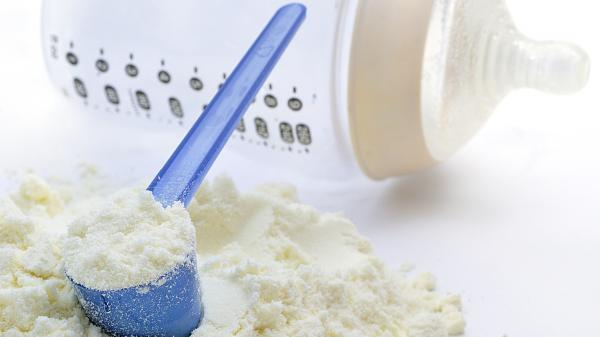
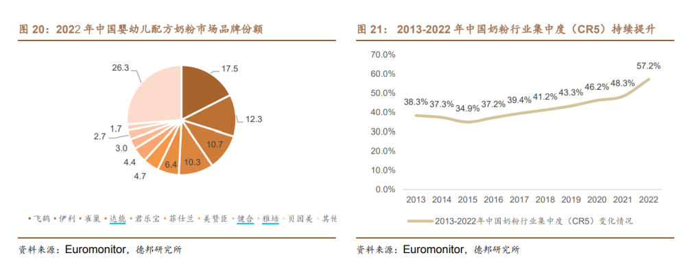

# 史上最严婴幼儿奶粉新国标今起实施：超千亿市场或将迎来行业大洗牌

两年过渡期后，婴幼儿配方奶粉“新国标”正式实施。

2021年3月18日，国家卫生健康委网站发布50项食品安全国家标准，其中的《食品安全国家标准婴儿配方食品》（GB
10765-2021）《食品国家安全标准较大婴儿配方食品》（GB 10766-2021）和《食品安全国家标准幼儿配方食品》（GB
10767-2021）三大标准，在业内被称为“史上最严”的奶粉“新国标”。

与此前的2010版婴幼儿配方食品系列标准相比，新国标对营养素的规定更严格，将原有的《较大婴儿和幼儿配方食品》（GB
10767-2010）分为《较大婴儿配方食品》与《幼儿配方食品》2个标准。

**新国标新在哪里？对企业影响几何？对行业来说意味着什么？**

澎湃新闻记者采访了多家头部奶粉生产企业与业内人士，业内认为，新国标对企业生产研发能力、配方科学性等要求更明确，提高了行业的准入门槛，另一方面也促进了市场集中度的提升，行业将迎来下一轮“科学竞赛”，加速行业洗牌与结构升级。

**为何要修改婴配粉“新国标”？**

“我觉得标准是有寿命的。”奶粉新国标的主要起草人之一、中国农业大学营养与健康研究院特聘教授韩军花向澎湃新闻记者介绍，国标的所有标准都要定期修订，标准是要越来越符合现代的健康理念或是最新的科学证据。

据韩军花了解，各个国家都在修订相关标准，尤其是国际食品法典委员会对婴幼儿配方食品标准做了较大修订，包括一些营养素的指标，尤其是针对二段（适用于6-12月龄婴儿，即较大婴儿）产品的营养素指标做了很多调整，调整的依据也是与母乳研究取得新进展有关系。

《婴幼儿配方食品系列标准问答》显示，根据最新的科学证据，参考国际标准的修订趋势，结合我国婴幼儿的营养素需要量，对宏量营养素进行修订：一是调整了较大婴儿和幼儿配方食品中蛋白质含量要求，并增加了较大婴儿配方食品中乳清蛋白含量要求；二是调整了较大婴儿配方食品中碳水化合物含量要求，与婴儿配方食品要求一致；三是增加了较大婴儿和幼儿配方食品中乳糖含量要求，并明确限制蔗糖在婴儿和较大婴儿配方食品中添加。

_来源：华鑫证券研报_

韩军花指出，从国内的实际情况来看，监管注册区分了一段、二段和三段产品，即0-6月龄婴儿、6-12月龄婴儿与1岁以上幼儿的产品，而旧国标只有两个标准，不符合国内监管的实际需求。

奶粉国标的修订，也体现了健康理念的改变，“我们把二段、三段奶粉的能量值、蛋白质等（营养素指标）都做了下调，其实也是更加接近母乳，或者说更接近该阶段孩子正常的生长发育，而不是让他的体重过度增长，追求更科学更均衡的生长。”韩军花说。

韩军花举例介绍，旧国标中对奶粉中添加的很多维生素没有设置上限值，企业在生产过程中添加的量较多，也是合格的。但新国标实施后，任何一个营养素都规定了最小值与最大值。

**史上最严婴配粉国标？**

2月22日，奶粉新国标正式实施后，只有通过新国标配方注册的奶粉产品，才能在中国境内出售。2021年新国标出台时，给奶粉企业留下了两年的过渡期“备考”。

**新国标这场“考试”的难度到底有多高呢？**

“新国标对生产的指标要求比较严格，因此企业有一些（情况下）调整的难度比较大。”韩军花介绍，有一些营养素的添加标准范围变窄了，这意味着企业必须在生产过程中严格控制，否则很容易就超出标准范围，就成了不合格产品，这就对企业的研发能力和生产工艺要求更加高。

以蛋白质指标为例，考虑到婴幼儿早期蛋白质摄入过多易增加肥胖风险，新国标下调了6-12月龄和12-36月龄婴幼儿配方奶粉的蛋白质指标，并提升了较大婴儿配方食品中乳清蛋白含量要求。

除了对一些营养素缩窄添加范围，新国标还提高了部分营养素的含量要求。韩军花举例称，新国标对奶粉中DHA（一种不饱和脂肪酸，对人体大脑、眼睛的发育有重要作用）的含量要求比原来高了，希望这些营养素添加进去后能真正对孩子的生长发育起作用。但很多企业指出，DHA添加多了奶粉会有一股腥味。“所以这对企业的生产和工艺把控来说也是一个考验。”韩军花坦言。

除了配方升级对企业研发能力和生产工艺的要求更严，新国标注册也是一场考验。

美赞臣中国首席科学家与创新官许飒向澎湃新闻记者指出，新国标注册非常考验企业的综合实力，其中最关键的一环是注册资料的准备与申报，材料的科学度、专业度和完成度是企业实力的直接体现，“要在较短时间内协调内外各方资源，完成配方升级并准备注册材料，并不容易。”

**新国标落地，婴配粉行业大洗牌？**

新国标全面替代旧国标后，规模超千亿的婴配粉市场，或将迎来行业大洗牌。

德邦证券2022年12月20日发布的研报指出，欧睿数据预测显示，2022年我国婴配粉的市场规模预计为1717亿元，一段、二段、三段以及特配奶粉的市场规模分别为450.81亿元、458.92亿元、727.80亿元与79.09亿元，占比分别约为26.26%、26.73%、42.40%及4.61%。

多家头部奶粉生产企业纷纷宣布旗下品牌或配方通过新国标注册。截至2月20日，伊利旗下金领冠有珍护、有机塞纳牧、菁护、育护等8个品牌、24个配方已经通过新国标注册；飞鹤通过新国标注册的品牌有18个系列、配方有54个；雀巢旗下的惠氏营养品旗下所有在售产品，全线通过新国标注册，完成注册的产品覆盖了惠氏启赋蕴淳、惠氏启赋等7个系列、21个配方；美赞臣中国旗下的蓝臻、铂睿等六大系列、16个配方全部通过新国标配方注册。

韩军花透露，大部分奶粉生产企业在2017年或2018年注册，配方注册的期限为5年，就算没有出台新国标，这些企业也该重新注册。企业为了符合新国标的要求，修改了配方，因此出现大批企业重新注册配方的情况。

据乳业分析师宋亮介绍，婴幼儿配方食品注册的要求非常严，首先工厂必须达标，其次产品配方要做临床验证，此外，企业还得做产品的稳定性测试，“这些都需要大量的资金、人力和时间，所以门槛比较高。”

宋亮向澎湃新闻记者指出，新国标正式实施后，会促进奶粉行业的集中度进一步提升，前十家奶粉企业的集中度有望提高到80%以上，三分之一的品牌可能会退出。

对此，韩军花坦言，不管是从国家的要求，还是老百姓的需求来看，像婴幼儿奶粉这么重要的食品，当然不希望太小的、不可靠的企业去做，都是希望大品牌来做婴幼儿奶粉，中小型企业做不了婴幼儿奶粉，可以做其他的配方奶粉。

国泰君安2022年12月19日发布的研报指出，新国标落地，预计约20%的中小品牌市场份额将进一步向前十家奶粉企业集中，在“十强”内部，也会出现市场份额向头部3至5家奶粉企业集中的趋势，国内奶粉行业前三家奶粉企业合计占有的市场份额有望从2021年的40%提升至长期的60%至70%。

据德邦证券研报，婴配粉市场中飞鹤、伊利、雀巢占据前三，行业集中度加速提升。根据Euromonitor的数据，2022年销售额前五的品牌为飞鹤、伊利、雀巢、达能与君乐宝，市场份额分别为17.5%、12.3%、10.7%、10.3%及6.4%，贝因美的市占率为1.7%，排名第十。前十名中，国产品牌和国外品牌各占5席。

_来源：德邦证券_

对于新国标，行业内的共识是，相对旧国标而言，这是一个“质的飞跃”。宋亮指出，符合新国标的产品品质会更好，也会推动企业进一步朝着技术储备、科研创新的方向发展。此外，新国标公布后，国产品牌与进口品牌通过配方注册的时间差距不是很大，也体现了我国进一步推动奶粉行业公平竞争的氛围。

“新国标的出台，对企业的研发能力、配方的科学性等提出了更高的要求。”惠氏表示，此次全线通过新国标注册，体现惠氏营养品“在中国、为中国、爱中国”的战略布局和深耕中国市场的坚定决心。惠氏母公司雀巢集团2022年财报显示，大中华区的婴儿营养业务实现了高个位数的增长，其中启赋品牌的市场份额呈增长趋势。

许飒指出，伴随新国标的正式落地，婴幼儿配方奶粉行业正在步入下一轮科学竞赛，驱动中国婴幼儿配方奶粉回归配方本质。

“新国标调整的核心是‘更适合’‘更精准’，使婴配粉最大程度接近中国母乳。新国标的实施，对公司健康长远发展有着积极影响。”飞鹤强调，新国标下，奶粉市场会加速向具备技术优势和产品优势的头部企业集中，研发将成为未来竞争的突出亮点和核心。据中国飞鹤2022年中期报告，去年上半年，中国飞鹤的收入约为96.73亿元，期内溢利约为22.72亿元。

值得一提的是，宋亮指出，新国标实施是中国奶粉价盘恢复的一个契机，“过去三年，奶粉价格战打得非常惨烈，新国标推出以后，会促进奶粉价盘稳定，企业供货稳价，对行业健康发展起到非常重要的作用。”宋亮说。

伊利也认为，新国标实施在即，叠加二次配方注册下新国标产品的更迭，有助于行业价格趋于稳定。据伊利2022年第三季度报告，去年前三季度，伊利的奶粉及奶制品业务收入约187.28亿元，同比增长约60%，占总收入比重约20%。

“新国标对婴配粉生产研发能力、配方科学性等方面的要求更为明确，标准更加严格，产品生产、注册难度逐步加大，这对企业的生产研发能力及质控质检能力提出了巨大考验，也使行业准入门槛再次提高，市场竞争更加激烈，导致部分企业将在这场角逐中被淘汰。”伊利方面表示，新国标的实施，在推动中国婴配粉行业迎来品质升级新阶段的同时，也促进了市场集中度的提升，加速行业洗牌及结构升级。

