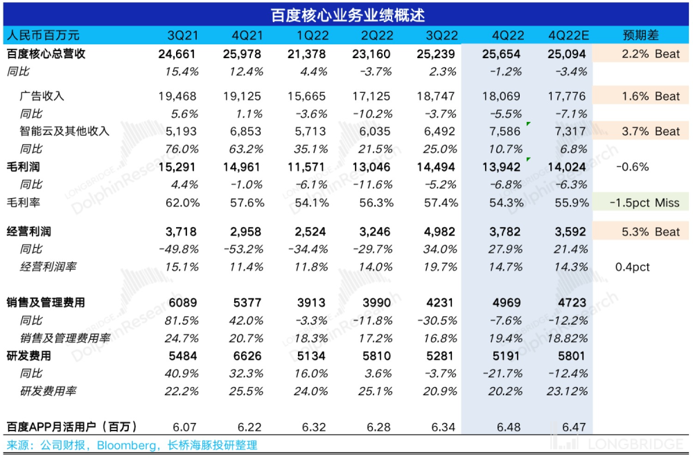
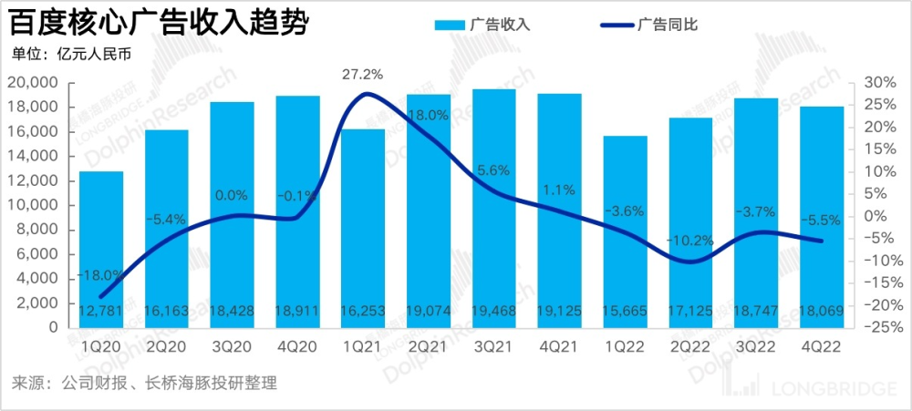
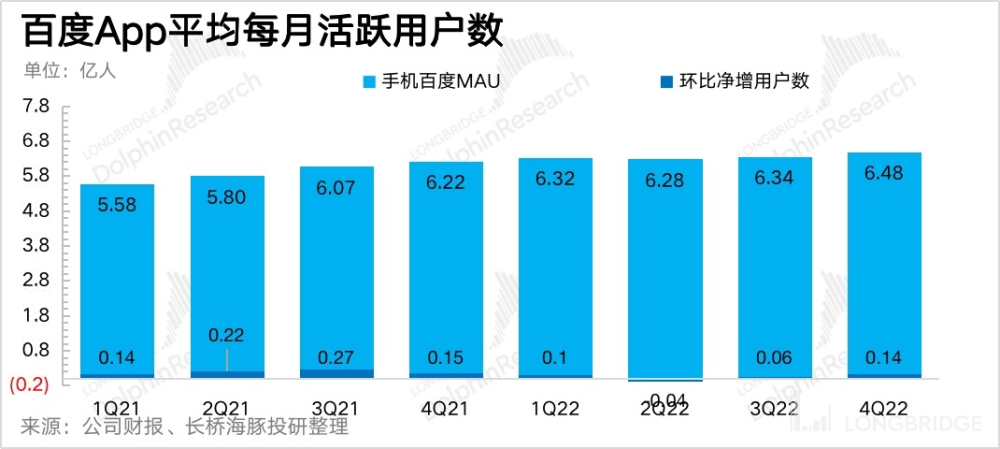
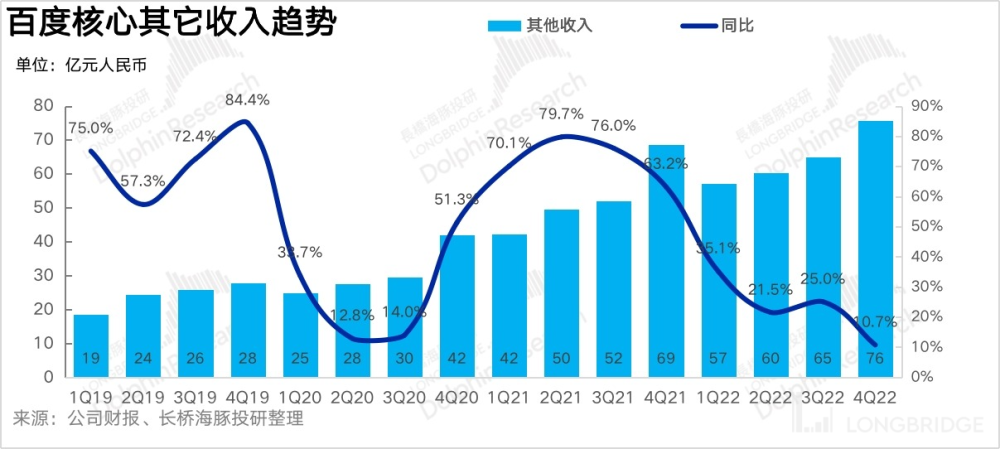
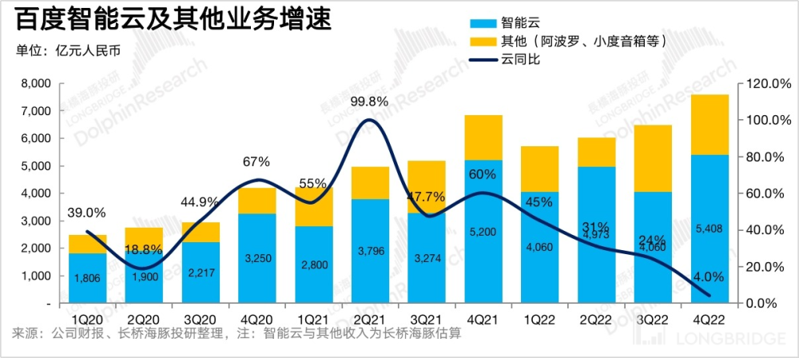
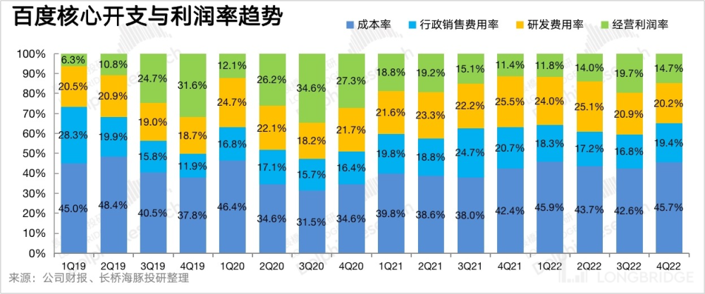
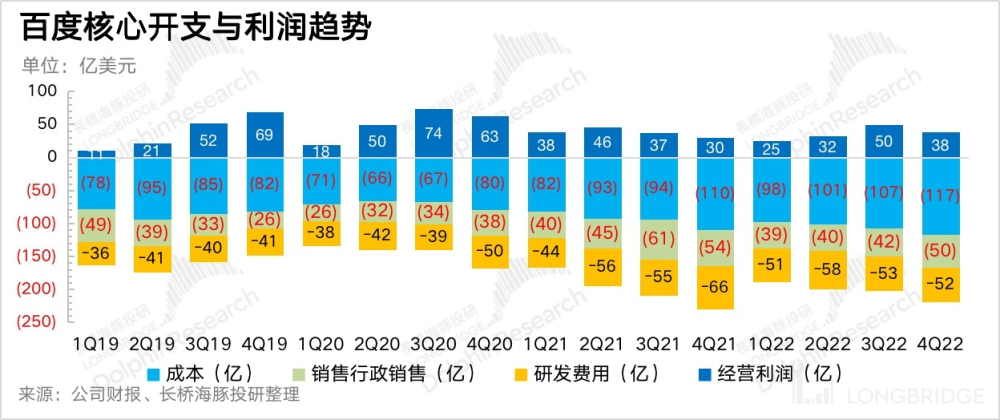
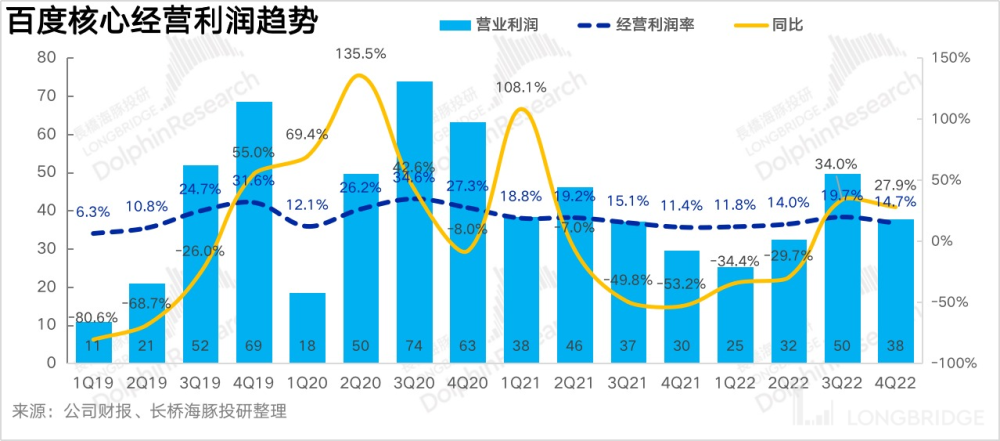

# 挺过疫情、迎来ChatGPT，百度要来第二春？

北京时间2月2日港股盘后，百度（9888.HK；BIDU.O）发布了2022年四季度财报。剔除爱奇艺看百度核心业务的情况，
**整体略优于预期，主要相对意外的是研发投入的大幅度收缩。此外，就是公司新宣布的一项三年期50亿美金额度的回购计划。**

百度核心业绩重点表现为：

**（1）核心收入主要受制于疫情，无论是对广告还是云，都带来了暂时性的压力——**
下滑幅度加大或增幅显著放缓。但因为市场预期偏谨慎，因此各项收入都比预期得要更优。

如果不与预期对比，单从业绩本身的表现来看，海豚君认为：

**a.广告收入虽然同比下滑5.5%，但基本还是有韧性的。**
背后可能隐含的信息：去年底尽管疫情高发很大程度上影响了线下经济活动，但因为防疫政策在不断调整，因此广告主对前景预期可能并没有那么悲观。

**b.以云、智能驾驶等为主的其他业务**
同比增长11%，创新业务中的支柱——智能云四季度增长只有4%，失速显著。除了有疫情因素，自身的业务调整（主动剥离低效益项目）也对当期增速影响。

**（2）盈利情况基本跟着贡献支柱——广告业务走**
，因此环比走低基本在预料之中。但四季度因为超预期的加速收缩研发费用（预期差近6亿），因此最后经营利润还是比预期要略高。

**（3）爱奇艺不再是拖累：** 加上爱奇艺这个季度也表现不俗，集团整体收入331亿人民币，同比持平，明显超市场预期321亿；

同时爱奇艺的盈利能力也在持续改善，并且超预期更多，在这个季度也贡献了近8亿的自由现金流，至少短期上爱奇艺已经不再是百度急于甩掉的包袱了。

（4）体内毛利相对高一些的托管页广告四季度贡献了核心广告的45%，比上季度有所下降。

（5）截至去年底，百度账面现金非常丰厚，现金+投资减去短期的有息债务、少数股东权益外，还有净现金近165亿美元，占了当期市值的34%。单季自由现金流进账59亿元人民币，剔除爱奇艺也有51亿。

公司这次也宣布了一项50亿美金额度的回购计划，在正常经营下，等于就是拿了一年赚的现金用作回购。

**长桥海豚君观点**

百度作为之前反弹最慢的中概，在最近一个月赶上ChatGPT风口的助力下，自低点以来的涨幅已经看齐甚至超越了同行。

在中文圈的环境中，百度的大模型（文心一言）几乎没有能够比肩的对手。在国内搜索引擎的市场地位上，百度也是一家独大，况且其他搜索平台在AI技术上的积累也很难与百度直接扳手腕。因此可以说在ChatGPT对谷歌潜在的竞争影响上，百度并不存在同等的危机。

因此对于百度来说，重点需要特别关注的就是 **投入成本对短期利润潜在的侵蚀问题** （参考海豚君在关于ChatGPT的成本测算《美股广告：TikTok
之后，ChatGPT 要掀起新 “革命”？》）。

相比英文语境，中文环境下因为多方面影响因素，在语料的获取、清洗等处理上都更复杂，加大了训练的难度和准确性，可能也会提高训练成本。此外，训练差异体现在终端应用上的影响，就是中文大模型最终的用户体验要与ChatGPT弱一截，进而可能也会影响到“文心一言”潜在的商业化空间。

目前而言，百度透露会将AI融入当前的搜索引擎，以及对外技术授权。直接对API接口收费的商业模式相对比较清晰（目前百度免费对外开放，OpenAI按次/按时间收费），但要想让广告主也来参与覆盖AI的成本，短期恐怕还有点难度。在广告效果未有显著提升下，商家立即提高预算的可能性不高。

**而在实际获得有效且持续的变现增量之前，成本已经提前投入，短期上随着百度对AI的重心倾斜，利润上或许会看到一些影响，但也取决于百度的投入节奏。（建议关注电话会上管理层对AI成本投入指引）**

**中长期的商业化前景，AI赋能后，对百度现有产品在流量入口和广告变现上的竞争提升的助力，可关注产业发展的逐步兑现情况。**

因此海豚君认为，随着加息预期的升温导致市场流动性不宽松的情况下，
**我们更倾向于淡化短期的炒作情绪，回归到对百度中长期估值影响更大的因子——宏观经济的复苏和超预期的节奏，来看当下存在的增值空间。**

从目前市场预期来看，对百度核心广告收入今年的增长预期在5.5%左右。如果结合今年GDP预期，以及百度客户中疫情受损严重的中小商户，尤其是线下本地商业在今年的更高弹性的回暖趋势来看，
**海豚君认为，市场对于2023年的预期略偏保守了，百度想要实现超预期的难度可能并不大。**

**结合海豚君此前对百度的估值《消费乍暖还寒，拦不住广告的春天》，目前股价位于市场一致预期下的合理区间（海豚君比彭博一致预期要乐观一些）。如果二季度之后国内消费回暖节奏超预期加快，那么也有望提升估值空间。**

**2023开年已有2月，实际消费复苏情况如何？公司如何判断短中期前景？** 建议关注管理层电话会对未来的展望和指引。

**本季财报详细解读**

百度是互联网公司中比较罕见地把业绩详细拆为：

1、百度核心：涵盖了传统的广告业务（搜索/信息流广告），以及创新业务（智能云/DuerOS 小度音箱/阿波罗等）；

2、爱奇艺业务：会员、广告与版权转授权等其他。

两项业务的拆分泾渭分明，加上爱奇艺作为独立上市公司数据详尽，海豚投研在此也将两项业务详细拆解。由于两大业务有大约 1% 左右（2-4
亿之间）的抵销项，因此海豚君拆分的百度核心细分数据与实际报数可能稍有差距，但无碍趋势判断。

**一、广告小超市场的保守预期**

由于12月份防控调整后，全国经历了一波感染高峰，线下出行受到影响，因此四季度广告不及上季度业绩会给出的指引显然已经属于是意料之中，市场也已经在过去两个月中对百度广告收入做了调整，给出了负7%的增长预期。

**但也因为市场预期足够低、去年基数也比较友好，实际百度核心的广告收入并没有那么差，海豚君基于百度财报核算出来的百度核心广告收入是181亿，同比下跌-5.5%**
，稍优于市场预期的-7%下滑。

总体上看，尽管四季度全国经济活动因为疫情大面积停摆，但百度四季度广告也并没有市场预期的那么悲观。从中窥出的信号可能是：四季度虽然有疫情扰动，但因为防疫政策的调整，至少在去年底广告主对今年消费前景预期还是不错的。

在走过了元旦的感染高峰，线下经济也开始从春节正式开启复苏，旅游出行的火热大家都有目共睹，
**那么别的行业对新一年的营销展望如何？以及二季度之后的复苏节奏是继续加快还是放缓？建议大家关注电话会管理层的指引。**

**从百度本身来看，自2019年下半年推出的托管页营销（** “营销+运营”类广告SaaS解决方案 **）**
，毛利相对高一些，近两年在传统搜索广告低迷期高速增长，贡献了不少增量。

但四季度，托管页营销收入占整体核心广告收入的45% **（环比下滑了6个点）** ，
**到底是因为防疫调整，传统搜索上的中小商家客户恢复弹性更大占比提升带来，还是说因为同行的竞争，**
比如微信在去年四季度释放了搜一搜的广告库存。这恐怕也会成为电话会上分析师会询问管理层的一个点，可关注管理层的解释。

**四季度百度APP平均月活6.48亿，在获客投入环比有所增加上，带来了约1400万人的净增。**

**二、创新业务：短期疫情影响智慧云交付**

百度核心中的其他所有与广告无关的收入都在百度核心的其他收入当中，这部分收入基本能够贡献到百度核心收入的30%以内，其中贡献主力是智能云业务。

具体分项上，既包括了软硬一体的智能业务，含to B和to C两端的智能云（占七成以上）、智能音箱、阿波罗自动驾驶，也包括了移动业务部分非广告收入。

**四季度的疫情不仅影响了广告，也影响了智慧云等创新业务的客户交付进度。** 百度核心其他收入约在76 亿，同比增长接近
11%，显著弱于2022年前三个季度，不过市场预期的调整比较及时，也更保守，仅对创新业务维持7%的增长预期。

**1、智慧云除了疫情扰动，剥离低质业务的动作还在持续**

在近两年的互联网强监管之下，相比于腾讯云的泛娱乐集中的客户和阿里云互联网集中的客户，百度本身由于客户行业分布更加均衡一些，加上本身在规模上基数也不高，因此整体放缓节奏要稍慢一些。

**作为创新业务的主要支撑，智能云四季度收入大约54亿，同比增长只有4%，相比上季度增速显著下滑。首先是有全国大面积疫情对商务出行和合同交付的影响**
，此外，由于与上季度相比放缓明显较大，因此海豚君认为百度 **对低效益的项目剥离** 应该还在持续。

而即将上线的百度版ChatGPT大模型“文心一言”则主要是在中长期上可以帮助扩大百度AI云的影响力。目前参与第一批测试的生态合作企业达到了400家，并且数量仍然在快速增长中。

虽然当下在测试期，文心一言免费对外授权API接口，重在扩大生态影响力，同时有意积累更多的高质量语料数据，增强模型训练。

但同时，后续不排除可以像OpenAI一样，按次/时间收费，并且作为企业上云的突破口，拓展百度云其他模块的能力。

**当然这主要是未来中长期前景的其中一种预判，由于此次技术变革的特殊性，海豚君认为并不需要着急定价到估值中，而是关注后续产品化，以及商业模式的落地情况，尤其是产业发展的关键节点。**

**2、智能驾驶**

相较于云业务已经初具规模，百度的智能汽车板块还属于一个需要想象力的长线故事。虽然梦想很远大，但是每一步的落地更重要。

**1）辅助驾驶**
是百度全自动驾驶路上沿途下蛋、向整车厂卖辅助驾驶方案的产品——ANP（道路自动驾驶）、AVP（自动泊车）和高精地图：上季度已经在广汽埃安、长城、威马等多款品牌车型上搭载，整体业务订单金额已超百亿，公司预计今年下半年会慢慢确认到收入中。

**2）自动驾驶车队服务萝卜快跑：** 四季度，萝卜快跑共提供56.1万单的乘车服务，同比增长162%，环比增长18.4%。截至2023
年1月，萝卜快跑向公众提供的乘车服务次数已累计达到200万。

**3）自动驾驶牌照上：** 百度已获得中国自动驾驶测试牌照718张，其中载人资格571张，商业试点194张；

去年底，萝卜快跑也成为首批获准在北京开展无人驾驶测试的解决方案商。

**三、广告修复+减投入，毛利率持续修复**

四季度由于高毛利率的广告负增长，整体毛利率因为收入结构的关系而环比走低。爱奇艺在其中已经不再是拖累，四季度毛利率反而继续优化至28.8%。

**但单看百度核心，四季度毛利下滑近7%，核心毛利率走低了3个点至54.3%，比市场预期的要差一些。**
通过与往年相比，在疫情相对严重的时期，百度的毛利率都会走低至53%-54%，虽然低毛利率的智能云等其他业务在整体收入中的占比在走高，但在关闭盈利低质的项目后，本身也在走改善趋势。

**海豚君认为，如果后续AI成本投入有限，或者能够同步商业化的话，那么在非正常环境下的四季度的毛利率水平，应该是今年的一个相对低点。**

**四、研发开支收缩加剧**

经营费用上，百度进入2022年已经进入明显的降本增效周期，销售费用率一直在持续收缩当中。四季度除了销售费用继续同比下滑但幅度放缓外，这次超预期的是在研发上的费用开支显著加速收缩，在继三季度个位数下滑后，这个季度下滑幅度进一步扩大到-21.7%。

不过，由于开年以来ChatGPT的技术革新，百度言语中似乎进一步提高了AI的战略地位，因此恐怕也会指向新一年的研发费用可能会重新抬头。

**最终由于收入超了一点（云业务预期差稍微大点），研发投入节省额度超预期，核心业务的营业利润38亿，超出市场预期近2个亿。**

**经营利润同比增长28%，虽然有所放缓，但整体上处于修复趋势，经营利润率回落至14.7%，基本符合预期。**

