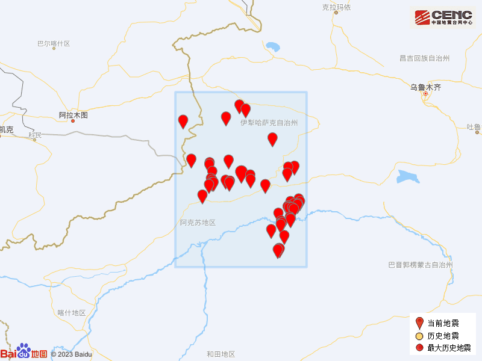

# 新疆阿克苏地区拜城县发生4.6级地震

据中国地震台网正式测定，2月22日18时25分在新疆阿克苏地区拜城县发生4.6级地震，震源深度26公里，震中位于北纬41.89度，东经81.99度。

本次地震周边5公里内的村庄有拜垅、布吉尕村、且买克买里斯、协合买里、伊希达其、喀瓦买里斯、格结克买里斯，20公里内的乡镇有亚吐尔乡、布隆乡、康其乡、拜城镇、托克逊乡、米吉克乡。

震中距拜城县16公里、距新和县65公里、距库车市86公里、距沙雅县99公里、距特克斯县148公里，距阿拉尔市161公里，距阿克苏地区165公里，距乌鲁木齐市507公里。

震中5公里范围内平均海拔约1450米。

根据中国地震台网速报目录，震中周边200公里内近5年来发生3级以上地震共272次，最大地震是2020年1月16日在新疆阿克苏地区库车县发生的5.6级地震（距离本次震中154公里），按震级大小前50次历史地震分布如图。

