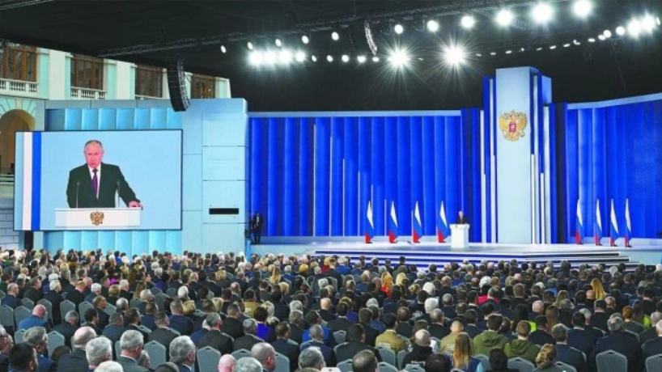

# 泽连斯基称“没看普京的国情咨文讲话”，原因是赫尔松正受袭击

【环球网报道 记者
李诗睿】据英国天空新闻网、乌克兰《基辅邮报》21日消息，乌克兰总统泽连斯基透露，当天他没有观看普京的国情咨文讲话，原因是赫尔松市遭到袭击。

“我没有观看他（普京）的讲话，因为当时赫尔松发生了恐怖袭击。”泽连斯基还声称，袭击导致该地区“21人受伤，6人死亡。”

_（泽连斯基，资料图。图自外媒）_

天空新闻网称，就在普京发表讲话之际，乌克兰赫尔松市受到袭击。

据外媒此前报道，俄罗斯总统普京21日在莫斯科发表国情咨文，他在讲话时宣布俄方暂停履行与美国签署的《新削减战略武器条约》。俄罗斯卫星通讯社称，普京此次演讲持续了1小时45分钟，成为他在俄罗斯联邦会议（议会）发表的时间最长的讲话。

_（普京2月21日发表国情咨文的画面。图自俄新社）_

据俄新社报道，谈及特别军事行动，普京在讲话中称，在战场上战胜俄罗斯是不可能的。普京还表示，俄罗斯曾准备与西方进行建设性对话，并多年来一直建议在联合安全架构下进行合作，也一直表示准备与西方对话，但遭到了忽视和拒绝。普京称，是西方发动了战争，而俄罗斯正在用武力制止战争，挫败了基辅对顿巴斯的蓄意袭击。

