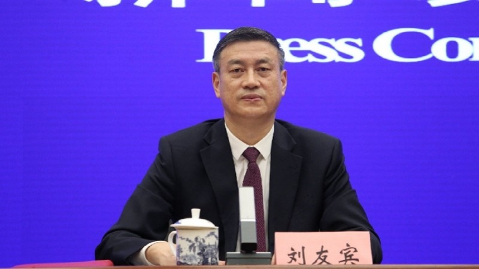

# 生态环境部：春节期间60个城市因烟花爆竹燃放出现重污染天

**南都讯** 见习记者王玮 发自北京
2月22日，生态环境部召开2月例行新闻发布会，生态环境部新闻发言人刘友宾介绍，今年春节期间（1月21日至27日），受烟花爆竹集中燃放及不利扩散条件影响，全国16个省份共60个地级及以上城市累计出现76天次因烟花爆竹燃放导致的重污染天，主要分布在河南、山东、湖南、陕西、辽宁、吉林等省份。

_生态环境部新闻发言人刘友宾。_

刘友宾表示，总体上看，今年1月，全国环境空气质量持续改善，339个地级及以上城市平均空气质量优良天数比例为74.3%，同比上升0.9个百分点，PM2.5平均浓度为55微克/立方米，同比下降1.8%。同时，臭氧平均浓度为90微克/立方米，同比上升9.8%。

监测数据显示，今年春节期间（1月21日至27日），受烟花爆竹集中燃放及不利扩散条件影响，全国16个省份共60个地级及以上城市累计出现76天次因烟花爆竹燃放导致的重污染天，主要分布在河南、山东、湖南、陕西、辽宁、吉林等省份。

此前，生态环境部生态环境监测司有关负责人也表示，1月，全国重污染天数比例同比增加2.3个百分点，全国地级及以上城市共出现564天重污染，同比增加了239天，主要是重点区域跨年持续重污染过程、春节期间烟花爆竹燃放及沙尘天气同比偏多等三方面因素共同影响导致。

“今年1月全国环境空气质量状况通报中，增加了全国及三大重点区域重污染天气比例情况，三大重点区域当月及累计月发生重污染天的城市名单及天数。目的是通过信息公开，充分保障公众环境知情权、参与权、监督权，推动公众参与，强化舆论监督；同时，督促重污染天数较多的城市，进一步加大污染防治工作力度，推动实现到2025年，全国重度及以上污染天数比例控制在1%以内的目标，切实改善环境空气质量。”刘友宾说。

