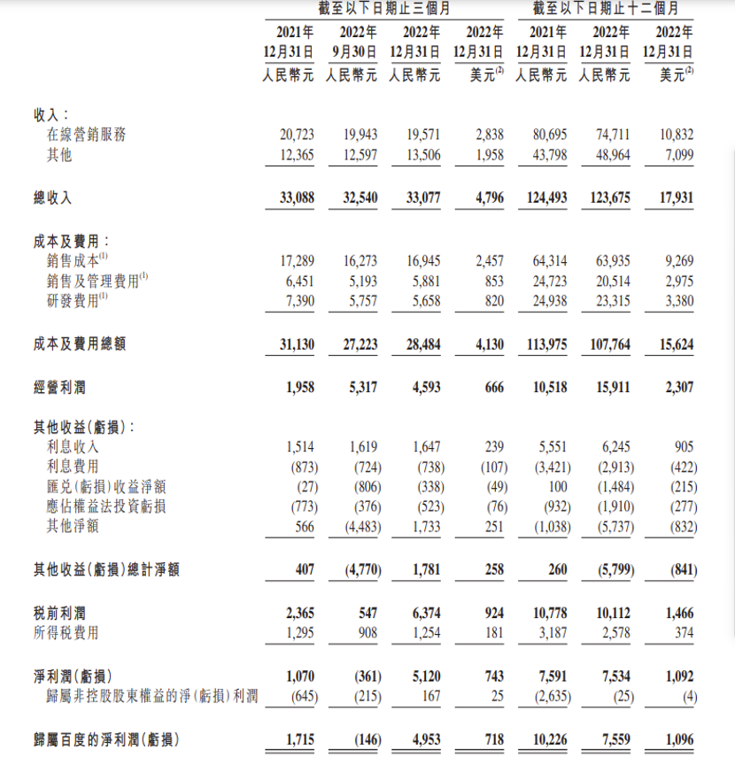

# 百度四季度营收330.8亿元 宣布50亿美元股票回购计划

**划重点**

  * _1_ 百度第四季度营收为331亿元，与去年同期基本持平；
  * _2_ 百度第四季度净利润50亿元，同比增长189%；
  * _3_ 百度2022年总营收1237亿元，同比下滑1%；
  * _4_ 百度2022年净利润76亿元，同比下滑26%；
  * _5_ 截至2022年12月，百度App月活达6.48亿，同比增长4%。

腾讯科技讯
2月22日消息，百度周三公布了该公司截至2022年12月31日的第四季度及全年未经审计财报。财报显示，百度第四季度总营收为331亿元，与去年同期基本持平；归属百度的净利润为50亿元，同比增长189%。不按照美国通用会计准则，归属百度的净利润为53.7亿元，同比增长32%。截至2022年12月，百度App月活达6.48亿，同比增长4%。财报发布后，百度在纳斯达克证券市场上市的股票盘前交易中上涨逾7%。

**一、财报要点**

**1、第四季度总营收与上年同期持平**

\--百度第四季度总营收为331亿元（约合48亿美元），与去年基本持平。

\--百度第四季度运营利润为46亿元（约合6.66亿美元），较上年同期的运营利润19.6亿元相比增长135%。

\--不按照美国通用会计准则，百度第四季度运营利润为65亿元（约合9.42亿美元），较上年同期的43.1亿元增长51%。

\--第四季度归属百度的净利润为49.5亿元（约合7.18亿美元），较上年同期的17.15亿元相比增长189%。第四季度归属百度的每股美国存托凭证摊薄收益为13.59元（约合1.97美元），相比之下上年同期每股摊薄收益为4.51元，同比增张201%。

\--不按照美国通用会计准则，第四季度归属百度的净利润为53.7亿元（约合7.79亿美元），与上年同期的40.8亿元相比增长32%。不按照美国通用会计准则，第四季度归属百度的每股美国存托凭证摊薄收益为15.25元（约合2.21美元），与上年同期的11.6元相比增长31%。

**2、2022年全年总营收同比下滑**

\--百度2022年总营收为1237亿元（约合179.3亿美元），较上年的1244.93亿元（约合195.36亿美元）相比下滑1%。

\--百度2022年运营利润为159亿元（约合23.1亿美元)，较上年的105.18亿元（约合16.51亿美元）相比增长51%。

\--不按照美国通用会计准则，百度2022年运营利润为232亿元（约合33.6亿美元），较上年的190.3亿元（约合29.86亿美元）相比增长22%。

\--2022年归属百度的净利润为76亿元（约合11.亿美元），与上年的102.26亿元（约合16.05亿美元）相比下滑26%。2022年归属百度的每股美国存托凭证摊薄收益为19.85元（约合2.88美元），与上年的28.07元相比同比下降29%。

\--不按照美国通用会计准则，2022年归属百度的净利润为206.8亿元（约合30亿美元），较上年的188.30亿元（约合29.55亿美元）相比增长10%。不按照美国通用会计准则，2022年归属百度的每股美国存托凭证摊薄收益为58.93元（约合8.57美元），较上年的53.53元相比增长10%。

**3、高管点评**

百度创始人、董事长兼首席执行官李彦宏表示：“2022年是充满挑战的一年，但我们利用这段时间为公司迎接更好的时代做好了准备。我们相信，在2023年，我们将有明确的路线图来重新加速我们的营收增长，我们现在处于有利地位，可以充分利用中国经济复苏为我们提供的机遇。通过对人工智能的长期投资，我们准备利用人工智能即将到来的拐点，在我们的整个业务组合中释放令人兴奋的新机会，从移动生态系统到人工智能云、自动驾驶、智能设备等。”（李彦宏发百度内部信：文心一言将整合入百度所有核心业务）

百度首席财务官罗戎称：“我们在疫情初期就开始努力优化成本和提高业务效率，打造了一家更强大、结构更精简的公司。2022年下半年，百度核心非公认会计准则营业利润同比增长14%。我们相信，更加精简的运营模式将支持我们公司实现长期可持续发展。”

**4、自由现金流**

截至2022年12月31日，百度现金、现金等价物、限制性现金和短期投资为1853亿元（约合268.7亿美元），不包括爱奇艺的现金、现金等价物、限制性现金和短期投资为1774亿元（约合257.2亿美元）。自由现金流为59亿元（约合8.59亿美元），不包括爱奇艺的自由现金流为51亿元（约合7.36亿美元）。2022年全年，百度自由现金流总额为179亿元（约合25.9亿美元），不包括爱奇艺的自由现金流为181亿元（约合26.3亿美元）。

周三，百度董事会宣布已批准一项新的股票回购计划。根据该计划，百度可能回购价值高达50亿美元的股票，有效期至2025年12月31日。

二、财务分析

**1、AI与云业务推动第四季度非在线营收增长**

\--在2022年第四季度，百度核心业务收入为257亿元（约合37.2亿美元），与上年同期的260亿元相比下降1%；在线营销收入为181亿元（约合26.2亿美元)，同比下降6%，主要是由于疫情反弹所致；非在线营销收入为76亿元(约合11.亿美元)，同比增长11%，主要受其他人工智能业务和云业务的推动。

\--在2022年第四季度，爱奇艺的收入为76亿元（约合11.亿美元)，同比增长3%。

\--营收成本为169亿元(约合24.6亿美元)，同比下降2%，主要是由于内容成本、商品销售成本和其他与新的人工智能业务相关成本下降，但部分被流量获取成本增加所抵消。

\--销售、一般和行政费用为59亿元(约合8.53亿美元)，同比下降9%，主要是由于与人员相关的费用减少。

\--研发费用为57亿元(约合8.2亿美元)，同比下降23%，主要是由于与人员相关的费用减少。

\--运营利润为46亿元(约合6.66亿美元)。其中，百度核心运营利润为38亿元（约合5.48亿美元），百度核心运营利润率为15%。不按照美国通用会计准则，百度第四季度运营利润为65亿元(约合9.42亿美元)，其中百度核心运营利润为55亿元(约合7.96亿美元)，百度核心运营利润率为21%。

\--其他总收入净额为18亿元(约合2.58亿美元)，其中主要包括长期投资的公允价值收益16亿元。很大一部分长期投资，包括但不限于对公共和私人公司以及私募股权基金的股权证券投资，须进行季度公允价值调整，这可能会导致未来期间的净收入波动。其他收入总额，去年同期净额为4.07亿元，主要包括长期投资的公允价值收益15亿元和减值损失8.91亿元。

\--百度第四季度所得税支出为13亿元(约合1.81亿美元)，同比下降3%。

\--归属于百度的净利润为50亿元，摊薄后美股收益为13.59元(约合1.97美元)。其中，百度核心的净利润为48亿元(约合6.92亿美元)，净利润率为19%。不按照美国通用会计准则，百度的净利润为54亿元(约合7.79亿美元)，摊薄后每股收益为15.25元(约合2.21美元)。其中，百度核心净利润为49亿元(约合7.13亿美元)，净利润率为19%。

\--在第四季度，百度经调整的扣除利息、税项、折旧及摊销前利润（EBITDA）为82亿元(约合11.9亿美元)，利润率为25%。其中，百度核心调整后的EBITDA为71亿元(约合10.4亿美元)，利润率为28%。

**2、2022年全年在线营销收入下降**

\--2022年全年，百度总营收为1237亿元（约合179.3亿美元），同比下降1%。其中，百度核心业务收入为954亿元(约合138.4亿美元)，与去年基本持平；在线营销收入695亿元(约合100.8亿美元)，同比下降6%；非在线营销收入259亿元(约合37.6亿美元)，同比增长22%，主要由云和其他人工智能业务推动。

\--爱奇艺的收入为290亿元(约合42亿美元)，同比下降5%。

\--营收成本为639亿元(约合92.7亿美元)，同比下降1%，与去年基本持平，主要是由于流量获取成本、带宽成本、销售成本和其他与新的人工智能业务相关的成本增加，但被内容成本的下降部分抵消。

\--销售、一般和行政费用为205亿元(约合29.8亿美元)，同比下降17%，主要是由于渠道支出、促销营销和人员相关支出的减少所推动。

\--研发费用为233亿元(约合33.8亿美元)，同比下降7%，主要是由于与人员相关的费用减少。

\--运营利润为159亿元（约合23.1亿美元)。其中，百度核心运营利润为145亿元(约合21.1亿美元)，运营利润率为15%。不按照美国通用会计准则，百度2022年全年运营利润为232亿元(约合33.6亿美元)，其中百度核心运营利润为209亿元(约合30.4亿美元)，运营利润率为22%。

\--其他亏损总额，净额为58亿元(约合8.41亿美元)，主要包括公允价值亏损39亿元及长期投资减值亏损30亿元。很大一部分长期投资，包括但不限于对公共和私人公司以及私募股权基金的股权证券投资，须进行季度公允价值调整，这可能会导致未来期间的净收入波动。其他收入总额，于2021年净额为2.6亿元，主要包括长期投资的公允价值收益31亿元及减值亏损43亿元。

\--所得税支出为26亿元(约合3.74亿美元)，同比下降19%，主要原因是2022年长期投资公允价值损失确认的递延税项收益，以及该公司2021年长期投资公允价值收益确认的递延税项支出。

\--百度2022年全年的净利润为76亿元(约合11亿美元)，摊薄后每股收益为19.85元(约合2.88美元)。其中，百度核心的净利润为76亿元，净利润率为8%。不按照美国通用会计准则，百度2022年全年净利润为207亿元(约合30亿美元)，摊薄后每股收益为58.93元(约合8.54美元)。其中，百度核心的净利润为199亿元(约合28.9亿美元)，净利润率为21%。

\--在2022年，百度经调整的EBITDA为297亿元(约合43亿美元)，经调整的EBITDA利润率为24%。其中，百度核心的调整后EBITDA为271亿元(约为39.3亿美元)，利润率为28%。

三、其他运营亮点

**1、人工智能云**

截至2022年底，百度ACE智能交通已被69个城市采用，一年前为35个城市，合同金额超过1000万元。市场研究机构IDC发布的《2022年上半年中国公有云市场报告》，百度连续四年荣登AI云提供商榜首。

截至2022年底，飞桨开发者社区已增长到535万人，已为20万家企业提供服务。截至2022年底，开发商已经在飞桨上创建了67万个模型。

**2、智能驾驶**

2022年第四季度，百度自主叫车服务Apollo Go提供了56.1万次乘车服务，同比增长162%。截至2023年1月底，Apollo
Go累计向公众提供乘车服务超过200万次。

2022年12月30日，Apollo Go获得了北京第一张无人驾驶车辆测试许可证，百度朝着在首都公共道路上提供完全无人驾驶叫车服务又近了一步。

**3、其他增长计划**

根据IDC、Strategy Analytics和Canalys的数据，2022年前9个月，小度在中国智能显示器出货量和智能音箱出货量中均排名第一。

**4、移动生态系统**

截至2022年12月，百度App月活达6.48亿，同比增长4%。

2022年第四季度，托管页面占百度核心在线营销收入的45%。2022年，托管页面的收入占在线营销总收入的48%，而一年前这个比例约为40%。

**5、爱奇艺**

爱奇艺第四季度的日均订阅会员总数为1.116亿，相比之下，2021年第四季度为9700万，2022年第三季度为1.01亿。

四、股价表现

百度股价周二在纳斯达克证券市场常规交易中下降0.89美元，降幅为0.63%，报收于每股140.82美元。截止本文发稿时，该股上涨10.98美元，涨幅为7.8%，目前每股交易价格为151.8美元。

过去52周，百度最低股价为73.58美元，最高股价为170.35美元。按照周二的收盘价计算，百度市值约为487.3亿美元。（金鹿）

