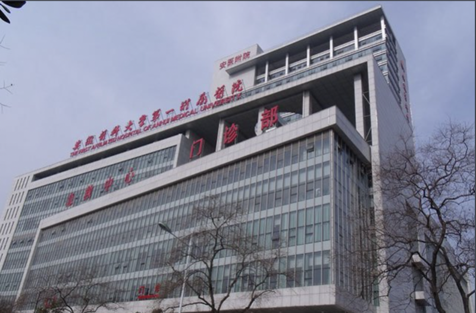
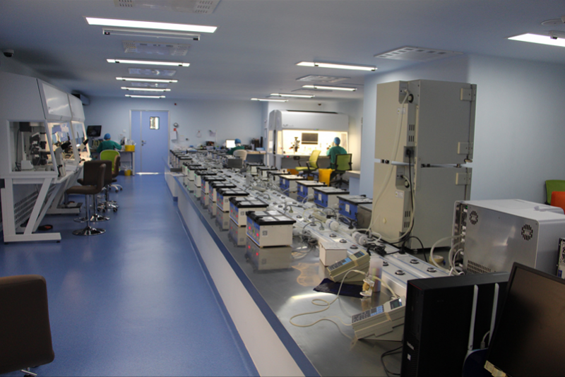
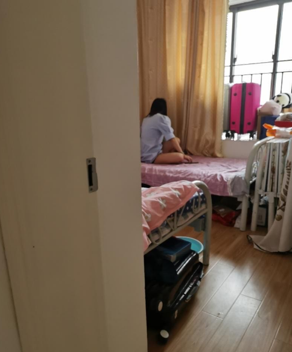
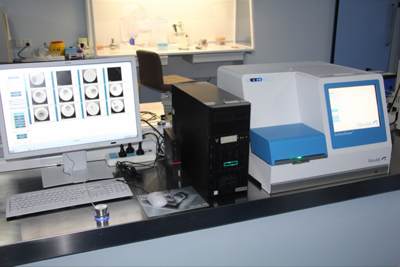

# 谁的试管婴儿：“胚胎疑被放错”案背后的行业乱象与监管隐忧

安徽一对夫妻尝试多次后终于产下试管婴儿，8年后却发现孩子与他们并无血缘关系。涉事的安徽医科大学第一附属医院没能回答两人的胚胎去向，以及孩子的生物学父母是谁。2月20日，安徽有关部门工作人员回应南都、N视频记者称，“相关情况已在了解中，有关部门将适时介入调查”。

这起“试管婴儿胚胎疑被放错”的医疗纠纷案件，引发广泛关注，也揭开了“试管婴儿”背后的行业乱象与监管隐忧。

“试管婴儿”是目前辅助生殖技术中最常见的一种。据了解，我国已成为世界上每年开展辅助生殖例数最多的国家，每年约有30万名试管婴儿诞生。随着辅助生殖市场爆发式增长，近年来与“试管婴儿”相关的医疗纠纷案件也在增加。与此同时，南都记者曾调查发现，在需求和利益的促使下，与“试管婴儿”密切相关的地下代孕市场也在“野蛮生长”。

有律师向南都记者指出，“试管婴儿”不单是一项辅助生育技术，背后更牵涉血缘与情感伦理，辅助生育医疗机构必须负起主体责任，完善档案管理制度，避免类似的纠纷再发生。对于“试管婴儿”代孕的灰色产业链，也应进一步加强立法工作以及对相关违法行为的打击。

**谁的试管婴儿？**

2月20日，“试管婴儿出生8年后被发现放错胚胎”的消息迅速登上微博热搜。

南都记者从该案的一审裁判文书中获悉，2010年9月，来自安徽合肥的男子刘文（化名）和当时的妻子孙芳（化名）因婚后不育，至安徽医科大学第一附属医院生殖中心接受治疗，后孙芳分别于2010年10月和2011年2月在该中心进行新鲜胚胎移植，未孕。后又于2011年6月至该中心再次行冻融胚胎移植，获单胎妊娠。近10个月后，孙芳在安徽省妇幼保健院分娩出一健康男婴。

在养育儿子期间，刘文逐渐发现，孩子长相和他没有丝毫相似之处。2020年7月，刘文和孙芳以及孩子一同做了亲子鉴定，结果发现，孩子与父母双方均无血缘关系。

为弄清事情原委，刘文和孙芳以侵犯他俩的生育权和知情权，将生殖中心和安徽省妇幼保健院列为被告。2022年6月，合肥市蜀山区法院开庭审理此案。

法院一审指出，依据现有材料，安徽省妇幼保健院未见程序性缺陷，在该院内发生抱错行为的可能性极低。而法院委托北京法源司法科学证据中心出具的鉴定报告则显示，依据现有病历材料，生殖中心在胚胎冻存及提取过程中，无法保证每组胚胎编号的唯一指向性，也无法体现解冻提取过程中准确溯源和核对，存在缺陷，具有导致提取非指向性胚胎的极大可能性，并导致非预期的辅助生殖受孕后果，因此存在医疗过错。

上述裁判文书指出，被告安徽医科大学第一附属医院的诊疗、护理行为存在过错，虽其错与原告主张的损害后果是否存在因果关系无法明确，仅能说明被告医院的过错与发生原告主张的损害后果之间具有高度盖然性（即极大可能性）。但根据原告提供的证据和安徽医科大学第一附属医院诊疗行为的过错情况分析，结合日常生活经验，可以高度盖然性地推定安徽医科大学第一附属医院的医疗过错行为与原告主张的损害后果存在因果关系。

法院认定，确定被告安徽医科大学第一附属医院对原告主张的损害后果产生的损失承担100%的赔偿责任。

刘文和孙芳的胚胎去向、孩子的生物学父母是谁等问题，目前尚无定论。

近日，南都记者多次拨打安徽医科大学第一附属医院生殖中心的电话，对方了解记者来意后，就立刻表示“不清楚”，并挂断电话。

当地有关部门工作人员就该案件回应南都记者称，“相关情况已在了解中，有关部门将适时介入调查”。安徽省卫健委妇幼健康处工作人员则告诉南都记者，“相关情况卫健委领导已经在开会研究，并且会根据研究结果向社会进行通报。”

**医疗纠纷早有先例**

南都记者注意到，这不是涉事医院首次卷入医疗纷争。

官方资料显示，安徽医科大学第一附属医院创办于1926年，1993年成为原卫生部首批三级甲等医院。而旗下生殖医学中心则创立于1998年，于2000年10月诞生了安徽省首例“试管婴儿”，2003年10月成为安徽省首家原卫生部正式准入的生殖医学中心。

南都记者通过中国裁判文书网检索发现，2013年以来，安徽医科大学第一附属医院作为当事人的民事裁定书、判决书等文书合计共有296起。该医院涉及案由为“医疗损害责任纠纷”的案件有上百起，多份一审判决书显示，该医院需赔付患者数万元至上百万元不等。其中，2016年，该院生殖科曾因误诊，延误了患者治疗，最终致患者左侧输卵管需被切除，该院被判赔。

近日，该医院因“试管婴儿胚胎疑被放错”案件，引起广泛关注。南都记者查询发现，因“放错胚胎”而引发伦理困境的相关判例，在国内并不常见，但随着辅助生殖市场爆发式增长，近年来与“试管婴儿”相关的医疗纠纷案件却不少。

2月21日，南都记者在中国裁判文书网可搜索到287份与“试管婴儿”相关的医疗损害责任纠纷裁决文书。而早在2003年，江苏省南京市鼓楼区人民法院曾审理一起郑某、陈某与江苏省人民医院的医疗服务合同纠纷案。这起案件也被法律界人士视为“全国首例试管婴儿纠纷案”。

该案的一审裁判文书显示，原告郑某、陈某是一对多年不孕的夫妻，希望通过“试管婴儿”技术获得孩子，并到江苏省人民医院就诊签订相关协议。原告诉称，江苏省人民医院医生在做试管婴儿手术过程中擅自更改了手术方案，将他们全部12个卵子都做了第一代试管婴儿，而非他们要求的第二代，导致手术彻底失败。

法院指出，在医疗服务合同中，医院负有对医疗方案的说明义务，而患者享有对医疗方案一定的选择权。在实施医疗方案之前，除非在紧急情况下，医院有义务就该医疗方案向患者或其代理人进行充分的说明。患者有权充分了解医疗方案可能给自己带来的后果，有权对医疗方案进行选择。法院一审判决江苏省人民医院需向原告赔偿医疗费约1.1万元。该案二审维持了原判。

2022年，湖北荆门中级人民法院也公布一起涉及“试管婴儿”的二审判决。2019年，36岁的敖女士经试管婴儿生殖辅助技术受孕成功，后在孕龄34＋4周时因腹部阵痛入住荆门市妇幼保健院，经过该院一系列治疗后，敖女士症状却加重，后转院至其他医院治疗，诊断出子宫破裂、胰腺炎、主动脉夹层破裂等症状，最终胎死腹中。敖女士认为荆门市妇幼保健院当初的治疗存在问题，并要求赔偿当初因做“试管婴儿”而产生的费用。

二审法院委托相关鉴定中心出具的报告显示，荆门市妇幼保健院的诊疗行为与敖某胎死腹中的损害后果存在因果关系。二审法院判决涉事医院赔偿原告经济损失6.7万元。同时，由于敖女士十月怀胎欲为人母的美好愿望落空，终审判决维持了一审酌定的10000元精神损害抚慰金。

**地下服务“野蛮生长”**

据了解，俗称“试管婴儿”的“体外受精”方式，是目前辅助生殖技术中最常见的一种。随着该技术的广泛应用，除了围绕“试管婴儿”的医疗纠纷案件在增加，南都记者此前调查发现，在需求和利益的促使下，近年来与“试管婴儿”密切相关的地下代孕市场也在“野蛮生长”。

南都记者此前曾暗访上海多家提供代孕服务的中介机构。一家位于上海市宝山区名为“天使助孕”的中介机构负责人曾介绍，其公司推出65万元和90万元两种“试管婴儿”代孕套餐，前者无法确保婴儿性别，后者则可指定性别，两种套餐均可分期付款，保证能在两年内向客户“交出”健康宝宝。

另外一家位于上海市杨浦区名为“上海添丁生殖集团”的代孕机构，则声称提供夫妻精卵、男方精子+捐卵、女方卵子+捐精等多种形式组合的“试管婴儿”代孕服务，价格从65万元到90万元不等。

“天使助孕”的负责人称，经过多年发展，其积累了庞大的客户群，每年接单“制造”出八九十个“试管婴儿”，“交货率”可达70%。“上海添丁生殖集团”的负责人则称，其公司自2008年成立，目前每年平均能“生产”上百名“试管婴儿”，每顺利“交货”一个婴儿，公司至少可以获利20万元。

当南都记者问及代孕过程中若代孕妈妈和胎儿出现意外情况如何处置时，上述两家中介的负责人均表示是“商业风险”。“天使助孕”的负责人透露，曾遇到过代孕妈妈大出血，胎儿畸形情况。“这时我们会立刻要求代孕妈妈把孩子打掉，客户只等收货就可以了。”

值得注意的是，代孕妈妈的权益毫无保障，代孕过程如豪赌，若孕期和生产过程出现任何意外，代孕妈妈的收益会大大“缩水”。上述负责人坦言，若受精卵成功移植后不见胎心，只会补偿代孕妈妈1万元；如果见胎心后2-3个月出现胎停需清宫，也只赔偿2万元，而实际孕期达到5-7个月后胎儿出现问题需要引产，只会补偿5-8万元。若在代孕过程中代孕妈妈出现意外死亡的极端情况，才可获得80万元赔偿。

此外，在代孕的灰色产业链中，提供代孕技术操作的医生和实验室常常被中介彻底隐藏。“天使助孕”和“上海添丁生殖集团”的负责人均表示，无法向客户提供做手术医生的任何资料，但他们都向客户“承诺”，提供代孕技术操作的医生，均是来自上海三甲医院的主任级医师，具备丰富经验。他们也透露，从建档环节起就由代孕妈妈冒名顶替客户，开出的《出生医学证明》也会顺利放在客户名下，最终完成整个代孕“一条龙”服务。

近日，南都记者再次联系上述提供“试管婴儿”代孕服务的中介公司，发现他们的名字招牌已更改，但他们表示仍在正常运营，“可以接单”。

**需求背后的监管隐忧**

从1988年中国内地第一例试管婴儿诞生以来，辅助生殖技术已走过35年春秋。据了解，我国已成为世界上每年开展辅助生殖例数最多的国家，每年约有30万名试管婴儿诞生。

广东省人类精子库主任张欣宗此前告诉南都记者，全国已婚夫妇中不孕不育的比例约15%-18%。“试管婴儿”等辅助生殖技术已成为不孕不育夫妇生育的重要途径。根据国家卫健委发布的数据，截至2020年6月底，我国经批准开展人类生殖辅助技术的医疗机构共523家。

在辅助生殖技术如此普及的今天，如何保证其始终走在“正轨”？南都记者留意到，2019年9月，国家卫生健康委办公厅印发《加强辅助生殖技术服务机构和人员管理若干规定的通知》，明确要求辅助生殖技术服务机构应当配备与开展业务相适应的场所、设施、设备和专业技术人员。全面建立严格的内部管理制度，明确岗位职责和服务流程，完善自我检查、整改和责任追究机制。

《通知》也规定，严格执行患者身份查对制度和配子、合子、胚胎核查制度，配子、合子和胚胎的处理、转移、保存、使用等关键环节应当由2人以上同时现场核对。对胚胎实验室等关键区域实时监控，监控录像至少保存30天。建立应急预案，配备预警设备，加强人员演练，提高突发事件应急处置能力。保护遗传资源安全、生物安全和信息安全。

此外，《通知》也要求辅助生殖技术服务机构应当健全病历档案管理制度，建立管理信息系统，及时、如实、准确、完整记录患者病案信息以及所有配子、胚胎的去向和结果，涉及供精治疗和赠卵治疗的医疗记录和法律文书应当永久保存。积极推进信息化管理，加强相关数据分析利用，指导改进服务质量。

对于此次安徽医科大学第一附属医院涉“试管婴儿胚胎疑被放错”案件，长期专注医疗纠纷的浙江京衡（宁波）律师事务所律师章李向南都记者表示，这起案件或因涉事医院当初对“试管婴儿”档案建立、保管方面的管理制度不完善造成，“如果目前这些相关数据已丢失，要追查已很困难”。

章李表示，“试管婴儿”不单是一项辅助生育技术，背后更牵涉到血缘与情感伦理，“辅助生育医疗机构必须负起主体责任，提高相关医务从业人员的准入门槛，尤其是法律法规及伦理培训，建立完善的档案管理制度，具有可追溯性，避免相关的纠纷再次发生。与此同时，相关部门也应该进一步加强对辅助生育机构的监管。”

此外，对于目前“试管婴儿”
地下代孕服务的乱象，曾关注代孕议题的北京隆安律师事务所律师杜洁指出，原卫生部以部令形式颁布的《人类辅助生殖技术管理办法》规定医疗机构和医护人员不得实施任何形式的代孕手术，事实上已禁止代孕服务在我国的开展。

北京市中闻律师事务所律师邓千秋则指出，目前全国人大及其常委会制定的法律，以及国务院制定的行政法规，对代孕问题均未涉及，就医疗机构和医护人员实施代孕手术的行为而言，虽然违规，但难以构成刑事犯罪。

邓千秋认为，地下代孕市场的发展，一方面会带来棘手的“卵母”“生母”不一的伦理困境，另一方面也会引发包括代孕生出缺陷婴儿的抚养问题、因非法代孕引发的法律纠纷，甚至是买卖妇女儿童等犯罪问题。他认为，要真正遏制地下代孕市场灰色产业链发展，还有赖于立法工作的加强以及相关部门对违法行为的打击。

出品：南都即时

采写：南都记者 余毅菁 实习生 陈宇龙

