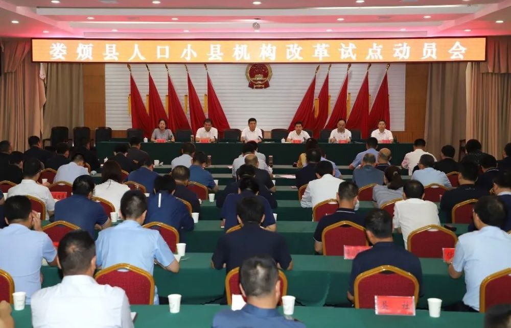
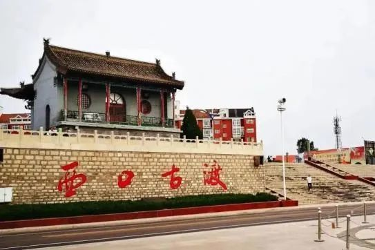
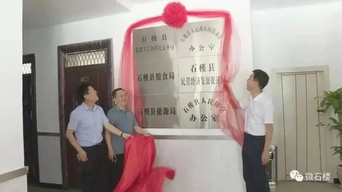

# 这些人口小县为啥要精兵简政？侠客岛：首要是解决财政供养失衡问题

最近，一些“人口小县”正在搞机构变革。

比如人口只有12万的山西娄烦县，搞起了“精兵简政”：通过机构改革试点，该县将9个县委机关减少到6个，26个政府部门降至16个。这样的机构改革，在山西、青海等多地都在进行。

有朋友会问，这是在搞“缩编”吗？原因究竟是人口太少、无需太多编制人口，还是像一些猜测所言，是因为地方财政捉襟见肘倒逼的改革？

_娄烦县召开人口小县机构改革试点动员会（图源：娄烦县人民政府官网）_

一

根据笔者了解到的情况，山西“人口小县”的机构改革，首要目的是解决财政供养失衡和人浮于事问题。某种程度上，这是财政困境倒逼，使地方政府必须对现有行政体制动真格。

任何动真格的改革都有风险和阻力，尤其从以往经验看，机构改革的最大阻力就是精减人员。缩编、减人，意味着一些人要下岗。这当然很难。

比如笔者调研时曾遇到一个情况：某县为提升教育质量进行淘汰制改革，竞争上岗，教学水平低的老师要淘汰出局。但不到俩月，这项改革就告失败。为啥？因为被淘汰的老师每天去教育局长家哭闹，你这是夺人饭碗呀！这位力推改革的局长后来也“想通了”：“教育局又不是我开的，何必这么得罪人？”

所以您看，改革难，机构内改革更难。政府机构不同于人员频繁流动的私人企业，许多工作无法用减员增效来衡量，因此，现实中较少有真正拿减编减员开刀的机构改革；山西人口小县的政府机构改革难度不小。报道说，有的地方党政机关改革方案先后修改16稿、事业单位改革方案修改35稿，足见其中牵涉面之复杂。

那怎么改呢？

通常的操作方法，是让一部分老弱人员分流或提前退休，工资待遇不变；或者政府以平台、外包、公司等形式承接被改人员和职能，这样就在数据上缩减了编制和人员。

具体到山西本轮小县改革，主要是通过“职级晋升”换“职务下降”，“转岗下乡”换“待遇上升”，减少改革阻力。比如将局长调降为副局长，但职级上升，收入相应调高；虽从正职变为副职，但责任压力小了，原有日常性权力一定程度上保留。这样，改革阻力相对就小些。

有人会问，为啥不步子迈大点，干脆撤县或并县？其实，撤县或并县风险阻力更大。一些县级建制有几千年历史，各县语言习俗甚至文化都不同，以县为单位的家乡认同感十分强烈，这种涉及文化认同的改革最难，后果也难评估。相对来讲，机构改革更容易，尤其在人口小县试点，风险成本相对要小得多。

_人口小县山西河曲县（图源：忻州在线）_

二

有的细心岛友会问，你前面讲政府机构改革并未实质减员，也就是说要供养的人还那么多，那财政能省下钱吗？

答案是，可以。

从山西人口小县改革实践看，其核心在于机构的重组、缩减，将县域治理体系简约化。这有几大优势：

其一，简约的治理体系减少层级和流程，提升县级整体性治理和协同治理能力。比如县领导兼任局长，可以打破之前部门利益藩篱，减少沟通和制度成本，提升整体效率，也能拉近干群关系。县领导一线办公，诸多具体事务的解决和处置率也会提高。

其二，将县级部门和机构人员分流至乡镇、村社，对提升县域治理能力也是好事。从报道看，山西的小县机构改革主要是简化和重组县级部门机构，没有涉及乡镇层面机构和人员调整。俗话说“上面千条线，下面一根针”，此举可以说是在充实乡镇“一根针”。

从中国现行县乡关系看，虽然县级局委办与乡镇同为科级，但前者的地位、待遇和工作环境都更好，绝大部分乡镇干部都想进城。这样，县乡就“头重脚轻”，县级部门膨胀，传达工作的比落实工作的人多，下发文件的比执行文件的人多，督查工作的比实际工作的人多，搞得乡村干部疲于应付。

而将县级机构重组、缩减和人员分流至乡村，就是将治理资源朝一线下沉，将人力从县局委办配置到乡镇，减少下达指令部门，充实基层治理队伍，既能提高县级机构效率，又能提升乡村治理能力。

从最实际的角度讲，简约的治理体系也能节省财政。县级财政一般按机构数量进行预算和拨付办公经费，机构数量变少，相应财政支出也会减少。对乡镇而言，县级的“千条线”少了，乡镇开支和人情往来也就相应少了。

_山西石楼县精简部门成果（图源：微石楼）_

三

最后谈一个关键问题：是不是这些地方的财政真撑不住了，到了必须折腾机关部门的地步？

从财政角度看，中西部地区的县级财政一直以“保运转、保民生、求发展”为目标。所谓保运转，就是财政供养人员和机构即人头费（保工资）、办公经费，这些主要依靠中央一般性转移支付。保民生，也仰赖上级财政项目资金即专项转移支付。

既然保运转、保民生都靠转移支付，为什么还会出现财政困难？

这首先是因为有些中西部地区经济欠发达，财政历来不宽裕，一直处于保运转状态。土地财政出现后，部分中西部县级政府才开始“变富”。一位西部地区的县长对笔者说，前几年土地好卖时，就愁钱花不出去，想办法花钱；现在土地卖不动了，就愁发不出钱，想办法找钱。

显而易见，对于那些常住人口10万左右的“小县”来说，人太少，地卖不了几块，财政就更困难。

其次，“求发展”也一定程度上加重债务负担，加剧原本脆弱的财政困境。从笔者团队的调研经验看，中西部地区大部分市县还属于“吃饭财政”，即财政仅够供养公务人员、覆盖一般性办公支出。要发展，就得依靠地方国控、城投、城建、旅投等融资平台。融资平台承接了绝大部分“亮点工程”，但不计成本的“造点运动”隐藏着债务问题。

比如某县2018年的亮点工程是财政投资6个亿，在江边建超级大亭子，第二年的亮点工程是投入5亿建特色小镇；但仅仅一年后，小镇就杂草从生、无人光顾。这样的例子挺多。

尤其是在宏观经济下行、难以靠卖地生财且中央不再对地方债务负责的大背景下，地方政府必须想办法突围。经济发达的省份突围相对办法多，比如广东宣布已成功化解地方债务问题；但对欠发达地区来说，囊中羞涩的困境几乎必然倒逼地方体制变革。

短期看，人口小县的机构改革是通过精减机构而非精减人员来节省财政支出。但从长期看，当机构改革成为定局，既有人员逐步被“消化”掉之后，减编减员的效果就会显现。

文/欧阳静（江西财经大学财税与公共管理学院教授）

编辑/云歌

