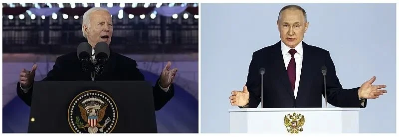
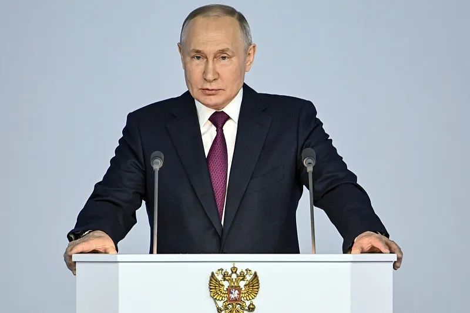
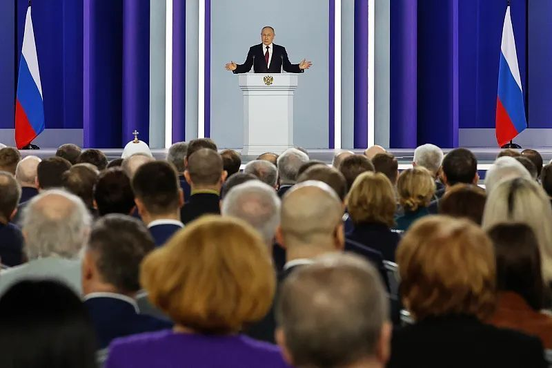
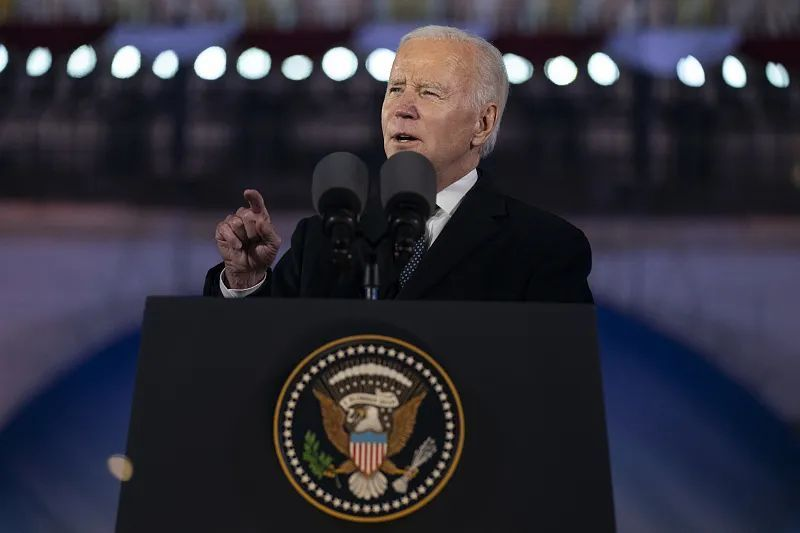

# 隔空交锋，普京演讲中11次提名美国，拜登则10次提及普京

俄乌冲突爆发即将一周年，21日，俄罗斯总统普京、美国总统拜登先后发表演讲，普京在演讲中11次点名美国，并宣布暂停与美方签订的《新削减战略武器条约》，拜登则10次提及普京，强调对乌克兰的支持“坚定不移”，双方上演了一场激烈的“隔空交锋”。

尽管白宫反复强调并未将此次演讲安排为美俄领导人之间的“正面交锋”，但法新社将此番场景形容为“对决演讲”，《纽约时报》评论称，双方“相隔数小时，800英里，誓言坚持战斗，直到对方撤退”。

_普京（右）与拜登。图源：视觉中国_

此番交锋的前一天，拜登突访基辅会见乌总统泽连斯基，并宣布价值5亿美元新的一揽子军事援助，以展现美国对乌克兰的“坚定支持”。

普京则在演讲中对美国为首的西方释放强烈信号——西方正利用乌克兰作为对抗俄罗斯的“试验场”，而俄罗斯不会屈服。

当地时间21日中午，普京在莫斯科商栈展览中心向联邦议会发表国情咨文，这是俄“特别军事行动”以来的首次国情咨文，由普京亲自撰写。演讲持续了1小时45分钟，成为普京在联邦议会发表的时间最长的演讲。

_普京发表国情咨文。图源：视觉中国_

演讲中，普京24次提到西方，11次提到美国，10次提到北约，他指出，西方的目标是在欧洲挑起一场代理人战争，以消灭竞争对手。西方已经花费超过1500亿美元援助基辅并向其提供武器。

普京表示，俄罗斯曾对与西方就安全问题进行对话持开放态度，换来的是虚伪的回应和北约的扩张，美国和北约迅速在俄边境附近部署军事基地以及秘密生物实验室。

“全世界有数百个（美国军事）基地，整个星球都布满了，你们只需要看看地图。”普京说，美国自2001年以来发动的战争导致近90万人死亡，超过3800万人沦为难民。

在临近演讲结束时，普京祭出“大动作”，宣布俄方暂停参与《新削减战略武器条约》。

_普京发表国情咨文。图源：视觉中国_

2019年俄美《中导条约》失效后，《新削减战略武器条约》条约成为两国间唯一军控条约。这一条约于2011年2月5日生效，有效期10年。2021年2月3日，俄美双方互换外交照会，条约有效期随后延长至2026年2月5日。

对于暂停这一条约的原因，普京说，美国要求俄罗斯履行《新削减战略武器条约》所有条款，自己则“随心所欲”。美国想让俄陷入战略失败，还想检查俄方军事设施。对此，俄方不得不暂停履行这一条约。

普京还谈及俄罗斯的核力量，称俄罗斯的核威慑力量现代装备已超过91%，其他部队的现代化装备水平也应该达到这一水平。他同时指出，华盛顿有些人考虑进行核武器试验，若美方率先进行核试验，俄罗斯也会对等进行核试验。

俄方暂停参与《新削减战略武器条约》的决定一经宣布，北约、欧盟及美国迅速作出回应。

北约秘书长斯托尔滕贝格称，俄方的决定使世界变得更加危险。美国国务卿布林肯说，俄方这一决定令人失望，而且是不负责任的，美国将密切关注俄罗斯将采取的实际行动。

普京国情咨文演讲结束数小时后，拜登在波兰华沙发表演讲。

拜登说，普京认为北约会分裂和分化，但相反，北约比以前更加团结。

他强调北约不会分裂，对乌克兰的支持也不会动摇。他认为俄罗斯不会在乌克兰取得胜利。

_拜登在波兰华沙发表演讲。图源：视觉中国_

拜登表示美国及其盟友本周将宣布更多对俄罗斯制裁措施。他同时宣布，美国将在明年主办北约峰会，庆祝北约成立75周年，并重申了北约第五条款有关集体防御的承诺，即一旦确认成员国受到攻击，其他成员国将作出即时反应。

CNN称，拜登用非常尖锐的语言指责俄罗斯领导人，甚至在讲话中10次单独点名普京，相比之下，普京当天早些时候在莫斯科发表的长篇幅演讲中一次也没有点名拜登。

拜登此番演讲无疑是为美国及盟友团结支持乌克兰提振信心，但随着俄乌冲突转向长期化，或成为一场旷日持久的消耗战，美媒对西方持续援乌的前景也表达了担忧。

CNN指出，过去一周出现了对西方国家现有弹药和武器供应的担忧，这清晰地表明，西方不可能提供无限的支持——无论是在后勤上还是在政治上。在美国，一些共和党人对向乌克兰提供更多援助犹疑不决。

此外，随着拜登准备宣布竞选连任，欧洲方面的焦虑情绪也在上升，认为白宫的变化可能预示着美对乌政策的转变。

“我不得不说，无论是在波兰还是在乌克兰，人们都对美国在本届政府之后的持久力量感到担忧。”德国马歇尔基金会驻华沙办事处的负责人米哈尔·巴拉诺夫斯基说。

​​

