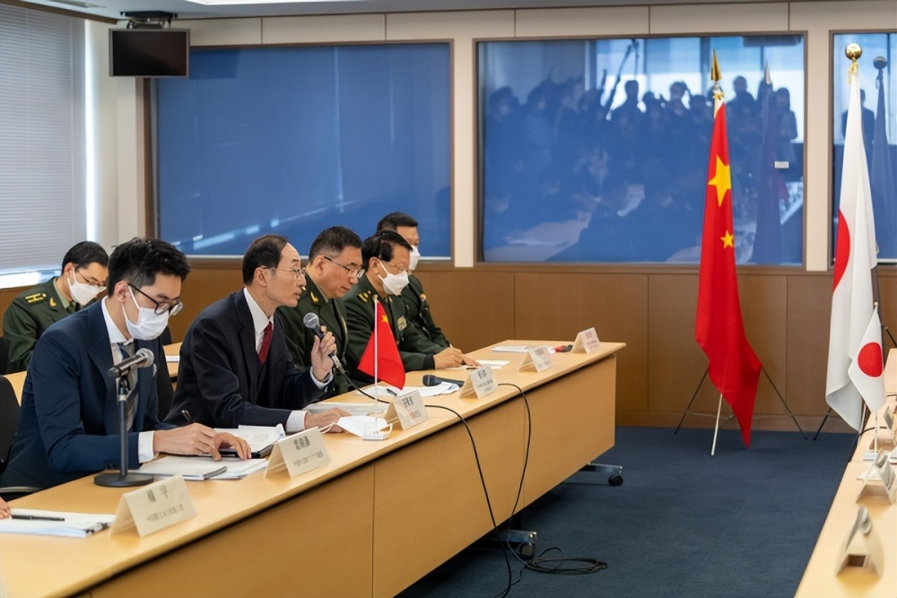
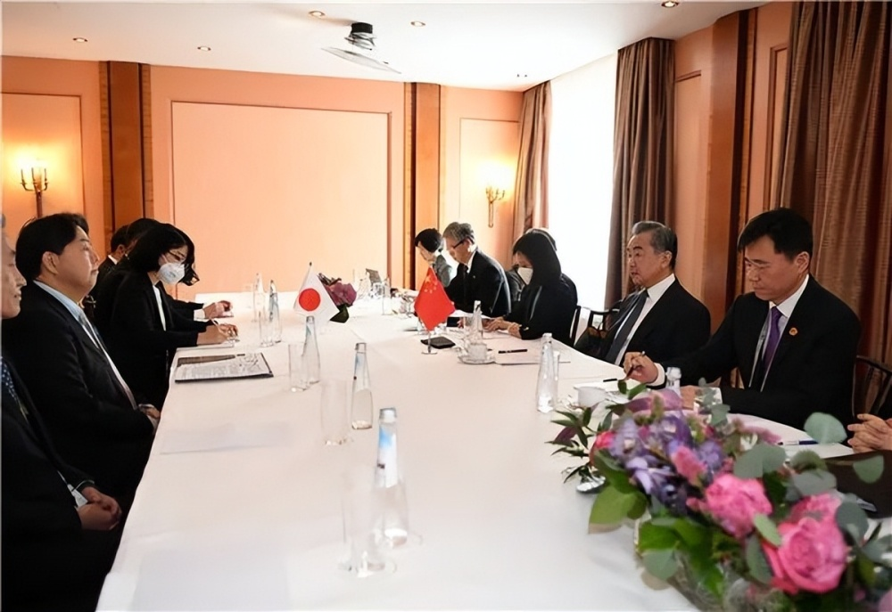

# 中日安全对话时隔4年重启，中方关心的都谈了

时隔4年，中日安全对话再度举行。外交部副部长孙卫东在对话结束后表示，本次磋商深入坦诚、内容丰富。

上海国际问题研究院中日关系研究中心秘书长、研究员蔡亮在接受在采访时表示，此次中日安全对话是在两国政治关系与安全关系均发生重要变化的背景下重启，尽管中日关系面临诸多挑战，但两国高层能够面对面展开交流总是积极的一步。

**商定尽早开通直通电话**

外交部网站2月23日凌晨发布消息，2月22日，外交部副部长孙卫东同日本外务省外务审议官山田重夫在东京主持第17次中日安全对话。中央军委国际军事合作办公室副主任张保群、日本防卫省防卫政策局副局长安藤敦史参加对话。

_第十七次中日安全对话。图源：外交部网站_

另据商务部消息，2月22日，商务部部长助理李飞与日本外务省外务审议官小野启一以视频方式共同主持召开第16次中日经济伙伴关系磋商，两国有关部门及使馆参会。

“中日安全对话与经济伙伴关系磋商同属中日三大定期交流机制，且都为副部级，层级较高。”蔡亮表示，两项交流机制重启，表明中日双方都有意加强交流。

中日安全对话机制于1993年12月建立，在两国交替举行。2019年第16次安全对话在北京举行后，这一机制中断长达4年。此前，从2011年第12次对话到2015年第13次对话之间，这一机制也曾因钓鱼岛等问题导致两国关系恶化中断4年之久。

在此次安全对话中，双方介绍了各自外交安全理念和防务政策，就共同关心的广泛议题深入交换意见。值得注意的是，双方商定在两国防务部门海空联络机制框架下保持密切联系，尽早开通直通电话。

清华大学战略与安全研究中心学术委员会委员张沱生曾在接受采访时表示，相比于中美之间，中日之间的危机管控机制建设较为滞后。在两国安全关系出现变化的背景下，中日之间需要加强相关机制建设。

**期待日方独立自主选择**

根据中方外交部与商务部会后发布的新闻稿，双方本次磋商深入坦诚、内容丰富，直指各自关切的问题。

在安全领域，中方明确就日本推进强军扩武、在防务安全政策文件中渲染“中国威胁”、在周边地区加强同域外势力军事安全勾连，在台湾、南海等事关中国核心和重大利益问题上不断出现消极动向表明严正立场和严重关切，要求日方纠正错误，摆正认知。

在经济领域，外交部与商务部均就确保产业链供应链稳定畅通等内容同日方进行交流。其中，商务部特别对日方在对华半导体出口管制问题上的有关动向表达高度关切，要求日方切实遵守契约精神和国际规则，为企业提供公平、非歧视、可预期的营商环境，维护中日经贸合作大局。

去年12月，日本政府以内阁会议决定的形式正式出台了新版《国家安全保障战略》《国家防卫战略》《防卫力整备计划》等日本“安保三文件”，首次将中国定义为“前所未有的最大的战略挑战”，并大幅扩充防卫预算，计划采购和部署美国“战斧”巡航导弹。

今年1月，美国、荷兰和日本三国的国家安全事务官员在美国进行高级别谈判，就限制向中国出口先进芯片制造设备达成协议。

2月18日，中共中央政治局委员、中央外事工作委员会办公室主任王毅在出席慕尼黑安全会议期间会见日本外相林芳正。王毅特别指出，单边主义、脱钩断链不符合任何一方利益，日方应认清形势，做出独立自主的选择。

_王毅会见日本外相林芳正。图源：外交部网站_

蔡亮认为，在日方做出一系列消极举动的背景下，中日一系列对话机制仍得以恢复，足见中方加强沟通协商的诚意，“对于日本会在多大程度上追随美国，中方也非常关心。”

蔡亮表示，尽管两国间的问题难以通过一场对话得到解决，但中日间交流机制的恢复，对于两国关系的未来发展仍是积极的第一步。

**出品 深海区工作室**

**撰稿 杨一帆**

**编辑 深海贝**

