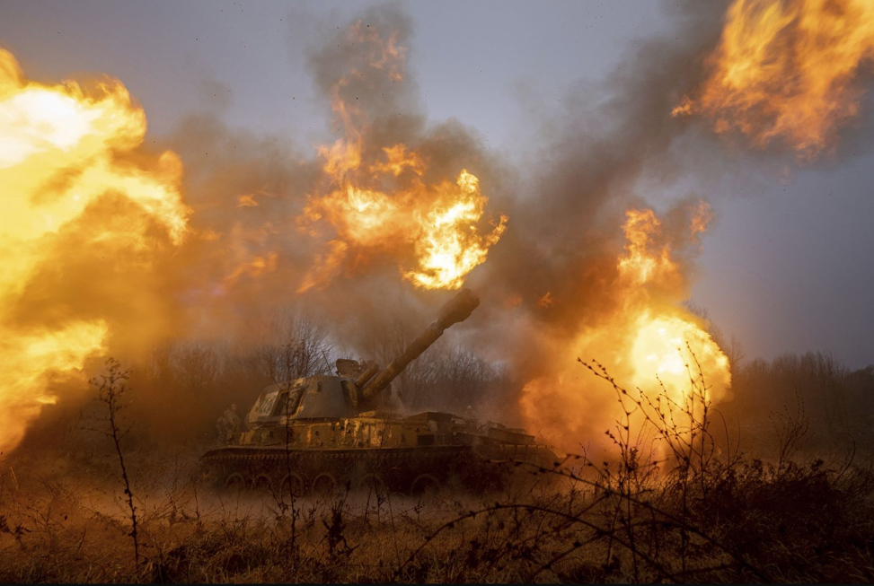

# 人民大学专家谈俄乌冲突1周年：美国获益最大，俄方恐被长期消耗

每经记者：郑雨航 每经编辑：高涵

一天后，俄乌冲突即将迎来一周年的重要时间节点。2022年2月24日，俄罗斯发起对乌克兰的“特别军事行动”，二战后欧洲最激烈的军事冲突拉开了序幕，至今仍未见终结的希望。

据新华社报道，俄罗斯总统弗拉基米尔•普京21日发表国情咨文，痛批西方国家不但“挑起战争”，而且“意图将在乌克兰的局部冲突演变为全球对抗”。同时，普京宣布暂停参与《新削减战略武器条约》，这是自俄美《中导条约》2019年失效后，两国间唯一的军控条约。

同日，美国总统拜登在波兰华沙就俄乌冲突发表演讲，讲话中对俄言辞激烈，10次单独点名普京。

如今，俄罗斯已被西方“孤立”，乌克兰国内千疮百孔，欧洲至今仍在地缘不安全环境下蒙受通胀与能源的双重打击，全球都在密切关注俄乌冲突接下来的走势。

《每日经济新闻》记者（以下简称NBD）专访中国人民大学重阳金融研究院执行院长、中俄人文交流研究中心执行主任王文，一同探讨俄乌局势现状、冲突各方的利益博弈，以及这场冲突带来的启示。

俄罗斯恐被乌克兰战场长期消耗与牵制

**NBD：俄乌冲突一周年之际，普京和拜登同日演讲，隔空较劲。您如何看待接下来俄乌局势？**

**王文：**
目前是国际社会自1945年以来离第三次世界大战最近的时刻。俄乌冲突明显在持久化，美俄双方，相互间正在呈螺旋上升式的军事紧逼，导致现在的国际安全形势急剧恶化。

拜登在波兰的讲话体现出，他希望能够利用事态恶化的趋势，进而牟利。

拜登讲话的主要逻辑有两个。一是继续军援乌克兰，尤其是推动北约其他国家集体加大军援，刺激俄罗斯升级对抗。

二是刺激世界其他区域的大国，让更多国家和地区卷入并成为“乌克兰危机”的当事方，并且拉拢南亚
(包括巴基斯坦)、中东欧助阵，还试图让北约亚洲化，就是往世界越来越混乱的方向去“拱火”。

没被打败的俄罗斯祭出暂停核军控条约，只会让美国谋划更“恶毒”的招数。

**NBD：您曾在去年秋季访问俄罗斯，并当面与俄罗斯总统普京、外长拉夫罗夫等政要交流。据您所知，俄罗斯真实战略目的是什么？**

**王文：** 2022年9月在海参崴举办的东方经济论坛上，我当时在现场，普京总统针对记者问“俄罗斯失去了什么”时，答道
“俄罗斯什么都没有失去。相反，赢得了尊严”。

近日，俄罗斯释放所谓“无预设谈判”的信号，看似是示弱，其实是以退为进，向国际社会显示其希望尽快结束冲突的国家形象，而另一方面却是以“无条件谈判”为由表达了保持当前占领领土为界的战略意图。

目前，俄罗斯从2022年2月24日开始的特别军事行动已占据了乌东地区约12万平方公里的肥沃领土与约800万人口。如果摒弃价值判断，仅用现实主义的尺度来衡量，俄罗斯仅用约50万军队、对抗西方30多国的制裁与军事后援，对北约过去20年五次东扩进行的这场绝地反击，是赢得了国家尊严的，且获得领土与人口价值足够覆盖冲突成本。

不过，在我看来，俄罗斯未来相当长一段时间与西方交恶，吸引外资与先进技术、对外贸易与人员流动等都会受到相当大程度的障碍。
**很有可能，俄罗斯将被乌克兰战场长期消耗与牵制，而从世界一流大国的阵营中跌落。这是俄罗斯最大的战略损失。**

_乌克兰坦克在前线向俄罗斯军队射击
图片来源：视觉中国_

美国“离岸平衡”战略奏效，从三方面获益

**NBD：目前俄乌冲突被普遍认为是一个“双输”的局面，您怎么看？**

**王文：** 我认为，以国家为分析单位来说，冲突战争没有纯粹的赢家，都须承担其冲击而承受不同的痛苦。

俄乌两国“兄弟相残”，都有数以万计的士兵失去生命，最大的受难者是乌克兰民众，约500万乌克兰人成为难民，家园被摧残。

欧盟被迫减少对俄罗斯廉价能源的进口而转向进口更贵的美国能源，重创了自身经济。而美国也受到俄乌冲突的影响，导致严重的通货膨胀。

不过，在这场冲突中，一来，
**美国军工与能源集团赚得盆满钵满；二来，泽连斯基成为当前最火的政治人物，在美国国会演讲，在欧盟会议被邀站C位，许多在西方国家举行的国际论坛都以能邀请到泽连斯基为荣。**

_泽连斯基（中） 图片来源：视觉中国_

**NBD：您刚提到美国军工和能源集团赚得丰厚利润，能详细讲讲吗？**

**王文：**
我认为，除了受到俄乌冲突带来的通胀冲击外，美国的确在这场冲突中获益最多。这折射了拜登政策对俄罗斯采取离岸平衡战略的“高明”之处。算起来，美国至少得到三方面的利益：

一是战略利益。 **美国对俄采取的“离岸平衡”战略奏效，不费一兵一卒、仅用数百亿美元就实现了“以乌制俄”、“以俄压欧”的三角平衡局面。**
自此，拜登政府从上届特朗普政府“美国第一”的外交政策中走出，中止了欧洲借增加从俄能源进口、缓和与俄关系、脱离美国的战略态势，弥合了北大西洋联盟的缝隙，甚至一度要重整西方世界。

二是经济利益。（美国）军工集团消耗了大量库存，大发战争财。有的美国军工企业短短一年，股价上升高达50%以上。而美国石油与天然气对欧出口大涨，以比俄罗斯高出50%甚至一两倍的能源价格而获利。军工、能源企业的上涨支撑了美股持续上涨之势。

三是非法利益。美国以“长臂管辖”的方式，不择手段地没收俄罗斯6000亿美元以上的海外资产。

从这个角度看，美国长期炮制战争、并从战争中维系霸权的战略投机主义惯性仍在继续。

需警惕美国在其他地区复制俄乌冲突

**NBD：国际社会在未来该如何化解这场冲突？**

**王文：**
目前看来，尽管国际社会在全力呼吁和平、劝和促谈，但对化解这场冲突仍然显得无力。联合国、G20、IMF、粮农组织等一系列全球治理体系的组织与机制面对这场冲突带来的冲击，或多或少都显得有点心有余而力不足。

对此，全球治理体系急需进一步改革与完善。当务之急仍是要想尽各种办法让双方停火，只有停火，才能减少不必要的人员伤亡，也才能让冲突引发的各类国际灾难（难民、粮荒、污染等）尽可能减少。

**透过俄乌冲突，需要警惕的是，美国和北约正试图在亚太复制一场乌克兰危机，怂恿冲突，进而营造出一场世界大分裂、西方大团结的局面，最终企图维系自身的全球霸权。**
美国一些战略人士的这种想法是非常危险的，这提醒我们须持有底线思维，认识到当下与美国的博弈已进入到前所未有的复杂深水区，以及难以预测的持久战状态。

**NBD：这场冲突对欧亚地区有什么启示？**

**王文：**
从战略层面看，欧亚地区的国家应透过俄乌冲突看到保持战略定力、敢于斗争、善于斗争的重要性。地区各国需要全力通过斗争捍卫核心利益，也要善于通过斗争防止最坏局面发生。

从这些地区的企业层面看，须透过俄乌冲突认识到“致富无国界、财富有祖国”的道理。
**各国企业需要全力助推本国的崛起，否则一旦国家有难，任何企业都不可能长期得利。**

从发展层面看，经济增长仍是硬道理，不断推动发展，各国才有更好地捍卫自身利益的本钱与基础。面对未来惊涛骇浪式的大国竞争残酷性，需要有充足的心理准备与民族智慧去克服。

每日经济新闻

