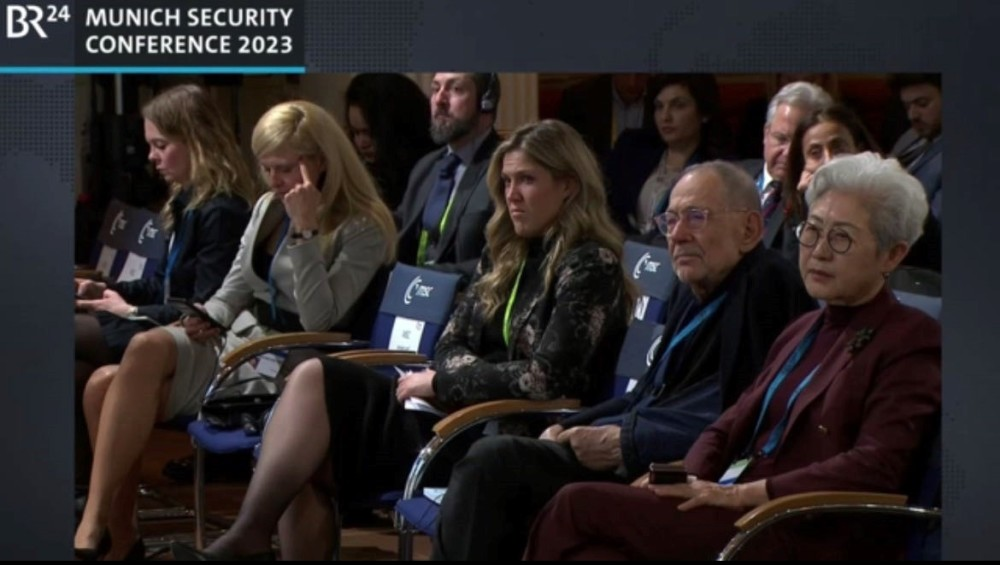
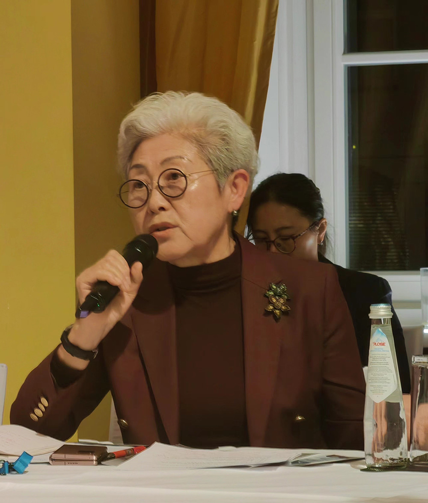

# 傅莹：对2023年慕安会的三点印象

2023年2月19日，第59届慕尼黑安全会议落下帷幕。拜耶瑞彻霍夫（Bayerischer
Hof）酒店门口的安检设备正被拆除，门外堆满了即将拉走的各种器械，我和团队一行人也收拾好行李赶赴机场。旅途中思考了与会期间得到的一些感受，写下来与读者分享。

**会议气氛发生变化**

上一次亲临慕安会还是三年前，后来受新冠疫情的影响缺席了两届。此次再度与会，感受最深的是气氛变化。在我多年形成的印象中，慕安会是个辩论和研讨的平台。今年，在乌克兰危机爆发将满一周年的背景下，会议聚焦俄乌战事，除了邀请乌克兰领导人视频发言，还有美欧多国政要出席，一致挺乌批俄。会议没有邀请俄罗斯外长拉夫罗夫参加，连持不同立场的德国选择党都被拒之门外。这样的安排使得会议成为一方表达情绪和态度的场所，前几年“西方的缺失”之类的迷离情绪完全被抗俄的亢奋言论所取代。但酒店外游行示威反对的声浪则是此起彼伏。

美国一如既往地有众多政要学者出席，从副总统哈里斯、国务卿布林肯，到60多位两院议员和近30位政府部门和军方要员，会内外、线上下线密集交流和发言表态，大谈俄罗斯对西方的“威胁”，誓言支持乌克兰战斗到底。难怪美国人经常引用丘吉尔的一句名言：“永远不要浪费一次好的危机”。美国显然在充分利用当前危机实现再度凝聚跨大西洋紧密关系的目标。

不过，就连慕安会报告也承认，美欧的激动情绪对于第三方国家，也即广大发展中国家，缺乏共情力。今年慕安会专门突出“全球南方”概念，邀请不少非洲、拉美、亚洲国家领导人出席，希望赢得他们对反俄援乌的认可和支持。但是“全球南方”更关心的是其面临的粮食和能源短缺等问题，同时也希望乌克兰危机能够得到和平解决，对欧美只讲打到底、不谈如何实现和平表达了不同的观点。另外，会上许多人在强调要重视和争取“全球南方”时，并没有把中国看作其中一部分。我在一个场合用玩笑的口吻评论说，中国显然也不是“全球北方”的成员，那么我们就做“全球中间”吧，大家在笑谈的同时，也觉得提出重大概念时需要准确定义。

**中美关系更“凉”**

40多年前，是小小的乒乓球开启了中美关系正常化之门，两国经过多年交往与合作构筑起广泛深入的纽带。然而现在，一个失控的高空气球被美方当作抓手，干扰和影响双方领导人商定的接触安排。在一次晚宴上听到某位美国议员声情并茂地讲述中国如何用气球“测试和挑衅美国”，我在发言时也回应了一句说，如果中国能用失控的气球来测试美国，那么平流层的风一定是中国的“好帮手”。

经过这场风波，“气球”这个词在国际场合已经成为某种笑料般的存在，其他国家的人谈到此事都难掩忍俊不禁的表情，感叹美国与中国的关系怎会变得如此脆弱。也有人告诉我，今日华盛顿的对华态度已经变得十分严峻，容不得任何人讲有利于中国和对华交往的话。中美关系陷入更加难解的困境，会上来自亚非等地的代表对此普遍感到担忧，认为气候变化、应对疫情和推动经济复苏等一系列重大全球问题仍需中美两个大国承担起责任，开展必要合作。

在慕安会上可以强烈感受到美国对华政策调整带来的影响。美方与会者可以说是“逢中必反”，中国的意识形态、经济政策、对俄关系等无一不成为他们指责的标靶。在涉及乌克兰的问题上更是言辞强烈，一位美国州长用手指着我说，“如果今天中国能直接告诉普京收手，明天战争就可以停止”。这位态度傲慢的老兄若不是政治幼稚就是习惯了霸道，难道不明白，在一场冲突中，当双方仍在交战时，任何停火斡旋必须双向进行，否则岂不是偏袒一方为其火中取栗？其实他就是试图将欧洲人对俄乌危机的焦虑转向中国。

在我看来，美国改变对华态度和政策的根本原因在于，对快速成长为世界大国的中国产生了深深疑虑甚至恐惧，害怕中国拥有更多世界权力，从而挑战美国的全球主导地位。一位欧洲学者在与我们交流时说，无论中国怎么做，美国对中国的打压态度都难以改变，因为让美国焦虑的不是中国在做什么，而是中国的存在本身（who
you are），让欧洲焦虑的则是中国在做什么（what you
do）。确实，欧洲对中国也有许多不满和意见，但是关注的焦点在于如何解决这些具体问题，克服两国关系中的障碍。

**中欧需要沟通**

在柏林和慕安会的交流中，可以感觉到欧洲人对中国的误解在加深，最主要的原因是，当他们因乌克兰问题陷入深深的安全危机感之时，对中国态度和政策缺乏了解。

中央外办主任王毅在慕安会上做了系统发言并现场答问，其中全面阐述了中国对乌克兰危机的立场和态度，态度鲜明地强调了和平解决的必要性和重要性。他的讲话在欧洲得到广泛传播，各方对中国即将发布的旨在促和的立场文件抱有很高期待。

在对华政策上，欧洲人受到美国对华战略竞争的影响比较大。德国也在制定自己的对华战略，其中一个核心提法是把中国定义成“制度性竞争对手”（systemic
rivalry）。这个英文词组的准确中译存在一定困难，systemic一词有“制度性”“系统性”和“全面性”的多重含义。欧洲人显然指的是政治制度和意识形态问题。另外，rivalry的含义比美方提出对华竞争时用的competition（竞争）这个词还要重，有非此即彼的零和含义。

我们在与德国官方和智库人士的讨论中，比较集中地探讨了中欧分歧问题，尤其一再质疑德方提出的与中国进行“制度性竞争”的意图，要求解释对竞争的终局构想。有趣的是，他们似乎从未深入考虑过这个问题，抑或是不愿或不敢说出自己的真实意图。我表示，你们提出与中国进行“制度竞争”，目的是争出制度的优劣吗，如同达芬奇与米开朗基罗的“才能之争”？若非如此，难道德国设想的是“制度的替代之争”？冷战后西方试图对其他国家搞民主制度输出，结果留下的不是战乱就是社会创伤。而中国在共产党领导下取得成功，这绝不是任何外部力量可以撼动的，当然也非其他国家可以轻易复制。

虽然德国乃至其他欧洲人在意识形态等方面对中国很难认同，但我们所到之处各方对沟通不仅不抵触，反而非常欢迎和期待。他们对中国的涉欧政策存在许多不解和困惑，会提出一连串问题希望我们作出解释和说明。代表团成员在德国媒体做的一些采访受到很大关注。不少人谈到，这两三年很少有机会直接听到中国人介绍和解释国家的政策与做法，导致社会上的对华认识更加被偏见所影响。他们觉得现在欧洲与中国的关系进入一个更加困难的阶段，出现问题时往往让矛盾和分歧盖过合作。有德国学者提醒，欧洲与中国的关系也已到“临界点”（tipping
point）了，双方应认真面对和解决存在的问题。

确实，中欧关系中有些矛盾看似死结，但既然是结，就有解儿，关键在于能否诚恳相待、坦诚沟通并付诸行动。正如习近平主席讲的，中欧关系关乎全球格局稳定和亚欧大陆繁荣，值得双方努力维护好、发展好。

