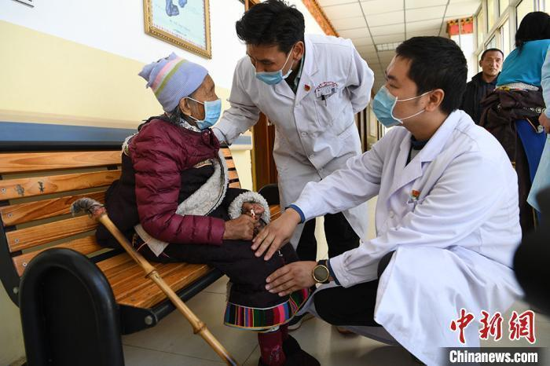

# 医保改革因为“统筹基金没钱了”？能否可持续？专家：收支平衡且有增长

_资料图：上海市民在医院终端机自助操作。张亨伟摄_

中新网北京2月23日电 题：专家解读医保门诊共济改革：提高职工门诊保障水平 提高全民医保发展水平

记者 李纯

当前中国多个省份正在实施职工医保门诊共济保障改革，受到社会各界广泛关注。为什么要进行此次改革？这次改革涉及哪些内容？改革将会有哪些成效？中国社会保障学会副会长、中国医疗保险研究会常务理事、浙江大学国家制度研究院副院长金维刚近日接受中新社记者专访，就相关问题进行权威解读。

_资料图：甘南州碌曲县藏医院的医生对患者进行问诊。杨艳敏 摄_

中新社记者：中国为何进行职工医保门诊共济保障改革？

金维刚：我国探索实施城镇职工医疗保险制度改革初期，在建立职工基本医疗保险制度方面，借鉴了国外的相关经验，并参考职工基本养老保险制度改革的做法，引入个人账户制度作为职工基本医疗保险制度的组成部分，实行社会统筹与个人账户相结合的制度模式。城镇职工基本医疗保险中的个人账户制度是我国在医保改革初期借鉴国外经验进行探索的产物，具有特殊的历史背景和社会环境。由于职工医保个人账户制度不具有社会互济性，职工个人在医疗保险社会筹资中的责任不明确，现行的职工基本医疗保险存在一些影响制度长期可持续发展的问题：

一是部分地区统筹基金入不敷出与个人账户资金结余过多并存，近年来个人账户结余资金占医保基金结余的约40%；

二是个人账户资金使用范围偏窄，使用效率不高，导致结余过多；

三是个人账户对于门诊慢性病的保障不足，在门诊与住院之间医保待遇不平衡的情况下，容易导致患者倾向于用住院替代门诊；

四是对个人账户管理难度较大，监管成本较高，放宽易滥用，严管则沉淀；

五是随着人口老龄化程度不断提高，退休人员大量增加，统筹基金的负担越来越重。

_资料图：市民在药房取药。张添福 摄_

2021年4月13日，国务院办公厅发布《关于建立健全职工基本医疗保险门诊共济保障机制的指导意见》。这项改革的主要目标是通过建立职工门诊共济保障机制，将职工门诊医疗费用纳入职工基本医疗保险统筹基金的保障范围，进一步完善职工基本医保制度，从而提高职工门诊保障水平。按照上述文件要求，各省级人民政府要统筹安排、科学决策，并制定出台实施办法，指导各统筹地区推进落实，可设置3年左右的过渡期，逐步实现改革目标。各统筹地区要结合本地实际，进一步明确和细化政策规定，制定具体的实施细则，并在本地区组织实施各项改革。

_中国社会保障学会副会长、中国医疗保险研究会常务理事、浙江大学国家制度研究院副院长
金维刚 图片由受访者提供_

随着老龄人口的增加，中国始终坚持“人民至上、生命至上”的理念，积极稳妥推进职工医保门诊共济保障机制改革，以便更好惠及老年人等重点群体，这本身就是应时应势之举。

中新社记者：此次职工医保门诊共济保障改革主要有哪几方面的内容？

金维刚：职工医保门诊共济保障改革主要包括以下八个方面：

一是增强门诊共济保障功能。建立完善职工医保普通门诊费用统筹保障机制，在做好高血压、糖尿病等群众负担较重的门诊慢性病、特殊疾病医疗保障工作的基础上，逐步将多发病、常见病的普通门诊费用纳入统筹基金支付范围，有效减轻普通门诊就诊费用负担。

二是合理调整统筹基金和个人账户结构。一方面，将单位缴纳的基本医疗保险费全部计入统筹基金，增加的统筹基金主要用于门诊共济保障，提高参保人员门诊待遇。另一方面，继续保留个人账户，在职职工个人缴纳的基本医疗保险费计入个人账户，计入标准原则上控制在本人参保缴费基数的2%；退休人员个人账户原则上由统筹基金按定额划入，划入额度逐步调整到统筹地区当年基本养老金平均水平的2%左右。个人账户的具体划入比例或标准，由省级医保部门会同财政部门按照以上原则，指导统筹地区结合本地实际研究确定。

三是普通门诊统筹覆盖职工医保全体参保人员，政策范围内支付比例从50%起步，随着医保基金承受能力增强逐步提高保障水平，待遇支付可适当向退休人员倾斜。

四是将门诊常见病、多发病门诊医疗费纳入统筹基金支付范围。根据医保基金承受能力，逐步扩大由统筹基金支付的门诊慢特病病种范围，将部分治疗周期长、对健康损害大、费用负担重的疾病门诊费用纳入共济保障，对部分适合在门诊开展、比住院更经济方便的特殊治疗，可参照住院待遇进行管理。探索将符合条件的“互联网+”医疗服务纳入保障范围。同时，不断健全门诊共济保障机制，逐步由病种保障向费用保障过渡。

五是将符合条件的定点零售药店提供的用药保障服务纳入门诊保障范围，支持外配处方在定点零售药店结算和配药，充分发挥定点零售药店便民、可及的作用。

六是规范个人账户使用范围。个人账户主要用于支付参保人员在定点医疗机构或定点零售药店发生的政策范围内自付费用。可以用于支付参保人员本人及其配偶、父母、子女在定点医疗机构就医发生的由个人负担的医疗费用，以及在定点零售药店购买药品、医疗器械、医用耗材发生的由个人负担的费用。探索个人账户用于配偶、父母、子女参加城乡居民基本医疗保险等的个人缴费。个人账户不得用于公共卫生费用、体育健身或养生保健消费等不属于基本医疗保险保障范围的支出。健全完善个人账户使用管理办法，做好收支信息统计。

七是完善与门诊共济保障相适应的付费机制。对基层医疗服务可按人头付费，积极探索将按人头付费与慢性病管理相结合；对日间手术及符合条件的门诊特殊病种，推行按病种或按疾病诊断相关分组付费；对不宜打包付费的门诊费用，可按项目付费。科学合理确定医保药品支付标准，引导医疗机构和患者主动使用疗效确切、价格合理的药品。

八是建立对个人账户全流程动态管理和监督机制，加强对个人账户使用、结算等环节的审核。创新门诊就医服务管理办法，健全医疗服务监控、分析和考核体系，引导定点医疗机构规范提供诊疗服务。加快全国统一的医疗保障信息平台建设，推进门诊费用异地就医直接结算。

中新社记者：此次医保改革的必要性体现在哪里？

金维刚：改革的必要性体现在以下五个方面：

一是适应我国医保发展阶段、改善群众医保待遇的客观需要。职工医保统筹基金和个人账户相结合，改革前统筹基金保障住院和门诊大病、个人账户保障门诊小病。这在特定历史时期有力地推动了公费和劳保医疗制度向社会保险制度的平稳过渡。但随着我国社会主要矛盾的变化与基本医保体系的不断完善，“个人账户保门诊小病”方式的局限日益凸显，出现了参保职工“有病的不够花，没病的用不了”的情况。

二是职工医保个人账户是自我保障，不能发挥社会保险互助共济的作用，仅靠个人力量难以应对疾病带来的经济风险。

三是职工医保统筹基金能够体现社会保险的社会互济功能，增强医疗保险的保障支撑能力，实现全体参保人之间的互助共济，有利于全社会共同承担和化解疾病风险，体现了社会保障的再分配功能，因此应当进一步做大做强医保统筹基金。

四是充分发挥统筹基金保障功能，把普通门诊费用纳入统筹基金报销范围，切实帮助身患疾病有治疗需要的人群，在机制上补齐了保障短板，减负效果更明显。这也是发挥社会保障再分配功能，促进共同富裕的体现。

五是增强统筹基金支撑能力和保障功能，在医疗费用持续增长、人口老龄化的趋势下，有利于促进医保制度可持续发展，切实提高广大参保人的医疗保障水平。

中新社记者：有观点认为，此次改革让医保今后划入个人账户减少了。怎么看待这样的观点？

金维刚：实施门诊共济保障改革后，门诊保障机制发生了转换，将单位缴费全部计入医保统筹基金，不再将其中一部分划入个人账户，同时将职工个人门诊费用纳入医保统筹基金的保障范围，从而在整体上提高了广大职工的门诊保障水平。

采取上述方式建立职工门诊共济保障机制，是通过职工医保基金内部的结构调整，在不另外筹资、不新增单位和个人缴费负担的前提下，显著提高了职工门诊保障水平。因此，不能片面、孤立地看待职工医保个人账户筹资标准减少，而是应当客观地看到，将原本要划入到个人账户的单位缴费的一部分资金计入统筹基金并用于职工门诊共济保障，这是门诊保障机制的一种转换，将职工门诊全面纳入统筹基金支付范围，从而有利于增强医保基金在职工门诊方面的保障功能，并显著提高职工门诊的保障水平。此举符合医疗保险的发展规律和深化医保改革的客观需要，符合广大参保职工的根本利益。

中新社记者：也有说法指，此次改革是因为“统筹基金没钱了”，要用个人账户“补窟窿”，这种观点是否准确？中国医保供给目前是否仍然可持续？

金维刚：上述观点是对目前医保统筹基金的误解，实际情况并非如此。据国家医保局统计，2022年全国基本医疗保险基金(含生育保险)收入超3.06万亿元(人民币，下同)，支出2.44万亿元，当期结余6300亿元。其中，职工医保基金收入2.06万亿元，比上年增长8.4%；基金支出1.51万亿元，比上年增长2.7%；基金当期结余5500亿元，基金累计结余2.32万亿元，比上年增长31.1%，可支付18.4个月。

总体上看，医保基金收支平衡，基金运行保持平稳，收支规模与经济发展水平相适应，医保基金保障能力不断增强，基金累计结余大幅度增长，能够实现医保制度以及基金财务可持续发展。

中新社记者：此次职工医保门诊共济保障改革设立了3年左右的过渡期，有何用意？改革如何平稳过渡？

金维刚：设置3年左右的过渡期，主要是鉴于目前职工基本医疗保险以市级统筹为主的情况，在各省级政府出台实施办法后，还需要各个统筹地区根据上述国办文件和省政府的有关文件精神，结合当地实际情况，研究制定更加具体的实施细则。

考虑到实施这项改革之后，新旧门诊保障机制的转换需要经历一个过程，其中一些新的政策措施需要在实践中逐步改进和完善，有的政策措施还需要在试行一段时期之后通过适当调整才能确定下来，同时，广大参保职工(包括退休人员)在这项改革实施之后，也需要有一个亲身体验和逐步适应的过程，因此，设置3年左右的过渡期是很有必要的，也是比较稳妥的，有利于这项改革的平稳运行和逐步完善。

为实现这项改革的平稳过渡，除设置3年左右的过渡期之外，还要求各统筹地区结合本地实际，进一步明确和细化政策规定，妥善处理好改革前后的政策衔接，确保参保人员待遇平稳过渡。对于已经开展相关工作的统筹地区，要在现有基础上进一步规范政策标准。对于尚未开展相关工作的统筹地区，要认真领会和贯彻落实国办发布的有关指导性文件和省政府制定的实施办法，加紧研究制定符合本地实际、切实可行、细致周密的具体实施细则，积极稳妥启动实施这项改革，并努力确保这项改革的平稳运行。

中新社记者：此次改革将对中国整体的医保水平产生何种影响？

金维刚：职工医保门诊共济保障改革是针对目前职工医保在门诊保障方面存在的主要问题，通过对统筹基金与个人账户的筹资结构进行必要调整，将单位缴费全部划入统筹基金，同时将职工门诊全面纳入统筹基金的保障范围，不仅增强了统筹基金的筹资能力和在门诊方面的保障能力，而且能够显著提高职工门诊保障水平。

同时，在继续保留职工原有个人账户并将个人缴费仍然全部计入个人账户的情况下，通过适当扩大个人账户的支付范围，有效利用个人账户资金，充分发挥个人账户在医疗保障方面的作用。因此，这项改革有利于在整体上提高全民医保发展水平。(完)

受访者简介：

金维刚教授现任中国社会保障学会副会长、浙江大学国家制度研究院副院长；中宣部、教育部、科技部联合评选的国家社会科学领军人才；国务院颁发政府特殊津贴的专家。曾任中国劳动和社会保障科学研究院院长；现兼任中国医疗保险研究会常务理事、全国政协中国经济社会理事会理事、《健康报》和《中国卫生》杂志评选的“2019年度最受关注医改专家”之一。

