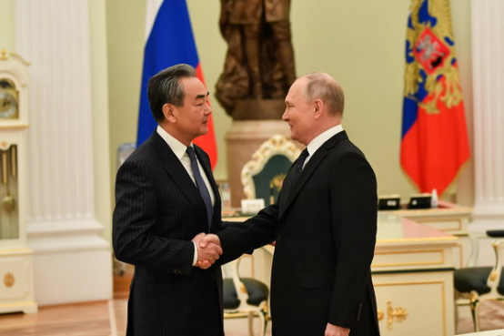
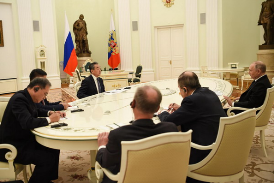
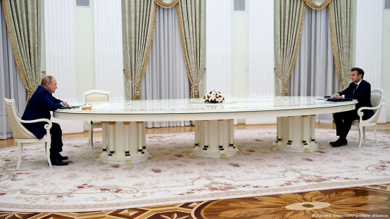
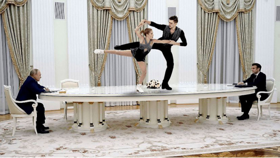
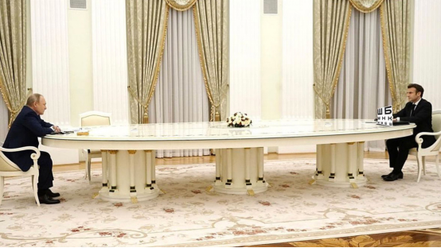
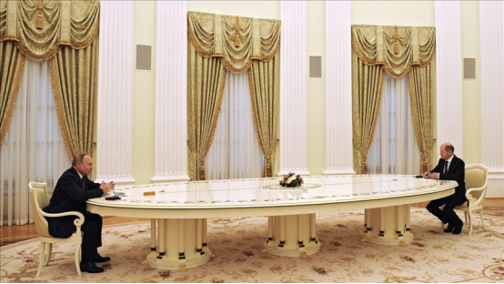
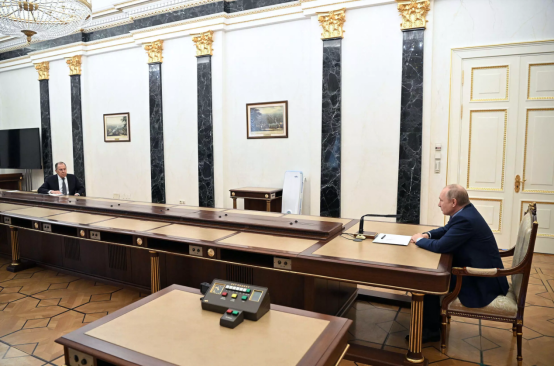
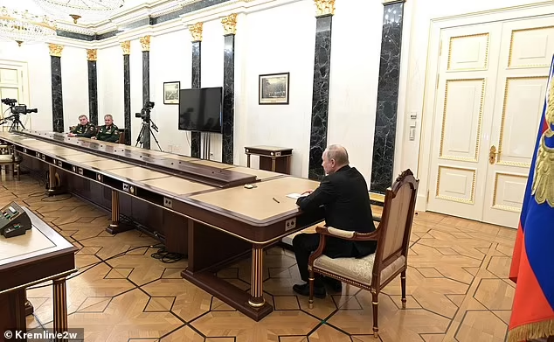

# 同一张桌子，普京“近距离”会见王毅，比见马克龙等人近得多

【环球网报道 记者 李诗睿】
同一张桌子，不同的坐法！俄罗斯总统普京22日在莫斯科会见中共中央政治局委员、中央外事工作委员会办公室主任王毅，外媒的关注点在一张桌子上。

_当地时间2023年2月22日，俄罗斯总统普京在莫斯科会见中共中央政治局委员、中央外事工作委员会办公室主任王毅。_

英国《每日邮报》发现，普京此前会见法国总统马克龙等西方领导人时，两人坐在桌子最长处的两端，远远对话。而此次会见王毅时，同样还是那张桌子，双方在彼此距离最近的位置“面对面坐着”，两人仅几步之遥，这与之前的情形形成了鲜明对比。

_当地时间2023年2月22日，俄罗斯总统普京在莫斯科会见中共中央政治局委员、中央外事工作委员会办公室主任王毅。_

《每日邮报》在文中称，普京22日在克里姆林宫热情地迎接了王毅，两人坐在桌子两边面对面交谈，彼此之间只隔了几英尺远（编者注：一英尺约30.5厘米），这清楚地表明了普京对中国的亲近，也与普京对待其他国家政要的态度形成了鲜明对比。

文章提到，普京此前与法国总统马克龙、德国总理朔尔茨等人举行会谈时，双方被一张非常长的桌子隔开。

关于这张桌子，法国24小时新闻网此前称，按官方说法，这张6米长的漆木桌子作为新冠病毒时期的方案一种，以确保普京和他的客人之间有足够的距离。法新社去年2月报道称，这张白色的、闪闪发光的、六米长的，普京与世界各国领导人会面而选择的桌子，引发了一系列表情包，以及外界对其象征意义的猜测。

_2022年2月7日，俄罗斯总统普京会见法国总统马克龙。图源：俄卫星社_

_俄罗斯总统普京（左）会见法国总统马克龙，网友制作的表情包。图源：莫斯科时报_

_俄罗斯总统普京（左）会见法国总统马克龙，网友制作的表情包。图源：推特用户@ioannZH_

_2022年2月15日，俄罗斯总统普京（左）会见德国总理朔尔茨（右）。图源：外媒_

文章还称，即使是克宫的一些高层内部人士，此前在与普京会面时，也受到了社交限制。包括俄罗斯外交部长拉夫罗夫、俄罗斯国防部长谢尔盖•绍伊古以及俄罗斯联邦武装力量总参谋长瓦列里•格拉西莫夫。

_俄罗斯总统普京（右）会见拉夫罗夫。图源：外媒_

_2022年冬季，普京（右）会见瓦列里•格拉西莫夫（最左边）和谢尔盖•绍伊古。图源：克宫_

关于22日的会谈内容，据新华社报道，王毅表示，当前国际形势复杂严峻，但中俄关系历经国际风云考验，成熟坚韧、稳如泰山。中方愿同俄方一道，保持战略定力，深化政治互信，加强战略协作，拓展务实合作，维护两国的正当利益，为促进世界和平与发展发挥两国的建设性作用。普京表示，当前俄中关系正朝着既定目标前进，双方各领域合作以及在上合、金砖等多边组织中的协调富有成果，在国际事务中加强团结协作，对推动国际关系民主化和国际格局的平衡稳定具有重要意义。双方就乌克兰问题深入交换意见。王毅表示，赞赏俄方重申愿通过对话谈判解决问题。中方将一如既往秉持客观公正立场，为政治解决危机发挥建设性作用。

