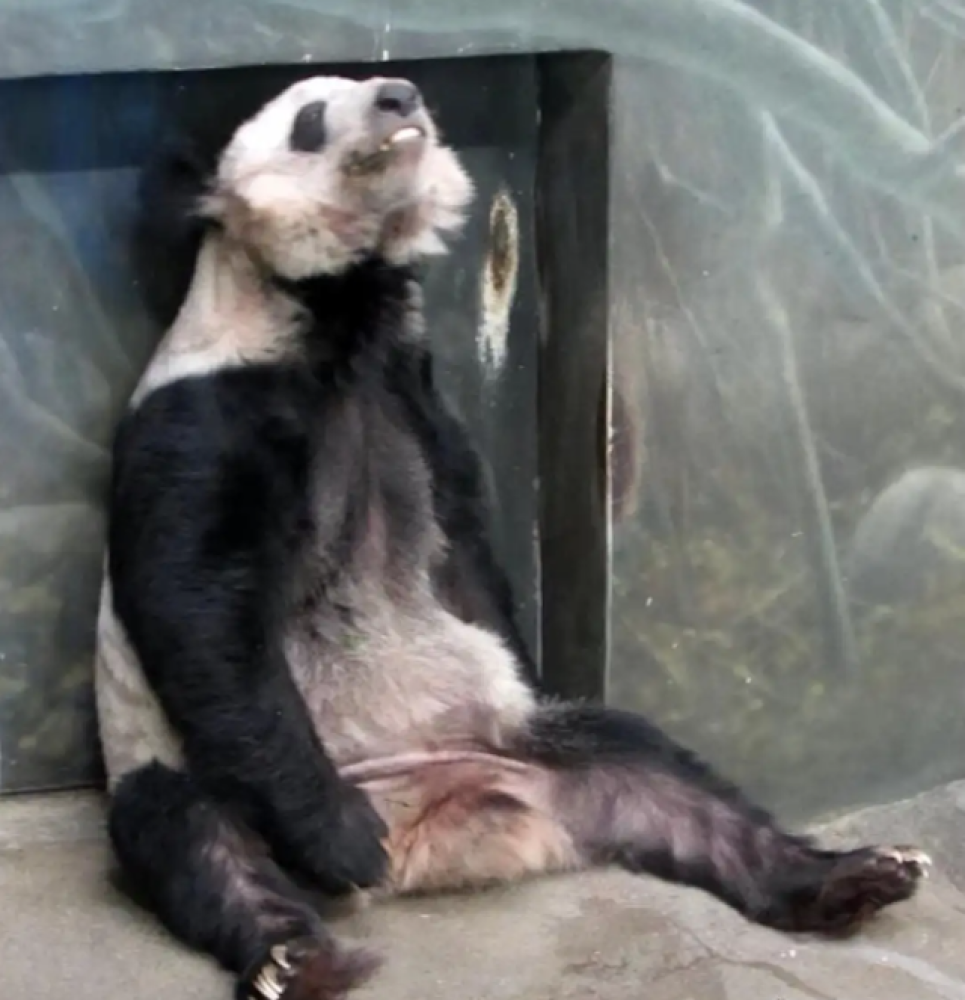
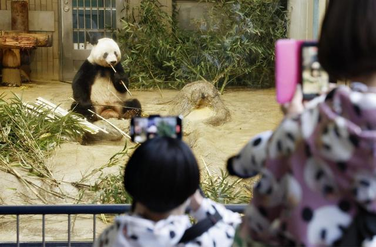
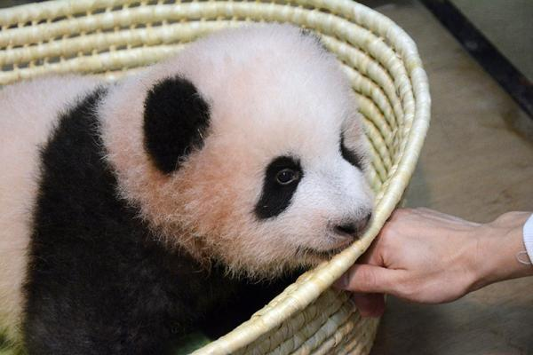
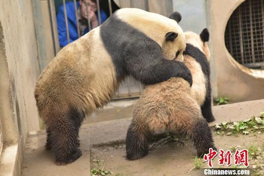
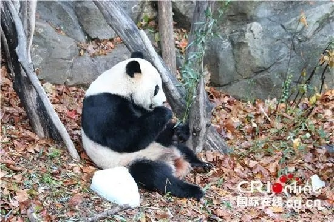
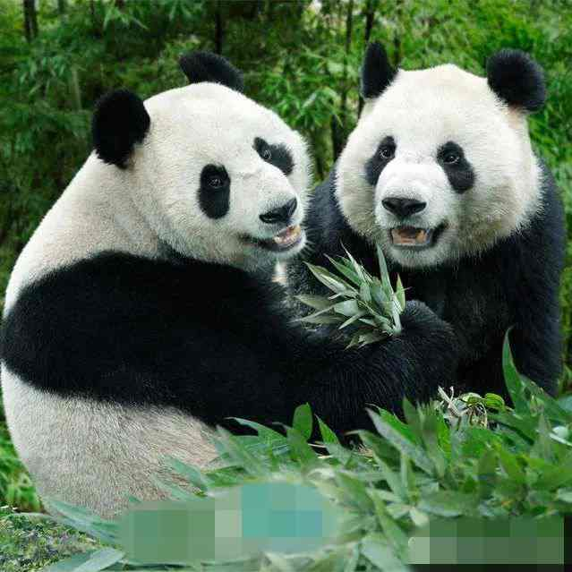
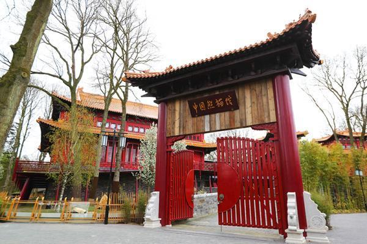

# 国外大熊猫生存现状：“乐乐”客死他乡，芬兰无力承担喂养费用

近期，旅美大熊猫“乐乐”和“丫丫”的遭遇引起舆论广泛关注。先是旅美25岁大熊猫“乐乐”于2月1日晨被发现死亡，紧接着“丫丫”又被传出健康状态极其不佳，不少视频和照片显示它的居住场馆环境恶劣、瘦骨嶙峋、毛色肮脏。按此前中美双方的协议，“乐乐”和“丫丫”原定于今年4月回国，如今变故突生“丫丫”能否健康安全归来？而正在此时，四只旅日大熊猫却已经先后回国。今天我们就来盘点看看，部分国宝大熊猫们在海外生活以及回国的情况。

_▲“丫丫”的健康状况令人担心。_

**“乐乐”回国前突然死亡**

**居留国：** 美国

**预计回国日期** ：今年4月

雄性大熊猫“乐乐”1998年7月出生，2003年4月，来自上海动物园的雄性大熊猫“乐乐”和来自北京动物园的雌性大熊猫“丫丫”（2000年8月出生在北京动物园）乘坐飞机抵达孟菲斯，开始了旅美生涯，让孟菲斯动物园成为全美第四家拥有熊猫的动物园。

2013年，两只熊猫为期10年的租借期结束后，孟菲斯动物园与中方签订协议，将租借期再延长10年。旅美近20年，回国倒计时2个月，乐乐却突然死亡，终年25岁，孟菲斯动物园方称乐乐的死因“尚未确定”正在调查。在“乐乐”去世之前，孟菲斯动物园官员声称它身体很好。

2月4日，中国驻美国使馆发言人就大熊猫乐乐离世答记者问时表示，已通知美方妥善保存尸体，并及时组建专家组，尽快前往美国孟菲斯动物园，与美方专家共同开展大熊猫死亡原因调查。

此前两只熊猫在孟菲斯动物园的状况，就曾引发较大争议。2022年年初，有网友指出，“丫丫”和“乐乐”的生存情况不容乐观。照片显示，两只大熊猫瘦骨嶙峋，精神萎靡，状态大不如抵美之初，即便是与其他旅美的大熊猫相比，整体状态也差了一大截。有网友称，“丫丫”和“乐乐”的居住场馆环境恶劣，没有新鲜竹子吃，投喂量达不到国内标准，饲养员也不与它们互动。消息发布后，曾引发广泛关注。

目前据中国动物园协会工作人员透露：“相关专家已出发去往美国，如果手续办理顺利，‘丫丫’将提前回国。”

_▲人们在上野动物园为大熊猫香香拍照，这是它返回中国之前在游客面前的最后一天。_

**动物园顶流明星“香香”**

**居留国：** 日本

**回国时间：** 2023年2月21日

2月21日，深受日本民众喜爱的大熊猫“香香”从日本东京上野动物园启程，搭乘顺丰航空货运包机回国。“香香”出生于2017年6月，是上野动物园自然繁殖成功的第一只大熊猫。由于父母是从中国出借的大熊猫“比力”与“仙女”，“香香”所有权属于中国，它属于双方合作协议到期正常回国。如今，已经5岁多的“香香”已经进入繁殖适龄期，此时回国也是为了能尽快寻找到合适的伴侣。

按照协议，“香香”原定2019年6月归还中国，由于许多日本人希望它多留一段时间，日方申请延期一年半归还，之后因疫情四度推迟回国，终于在2月21日踏上回国之旅。“香香”此次回国全程采取闭环管理，接下来将被送往熊猫中心雅安基地，入住隔离检疫区一个月，隔离结束后“香香”将与游客见面。

_▲“香香”百日照。_

在日本，“香香”是当之无愧的顶流明星。2月19日是上野动物园开放参观“香香”的最后一天，中签的人们排起了长队向“香香”道别。当天，共有6万多人报名参加抽签申请，最后只有约2600名粉丝幸运中签。

1972年10月，中国政府将一对大熊猫“康康”和“兰兰”赠送给日本人民。这对大熊猫就落脚于上野动物园。“康康”和“兰兰”从机场前往动物园的路上，配备警车开道和约100名警备人员。上野动物园的入场人数也在1973年创下了历史最高纪录的920万人。如今，上野动物园大熊猫家族的每次添丁，也都能登上日本头条，给周边餐馆、商店带来巨大经济效应。

_▲“永明”和他的双胞胎女儿回国了。_

**多产爸爸“永明”**

**居留国：** 日本

**回国时间：** 2023年2月22日

继“香香”之后，2月22日，日本和歌山县白浜町“冒险世界”乐园的大熊猫“永明”和他的双胞胎女儿“樱浜”“桃浜”（出生于2014年今年8岁）也启程回到中国。它们属于中日双方合作协议到期正常回国。

“永明”1992年出生于北京动物园，1994年来到日本。“永明”和2008年去世的大熊猫“梅梅”诞下6个孩子，后又与大熊猫“良滨”育有10子，一共是16只熊猫的父亲。“永明”和双胞胎女儿离开后，“冒险世界”内将只剩下4只雌性熊猫。

2月22日晚23时10分，“永明”和它的双胞胎女儿顺利抵达成都双流国际机场。三只大熊猫此次回国全程采取闭环管理，接下来，它们将被送往成都大熊猫繁育研究基地入住隔离检疫区，为期一个月。

“香香”“永明”“樱浜”“桃浜”四只大熊猫回国后，日本国内的大熊猫数量将从13只减少9只。

_▲正在午休的“旦旦”。_

**因病推迟回国的“旦旦”**

**居留国：** 日本

**预计回国时间：** 今年12月底

神户王子动物园的大熊猫“旦旦”年老体弱，虽然是人气明星，但养育工作难度很高。

今年已经27岁的旦旦，按人类的年龄相当于80岁左右，2021年3月被诊断出患有心脏疾病，仍在治疗中，归国日期推迟至2023年12月底。神户王子动物园园长加古裕二郎去年7月在接受采访时表示，旦旦是一只高龄熊猫。“旦旦有自己的情绪和好恶，我们会观察并选取它状态比较好的时候进行体检，也逐渐缩短了它的展示时间。”

2022年春季起，神户王子动物园停止了公开展示。加古裕二郎介绍，在炎热天气下，为了防止室外环境过于干燥，安装了干雾、水蒸气喷雾等设施。园方与中方专家一直保持密切沟通。

**“阳光”“甜甜”怀孕失败**

**居留国：** 英国

**预计回国时间：** 2023年10月底

英国爱丁堡动物园官网今年初透露，旅居英国的唯一一对大熊猫“阳光”和“甜甜”最早可能会在2023年10月底离开爱丁堡。根据中英2011年签署的协议，它们原定于2021年结束旅英生活。后来，在苏格兰皇家动物学会与中国野生动物保护协会之间协调下，最初10年的合约期延长了两年，至2023年。

据介绍，“甜甜”和“阳光”均出生于2003年。2011年12月，被送抵英国爱丁堡。这对大熊猫在爱丁堡动物园落户后立即成为当之无愧的明星，受到了英国民众的喜爱。大熊猫喜爱吃的竹子特地从荷兰运过来，动物园也花费巨资为这对熊猫打造了舒适的新居。然而，动物园方面自2012年起多次尝试经由自然交配或人工授精使“甜甜”怀孕，但无一成功。“阳光”后来被诊断患上睾丸癌并做了手术。

2023年1月5日，爱丁堡动物园宣布将为大熊猫“阳光”和“甜甜”举办一场“盛大的告别会”。园方将为人们提供尽可能多的机会与大熊猫告别。

_▲“高高”回到国内。_

**旅居海外时间最长的“高高”**

**居留国：** 美国

**回国时间：** 2018年11月

2018年11月1号，旅居美国的大熊猫“高高”回到了中国大熊猫保护研究中心，入住都江堰青城山基地的隔离检疫兽舍。一个月后，“高高”解除隔离检疫，在中国大熊猫保护研究中心都江堰青城山基地公开亮相。

“高高”是一只雄性大熊猫，2018年已经28岁，相当于人类约98岁。1992年它在野外被发现并被救助，救助时约2岁，2003年6月旅居美国圣地亚哥动物园，是旅居海外时间最长的大熊猫。在美国生活期间，“高高”曾患过睾丸癌，并实施了手术。作为老龄大熊猫，“高高”也患有一些大熊猫常见的老年疾病。

据介绍，大熊猫“高高”和早先旅居美国的雌性大熊猫“白云”共繁育了五只后代，分别是大熊猫“美生”“苏琳”“珍珍”“云子”“小礼物”，除“小礼物”外，均已回到保护研究中心生活。

_▲“泰山”回国找到了伴侣。_

**“泰山”回国找到了对象**

**居留国：** 美国

**回国时间：** 2010年2月

“泰山”是一只出生在华盛顿国家动物园的熊猫，它的父母“美香”和“添添”2000年被租借到美国。2005年7月9日，“泰山”的降生在美国掀起了新一波熊猫热，单单起名字就有约20万人投票。

按中美双方最初约定，泰山的所有权归中国并将在两岁时被送回中国。在美方要求下，中国政府2007年同意将泰山留美时间延长两年。2009年夏天又应美方要求再次延长半年。2010年2月，泰山返回中国，大批美国民众为其送行。

大熊猫“泰山”回国后，消化系统存在异常，体重偏轻，毛色粗糙无光泽，保护研究中心随即对“泰山”的饲养管理上做了精心的调整，“泰山”体重从90多公斤增至107公斤，肠胃功能从弱到强，身体越来越健康。近日按计划转移到雅安基地参与繁殖，终于不负众望，顺利完成第一次自然交配。

**乘坐波音777回国的“美兰”**

**居留国：** 美国

**回国时间：** 2010年2月

雄性大熊猫“美兰”是成都大熊猫繁育研究基地与美国亚特兰大动物园开展“大熊猫国际合作繁殖计划”后诞生的一只宝宝。根据中美双方相关协议，“美兰”归中国所有。

据介绍，1999年11月，“美兰”的父母“伦伦”“洋洋”开始了在亚特兰大的生活。2006年末，夫妻俩产下爱子“美兰”。“美兰”与“泰山”一起回国来到成都大熊猫繁育研究基地，开始在家乡的新生活。

为了运送泰山和美兰回国，启用了世界上最大的货运飞机波音777，其减噪功能好，可以为熊猫营造一个安静的旅程。4岁半的泰山和3岁的美兰都有自己的头等舱单间，还有重达75公斤的竹子、营养品和水可以享用。

_▲龙凤胎“福凤”“福伴”顺利回国。_

**“福”字号五只熊猫全部回国**

**居留地：** 奥地利

**回国时间：** 2015年-2018年

2003年，四川卧龙出生的一对大熊猫“龙徽”和“阳阳”前往奥地利美泉宫动物园定居。“龙徽”和“阳阳”自旅居维也纳以来已经生育了5个幼崽，创造了欧洲圈养大熊猫在没有人为干预状态下交配生育的纪录。

“福豹”于2013年8月14日出生于奥地利美泉宫动物园，是旅奥大熊猫“龙徽”和“阳阳”的第三个孩子。根据协议，它们出生的幼仔将在其满两周岁之后被送回国内。在此之前，“福豹”的两个哥哥“福龙”和“福虎”已经顺利回国生活。

2015年11月7日，出生于奥地利美泉宫动物园的两岁雄性大熊猫“福豹”顺利回国并到达中国保护大熊猫研究中心都江堰基地。

2018年12月4日，旅奥大熊猫龙凤胎“福凤”“福伴”也顺利回国，入住中国大熊猫保护研究中心卧龙神树坪基地隔离检疫区。

_▲贝贝回国前在美国国家动物园最后亮相。_

**8天2万多人与“贝贝”告别**

**居留国：** 美国

**回国时间：** 2019年11月

2019年11月19日中午，在美国首都华盛顿美国国家动物园出生长大的大熊猫“贝贝”从杜勒斯国际机场出发启程回国，约16小时后“贝贝”落地四川成都，开始新生活。

“贝贝”是一只雄性大熊猫，2015年8月22日出生在美国国家动物园，现在体重250磅，约合113公斤。“贝贝”的父母是大熊猫“添添”和“美香”，它们于2000年抵达华盛顿，它们孕育并成活的熊猫幼崽有三只，分别是2005年出生的儿子“泰山”、2013年出生的女儿“宝宝”和2015年出生的儿子“贝贝”，其中“泰山”和“宝宝”已经分别于2010年和2017年返回中国。

美国国家动物园2019年11月11日至18日为“贝贝”举行了一系列告别活动。“贝贝”接受了回国前最后一次体检，享用了临行前的大餐，也就是一只果蔬和零食做成的冰蛋糕，前来告别的民众还可以给“贝贝”或它的新饲养员写明信片，这些明信片将随“贝贝”一起被送往中国。据美国国家动物园统计，这8天里有23000多人来到动物园与“贝贝”告别。

**中秋给熊猫唱《但愿人长久》**

**居留国：** 芬兰

**预计回国时间：** 或将提前回国

今年1月，芬兰一家动物园表示，由于无力承担大熊猫的饲养费用，正考虑提前归还早前从中国租借的两只大熊猫“金宝宝”和“华豹”。

艾赫泰里动物园是一家位于芬兰中部的私营动物园，原本希望大熊猫能吸引游客，但由于新冠疫情影响当地旅游业，如今该动物园面临越来越严重的债务问题。2021年，芬兰政府曾向该动物园提供20万欧元的一次性资金扶持，但拒绝了后者提出的500万欧元补助金申请。该动物园称，是否归还大熊猫的最终决定将在2月28日做出。

2017年4月，中国与芬兰签署了合作开展为期15年大熊猫保护研究的相关文件。大熊猫“金宝宝”和“华豹”于2018年1月抵达芬兰。在它们抵达之前，芬兰民众还为这两只大熊猫起好了当地名字：雄性大熊猫“华豹”得名“皮吕”，意为“大雪纷飞”；雌性大熊猫“金宝宝”得名“卢米”，意为“雪”。这两个昵称是从4000多个候选名中投票甄选出来的。

大熊猫在抵达时受到“总统级的接待”，当地动物园还很注重“滚滚”们的精神世界，在中秋节来临之际，芬兰动物园请来了合唱团，为大熊猫演唱《但愿人长久》。

_▲大熊猫凯凯和嘉嘉。_

**大熊猫留新拼二胎**

**居留国：** 新加坡

**预计回国时间：** 原定去年，延长到2027年

原定2022年送回中国的大熊猫凯凯和嘉嘉，将在新加坡继续待到2027年。2022年9月2日，新加坡万态保育集团与中国野生动物保护协会，签订大熊猫保护研究合作延长协议。继续留在新加坡的5年期间，万态保育集团会尝试让他们再拼个二胎。

2009年11月，为庆祝中国和新加坡建交20年，中新双方共同签署了大熊猫合作研究协议。2012年9月6日，大熊猫凯凯和嘉嘉，一起开始在新加坡的生活，定居10年。2021年，历经7次繁殖后，嘉嘉终于生下了头胎宝宝叻叻。

**延伸阅读**

**近60只“滚滚”继续在海外圈粉**

据悉，除日本之外，中国已和美国、奥地利、泰国、墨西哥、加拿大、澳大利亚、法国、德国、荷兰、芬兰、比利时等十多个国家开展大熊猫合作研究，共有近60只大熊猫在海外旅居。在不少国家，“滚滚”们都大受欢迎，在海外过得十分“滋润”。

_▲荷兰雷嫩市欧维汉兹动物园熊猫馆外景。_

在荷兰，大熊猫住进了“宫殿”。据悉，荷兰欧维汉兹动物园为大熊猫准备了中国传统宫殿式的熊猫馆，不仅每只熊猫有各自的卧室和活动室、食物储存间、诊疗所，还有为未来宝宝准备的育婴房。如果它们想出去溜达撒欢，可在熊猫馆周围2000多平方米的场院里尽情玩耍，木梯、石洞等活动设施应有尽有。

在丹麦，旅居哥本哈根动物园的“滚滚”所住的熊猫馆不仅空间宽敞，还被设计为太极图案的“阴”“阳”两部分。

在比利时，位于布鲁塞尔的天堂动物园为熊猫开辟了４公顷的专属竹林，竹子的品种也经过精挑细选。比利时布鲁塞尔天堂动物园的“星辉”“好好”“天宝”。

在泰国，清迈动物园为大熊猫建造了一座600平方米的雪景园，常年人工降雪，使园内保持零下6-7摄氏度。

在卡塔尔，卡塔尔政府为迎接大熊猫“四海”“京京”，精心建造了大熊猫馆。两只大熊猫将分别拥有带空调的运动场、室内展厅、独立的“卧室”。

在韩国，2016年3月两只大熊猫搭乘专机运抵韩国仁川国际机场，开始为期15年的“旅韩”生活。雌性大熊猫的韩国名字为“爱宝”，雄性大熊猫的韩国名字为“乐宝”。2020年7月，“爱宝”和“乐宝”还生下了它们的宝宝“福宝”。

上游新闻据新华社、国家林草局动植物司、封面新闻、澎湃新闻、中国青年报、央视新闻、上观新闻、中新网等综合 图片来源据网络

编辑：杨波

责编：李洋 官毅

审核：冯飞

