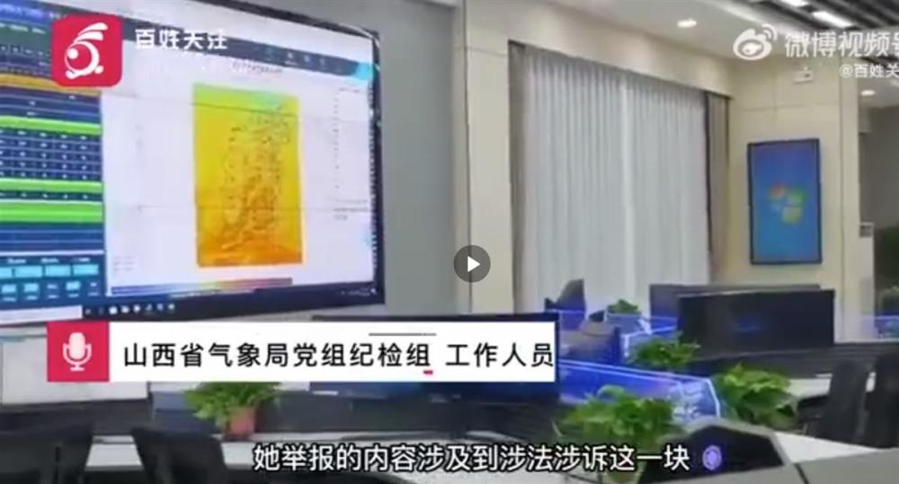
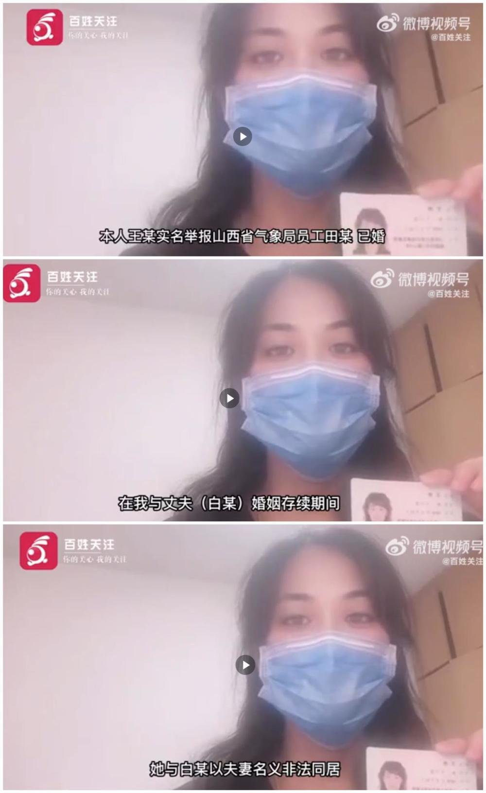

# 女子举报丈夫与公职人员同居生女，不是党员也要依法调查处理

极目新闻评论员 屈旌

2月23日，山西太原一女子王某实名举报山西气象局公职人员田某与其丈夫同居并生育一女。23日，田某回应称举报不属实。山西气象局党组纪检组一名值班人员回应称他们已调查，由于田某不是党员，因其举报内容涉诉涉法，建议举报者走法律程序，法院判决后，可依据判决结果处理。（据2月23日百姓关注）

_相关新闻视频截图_

据王某举报，她和丈夫于2005年结婚，2019年，婚姻进入困境，她丈夫一直不回家，与田某同居并生有一女。

如果举报内容属实，其丈夫在婚姻关系存续期间，与他人长期同居并生育小孩，其行为很可能已经构成重婚罪，而田某自己也有配偶，如果明知他人有配偶，依然与其生育子女，保持事实婚姻关系，也同样可能构成重婚罪。王某要维护自己在婚姻中的合法权益，的确如山西气象局党组纪检组这名值班人员所言，走法律途径是最直接、最有力的。

_相关新闻视频截图_

不过，公职人员既然是履行公职，拿的是公家的薪水，端的是公家的饭碗，那么就是公家，也就是政府部门、公共机构的形象。无论是不是党员，只要行使公权力，具有公职身份，就应该接受监察部门的有效监督。监察部门收到相关举报，就应该及时地受理、调查、核实。

2020年7月1日，《中华人民共和国公职人员政务处分法》开始施行，其目的就是为了加强对所有行使公权力的公职人员的监督，促进公职人员依法履职、秉公用权、廉洁从政从业、坚持道德操守。该法律明确规定，公职人员有违背社会公序良俗，严重违反家庭美德、社会公德行为的，予以警告、记过或者记大过；情节较重的，予以降级或者撤职；情节严重的，予以开除。可见，如果涉事公职人员，与他人保持不正当关系的情况属实，对其进行调查处分是有法可依的。

而且，《政务处分法》的执法主体就是相关机关单位或其上级单位的监察机关，依法对公职人员进行调查处理，与公安机关和法院调查重婚案件是不矛盾，不冲突的，完全可以并行不悖。也就是说，无论当事人王某是否就其配偶重婚报案或起诉，山西气象局或其上级纪检监察机关，都应该依法对其举报进行受理，对公职人员田某进行调查。

国家之所以设立监察委，就是为了着力解决对公职人员的管理监督薄弱、处分程序不够规范、处分决定幅度不统一等问题，避免出现“监督空白”。建议山西气象局重视群众举报，及时对相关问题进行调查处理。

（来源：极目新闻）

