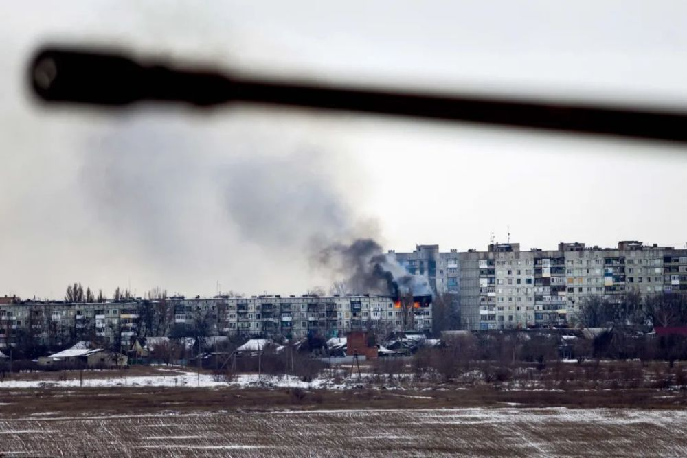
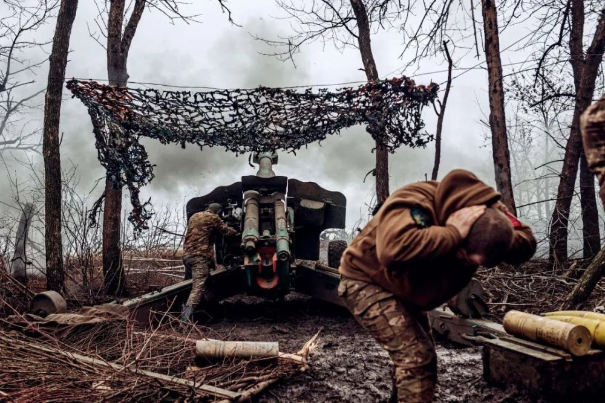
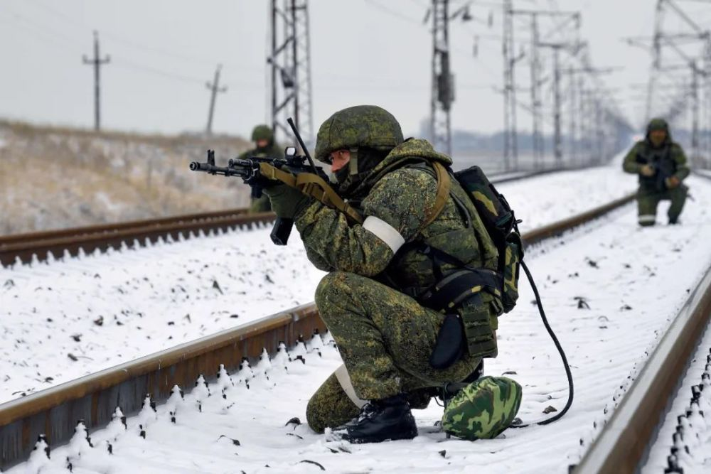
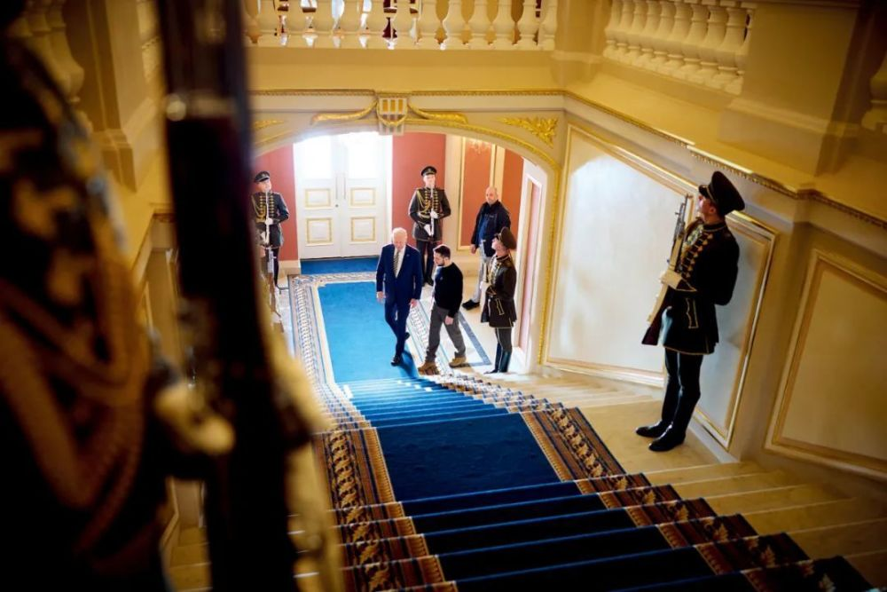

# 打了一整年，打回顿巴斯

过去7个月里，乌克兰救护车司机伊万每天拉着失去四肢、伤痕累累的军人或平民，在乌克兰顿涅茨克州东北重镇巴赫穆特及周边市镇的战火间穿行。

伊万这样的工作状态，终于在2023年2月告一段落。在乌克兰政府中断巴赫穆特与外部世界除军事活动之外的全部联系后，巴赫穆特之战进入“决胜时间”。这场乌克兰危机升级一年来历时最久的战役，被外界认为要到尾声了。

“这就是凡尔登。”伊万对乌克兰媒体感叹。1916年的凡尔登战役是第一次世界大战中最长的一次战役，也是人类历史上伤亡最惨重的战役之一，德法两国超过30万士兵战死。

“一年前，没人能预想到今天的局面。”美国外交关系委员会高级研究员、白宫前总统国家安全事务特别助理查尔斯·库普乾说。库普乾接受《中国新闻周刊》采访的时间是2023年2月16日，俄罗斯和乌克兰军队正在巴赫穆特对决。

_2月14日，顿涅茨克地区巴赫穆特，一辆乌克兰军车驶过被俄罗斯炮火击中的公寓楼。图/视觉中国_

2022年2月24日，俄罗斯对乌克兰发动“特别军事行动”。占领顿巴斯地区，也就是顿涅茨克和卢甘斯克两州全境，是普京在当日凌晨的讲话中设定的军事目标。随着战火在最初一周迅速燃向乌克兰首都基辅、第二大城市哈尔科夫和南部重镇赫尔松，俄罗斯公开的战略目标亦不断升级：乌克兰非军事化、乌克兰永久中立、乌克兰去纳粹化……

然而，战事拉锯了整整一年后，“主战场”又回到顿巴斯。“乌克兰的韧性”与“西方升级军事援助”，是美俄几位专家对《中国新闻周刊》总结的两大原因。收缩战线后，俄军主力于2022年底悉数回到顿巴斯，也一定程度上“稳住了战线”，结束了乌克兰局部反攻的局面。但这场“顿巴斯决战”将走向何方，依然悬念重重。

**巴赫穆特“绞肉机”**

巴赫穆特位于顿涅茨克东北，扼守交通要道，是从顿涅茨克乌军控制区去往卢甘斯克乌控区最大城市北顿涅茨克市的必经之地。这座人口才几万人的小城，原本并不在乌克兰政府军与顿涅茨克分离武装对峙的一线，但2014年顿巴斯战争结束后，乌军将北顿涅茨克及周边城镇打造为工事密布的“堡垒城市”，巴赫穆特则是前线乌军的“大后方”。

2022年3月23日晚，巴赫穆特的乌军指挥部和火炮弹药库遭到导弹袭击，这是俄罗斯官方认可的“特别军事行动”后对巴赫穆特的第一次攻击。当时，俄军正经历“特别军事行动”的首次战略调整：逐步放弃基辅围城战，主要精力转向对顿巴斯最南端重镇马里乌波尔的围攻。惨烈的钢铁厂巷战尚在进行中，外界未曾注意到，东北方的巴赫穆特开始成为轰炸目标。其背后的原因很快明了：马里乌波尔之战刚刚结束，顿巴斯北端重镇北顿涅茨克市就遭到俄军围攻。两场战役展现了俄军的优先事项：先控制顿巴斯全境，再向其临近各州进军。

5月，在向北顿涅茨克市推进的过程中，一支俄军装甲支队试图渡河直插巴赫穆特后方基地，结果被乌军发现，遭到“毁灭性炮击”。但这没有影响俄军顺利进占北顿涅茨克，乌军也没有如马里乌波尔之战那样死守，而是几乎主动撤出了卢甘斯克全部控制区。随之，巴赫穆特成为前线。不论是莽撞的渡河行动还是此后对巴赫穆特及周边市镇的持续空袭，都显示出巴赫穆特成为俄军的下一个重点目标。

然而，北顿涅茨克之战成为2022年俄乌战局的一个“分水岭”。俄军7月开始向巴赫穆特进军，激战一个月后，于8月抵达巴赫穆特东北部小镇索莱达尔，进入小镇东南角的建筑材料加工厂，与乌军面对面厮杀。但俄军占领距离巴赫穆特只有18公里的索莱达尔，却要等到半年之后的2023年1月。塔斯社等俄罗斯媒体曾引述前线官兵的说法，强调“短期因素”，如顿涅茨克七八月间进入雨季，俄军赖以制胜的炮兵难以在泥泞环境中机动。但事实上，巴赫穆特外围战役的转折，是俄乌“攻守之势异也”的一个缩影。

_2022年12月28日，在顿巴斯前线开火的乌克兰士兵。图/视觉中国_

一开始，俄军军官对轻松到达索莱达尔近郊感到惊喜，参与进攻的卢甘斯克分离武装指挥官基谢列夫指出“大部分战壕都完好无损，乌军本可以在那里坚守相当长的时间”。他很快知道了原因：乌军统帅部吸收西方军事专家的建议，不再据守一城一村。隐蔽于巴赫穆特城中的乌军火力集群，包括刚刚投入战斗的美援“海玛斯”火箭炮，重创了火力支援脱节的俄军。俄军对巴赫穆特的攻势止步不前，乌军却在9月先后于赫尔松、哈尔科夫两线发动大规模反击，一度掌握战场主动。

10月初，乌军在哈尔科夫的反攻态势明朗，目标直指巴赫穆特北侧、哈尔科夫州与顿涅茨克州北境交界的重镇红利曼。主持巴赫穆特及顿涅茨克北方战局的分离武装“一号人物”普希林当时接受塔斯社采访，阐述他的战略主张：由于乌克兰统帅部将巴赫穆特一线的空中突击队、国民卫队旅等精锐力量调往红利曼，巴赫穆特防守空虚，俄军、分离武装及雇佣军组成的“联军”应专注进攻巴赫穆特。

普希林还说，如果俄军拿下巴赫穆特，则红利曼方向乌军与顿涅茨克乌军之间的后勤、援助通道将被切断，这既能破红利曼危局，又能南下“收复”整个顿涅茨克北部。随后，乌军在巴赫穆特转入守势，再未对该线俄军发起成规模的进攻。不过，这其实是一场俄乌间的对赌。普希林没有说出口的另外一种结果是：一旦乌军首先收复红利曼，而俄军仍逡巡巴赫穆特城外，那么巴赫穆特俄军北翼的安全屏障就荡然无存，赢得这场关键之役的难度将大大增加。

10月2日，乌军进入红利曼，巴赫穆特之战转入俄军侧翼受敌的艰难攻坚阶段。在此后俄军的战术调整中，外界倒推出俄方未能抓住“10月机遇”的原因：乌克兰军队在巴赫穆特周边的“军事城市”经营日久，建立了稳固的永久性防御工事、复杂的地下通道和隐蔽的火力阵地，俄军消息称索莱达尔“每栋建筑都是堡垒，每10米设置一道防线”。

投入进攻的“亲俄联军”以轻装上阵的分离武装和“瓦格纳”雇佣军集团为主。有外媒报道称，在乌军第28机械化旅的阵地上，缺乏苏制弹药补充的乌军坦克其实很少开炮，主要任务是在山坡上“露头”，就足以威慑乃至逼退那些缺乏重武器装备的瓦格纳步兵。

_2022年12月25日，顿涅茨克地区巴赫穆特，乌克兰军队医护人员在顿巴斯前线治疗受伤士兵。图/视觉中国_

此外，乌军改变巴赫穆特一线部署时，没有调离“海玛斯”火箭炮，而俄军当时正深受弹药补给匮乏的困扰。乌克兰军方的数据显示，整个2022年秋季，顿巴斯战场俄军发射火炮的数量只有夏季的三分之一。缺乏远程支援的情况下，步兵角斗成为新常态。乌方称，仅“瓦格纳”雇佣兵集团，就有超过4000名官兵在进攻索莱达尔期间阵亡。从10月开始，“巴赫穆特绞肉机”的说法流传开来。

俄乌双方在漫长的拉锯和僵持中迎来2023年。俄军控制的乌克兰领土从2022年3月最多时的27％降至18％，2022年2月24日以来新占领地区已有一半以上被乌军收复，包括9月时经过“公投”后“加入”俄罗斯的赫尔松州、扎波罗热州大部分地区。俄罗斯国际事务委员会总干事科尔图诺夫告诉《中国新闻周刊》，此时俄军的目标已进一步回调：尽可能拿下整个顿巴斯地区，实现“最低限度的胜利”。

1月3日，乌克兰情报机构表示，俄军正以“放弃赫尔松战线”为代价从南线迅速向巴赫穆特转移军队。这与“战争研究所”（ISW）此前的预判一致：俄军会将南线兵力重新集结于顿巴斯，拿下“必须赢”的巴赫穆特之战。与此前俄军“闪电战”、乌军出人意料的大反攻不同，这一次，双方的战略、战术几乎都是“明牌”，决定胜负的是一线官兵的“肉搏战”。

从1月初到1月12日俄军进城，仅有5.5平方公里的盐池小镇索莱达尔成为真正的“绞肉机”，巴赫穆特战役也迎来转折点。乌方称俄军伤亡创造新纪录，俄方则称乌军为此战投入14个旅的精锐力量，损失至少60％到70％。当俄军控制小镇时，索莱达尔已经没有一栋完整的建筑物。

**卢甘斯克新战线？**

2023年2月14日，乌克兰政府发布禁止平民和志愿者进入巴赫穆特的指令。16日，塔斯社援引俄军消息称，巴赫穆特周边的高地已全被俄军占领，城中约万名乌克兰守军仅靠乡野小道维持与后方的联系。当天，乌军将巴赫穆特的市政档案转移。次日，乌克兰副总理韦列舒克正式呼吁：在巴赫穆特地下室和临时掩体中度日的6000多位留守平民必须立刻撤退。到20日，俄乌双方仍在该市以西、以北约6公里处展开恶战。

有分析认为，这些动向意味着乌克兰军方已无法控制此前“相对安全”的巴赫穆特。对乌克兰来说，不利局面源于去年9月到11月的大反攻未能持续。战争研究所指出，合理的反攻设计，要持续反攻态势，减少大规模反攻之间的停滞时间，以防对方重组部队、重获主动权。无论出于何种原因，乌军未能实现第二层目标，从而在巴赫穆特陷入被动，最终遭遇俄军反攻。

此前久攻顿巴斯不下的俄军，则在本轮进攻中尝试新的破局方法。1月12日占领索莱达尔后，俄罗斯国防部特别表彰了俄陆军、陆航、导弹、炮兵及空降兵部队对战役的贡献，并未提及雇佣兵集团与分离武装。这显示出俄军专业多兵种协同作战的能力有所提升。

_1月30日，俄罗斯铁路部队的士兵在一处铁路轨道执行排雷。图/视觉中国_

俄罗斯军事分析人士一直将多兵种、特别是科技兵种的协同，视为俄军在“特别军事行动”之初屡屡失利的关键原因。1月11日“特别军事行动”换帅，俄军总参谋长格拉西莫夫亲自出任总指挥后，俄军对乌克兰发起的四次大规模空袭，展现出陆海空多军种及无人机、无人艇共同参与的新趋势，俄军内部的协同指挥关系似乎得到理顺优化。

据俄方军事顾问基马科夫斯基透露的信息，此番俄军能够有所进展，另有一关键原因：通过情报途径掌握了巴赫穆特周边市镇“几乎所有隧道和竖井的地图，从而避免了马里乌波尔式的僵局”。去年4月，俄军因不熟悉乌克兰军队据守的马里乌波尔钢铁厂内部构造，耗费数周才肃清残存乌军。这种情报战手段几乎是乌军去年9月赫尔松大反攻的翻版。当时乌克兰情报机构通过打入俄占赫尔松当局内部，获得了全城监控探头数据，从而准确定位俄军指挥和后勤机关，再通过远程武器予以打击。

然而，英国国防部指出，即使做出诸多战术调整，俄军也仅以每日推进数百米甚至不足百米的速度，耗费近半年才实现对巴赫穆特的合围。按照战争研究所提出的反攻理论，俄军同样不合格，难以掌握战场主动权。在这种情况下，巴赫穆特之战结束后，俄军会如何迅速开始第二轮大规模反攻，以避免重蹈乌军反攻缺乏连续性、陷入僵局和被动局面的覆辙？

按照普希林等人过去提出的战略，俄军占领巴赫穆特后应沿高速公路迅速向西、向南，同时从顿涅茨克南部发力，打破和巴赫穆特一样对峙半年之久的南线僵局，实现占领顿涅茨克全境的基本目标。但据彭博社报道，自1月12日索莱达尔失守以来，这也是西方军事顾问给乌克兰统帅部指出的下一阶段防御重点：利用巴赫穆特迟滞俄军进攻，稳固顿涅茨克的第二道防线，等待装备西方先进主战坦克的师级战斗群到位再进行反击。

在此背景下，近期俄军的调动显示出，巴赫穆特之战后，卢甘斯克战线更可能有“大动作”。去年9月到11月的大反攻后，俄乌双方基本沿哈尔科夫州和卢甘斯克州边境对峙，其间乌军一度从红利曼向北顿涅茨克方向反攻，但无显著进展。1月底以来，乌克兰哈尔科夫州和卢甘斯克州交界地区多次报告称，伪装成乌军的俄军小股部队四处出击，探查乌克兰的防御工事。与此同时，俄军增加了对临近控制线的主要城镇的火炮袭击，从库普扬斯克到红利曼之间的高速公路、桥梁和水坝，成为重点攻击目标。

库普扬斯克是乌军在哈尔科夫-
卢甘斯克战线的北部重镇，红利曼则在南部。一些军事分析人士认为，这些袭击可能表明俄罗斯军队试图破坏乌军的后勤补给线，并切断库普扬斯克与乌军后方的交通动脉。2022年7月到9月，在正式发起大规模反攻前，乌克兰军队就采用这样的手段，持续破坏了俄军在赫尔松地区的后勤补给线。

随着“特别军事行动”一周年的临近，俄军于2月中旬开始从库普扬斯克、红利曼两线对乌军进行试探性反攻，并占领了距库普扬斯克约30公里的小村庄赫里亚内基夫卡，此地去年底刚刚在乌军反攻中易手。与此同时，卢甘斯克州境内的移动数据信号从2月11日开始被正式切断。

此前的乌军反攻中，数十万乌克兰公民使用手机向基辅情报机构传递占领区俄军的动向。战争研究所指出，现在，俄军显然在全面“吸取教训”，尽可能隐蔽其部队调动状况。迄今为止，外界仍不能准确判断俄军在卢甘斯克集结的反攻兵力规模，也就难以推测这到底是一次大反攻，还是“声东击西”。但可以确定的是，在顿巴斯4月的雨季到来前，俄乌间的大规模战事仍会继续。

**最可能的结局是“冻结冲突”？**

2月11日，俄罗斯外交部副部长谢尔盖·韦尔希宁在接受俄罗斯红星电视台采访时表示，俄罗斯准备与乌克兰接触，在“不应有任何先决条件”并“根据现状”的情况下开始对话。在俄乌冲突持续一周年之际，韦尔希宁的言论被国际社会视为一种积极信号。

“开始对话”没有先决条件，并不意味谈判本身没有条件。国际社会普遍认为，控制顿巴斯全境是俄罗斯的底线。而乌克兰总统泽连斯基及其幕僚近期已多次重申，从顿巴斯到克里米亚，乌克兰的主权领土“不可谈”。不过，在过去一年，顿巴斯并非一直被双方排除在妥协的选项之外。

2022年2月24日俄军对乌发起“特别军事行动”前，双方已就顿巴斯问题进行了长达八年的谈判。冲突升级后，双方于3月3日到7日在白俄罗斯进行初步对话。一系列线上线下接触后，俄罗斯外长拉夫罗夫与乌克兰外长库列巴于3月10日在土耳其安卡拉会面。同月29日，双方代表团在土耳其伊斯坦布尔再次会晤，讨论俄军撤回2月24日前控制线、乌克兰永久中立、国际安全保障、双边元首会晤等一系列关键议程。分析人士后来认为，这是一年来的冲突中，双方离暂时停火最近的时刻。

关于顿巴斯的一项折中方案也在此时被提出：通过公投解决争议地区的归属问题，该公投会由双方一起在未来15年内完成。“本质上，这是将地区未来交给下一代人而非这一代相互仇恨的人去决定。”俄罗斯国际事务委员会总干事科尔图诺夫对《中国新闻周刊》说。然而，2022年4月后，涉及杀害平民的“布查事件”和马里乌波尔惨烈的围城战，及其背后反映出的双方强烈的“以战争取胜”的意愿，最终导致伊斯坦布尔会晤未能继续。

“如果顿巴斯长期没有和平，我并不会感到奇怪，因为二战以来的绝大多数国际性武装冲突都没有最终解决，既不是一方战胜另一方，也不是彻底达成和解。”卡耐基国际和平基金会高级研究员安娜·奥罕扬对《中国新闻周刊》指出，俄乌冲突最可能的结局是“冻结冲突”（No
War No Peace），即双方达成一些停火协议，但顿巴斯控制线继续处于军事化和小规模冲突中。

_2月20日，乌克兰基辅，乌克兰总统泽连斯基与到访的美国总统拜登会面。图/视觉中国_

奥罕扬认为，这在一定程度上解释了乌克兰总统泽连斯基现在为何坚持顿巴斯“不可谈”：如果“冻结冲突”的状态形成，俄罗斯仍保留随时设置冲突以削弱乌克兰国家能力的机会。这将使乌克兰无法重建国内秩序，无法获得有效的外国投资，作为“冲突中国家”也不可能加入北约。“它或将永远、或至少长期处于极其羸弱的状态，直到真的变为‘失败国家’。”

然而，正如过去一年的谈判及更早之前由美国、法国、德国共同主导的顿巴斯和平进程展现的：因为西方援助是乌克兰坚持抵抗的关键因素，乌克兰必须听取欧美政府的意见，以决定自己是否坐到谈判桌上。

曾在乌克兰政府任职的加拿大多伦多大学政治学教授卡查诺夫斯基对《中国新闻周刊》说，泽连斯基政府走向谈判的两个关键障碍，一是乌克兰国内政治议程，二是美国政府的反对意见，两者相互交织。“因为国内政治反对派及议会随时可以终结乌克兰与俄罗斯的‘交易’，而美国政府在对乌政策上的总体立场稳固了乌克兰国内的强硬派，乌俄双方事实上很难就任何问题实现有效进展。”

2023年2月20日，美国总统拜登突然短暂访问乌克兰首都基辅，与泽连斯基会面。这是乌克兰危机升级近一年来，拜登首次访问乌克兰。在2月3日刚刚宣布向乌克兰追加22亿美元新军事援助计划后，拜登在这次访问中再次提出数十亿美元的“直接预算援助”，及进一步“增强乌克兰的武装抵抗能力”。泽连斯基近期一直呼吁西方在援助先进主战坦克后再向乌克兰移交先进战斗机，他在和拜登共同会见记者时表示，两人谈论了“可能向乌克兰提供此前尚未提供过的远程武器”。

美国外交关系委员会高级研究员、原国家安全委员会特别助理库普乾对《中国新闻周刊》表示，虽然援助战斗机目前还是“红线问题”，但“很难判断2023年对乌军事援助会如何升级”。他指出，不论援助战斗机能否对战事产生实质影响，但只要美国的政策依然是向乌克兰提供武器援助、支持其继续战斗，这些情况就会影响乌克兰政府对战略目标的设定。

“就长远来说，我们（美国）仍需要就更广泛的欧洲安全架构和北约扩张的未来和俄罗斯进行对话，但这是未来，不是现在。”库普乾说。

奥罕扬则认为，欧美对俄乌谈判的态度很可能在今年发生变化。“这与战场无关，除非战场上发生很大的变化。原因一是西方各国国内政治的变化，二是西方各国及他们的全球治理伙伴国家，包括中国、印度，对于国际秩序的实际需要。”

她指出，西方确实乐于看到俄罗斯的地缘影响力被进一步削弱，但过去一年，“我们也看到这造成了很多不稳定性。”2023年初，在俄罗斯的“后花园”外高加索，阿塞拜疆和亚美尼亚就纳卡地区问题的新一轮武装冲突爆发，这其实是当事方违背了俄罗斯主导下的和平协议。“于是，讽刺的是，西方各国，主要是美国和法国，现在正在推动当地领导人回到俄罗斯主导的和平进程中。”

“在战前的国际秩序中，西方国家，以及中国、印度等新兴大国，都受益于稳定、和平的国际秩序。乌克兰政府最终是否会回到谈判桌上、顿巴斯问题最终能否得到和平解决，取决于这些总体上需要和平秩序的大国如何选择。”奥罕扬说。

2月18日，中共中央政治局委员、中央外事工作委员会办公室主任王毅在德国出席慕尼黑安全会议并发表主旨讲话时宣布，中方将发布“关于政治解决乌克兰危机的中国立场”文件，中国将继续站在和平一边，站在对话一边。

2月20日，外交部发言人汪文斌在例行记者会上进一步表示，这份文件将重申习近平主席的重要主张，包括各国主权领土完整都应得到尊重，联合国宪章宗旨原则都应得到遵守，各国合理安全关切都应得到重视，一切有利于和平解决危机的努力都应得到支持。我们将重申核战争打不得也打不赢。我们也呼吁保障民用核设施安全，反对攻击核电站，我们还将倡导共同反对使用生化武器。

汪文斌还指出，形势越是复杂，越需要采取冷静务实的态度，战火越是延宕，越不能放弃争取和平的努力。中方希望同各方一道，继续致力于和平努力，争取早日实现和平。

记者：曹然

