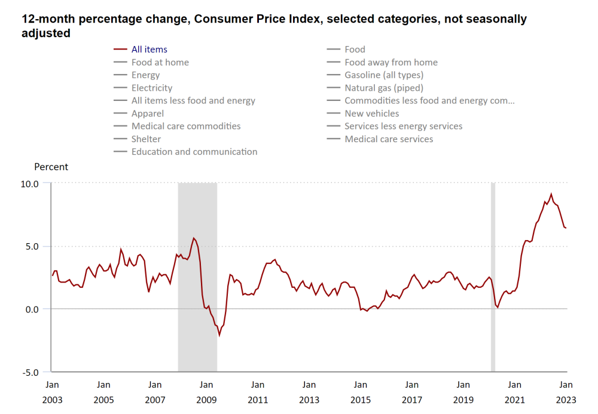
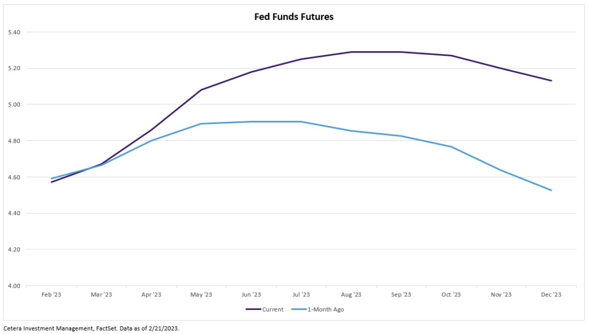
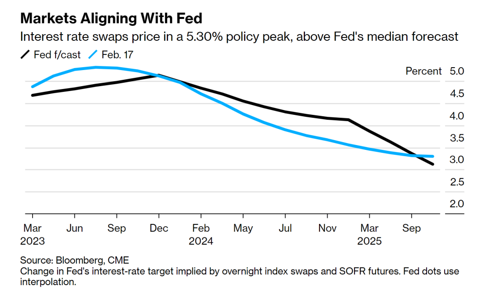

# 潜望观察｜美联储会议纪要透露哪些信号？美股狂飙是否昙花一现

划重点：

  * _1_ 年初这一轮市场狂欢的背后，投资者似乎选择性遗忘了一个事实，那就是：目前仍处在一轮加息周期中，严谨的美联储没有释放任何关于何时停止加息的信号；
  * _2_ 从美联储主席鲍威尔的多次公开表态来看，美联储在收紧货币政策方面将保持坚定，至少对外会在一段时间内保持这样的态度；
  * _3_ 从更为长期的角度看，目前投资者预计美联储可能将终端利率水平一直维持到2023年年底。

腾讯新闻《潜望 》纪振宇 发自硅谷

美股投资者普遍预期，美联储的终端利率将进一步提高，这是2023年2月中下旬，市场当前的普遍共识。

投资者从来都是提前行动的。随着美国通胀情况的持续改善，从去年底开始，投资者对于美联储货币政策决定关注的焦点，就已经从“每一次加息多少”，转为“终端利率会是多少”上来。

美股市场一度出现了过度乐观的情形。2023年开年后，美股开始狂飙突进，一副牛市来了的架势，板块轮转也开始变得显著起来：之前涨势不错的道琼斯工业平均指数开始掉头往下，以成长股为主的纳斯达克指数又开启了暴涨模式，人们仿佛又看到了2020年美联储大放水后的情景：特斯拉再度成为美股市场的王者，短短一个多月的时间，涨幅达到惊人的近70%，Meta，英伟达等也不甘落后，一副报复性上涨的姿态，涨幅也均在50%左右，此外，市值万亿美元规模的苹果、亚马逊等“大象起舞”，涨幅均在20%左右。一度跌落神坛的方舟基金创始人“木头姐”又重新被投资者追捧，她手中重仓的特斯拉、Coin等无疑是开年后市场表现最佳的股票。

然而在这一轮市场狂欢的背后，投资者似乎选择性遗忘了一个事实，那就是：目前仍处在一轮加息周期中，严谨的美联储没有释放任何关于何时停止加息的信号，尽管美联储主席鲍威尔一再强调：按照目前的通胀和经济状况，美联储仍然需要在一段时间里维持目前的货币政策立场，因为从美联储的“双重职责”（Dual
Mandate）出发：维持价格总水平稳定和最大化就业，美联储一直强调要将长期通胀水平压低至2%，并且密切关注就业市场状况。

从通胀情况来看，尽管美国消费价格指数在去年7月份达到9.1%的30年最高水平见顶后持续下行，在2023年1月份已经达到6.4%的水平，但相比2%的美联储目标依然有着不小的差距。

从就业市场来看，2023年1月份美国非农就业数据意外利好，失业率降至1969年以来最低的3.4%的水平，也为美联储提供了进一步收紧货币政策的缓冲空间。

从美联储主席鲍威尔的多次公开表态来看，美联储在收紧货币政策方面将保持坚定，至少对外会在一段时间内保持这样的态度，因为美联储不愿重蹈上世纪70、80年代的覆辙，当时美联储货币政策转向，使得通胀报复性抬头，最终酿成了更为棘手的恶性通胀。鲍威尔在近期也曾多次强调，一定要避免“工资价格螺旋”的风险，因为一旦发现，问题就已经变得严重，通胀就会变成一个最为突出的问题。

但市场就是如此的固执，对美联储的表态充耳不闻。衡量市场恐慌情绪的波动率指数VIX在整个1月份都没有超过23，一度跌至17的历史性低位。

但在进入2月份后，情况悄然起了变化。

2月初，美联储照例进行了联储货币政策会议，不出意外地公布了加息25个基点的决定，将联邦基准利率提升至4.5-4.75%的水平，美联储2月份货币政策会议纪要称，1月份通胀情况相比11月份和12月份持续下降，但依然维持在高位，实际GDP在去年第四季度依然坚实增长。

在综合评估所有已知经济数据的情况下，美联储货币政策委员会认为，目前持续加息对于达成美联储长期政策目标是合适的。

尽管美联储在政策立场上依然没有任何松动的迹象，但美股在联储会议后继续高歌猛进，似乎要延续1月份的行情。

但在进入到2月中旬，市场的上行步伐开始出现犹豫，似乎对于“美联储的终端利率将会更高”这个事实猛然醒悟了一般，2月21日，三大股指均跌超1%，标普指数失守4000点，重新回到1月底的水平。

从以上图表可以直观地看出，美股在2月中下旬的这一轮下跌，完全印证了投资者对于美联储终端利率水平预期的重新调整，在1月份市场最为乐观的情况下，投资者预期美联储最后一次加息的时点是今年6月份，终端利率水平在5%以下，随后利率水平将下行，市场甚至预期在年内美联储将会进行降息。

但仅一个月之后，市场对美联储的货币政策预期出现了很大的调整，预计最后一次加息时点将是今年8月份，终端利率水平也将进一步提高至5.2%以上。

从更为长期的角度看，目前投资者预计美联储可能将终端利率水平一直维持到2023年年底，直到2024年才有降息的可能，到2025年中旬，基准利率水平才有可能重新回到3.5%以下的中枢位置。

所以2月份中下旬以来的美股市场总体下行，可以看作是投资者对于美联储终端利率走向预期重新调整的回补。

随着美联储下一次货币政策会议的临近，市场对于美联储此次加息幅度的共识也越来越一致。根据芝加哥商品交易所的联储利率工具显示，市场预计美联储在3月份加息25个基点至4.75-5.00%基准利率区间的概率已经达到79%。预计加息50个基点的概率为21%。

目前美股短期震荡主要受到对美联储货币政策预期调整的影响，从中长期来看，对于通胀未来的走向及其他经济数据对美联储货币政策的影响，以及经济增长的预期，将成为主导市场走向的主要因素。

