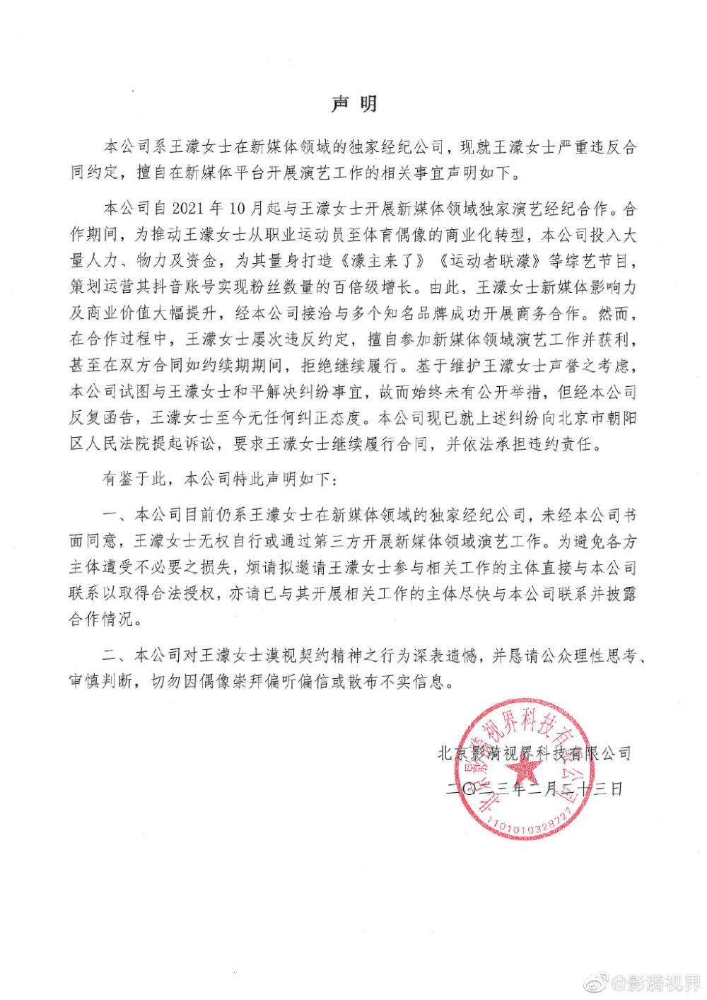
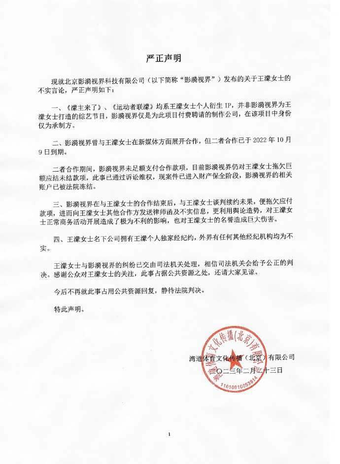

# 热搜第一！王濛正式回应被起诉，态度强硬，短道女王再成全网焦点

北京时间2月23日，短道速滑女王王濛突然冲上热搜第一。原因是，王濛新媒体领域独家经纪公司就王濛违约一事发布声明，声明表示：王濛严重违反合同约定！之后，王濛工作室进行了回应。

根据经纪公司方面的控诉，王濛擅自参加新媒体领域商业活动，且多次催告未有纠正。因此，经纪公司将启动诉讼程序，维护自身合法权益。
为此，网友也是一脸懵。发生了什么？

根据王濛工作室的官方回应，对于指控进行了具体的解释。比如说王濛的一些个人综艺节目，并非经纪公司所打造，而且双方合作在2022年10月9日已到期，并且公司拖欠了王濛巨额的应结未结款项。综合来看，王濛方面对于指控嗤之以鼻，认为对方发送不实信息，利用舆论造势，对于王濛的名誉造成巨大伤害。王濛方面强调，今后不再就此事占用公共资源回复，静待法院判决。

必须承认，退役的王濛，目前在体育圈的影响力还是很大的，她目前有关联的公司达到4家，作为一位综合能力非常出众的运动员，王濛退役后的商业版图也着实不算小，王濛的影响力体现在她即便是离开了赛场，当教练也能红，当解说同样能红，她还上直播、唱歌、参加综艺等等。必须承认，这是一种强大的能力。

去年冬奥会，王濛在解说席上大火，她金句不断，比如说“我的眼睛就是尺”！成为了短道速滑迷观看比赛的一大亮点。与其同时，王濛代言与活动也不少，也开发了相关的综艺节目，但是争议一直伴随着王濛。比如说在运动员时期，王濛就曾因为内讧事件被国家队开除。

王濛就是这样一位啥都敢干，我行我素的人，所以这一次与经纪公司闹了大争议，她本人目前来看丝毫不觉得不占理。最终，具体谁对谁错，需要法律来判定。

