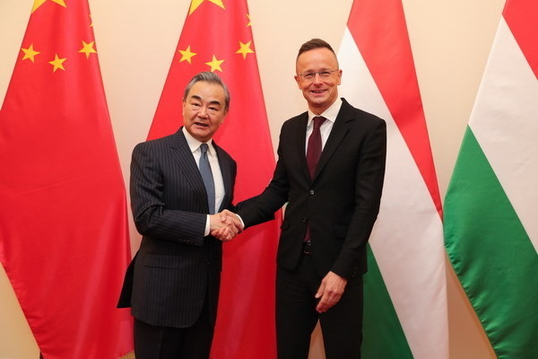
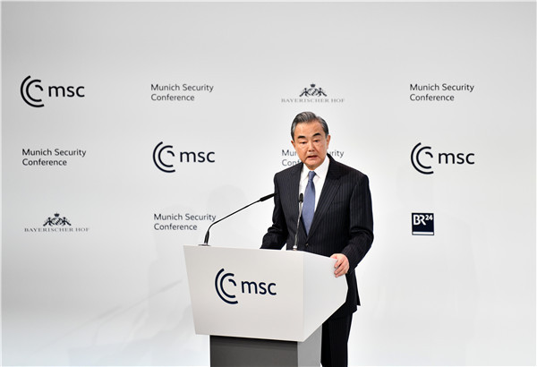

# 王毅一周访欧行，中欧关系中的乌克兰“心结”能否解开？

2月14日至22日，中共中央政治局委员、中央外事工作委员会办公室主任王毅开启了为期逾一周的欧洲之行。这是自去年10月中共二十大召开后，中国最高级别官员出访欧洲。

期间，王毅应邀访问法国、意大利、匈牙利和俄罗斯，并赴德国出席第59届慕尼黑安全会议。就当前重大国际和地区问题，进一步系统阐述中方立场，与欧洲多国政要交换意见。

令外界关注的是，王毅此行时间节点较为特殊，正值去年2月24日爆发的俄乌冲突即将满一周年之际。于欧洲而言，俄乌冲突是涉及地区安全的头等大事，乌克兰问题已在无形中成为影响中欧关系的“心结”之一。对此，王毅访欧期间，在不同场合都多次传递出强烈信号——“这场冲突不应再继续下去了”“中国所做的一切就是劝和促谈”。

谈及近年来中欧关系发展现状，复旦大学欧洲问题研究中心主任、中国欧洲学会副会长丁纯接受澎湃新闻（www.thepaper.cn）采访时称，欧盟2019年对华采取“伙伴、竞争者和制度性对手”的三重定位，再加上台海局势、乌克兰危机、以及所谓的新疆人权等问题，实际上使得中欧关系呈现出明显的“政冷经热”情况。与此同时，欧盟国家内部也存在不同的声音，部分国家意识到，彻底与美国站在一起，对他们并非有利。

“在此情况下，王毅在访问欧洲国家、出席慕安会期间，通过主动对外阐释中方在乌克兰危机等关键问题上的立场，有助于消除外界误解。这种主动展示和出击对于加强双边合作，以及在中欧战略合作伙伴关系20年的背景下重启中欧合作，缓解中欧‘政冷经热’状态起到了积极作用。”丁纯分析道。

**中国对欧盟“全面战略伙伴”定位未变**

在整趟访欧行程中，王毅与欧洲多国政要进行了频密的沟通。尤其是在德国出席慕安会期间，王毅与德国、英国、爱尔兰、荷兰、比利时、奥地利、乌克兰等欧洲多国政要举行会见。

_外交部网站 图_

具体来看，王毅此次主要访问的法国、意大利、匈牙利这三个国家，均是中国在欧盟内的重要合作伙伴，地理上覆盖西欧、南欧、中东欧。考虑到双边关系的特点，中方的访问目标也各有侧重。

首先，法国作为欧洲地区最具影响力的大国之一，中方始终视其为优先合作伙伴，王毅特别强调愿同法方共同探索乌克兰问题解决路径。此外，自去年11月以来，法国方面曾多次透露，该国总统马克龙将要访华的消息。最近的一次是彭博社1月19日报道称马克龙计划访华。值得一提的是，王毅此次访法时也表示，“愿同法方进一步密切高层交往”。

同时，今年是“一带一路”倡议提出十周年，而意大利和匈牙利分别又是首个加入“一带一路”倡议的七国集团国家和首个同中国签署推进“一带一路”合作文件的欧洲国家，王毅在访问两国时均强调了要加强“一带一路”倡议下的合作。

“在中欧关系和欧洲局势比较微妙、复杂的情况下，中方深入一线对这些主要国家进行政策宣介，沟通想法，去寻找共同对话空间，这在外交上是一个非常有意义的出击和展示。”丁纯分析称。

事实上，自去年年底以来，中欧高层便开始了较为频繁的互动。德国总理朔尔茨和欧洲理事会主席米歇尔分别于去年11月、12月初访问中国。此外，国家主席习近平还于去年11月二十国集团峰会期间分别会见法国、荷兰、西班牙、意大利四个欧洲国家领导人。

需要指出的是，尽管2019年欧盟对华提出了“合作、竞争、对手”的三重定位，但中国从未改变对欧盟“伙伴关系”的定位，同时也期待欧盟能够重新考虑对华关系定位。正如王毅在慕安会期间会见欧盟外交与安全政策高级代表博雷利时所指出的，“中欧是伙伴不是对手，共识远大于分歧。今年是中国和欧盟建立全面战略伙伴关系20周年，双方应坚持伙伴关系定位，尊重彼此核心利益，珍惜合作成果。”

**欧洲在乌克兰问题上的“心结”**

自去年2月底俄乌冲突爆发以来，欧洲方面格外关注中国在俄乌冲突中的立场以及中俄关系的紧密程度。对于欧洲而言，乌克兰问题已成为影响中欧双边关系的一个“心结”。临近俄乌冲突一周年之际，王毅此访意在进一步向欧方传递中方立场，以减少误解，为当前的俄乌局势降温。

_外交部网站 图_

在慕安会谈及乌克兰问题时，王毅强调，“这场冲突不应再继续下去了”
“中国所做的一切就是劝和促谈”。在涉及核问题的表态上，中方除了重申核战争打不得也打不赢，还专门提到
“我们也呼吁保障民用核设施安全，反对攻击核电站，我们还将倡导共同反对使用生化武器”。

事实上，在持续一年的俄乌冲突中，曾多次出现核电站遭遇袭击事件，尤其是位于乌克兰的扎波罗热核电站频繁遭袭受到外界关注，该核电站是欧洲最大的核电站之一。乌克兰外长库列巴曾在社交媒体上发文称，如果该核电站因遭遇攻击而发生爆炸，其危害将是切尔诺贝利事故的10倍。

此外，在与法、德这两个最具影响力的欧洲“轴心”国政要会见时，王毅均指出中方“主张尽快停火止战”。他还表示，望德国“为推动局势降温发挥建设性作用”；愿同法国一道探索政治解决路径。

在丁纯看来，中方通过宣介立场，尤其是和法、德、意、荷、匈、乌等国领导人和外交同行会谈，使他们对中方、对世界安全，尤其是俄乌冲突中的相关立场、取向、逻辑和关切点及对华的期许相较以前有了进一步了解和理解。

即便如此，需指出的是，解开欧洲在乌克兰问题上的“心结”仍需进一步努力。近日，在美方开始炒作“中国考虑在俄乌冲突中向俄方提供武器支持”后，博雷利也放话称，若中国向俄援武，那将是（中欧关系）中的一条“红线”。

“对欧洲来讲，头等大事是俄乌战争这一安全问题，不能（让）普京赢和让乌克兰输是政治正确，这就使之严重依赖美国。”谈及博雷利这一表态背后的逻辑，丁纯分析称，美国出于对华遏制战略需要，指责中国可能对俄出口武器，一方面打压和警告中国勿输俄武器，另一方面也以此为由头变相拉拢欧洲，提高向心力，企图恶化中欧关系。

丁纯由此指出，欧洲在安全为要、不得不倚重美国的背景下，对中国不站边欧美及所谓“正义与正确一边”始终怀有一种纠结的心态。

**中欧全面投资协议能否重启？**

长期以来，中国与欧盟互为重要贸易和投资伙伴，双边经贸往来对中欧关系稳定发挥着关键的“压舱石”作用。尽管目前欧洲部分国家在一些关键领域鼓吹对华“脱钩”，但在能源危机、物价上涨、经济衰退的情况下，欧洲很难在非关键领域寻求对华“脱钩”，与中国的经贸合作对稳定和提升下行的欧洲经济意义重大。

欧盟统计局2月15日公布的数据显示，2022年欧中货物贸易总额达8563亿欧元，较2021年增长约23%，创下新高。王毅2月18日会见博雷利时也指出，“中欧经贸关系的本质是优势互补、互利共赢，双方应保持开放合作，拒绝脱钩断链，共同维护全球产供链稳定。”

值得关注的是，就在王毅访问欧洲之前，中国驻欧盟使团团长傅聪大使2月8日在出席欧盟智库欧洲政策中心举办的“60分钟吹风会”时，其有关激活中欧投资协定的表态，被外界视为对欧释放的清晰且积极的信号。2021年5月，中欧由于在涉疆议题引发的相互制裁，致使这份历程7年、35轮谈判的协定遭冻结。

为打破这种“搁置”状态，傅聪呼吁欧盟，“我们应该向前看”。对此，傅聪提出双方同时解除制裁这一办法，同时也对其他提议持开放态度。不仅如此，傅聪还进一步释放友善信号称，“如果你们认为不够好，请提出一些建议，我们愿意进行研究。”

在丁纯看来，中方关于中欧投资协定的表态较为务实，可见是在认真考虑推动双边经贸关系。但目前欧盟内部仍存在不同声音，欧洲理事会以及部分欧盟国家领导人支持推进该协定，但相对独立的欧洲议会则不太可能轻易同意解除制裁。因此，由于政治和技术上的阻碍，短期内中欧同时解除制裁的可能性比较低。

从欧盟领导层角度而言，去年12月，米歇尔在访华期间明确表示：“欧方愿同中方继续推进欧中投资协定的进程，增强供应链稳定互信，深化欧中各领域互利合作。”另据傅聪透露，去年底他与欧委会冯德莱恩主席的办公室主任塞伯特会面时，也曾提到过推进这一协定。

基于此，丁纯提议道，在欧盟并非“一边倒”且中欧双方有意愿推进的情况下，可考虑避开或绕开欧洲议会，局部先推动那些无需审议的经贸投资合作落地。

