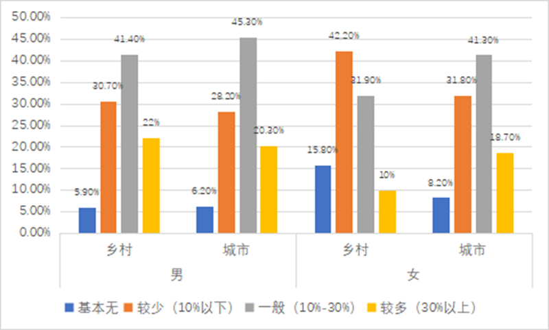
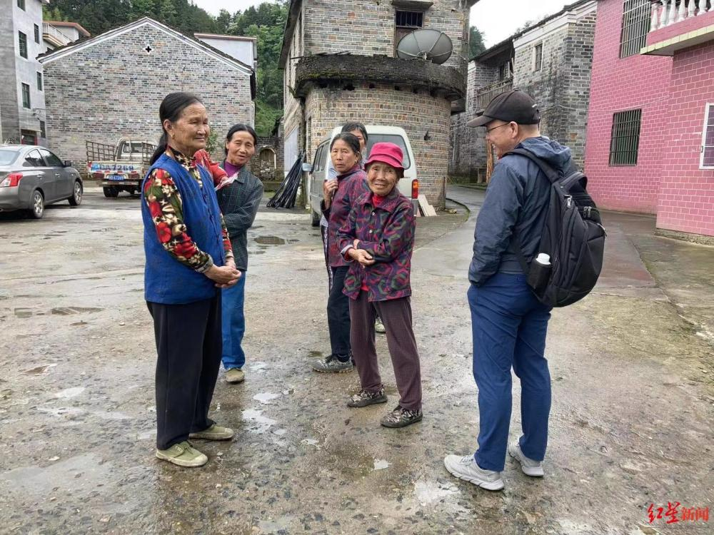
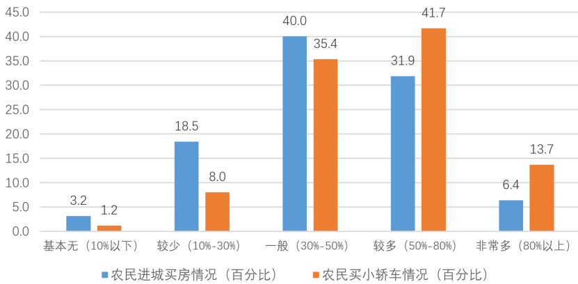
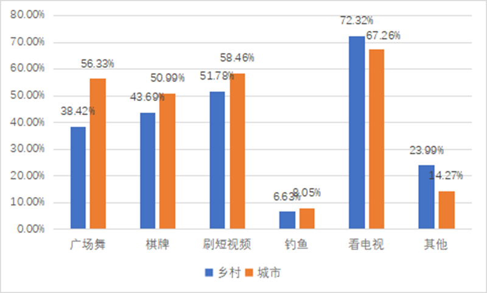

# “近三成农村青年无生育意愿？”上热搜 总报告撰写者：中国农村正在发生“生活革命”

_2月22日，南宁邕宁区蒲庙镇的乡村
据视觉中国_

红星新闻记者｜王震华 发自 湖北武汉

责编｜官莉 编辑｜郭庄

“调查显示近三成农村青年无生育意愿？”“农村老年人养老难在哪？”。2月20日，#微博2023回乡见闻报告#发布，中国乡村生活方式的新变化在网上引发热议。

2023年春节期间，经农业农村部新闻办指导@中国三农发布，新华网、微博联合武汉大学中国乡村治理研究中心、中国社会科学院新闻与传播研究所传媒调查研究中心联合发起“2023回乡见闻”问卷调查。新浪微博统计，活动期间，“2023回乡见闻报告”主话题阅读增量超过15亿，超24万人参与了话题讨论。

作为特约指导学者，武汉大学社会学院教授吕德文参与主导了调查问卷设计，创作了自己的回乡见闻，并撰写了“2023回乡见闻”的结案报告《中国农村的生活革命——2023回乡见闻中的乡村图景》。

吕德文认为，数据显示，中国农村正在发生一场生活革命。城乡人民具备了美好生活的物质基础，新生活方式正在形成，但生活危机也在蔓延。

**—— ——**

**城市生活方式正在冲击每一个乡村**

红星新闻：此次报告提出一个判断，在中国乡村，单身情况值得关注。

吕德文：无论是问卷数据，还是网友的博文反映，以及我们的田野调查，多方数据都显示，无论是男性，还是女性，30岁以上的大龄未婚青年都非常普遍。问卷数据分析结果显示，反映未婚男性青年数量占比10%以上的，城市和农村的占比都高达65%左右；而反映未婚女性青年数量占比10%以上的，城市远高于农村。

根据2023回乡见闻报告的问卷结果，无生育意愿的农村青年比例已经高达27.72%，比2021年宁波地区的数据翻了一倍有余，有一胎意愿的占比为38.04%，有二胎意愿的占比为32.49%，有三胎及以上意愿的占比为1.75%。

_城乡单身青年的情况分布
据新华网_

红星新闻：我们应该怎样看待这种变化和现象？

吕德文：我们应该注意到这样一个事实，中国社会经过改革开放这么多年的发展，今天的整个生活方式的变革是一个连锁性的。在这个连锁反应里面，农村年轻人已经习得了城市生活方式。90后、00后这一批年轻人，无论生活在城市里，还是农村里，在生活方式上已经没有本质差别。

在过去，彩礼是年轻人成家立业的一种保障。从社会学角度来看，彩礼本质就是财产的代际转移。通过彩礼和嫁妆，财产从上一辈人转移到下一辈人。有的地方，男方承担的这种财产代际转移的责任要多一些，所以一般彩礼要比嫁妆多。

最大的成本就是他要进城，要有一套房，为了在城市里面让小孩接受比较好的教育。都市化的生活方式在逐渐地取代过去的乡土生活方式。这个过程里面，他生活的成本提高了，但年轻人一般在20岁左右，没有太多的能力，这个压力在他的父母，四五十岁的中年人身上，所以彩礼，本质上是因为这一辈的父母要为子女进城过上都市化的生活方式，所提供的一种财产的提前代际转移。

红星新闻：跟城市社会一样，农村也出现了一些恐婚、恐育群体。

吕德文：我们统计的那个数据相对专业机构来讲不一定是最准确的。但客观上来讲，这个数据肯定是比较高的，而且基本上每年都在攀升。

我们谈乡村青年的单身情况，观念的变化很重要。过去大家把“单身”当成一个异常，所以父母使劲砸高价彩礼，也要给儿子娶媳妇。但是今天我们看到很多地方，观念已经妥协了，觉得单身也不是个事。我们在观念里面接受了，重要的是，社会应该给他们提供更好的符合“单身”的一系列配套。

红星新闻：有一种说法：农村光棍多，城市剩女多。

吕德文：城市的剩女和农村的光棍是两个逻辑。光棍是想娶媳妇，但条件有限。剩女是不愿意降低自己的生活水准去将就找另一半。光棍和剩女，这两个群体交汇在一起，就成了非常庞大的一个单身群体和现象。

_吕德文教授在农村调研（右一）
受访者供图_

**—— ——**

**“超龄农民工”和“自养秩序”的形成**

红星新闻：你用“生活革命”来形容这种变化。

吕德文：我讲“生活革命”，它是一个中性的。其实就是生活方式的都市化，乡村也要过上都市生活。但是都市化的生活它需要有成本支撑的。因为以前的乡土生活，某种意义上它是自给自足的经济。这种变化对于农村来说是一种生活方式的危机。

我讲的中国农村正在发生的“生活革命”，本质上指的是生活方式的革命：一个人，在他不愁吃不愁穿以后，他的整个行为逻辑都会发生非常大的变化，比如我的父辈，他们当时的整个行为逻辑就很简单，要生存，要把小孩给养大，这是第一目标。在满足第一目标的基础上，才能有更多更高的追求。

_受访农民进城买房和买车占比
据新华网_

红星新闻：比如老人的养老问题。

吕德文：中国历来的养老模式，它是一个反馈模式。儿女由父母抚养，父母老了以后，子女反馈给父母，它是一个双向的平衡。但是这个模式在第一代农民工身上出现了断裂。对第一代农民工来讲，他没有条件来照看老人，心有余力不足，因为他有限的打工收入，要为儿子进城买房、买车、娶媳妇做准备。他反馈给上一代的就比较有限。

红星新闻：你一直在关注超龄农民工的权益维护问题。

吕德文：只要政府有足够的经济实力，它会给所有的老人同样的保障。其实我们下一代的农民工基本上都是按这么做的，因为现在打工，都交社保，这是城乡一体。所以下一代人基本上就不存在这个问题。

另外，看待这个问题，要站在一般农民工的内部视角。我跟很多农民工打交道，包括我的岳父，他也是第一代农民工。从他们的角度来看，觉得能够赚一些钱，然后回家去养老，是非常幸福的一件事。因为农村是他从小生活的地方，那个地方有房、有地、有车，他还有人际关系在里面。客观上来讲，他的养老质量并不低。所以，能够给他就业机会就非常重要，要畅通灵活就业的机会。

红星新闻：你的判断是在乡村社会，老人自养秩序正在形成。

吕德文：我觉得最关键的一点是他们对家庭养老、对子女的赡养没有期待，自己解决自己的问题。过去，农村的养老主要依靠家庭养老，但现在有社保。

“自养”的核心观念是一不靠子女，二不靠国家，靠自己，我觉得今天农村的老人确实在形成这么一个秩序，一方面我们国家的社会保障水平提高了，同时他自己也会做一些充分的养老准备。

随着城乡一体化的形成，年轻人生活在县城而老年人在村子里面养老，这个时空距离已经不是个问题了，它可以实现这种相互的照应。

红星新闻：您觉得，我们的基层治理应该如何应对中国乡村正在发生的“生活革命”？

吕德文：我这段时间也在考虑这个问题，中国社会今天已经建立了一个比较成熟的基层治理体。

这个体系最应该做什么？我觉得最应该做的就是安置老百姓的生活，用我的词来讲就叫“生活的治理”，这应该是乡村治理的一个非常重要的转向。未来，乡村作为老年农民工退养的地方，它需要基层组织去帮他，去服务好他，比如建立互助养老，老年人活动中心等。

**—— ——**

**城乡一体化起码在硬件上已经实现了**

红星新闻：您认为此次产生的这些热议话题，以及调查问卷产生的一些统计数据，是否可以勾勒出当下中国乡村的生活面貌？

吕德文：“回乡见闻”这种形式我做了十几年，包括我们武汉大学中国乡村治理研究中心的老师、学生团队每年都会做“回乡见闻”，我们把它作为学术训练的一部分，我们团队的成员也分布在全国各地。但这次活动提供的信息量足够大，很多普通人也参与进来，十万多份的问卷，基本上全国各地的变化，我们都看得到，中国社会正在发生巨变。

_城乡老年人娱乐休闲方式 据新华网_

红星新闻：从这个角度来讲，回乡见闻所描绘出来的乡村中国图景，某种意义上超越了一些俯视的研究视角？

吕德文：你说得很对。我平常的调研，就是全国各地跑，我几乎每年都要回家乡。一个好的研究或者说观察，亲身体验是其他代替不了的。

作为改革开放的同龄人，我在家乡40多年的变迁当中感同身受，它作为中国农村变化的一个缩影，从一个封闭的，落后的，物质还比较贫乏的社会，进入今天这么一个丰裕的社会。从社会变迁的角度来讲，这是人类历史上的一个巨变，从农业社会进入工业社会，从乡土社会进入城市社会。

红星新闻：这种乡村生活的真切体验，会影响到你的观察和研究吗？

吕德文：家乡能够提供超越我们科学范式的东西，亲身参与的东西，会在看待很多社会问题的时候，有一种同理心。

比如，我的家乡是客家人聚集区，会有一些重男轻女。我有兄弟姐妹五个，我是老四。我大姐小学毕业就出来打工，要帮家里分担，姐姐要给弟弟“让位”。在那个时候养儿防老就很正常，他整个家庭拥有社会资源就这么多。

红星新闻：以往“回乡见闻”里面更多带有一些“乡愁”，现在这种情绪好像少多了。

吕德文：这次“回乡见闻”里面，大家写出来的东西很朴实，没有更多修饰，包括学术语言的修辞，也没有很悲情的情感。前些年的回乡记里，有悲情的东西，就是那种“乡愁体”，带有城市知识分子的情感投射在里面。

但今天的社会，包括写“回乡见闻”的那些人，他们所面对的世界，城市和乡村本身就连接在一起了：汽车多了，路好了，基础设施好了，房子漂亮了，还有不少人进城买房了，农村上网也方便了，接触信息和城市没什么区别。它说明城乡一体化起码在硬件上已经实现了。

另外一个原因是，今天“回乡见闻”的写作者主要是90后、00后，他们对乡土本身，不像我们70后、80后有非常完整的体验。我有一个判断，80后是最后一个有完整村落生活的一代人，90后就没有了，因为90后的父母外出打工了，他体验到那种乡土社会都是不完整的。他们对乡村生活的走向或者它的流逝，不会产生很大的心理上的共鸣。

**吕德文简介**

吕德文，1981年生，福建武平人，武汉大学社会学院教授，中国乡村治理研究中心研究员，博士生导师。长期从事田野调查工作，专注基层治理研究，出版《基层中国：国家治理的基石》《大国底色：巨变时代的基层治理》《治大国若烹小鲜：基层治理与世道人心》《国家基石：基层社会治理图景与乡村振兴》等著作。

—— END——

