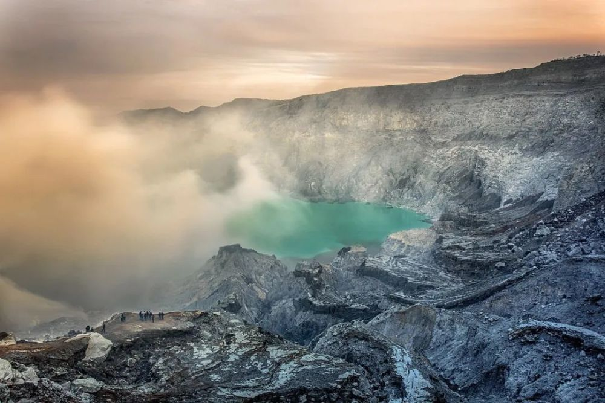

# 又发7.2级地震！全球地震频发，地球进入“震动模式”了吗？

**文/赵斌**

土耳其接连两次7级以上地震后，2月23日8时37分，在塔吉克斯坦（北纬37.98度，东经73.29度）发生7.2级地震，震源深度10公里；19时24分在塔吉克斯坦又发生4.5级地震。

随着近期关于地震的报道一次次在网络刷屏，“地球进入震动模式”的说法迅速蹿红。地球进入活跃期了吗？地震背后的真相是什么？

地球进入“震动模式”？

“单独看2023年以来这近两个月时间，的确地震有点多。但难以根据如此短时期的地震活动现象就断定地球进入活跃期。每次有大地震发生，‘地球进入震动模式’热词就会出现。”
**中国地震局地球物理研究所特聘专家高孟潭** 在接受中新社国是直通车采访时表示。

高孟潭认为，近100年来，可以完整观测全球大地震数据。 **全球平均每年发生7级以上地震12至14次左右（2022年共计发生11次）**
，8级以上地震1到2次左右。每年大地震发生次数都有一定变化，但只是围绕平均值的小的波动。近年来的地震数据，大地震的活动频度都是如此。今年的地震活动水平还有待于进一步观察。

据相关数据显示，2020年全球发生了89次6级以上地震，10次7级以上地震，没有8级以上地震；

2021年全球发生了115次6级以上地震，19次7级以上地震，1次8级以上地震。

高孟潭说， **2022年地震主要分布环太平洋地震带海域部分，并不是人群聚集的地方，也没有带来太多灾害，所以没有引起多少关注。**
2023年这2个月，发生在印尼西部、土耳其以及塔吉克斯坦刚刚发生的超过7级的地震都位于欧亚地震带。这些区域房屋建筑对大地震抵抗能力较差，引起了灾难性后果，所以更引发关注。

据资料显示，地震又称地动、地振动，是地壳快速释放能量过程中造成的振动，其间会产生地震波的一种自然现象。地球上板块与板块之间相互挤压碰撞，造成板块边沿及板块内部产生错动和破裂，是引起地震的主要原因。

高孟潭表示，地球内部运动与地壳板块运动导致板块内部变形和应力积累是产生地震的主要原因。对其孕育发生过程的研究，不仅涉及物理学，还涉及化学、地球内部观测、探测等多个学科，是个庞大而复杂的体系。

他进一步称，多学科的地震观测包括地震活动、地壳形变、重力、地磁、地电、地下水化学、地下水位等学科的观测台网等，而且需要大地震发生前对大地震孕育发生的详细观测研究。

地震预测到底准不准？

全世界对地震研究多年，那地震预测准确率有多高？世界上哪些国家预测的最准？

“美国、日本等国家对地震的研究相对深入，中国目前与这些国家基本都处在同一水平线上。”

高孟潭认为，地震分为长期预测和短期预测。长期预测是根据地震构造和历史地震资料进行综合分析与判断，预测不同区域50年甚至100年地震危险性；短期预测是指3个月内将要发生地震的时间、地点、震级的预测。前者用于土地利用规划和房屋建筑抗震设计，后者用于地震灾害应急备灾。

中国地震监测预报可基本上分3个阶段：第一个阶段针对国家建设需要，开展以烈度区划和烈度评定为中心的研究工作；第二个阶段则以探索地震预报为中心，开展了大量的基础研究与现场实践；第三个阶段全面系统地总结分析预报实践经验与教训，深入研究地震孕育条件与过程，努力将地震预报向减轻地震灾害的实用化方向发展。

据了解，目前在世界上关于地震的国际性组织以及各个国家对于地震都有长期预测的规划，预测上出现较大偏差的概率并不高，而短期预测的可预知性以及准确率都有待提升。

高孟潭说，因为地球内部的构造运动的复杂性和观测手段的局限性，判定岩体改变什么程度、什么时候发生断裂、震级规模会多大等都很困难。这些影响地震发生的关键因素都在距地表十几公里甚至更深的地方。国际上目前的观测技术很难实现直接的观测与研究，只是通过地表的观测推断还有相关的数据分析来进行预测。随着人类对于地球内部的观测能力和相应数据分析能力的提升，相信地震预测水平会逐步提升。

应对地震最好的办法是什么？

地震到底在哪天会来，对人类而言还是普遍存在着不确定性，我们如何在难以完全预知的灾难面前把损失与伤害降到最低？

广东省应急管理厅矿山安全监管和地震地质灾害救援处处长罗峥曾在接受媒体采访时，建议大家主要从4个方面准备生活物资：

——饮用水食品，包括儿童奶粉等；

——应急物品：用于求救的救生哨、用于个人清洁的毛巾、纸巾、具备收音功能的手摇充电电筒等；

——应急工具：保温毯防火毯、多功能组合剪刀、应急逃生绳、呼吸面罩等；

——应急药物：抗感染、感冒、腹泻药，创可贴、纱布绷带等用于包扎的材料，用于消毒的碘伏棉棒等。

并且，还要留意这些物资的保质期并及时更换。

发生地震后，遇险人员是否能在第一时间采取有效地避险行动，也是减少损害影响的关键。同时，还需要掌握必要的灾害自救互救技能。

高孟潭认为，防御是应对地震灾害的关键。在城市规划布局以及房屋建筑建设进行设计时，要充分考虑中国主要地震带分布以及相关地域的地震危险性，依据国家地震区划图规定的地震动参数，进行严格设计和施工，切实做到“小震不坏、中震可修、大震不倒”，即使地震来了也不会造成大的人员伤亡。实际上，严格按新的抗震标准设计施工的房屋建筑的抗倒塌能力已经有了很大的提升。

2022年，应急管理部和中国地震局联合印发了《“十四五”国家防震减灾规划》。

到2025年，初步形成防震减灾事业现代化体系，体制机制逐步完善，地震监测预报预警、地震灾害风险防治、地震应急响应服务能力显著提高，地震科技水平进入国际先进行列，地震预报预警取得新突破，地震灾害防御水平明显增强，防震减灾公共服务体系基本建成，社会公众防震减灾素质进一步提高，大震巨灾风险防范能力不断提升，保障国家经济社会发展和人民群众生命财产安全更加有力。

到2035年，基本实现防震减灾事业现代化，基本建成具有中国特色的防震减灾事业现代化体系，关键领域核心技术实现重点突破，基本实现防治精细、监测智能、服务高效、科技先进、管理科学的现代智慧防震减灾。

来自：国是直通车

编辑：陈昊星

责编：魏晞

