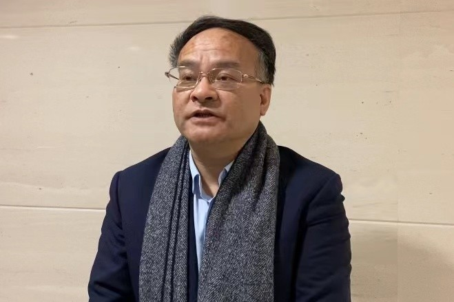

# 大学生越来越求稳了？全国政协委员倪闽景：不要满脑子“央国政”

_全国政协委员、上海市教委副主任倪闽景。
澎湃新闻记者 陈悦 图_

聚焦青少年科创教育发展和拔尖人才培养，全国政协委员、上海市教委副主任倪闽景将在今年全国两会上提交两份提案。

2月23日下午，倪闽景在接受媒体集中采访时，讲述了提案内容，并就就业、考公、职业教育和ChatGPT等热门话题分享了观点。

**问：您今年打算提交什么提案？**

**倪闽景：**
一是聚焦青少年科创教育高质量发展。科创教育是童子功，孩子们需要更多动手动脑的实践机会，学校的科学课程要更加贴近生活、跟上时代的步伐。我希望科技场馆能够免费对孩子们开放，科学家能够走近孩子们，孩子们能够走进大学、走到实验室、走到科研机构，甚至是到高科技企业，体验科技的发展。让孩子们从小养成对科技的热爱和好奇心，再通过系统的培养，成为能够引领整个国家科技发展的人才。

二是拔尖人才培养。我有个观点，只要是个正常的孩子，人人可以成为拔尖人才，关键问题是我们怎么给他土壤。这个孩子可能有特殊的表现、突出的爱好，可能会偏科，在关键阶段我们能不能给他帮助。培养方式上，过去喜欢把智商超常的儿童挑选出来，集聚在一起专门培养，这个方法被证明是错的，我们不能再走这条路了。拔尖人才培养一定是各种各样的人才在一起培养，独狼式创新不再适应现代社会需要。

对于博士生，特别是科技方面的博士生，我觉得应该给予更多的关心和支持。现在博士生一个月补贴大概3000元，我希望至少能提高到1万元，这样全中国超50万名全日制博士生大概需投入超50亿元，但这是值得的。如果拿不出这么多钱，能不能对从事科创研究的博士生优先支持，这会导向更多的孩子从事科创学习和发展。

**问：高校毕业生就业是大家每年关注的重点，今年的就业怎么落实？**

**倪闽景：** 高校毕业生已经成为我国新增劳动力的主要来源。去年全国需要就业的城镇新增劳动力约1600万人，其中高校毕业生规模达1076万人。

现在，一方面高校毕业生不断增多，一方面经济调整、国际社会动荡，对就业产生了负面影响。但我还是有信心的，疫情以后，今年经济大概率会恢复发展；这几年高校专业设置也在及时调整，跟不上时代发展的专业在减少招生，甚至取消。

从现在的大学生就业来看，不是岗位问题，而是结构性问题。我们需要的岗位没有对应的专业或者人很少，而有些专业在社会上已经过剩，接下来各个高校的培养方向需要做大幅度的调整。

**问：面对就业压力，考公和考事业单位非常热门，有人说大学生越来越求稳了，您怎么看？**

**倪闽景：**
现在，不仅仅大学生求稳，中学生都求稳。前段时间我看到一个初三学生、一个高一学生，问他们人生目标，就是稳稳地拥有生活。社会变化太快了，很多人都想稳一点，有更多安全感，这是一个社会问题，不仅仅是大学毕业生的问题。

可能需要一段过程，大家慢慢就会适应快速变化的世界，而不是停留在几十年以前。我们会在意工资怎么老不变，但是对于工作环境、技术发展，我们往往有惰性。

所以，一方面要提高大学生的就业适应能力，另一方面要鼓励大学生，不要满脑子“央国政”（央企、国企、公务员），也要想到我们现在有广阔市场，你去做一个有价值的小的科创企业，将来可能成为独角兽，既对社会做贡献，也会给自己带来非常美好的有挑战的人生。

做公务员，进入以后一眼看到了头；但在科创企业里，（前途）是看不到头的，很难想象的。我们鼓励大学生做各种各样的尝试，不要觉得社会变化很快就求稳，正因为社会变化快，大学生的机会才多。

**问：加强职业教育的呼声喊了多年，职校仍是很多家长不情愿的选择。您怎么看待职业院校未来的发展？**

**倪闽景：**
很多家长不愿意把孩子送到职校去读书，是因为制度设计中存在一些瑕疵。孩子往往是高中考不上，然后进入职业学校，给孩子的感受是“我是失败者”，给家长的感受是“我觉得没有面子”。

实际上，从就业来看，高职毕业生的就业率远比本科就业率高，收入也高。本科所学，进入单位可能用不上，将来机器都可以替代一般的白领工作，而有一技之长的人是很难替代的。

斯坦福大学等学术性大学喊出了“技能第一，知识第二”，他们的观念就是知识是共享的，技能是私有的，技能是有限的，知识是无限的。在这个层面，职业技能会越来越得到重视，现在实际上已经开始发生改变了。

实际上所有的教育都是职业教育，这需要全社会的理解。让从事职业学习的孩子觉得骄傲，收获好的待遇，我觉得社会的发展正在往这个方向走。

**问：ChatGPT出来后，可能会对高校教育产生冲击，您有什么建议和看法？**

**倪闽景：**
学校教育可能会有一段时间的不适应，比如学生会利用ChatGPT直接寻找答案，写论文或对论文进行润色，有学生已经在做了。我们的教育有一套惯性，新的东西出来后，短时间会手忙脚乱的，我认为可以理解，甚至有的学校会短时间屏蔽ChatGPT在校内的应用。

但是我认为，一个新技术出来，一定是新的、好的学习工具，在新的层面带来更高层次的学习内容和新的思维能力的构建。以往所有的新技术发展都导致这么一个结果。

大家还是要敞开胸怀来拥抱新技术、研究新技术，用新技术促进教育，这才是我们应该选择的道路。

