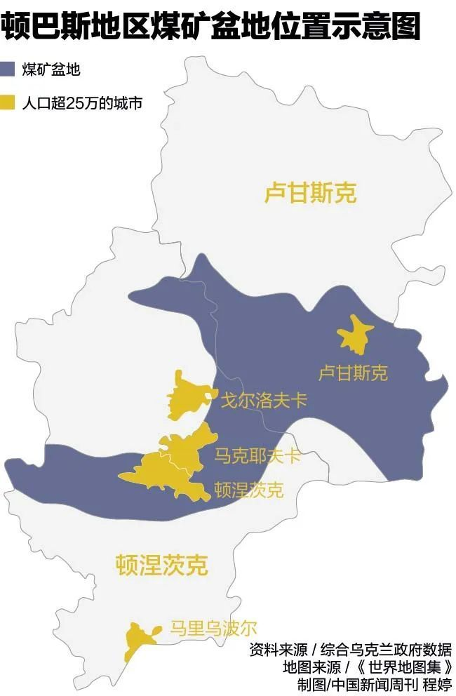
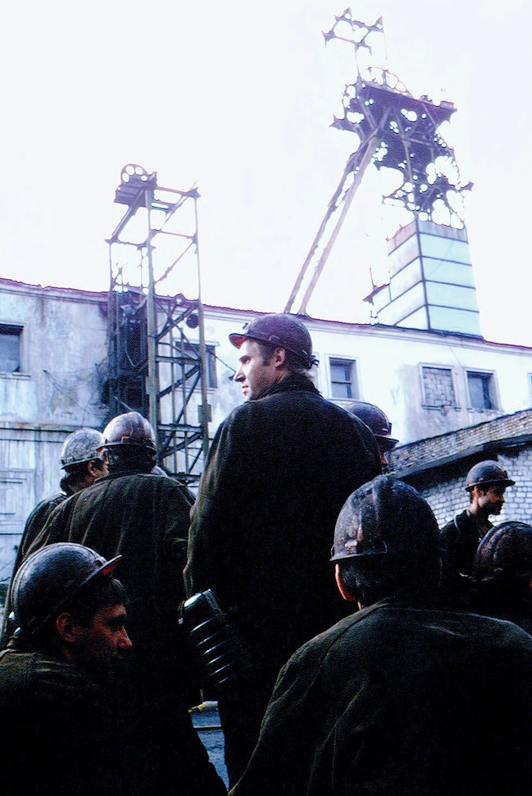
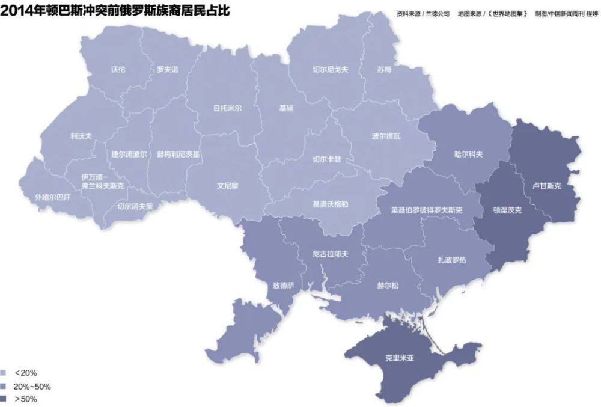
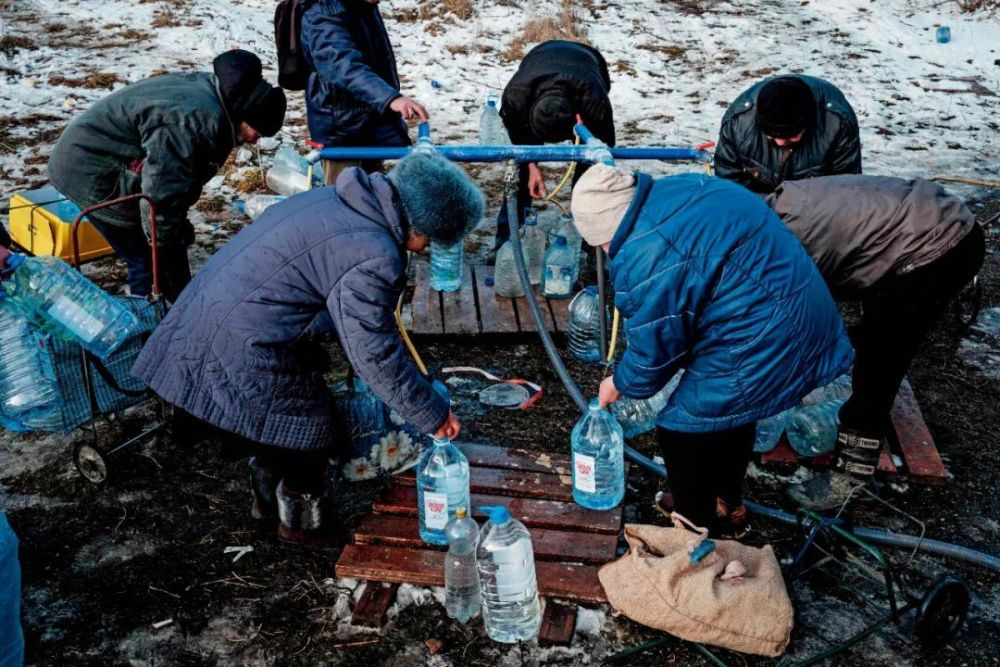

# 打打杀杀、来来去去，顿巴斯从未屈服

在乌克兰顿巴斯地区最大城市顿涅茨克市的街头，普希金大街众多的长椅扶手上，刻有一种形态奇特的怪兽雕饰，它长着比身体更长的、弯曲繁复的角，像狮子一样充满力量感的前爪，以及一对张开的大大的翅翼。在剧院广场中心的大型石雕上也有这种怪兽的身影，它们似狮似鹰，看起来强大、尊贵又危险，这就是传说中的神兽“格里芬”。

21世纪以来，越来越多的“格里芬”出现在顿涅茨克的市政设计中。“格里芬”是游牧民族斯基泰人的原始信仰，早在乌克兰出现在世界地图上之前，这些斯基泰人就自由地驰骋在草原之上，横跨欧亚大陆。1971年，苏联考古队在顿涅茨克矿区发现了一处公元前4世纪的贵族墓葬，其中出土了大量拥有“格里芬”纹饰的精美陪葬品。顿巴斯的主政者们认为，这意味着顿巴斯地区拥有独立于乌克兰的早期文明，这里和乌克兰“不一样”。

顿巴斯的确是特殊的。对2022年2月以来这场迅速波及乌克兰全境的大规模冲突，乌克兰官方叙事称这是一场俄罗斯总统普京为地缘利益挑起的政治冲突，俄罗斯和顿巴斯的叙事则强调族群矛盾和分离诉求。这两种叙事几乎可以照搬于后苏联时代的所有民族区域冲突中。

但生于苏联的卡耐基和平基金会高级研究员安娜·奥罕扬仔细研究过这些不同的冲突后认为，顿巴斯“和它们都不一样”。哈佛大学乌克兰研究所研究员黑宫博明也认同这点，这位西方世界撰写顿巴斯历史专著最多的学者说，顿巴斯“从未真正忠于任何政府或意识形态”。

苏联时期的一句顿巴斯谚语或许早已预示了这一地区的命运：“没有人能迫使顿巴斯屈服。”

_1月18日，顿涅茨克地区一座战火中损毁的教堂。图/视觉中国_

“英雄”

顿巴斯的故事起于蛮荒。斯基泰人的时代，这里是荒原。两千年后的中世纪，这里还是荒原。当时的莫斯科和基辅政权默契地不去触碰这片留给游牧民族的野地。哥萨克部落来来去去、打打杀杀，17世纪末才建立起第一个定居点，即2023年1月被俄军攻占的盐池小镇索莱达尔。半个多世纪后，不断扩张的沙俄帝国吞并了这里，发现了海量的煤矿。“顿巴斯”就此出现：这是“顿涅茨克煤矿盆地”的简称。

暗无天日的矿井工作与迅速工业化带来的财富浪潮，让顿巴斯成为冒险家的乐园。到1884年，一些主要城镇的本地居民只占总人口的11％。从乌克兰西部和俄罗斯流浪来的无家可归者先行抵达，淘金的乌克兰人、俄罗斯人、希腊人、德国人、鞑靼人、瑞典人、罗马尼亚人接踵而至。威尔士人约翰·休斯建立起采矿村尤兹夫卡，苏格兰人加斯科因建立了另一个居民点。两个村镇后来有新名字：顿涅茨克市和卢甘斯克市。

季节性工人是辗转来到顿巴斯的又一波移民。他们被沙俄帝国视为不安分的流动暴徒，在矿坑中传唱着监狱歌谣，没人知道第二天下井后能否活着回到地上。狂欢的夜间活动让乌克兰其他地区传开了“顿巴斯人好喝酒”和“顿巴斯人爱盗窃”的说法。百年之后，乌克兰社会学家Oksana
Mikheeva研究这些传闻，发现当年的顿巴斯工人不把“从国家那儿偷东西”视为犯罪，而是认为这属于“物归原主”。如今，人们只能从沙俄帝国残缺的处决档案中看到一小部分偷窃者的名字，他们是顿巴斯的第一代“英雄”。

注意到这些“工人暴徒”的不只是沙俄政府。来自扎波罗热州的钢铁工人马赫诺将顿巴斯变为无政府主义军事运动的中心。1917年到1921年的苏俄内战期间，叶卡捷琳诺斯拉夫省——包括今天的顿巴斯及扎波罗热州、第聂伯罗彼得罗夫斯克州一部分——战争不曾止息。形形色色的白军（反革命武装）分支，互相争斗不休的乌克兰民族主义者，都未能在此立足。

研究者常用“最原始”和“最底层”形容那场内战。基辅政权“乌克兰人民共和国”收复东境时主动止步于顿涅茨克边界；红军领导人托洛茨基用他标志性的双关语说“不戴防毒面具就不能去顿巴斯”，因为那儿有漫天煤渣，更因为那儿的斗争环境“有毒”。顿巴斯战士白天在一线冲锋，晚上和农民一起喝酒。他们野蛮而顽强，不相信爱国主义或法律秩序，只信仰矮小的“马赫诺老爹”——他们的第二代“英雄”，而“老爹”和来自莫斯科的红军三次联手、又三次开战，今天是“红军的一部分”，明天就是“马赫诺匪帮”。

但顿涅茨克“独立”后建立的苏维埃共和国只维系了1个月的寿命，列宁很快就将顿巴斯并入乌克兰，这个决定后来被俄罗斯总统普京反复提及和批评。

斯大林塑造了顿巴斯的新一代“英雄”：在工业生产中创下新纪录的工人、女拖拉机手，以及法捷耶夫笔下的“青年近卫军”。顿巴斯的城镇以他们的名字命名，直到2016年，在一场大规模改名运动中，乌克兰政府将这些由“苏联英雄”命名的城市恢复为乌克兰原地名。

苏联时代，顿巴斯的煤炭总产量和无烟煤、炼焦煤产量一直居全国首位，冶金、电力、化工、机械制造和军工业聚集，成为工业中心。然而，当地犯罪率同样稳居全国前列。解密档案显示，模范工人和前人没什么区别：干劲十足，酗酒成瘾，热爱有关监狱和犯罪的笑话。乌克兰独立后，来自顿巴斯的总统亚努科维奇在公开演讲中说出“偷车贼”的俚语时，只有出生在顿涅茨克州的人明白他的意思，因为“对这些盗窃俚语的普及几乎是苏联时期顿巴斯学校教育的一部分”。

新“流氓文化”是行政当局自己塑造的。1939年10月，时任乌克兰党委第一书记赫鲁晓夫签署命令，将波兰、乌克兰边境地区的1万名“对苏维埃不信任”的失业居民迁徙到顿巴斯地区做工。相似的新移民还有被苏联军队从波兰迁移来的波兰人、第二次世界大战后无法逃亡西方的乌克兰民族主义者、认为顿巴斯“比苏联其他地方自由”的犹太人。一份内务部文件写道：“雕塑家、作家、律师等都要派往矿山，他们只能作为体力劳动者使用。”

亚努科维奇就是典型的苏联时期顿巴斯人：母亲是俄罗斯人，父亲是立陶宛波兰人和白俄罗斯人的后代。1967年，17岁的亚努科维奇因参与抢劫被判处三年徒刑，随后又因为参与群殴事件二次入狱。后来他说这叫“青年时代的错”。

“顿巴斯是古拉格，是问题儿童，是集纳不受欢迎者的垃圾场。”黑宫博明如此总结。到上世纪80年代，顿巴斯成为苏联独立工会运动的策源地，“反苏”诗歌的传唱地，甚至是乌克兰新一轮民族主义运动的密谋处。有来自苏联的学者形容道，这里“似乎是一个磁场”，将各色弃儿、流氓、暴徒和英雄聚集在一起，被这些人所塑造，又反过来塑造了生长于此的每一个人。推动解体时，每一个人都成为“英雄”，这是第四代。

1991年1月，当风雨飘摇中的苏联政府停发对煤炭产业的国家补贴，“问题儿童”们用持续一年的罢工彻底发泄了被压抑的怒火，直到12月苏联解体。当年的公投中，近84％的顿巴斯地区投票者支持乌克兰从苏联独立。不过，一位来自基辅的干部也提醒道，这些人虽然骂着莫斯科，但“对乌克兰民族也毫无感觉”。历代苏联领导人都试图驯服顿巴斯，但结果显然是失败了。

乌克兰独立前夜的“糖果革命”，是这段流氓与英雄交织的史诗的最好收尾：顿涅茨克州第二大城市马里乌波尔，百货公司没有如期向市民出售糖果。人们在排队数小时后失去耐心。在市政府明确表示“今天不会有糖”后，民众走上连接乌克兰东南部最繁忙的两条高速公路，设置路障，封锁了交通，然后在街上喝酒唱歌。

神话

从马里乌波尔到北顿涅茨克，2022年的战火中，顿巴斯人引以为傲的大型工厂，作为军事工事完成了它们最后的谢幕。不过，对任何一方来说，谈论工厂被毁的“经济损失”都显得矫情：过去数十年，这里的工业逐步“退场”。因此，2014年内战之后，双方军队都毫不犹豫地接管废弃的钢筋混凝土建筑，将之改造为军事据点。

乌克兰独立后的最初十年，国内生产总值下挫达60％，但顿巴斯的工业危机远早于此。衰退的起点是上世纪70年代末，那是煤炭产量的历史巅峰。此后，随着戈尔巴乔夫改革计划经济，国营矿山陆续倒闭，工厂停工，上下游产业链次第崩溃。到1990年前后，顿巴斯地区的适龄劳动人口就业率已跌至66％以下。

当黑宫博明在21世纪重返顿巴斯，他听到一些基辅政策界人士提出：没有顿巴斯，乌克兰会不会更好？因为如果算一笔“经济账”：顿巴斯对乌克兰年国内生产总值（GDP）的贡献度，从苏联时期的30％到40％，一路跌至2013年的18％。与此同时，基辅政权为该地区承担的财政支出却越来越多。

在顿巴斯，“谁养活谁”的故事却截然相反。“过去的神话是：乌克兰养活了整个苏联。但我们知道那不是真的。今天的神话是：顿巴斯养活了乌克兰。”2014年，顿涅茨克州州长谢尔盖·塔鲁塔如此描述他治下民众的优越感，“真的，如果有人要问，我想可能每一个顿巴斯居民都会说自己养活了整个乌克兰。但如果查看统计数据，就会发现顿涅茨克州其实是受补贴的地区。”

当已成为顿涅茨克州州长的亚努科维奇及其后继者一遍遍说起“顿巴斯养活了乌克兰”的神话，没人觉得有问题。2013年的统计显示，顿巴斯居民绝大多数通过本地电视频道了解外部世界，几乎没有人阅读印刷出版物、没有人相信媒体。老工业区的新一代“英雄”利用了人们的与世脱节，这些苏联解体前因思想活跃而主张独立的地区，变成最怀念苏联的地区。

“这是后苏联时代最常见的一种矛盾转移。”一位乌克兰政府前官员说，到后苏联时代，新政权无力调动起苏联庞大的计划机器，保证工业区的生活水平。一个地区失去活力，也就失去与时俱进的能力。“从波罗的海之滨旧工业区的衰落和俄罗斯族工人遭受的歧视，到中亚哈萨克斯坦2022年发生的骚乱，都反映出同样的问题。”

距乌克兰独立公投不到三年，1994年进行的咨询性公投显示，34％的顿巴斯人认同自己是苏联人，25％的人认同自己是顿巴斯人，只有23％的人认同自己是乌克兰人。而在乌克兰其他地区，不论是俄语居民还是乌克兰语居民，38％的人认同自己是乌克兰人，25％的人认同自己是苏联人，没有什么人认同自己属于一个更具体的地区。调查还显示，如果再进行一次公投，至少一半顿巴斯人反对乌克兰从苏联独立。

使用苏联时期的政治话语最容易在这里得到共鸣：基辅当局推动乌克兰语教育是“种族主义的”，重塑乌克兰独立历史是“法西斯的”。亚努科维奇在基辅的政治对手尤先科、季莫申科等人认为，顿巴斯政客们发起的是一场亲俄罗斯运动。在这套被西部政客称为“贝利亚式”的话语中，对顿巴斯而言，俄罗斯和西乌克兰都是“兄弟”，也都是“他者”。不同的是，西乌克兰的“他者”意图“迫害我们”。

乌克兰独立以来，历届政府的文化部长都来自西部，顿巴斯政客认为他们将一种源于西部牧区的地域文化上升为民族文化，而刻意忽略了苏联工业区的历史。1994年，顿巴斯民众在咨询公投中呼吁将俄语提升为第二官方语言，但从1993年到2014年，使用俄语教学的乌克兰学校数量从近50％下降到不足5％。

一些学者认为，顿巴斯社区被迫接受他们不认同的、陌生的历史文化符号，导致了最终冲突的爆发。更多的研究者则认为，所谓文化之争只是前述乌克兰东西部经济矛盾的政治表现。2010年乌克兰总统选举时，亚努科维奇以实用主义的方式，打出“东西部统一”和“既反对纳粹，又反对苏联极权”的口号，在西部政客的一片内讧中侥幸而微弱地获得了胜利。此后，顿巴斯的异议声音瞬间变小了。没有人指责他的折中，人们都憧憬新政府对老工业区的复兴。

然而，2014年，随着亚努科维奇政府和乌克兰主流社会在是否进一步“转向欧洲”的问题上愈走愈远，席卷顿巴斯之外的乌克兰全境的“颜色革命”，断送了亚努科维奇政府，也终结了顿巴斯人在乌克兰体制内自我复兴的最后努力。

流言四起。人们担忧从未被证实的“特别费”，即从顿巴斯人过高的收入中拿走一部分补贴西部地区。被称为“纳粹团体”的西部示威者的暴力行为在顿巴斯电视台滚动播出。到2014年3月，民调显示60％的顿巴斯居民真的害怕西边的民众会拿起武器，重现“二战”时期乌克兰民族主义者的屠戮。4月时，47％的顿巴斯民众表示害怕基辅当局，超过三分之一的人觉得，“独立”未尝不是一种选择。

在剑拔弩张的最后时刻，新一届乌克兰政府是否应当给予顿巴斯地区更大的自治权，以换取稳定大局？“过去八年来，总有西方专家这么说，”基辅州议员米涅表示，“但是，如果那时给予顿巴斯地区更大的自治权，只会让俄罗斯更容易地渗透，更容易地利用顿巴斯削弱乌克兰。”

来自西边的主流叙事认为，不论经济矛盾还是文化冲突，都只是一个多民族国家内部的寻常矛盾，是普京推动了顿巴斯的分离主义进程。莫斯科反驳这一说法，表示俄罗斯政府的有限介入是为了保护被基辅“种族歧视”的俄罗斯族民众。奥罕扬则指出，不论这些说法的真伪，顿巴斯地区和基辅政权持续存在矛盾，在地缘政治上对俄罗斯有利。“最关键的是，根据北约扩容的规则，北约不会接纳正处于武装冲突中的国家，所以乌克兰不再有资格加入北约。”

_（资料图片）顿巴斯的煤矿工人。图/视觉中国_

废土

2014年顿巴斯战争开始时，乌克兰议会的顿涅茨克代表尼古拉·列夫琴科匆匆赶回顿涅茨克市，试图搭建起双边桥梁，但他立刻被自封“人民州长”的商人古巴列夫堵在了议会大楼里，要求现任官员只有在和民兵团体协商一致的情况下才能执政。与此同时，卢甘斯克市长和北顿涅茨克市长被当地民兵武装逮捕，虽然他们只是准备前往俄罗斯。

这些民兵武装的指挥者大多来自工人和犯罪群体，除了古巴列夫外，“幽灵”旅指挥官莫兹戈沃伊是厨师兼歌手。“索马里营”指挥官托尔斯泰赫是保安，他的部队因为穿着便服、短裤和运动鞋参加阅兵，获得了“索马里”的绰号。其他民兵指挥官还有殡仪馆工人、卡车司机和私人煤矿主。上世纪90年代以来，随着大型矿场倒闭，懂技术的矿工往往自行购置设备，四处违规采矿。为了规范这些违法活动的“秩序”，黑社会组织应运而生，他们对使用枪支并不陌生。少有的例外是“东方营”指挥官霍达科夫斯基，身为乌克兰情报官员的他从部队里拉出一批特种兵，组建自己的武装。

没有人知道这些“乌合之众”如何击败了乌克兰军队的进攻，使双方回到谈判桌上，开启“明斯克进程”。2014年9月5日，乌克兰政府与顿涅茨克、卢甘斯克分离政权代表在白俄罗斯首都明斯克签订了停火协议，也就是《明斯克协议》，协议签署后，乌克兰政府同意给予两地区“特殊的自治权”，但它们依然是乌克兰领土。此后，顿巴斯地区争取“独立”的武装冲突仍断断续续进行，直到2022年2月24日，俄军正式开过边境。

乌克兰政府指控称，乌军在2014年军事行动之初取得胜利，夺回多座主要城市，但随后俄罗斯军队及雇佣兵集团介入战局，俄军军官代替“草莽英雄”直接指挥作战。俄方对此予以否认。2022年，这些遭到指控的俄军军官大多出现在乌克兰战场上，包括一度出任“特别军事行动”总指挥的苏罗维金。

不过可以确定的是，2014年11月停火间隙的分离政权选举中，大多数民兵指挥官没有得到自己想要的职位。最终，矿工出身的扎哈琴科当选为“顿涅茨克人民共和国总统”，他之前是临时政府的“总理”和首席谈判代表。其他意图参选的民兵指挥官大多被提前劝阻，执意不听的古巴列夫“被莫名其妙地绑架”。他后来回忆，是车臣人把他带走的，理由是他污蔑车臣领导人卡斯特罗。前任“总理”博罗代后来宣称，扎哈琴科是俄罗斯政府的选择，目的是“展现顿巴斯领导者的草根形象”。很快，“矿工政府”与民兵武装就相看两厌。

冲突后四年，顿巴斯分离地区国内生产总值下降到2013 年水平的
39％。卢甘斯克的工业产值下降八成，顿涅茨克减半。顿涅茨克州的工业出口下降六成，卢甘斯克则接近于零。学界预计该地区“永久性有形资产”损失总价值约为
846亿美元；卫星图像显示主要城市的经济活跃度下降50％到70％。

乌克兰政府控制区的光景也不好过。2017年数据显示，顿涅茨克乌军控制区的平均工资约为战前的60％，商品零售额较2014年下跌80％。卢甘斯克州乌军控制区不太需要统计数据：乌控区最大城市北顿涅茨克周边的工业小镇，大多被政府军征用，构筑为“军事城市”。在2022年5月到7月的战事中，乌军主动收缩兵力，从北顿涅茨克一线撤出，“军事城市”没能派上用场。

在分离政权控制区，大量武装团体的存在要花费政府高昂的开支。虽然养老金发不出、失业率难以计数，为了让战争继续，“矿工政府”必须给民兵武装的人每月发放高至“数万卢布”的薪资。现实困境下，政府不得不转向寡头政治。前总统亚努科维奇及家人早早逃亡俄罗斯，但他儿子亚历山大名下的金融机构仍在分离势力控制区正常营业，派送资金。

政府、寡头与民兵武装间的矛盾很快演变为光天化日下的刺杀。拒绝加入顿涅茨克分离政权的“幽灵旅”指挥官莫兹戈沃伊转向卢甘斯克分离政权，随后于2015年5月在公路上被机枪扫射身亡。他的支持者将嫌疑人指向“卢甘斯克人民共和国总统”普洛特尼茨基。普洛特尼茨基以铁血手段肃清了该州分离地区最初“三分天下”的势力后，于2017年被自己的“内政部长”率兵推翻。同年，“索马里营”指挥官托尔斯泰赫在办公室遇袭身亡。

2018年8月31日，“顿涅茨克人民共和国总统”扎哈琴科于在顿涅茨克市普希金大道一家名为“分离主义者”的咖啡馆里遭遇炸弹袭击身亡。分离政权称乌克兰情报部门制造了袭击，乌方则表示这是顿巴斯武装内斗的结果。

今天，在顿巴斯和乌克兰军队作战的主力是俄罗斯正规军和“瓦格纳”雇佣军。八年前起于草莽的商人、厨师、歌手、殡仪馆工人和卡车司机多数已经成为历史，曾经不愿被驯服的顿巴斯继续在大国的博弈中“幸存”着。“与许多类似的地缘政治问题一样，顿巴斯问题可能会被大国政治‘解决’，
顿巴斯本身则几乎没有被列入考虑。”黑宫博明说。

对普通民众而言，这一切无关紧要：在未离开家园的约300万民众中，至少60万人生活在靠近绵延450多公里的前线两侧临近地带。这里房屋、医院、道路、桥梁、铁路和管道被毁，煤矿被淹，至少1.6万平方公里的农田和矿区散落着未爆弹和地雷。顿巴斯人长年生活在地下室和简易掩体中，没有水、电和暖气，没有医疗保障，也没有基本商品配给。联合国人道事务协调厅的数据显示，顿巴斯分离地区每年有120万人需要粮食救济。据保守统计，仅2014年到2022年的冲突，就导致顿巴斯地区至少13万人死亡，300万人流离失所，各主要城市人口下降多在一半以上。

_2月3日，顿涅茨克地区，人们在巴赫穆特人道主义中心旁的新取水点取水。图/视觉中国_

到2023年2月，顿巴斯地区已少有未经战火严重破坏过的地区。在俄乌双方近日争夺的焦点顿涅茨克东北重镇巴赫穆特，现场记者看到残存居民们在零星的枪炮声中排着长队，在废墟中领取用向日葵收获后的残渣制成的“燃料”，拿回家烧炉子。须发皆白的老人对着媒体镜头说，所有公共服务都已停止，只剩下士兵和志愿者在发放燃料和食物，“我们过着动物般的生活。”

记者：曹然

