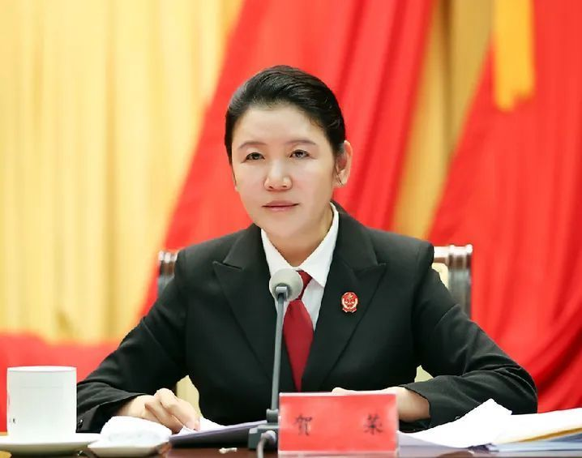

# 最高法副院长贺荣履新司法部部长，曾是反腐有力“打虎女将”

中国人大网2月24日公布《全国人民代表大会常务委员会决定任免的名单（2023年2月24日第十三届全国人民代表大会常务委员会第三十九次会议通过）》：免去唐一军的司法部部长职务；任命贺荣（女）为司法部部长。

察时局关注到，贺荣曾有30多年法院系统任职经历，任陕西省纪委书记期间，她因反腐有力被称为“打虎女将”。任职最高人民法院副院长期间，贺荣呼吁通过涉自贸案件审判，不断增强中国司法国际公信力影响力，在国际规则制定中发出更多“中国声音”，注入更多“中国元素”。

唐一军出生于1961年3月，山东莒县人，曾任辽宁省省长，2020年4月任司法部部长，后同时任司法部党组书记。今年1月，唐一军任江西省政协党组书记、主席。

_贺荣。资料图_

30多年法院系统任职经历

公开资料显示，贺荣是山东临邑人，1962年生，1984年毕业于中国政法大学，2006年获中国政法大学诉讼法学博士学位，二级大法官，第十九届中央纪委委员。

她曾历任北京市高级人民法院研究室副主任、副处级审判员、正处级审判员、研究室主任，北京市高级人民法院副院长、党组成员，北京市第二中级人民法院院长、党组书记（正局级），北京市高级人民法院副院长、党组副书记。

2011年12月任最高人民法院审判委员会副部级专职委员，后任最高人民法院副院长、党组成员、审判委员会委员。

2017年3月，贺荣出任陕西省委常委、省纪委书记，2018年1月，贺荣任陕西省委常委、省纪委书记，省监察委员会主任。同年3月，贺荣任陕西省委副书记、省纪委书记、省监察委员会主任。

三年后，2020年4月，贺荣重回最高法院，担任最高人民法院党组副书记、分管日常工作的副院长（正部长级）。

反腐有力的“打虎女将”

任陕西省纪委书记期间，贺荣因反腐有力被媒体誉为“打虎女将”。

贺荣任职期间，陕西省纪委查办了魏民洲系列腐败案；西安体育学院原副院长白跃世，西安工业大学原党委书记苗润才等高校领导干部腐败案件；还查处了中陕核工业集团原党委书记、董事长张宽民，原党委副书记、纪委书记杨建勋等人在矿产资源领域腐败案件。

2018年2月28日，陕西佳县县委书记辛耀峰涉嫌严重违纪违法接受纪律审查和监察调查，并被采取留置措施。这也是陕西省监委组建后第一例采取留置措施的案件。

基层一直是贺荣格外重视的领域，她多次强调基层巡视巡察工作的重要性，2017年9月28日，陕西省纪委、省监察厅领导班子听取全省巡察工作情况通报，贺荣在会上指出，开展巡察，是推动全面从严治党向基层延伸的有效方式，是加强基层党组织及其领导班子建设、密切党群干群关系、厚植党执政基础的有效途径，各级党组织和巡视巡察机构要深刻把握市县巡察在巡视大格局中的重要地位。

在2017年7月26日陕西省纪委监察厅召开的理论学习中心组学习（扩大）会暨传达省委有关会议精神大会上，贺荣强调，要聚焦扶贫等民生领域，严查侵害群众利益的不正之风和腐败问题。

呼吁国际规则制定中发出更多“中国声音”

任职最高法副院长期间，贺荣对发挥中国司法国际公信力颇为重视。

2016年11月15日在上海自贸区司法服务保障论坛暨浦东法院自贸区法庭成立三周年大会上，时任最高人民法院副院长的贺荣就借自贸区不断增强中国司法国际公信力提出了自己的观点，贺荣表示要继续发挥好自贸区“试验田”的司法引领作用和辐射效应，要以司法服务对外开放和制度创新为重点，立足中国国情和实际需要，树立国际视野，提升涉外国际影响力。

贺荣要求，应通过涉自贸案件审判，不断增强中国司法国际公信力影响力，在国际规则制定中发出更多“中国声音”，注入更多“中国元素”。

谈及法院信息化的意义，贺荣曾在全国高级法院院长座谈会上强调，信息化是新时期人民法院创新发展的重要支撑和动力。信息化服务依法治国战略的职责更加重大；信息化服务法院司法改革的任务更加繁重；信息化服务人民群众司法需求的使命更加艰巨；信息化为法院科学发展提供的机遇更加难得。如何紧抓机遇，推动信息化工作再上台阶，对各级法院特别是领导同志提出了新的考验。

她还提到要严格要求法院系统干部。2015年7月30日，最高人民法院党组成员、副院长贺荣在最高人民法院内部讲“三严三实”专题党课时强调，要坚持从严求实，把“三严三实”根植于思想和实践中，做敢于担当、善于担当和能够担当的好法官好干部。

在贺荣看来，敢于担当是党员干部的基本素质，也是党员干部的时代责任。要树立敢于担当、勇于担当的意识。要树立大局观念，立足于“四个全面”战略布局新要求，立足于经济发展新常态，立足于群众司法需求新变化，扎实做好执法办案及法院管理等各项工作。

采写：南都记者 刘嫚 发自北京

