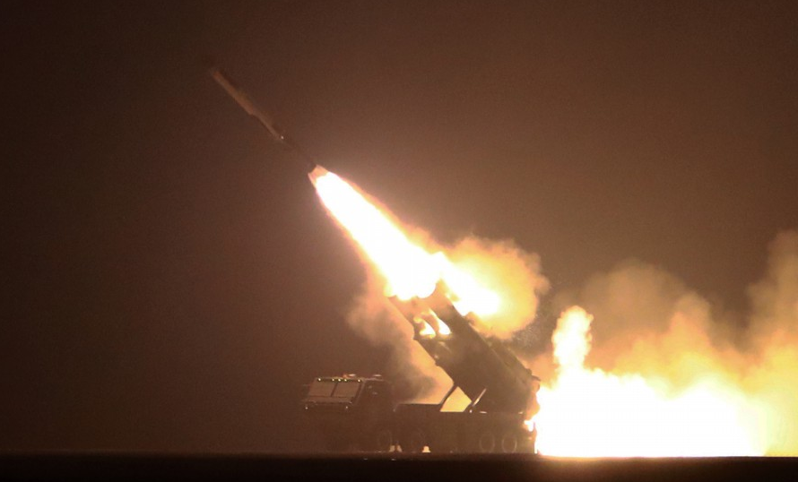

# 朝鲜首次公开战略巡航导弹的命名，射程约2000公里

朝鲜进行战略巡航导弹发射训练，并首次公开该导弹的名称。

据朝中社2月24日报道，朝鲜于23日进行了导弹发射演习，发射4枚战略巡航导弹。报道称，朝鲜人民军东部地区战略巡航导弹部队，在咸镜北道金策市一带向朝鲜东海发射了4枚“箭矢-2”型战略巡航导弹。

这是朝鲜首次向外界公开其新型战略巡航导弹的命名，朝鲜曾在2021年9月首次进行巡航导弹试射，但当时未向外界公布该导弹的命名。

报道称，发射训练取得了预期的成果，通过发射训练再次确认武器系统的可靠性，同时检验和判定朝鲜核遏制力的重要组成部分之一——战略巡航导弹部队的迅速反应能力。这次发射的4枚战略巡航导弹沿着在朝鲜东海设定的模拟2000公里界限距离的椭圆及八字形飞行轨道，共飞行1万208秒-1万224秒击中了目标。

分析人士认为，巡航导弹飞行在低空，可以和弹道导弹配合作战，提升朝鲜的远程精确打击能力，可打击韩国以及驻韩美军高价值战略目标，比如“萨德”、“爱国者”反导系统阵地、机场等。

据韩联社报道，美日韩三国于22日在韩国东部海域距离独岛180公里左右的公海上实施反导演习，韩国海军的“世宗大王”号驱逐舰、美国海军的阿利·伯克级驱逐舰“巴里”号和日本海上自卫队的“爱宕”号驱逐舰参加了联合演习。

