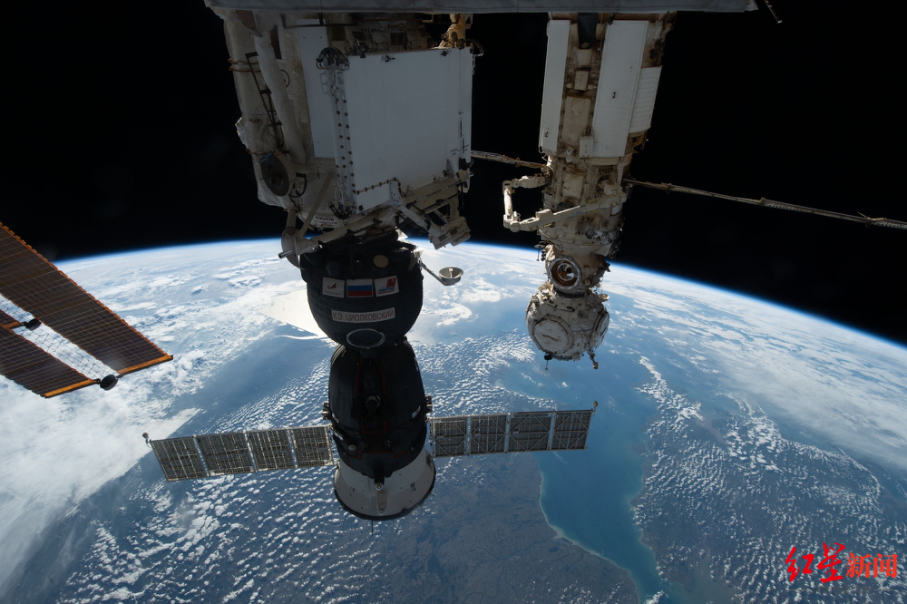

# 罕见太空救援！俄成功发射飞船，将解救遭困的2名俄罗斯宇航员和1名美国宇航员

当地时间24日，俄罗斯“联盟MS-23”飞船按计划从拜科努尔发射场点火升空。据悉，飞船预计在北京时间2月26日上午9时01分与国际空间站俄罗斯舱段的“搜索”模块对接。国际空间站第68乘组人员预计会在今年9月乘坐“联盟MS-23”飞船返回地球。

据报道，“联盟MS-23”飞船发射时没有搭载乘组人员，只有一个“零重力指示器”，当太空舱进入微重力状态时，它被设计为可以自由漂浮。在这次任务中，指示器是一只泰迪熊，用绳子绑在座位上。起初，“联盟MS-23”飞船计划在今年春季末发射，执行正常的乘组轮换任务。后来，俄罗斯航天局将其提前。

据悉，这是航天史上一次罕见的救援行动。去年9月，2名俄罗斯宇航员和1名美国宇航员搭乘“联盟MS-22”飞船抵达国际空间站执行太空任务。作为返回工具和紧急情况下的救生船，“联盟MS-22”飞船随后停靠在国际空间站上。当时，3名宇航员计划在今年春天返回。

但去年12月的一次意外改变了原定计划。当时，2名俄罗斯宇航员准备在国际空间站外部进行太空行走时，飞行控制人员注意到，停靠在国际空间站上的“联盟MS-22”飞船正在喷出液体冷却剂颗粒。由于美国宇航局和俄罗斯航天局希望更好地了解情况，太空行走最终被取消。

专家在分析后认为，由于微陨石的撞击，“联盟MS-22”飞船的温控系统发生泄漏。泄漏虽不影响国际空间站宇航员的安全，但宇航员却无法乘坐该飞船安全返回地球。

俄罗斯航天局表示，制造“联盟MS-22”飞船的RSC
Energia公司分析了过去15年飞船冷却系统的相关数据，并排除了任何制造缺陷。此外，俄美两国计划在今年3月份将受损的“联盟MS-22”飞船空载返回地球。

红星新闻记者 王雅林 实习记者 梁宏

编辑 何先锋 责任编辑 魏孔明

