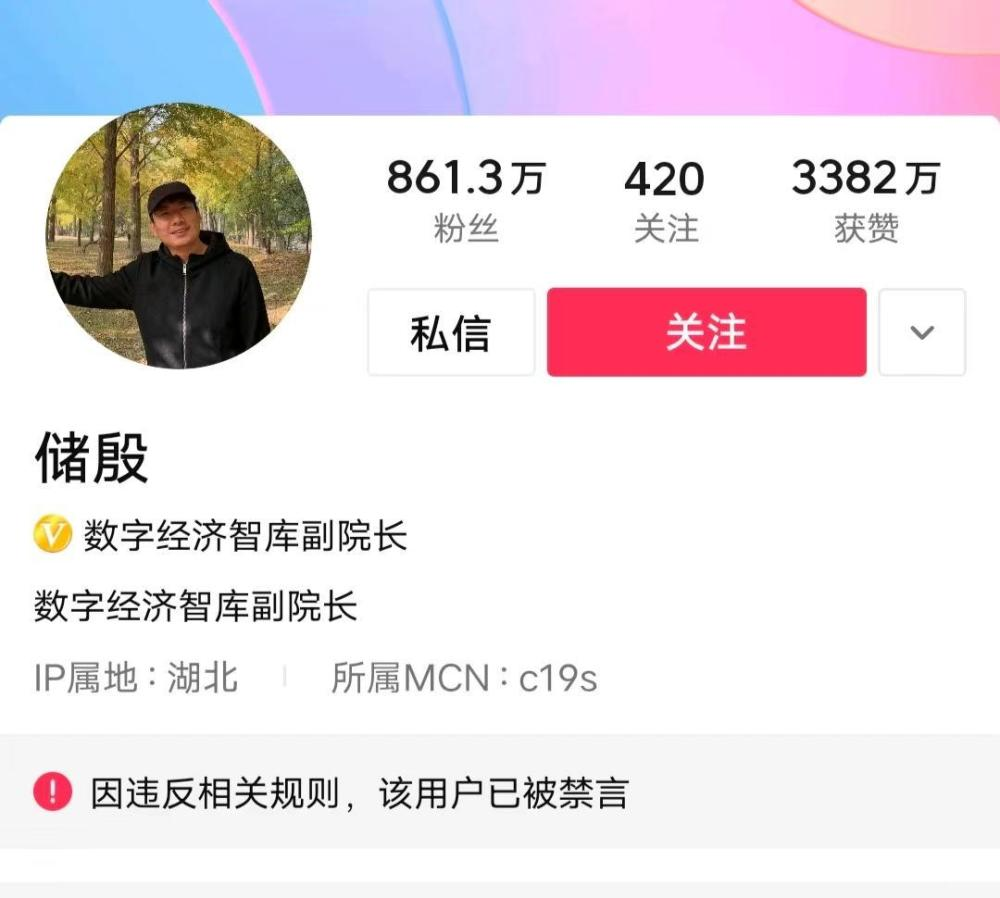

# 著名经济学家储殷多个平台账号被禁言

鞭牛士 2月24日消息，今日，数字经济智库副院长储殷的多个社交账号被禁言。

储殷305万粉丝的今日头条号，172.8万粉丝的微博账号，861万粉丝的西瓜视频账号均被禁言。相关页面显示，“因违反相关规则（法律法规），该用户已被禁言。”

据了解，储殷今年46岁，是中国人民大学博士，曾任国际关系学院公共管理系教授，但目前已经离职。

此前，储殷曾发表过年轻人不应该拼存款、成年人有权做个废物、董宇辉不过是读者文摘水位、建议30岁女性回老家、成年人有权做个废物等等言论。被网友批评为：看似是为年轻人发声，实则是制造焦虑，制造性别对立等。

