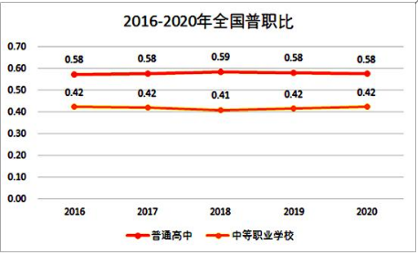

# 2022年新生儿或仅有不到600万人将参加高考？上大学会更容易吗？

继前不久多地小学发出“学位预警”后，近期部分幼儿园招生荒也登上微博热搜。

红星新闻记者梳理近11年高考报名人数和同年出生人口发现：从2012年到2022年，每年报名高考的人数稳定在1000万上下，不过出生人口在11年里下滑了1017万。从2021年开始，同年出生人口和高考报名人数已形成“逆差”，到2022年，二者“逆差”翻了13.8倍。

据数据推算，按照当前普职率和大学本科招录比，到2040年参加高考的人数或将降至不到600万，其中本科生或仅200余万。这一生源数量或将远小于大学的招生需求。

**小学学位预警与幼儿园“招生荒”同步上演**

“全面二孩”政策后，2016年和2017年出生人口迎来了小高峰，这两年新生儿数量都超过了1700万人，尤其2016年新增人口更是达到了1883万人。进入到2018年，“二孩政策”影响回落，当年出生人口1523万人，其后出生人口数量走低。

生育人口的变化，直接影响着基础教育生源的走向。按照6岁的入学门槛，2016年、2017年出生的孩子眼下进入正是入读小学的时段，集中出现的入学青少年，让广州、大连、长春等多个大中城市发出了2023年秋季义务教育入学的“学位预警”。

在近期出现小学入学难的同时，一些幼儿园又出现“招生荒”。根据国家统计局今年1月发布的数据，2022年我国出生人口为956万，自1950年来首次低于1000万。相比于2016年的新生儿“小高峰”，去年新生儿数量减少了927万。

红星新闻记者梳理6年来的出生人口发现，2018年我国出生人口数为1523万，到2019年回落至1465万，此后3年分别又降至1200万、1062万和956万。而这一批新出生人口，正是当下幼儿园招生的主力军。

**近1年内，高考报名数与同年出生人数“逆差”翻13.8倍**

相比于已经表现出的基础教育影响，人口变动对高等教育的辐射同样让人关注。

眼下，我国已经建成世界最大规模高等教育体系。红星新闻记者梳理近11年的高考报名人数发现，这11年每年参加高考的人数稳定在1000万上下，与此同时出生人口在这11年里下滑了1017万。自2021年开始，高考报名人数就开始低于同年出生人数。

记者统计发现，从2012年到2022年，其中2012年高考人数和出生人数差最大，二者缺口达到1058万（出生1973万，高考报名915万）。此后两项数据的差距逐步变小，但多维持在800万左右。

_图据国家统计局_

自2018年开始，同年的高考报名数和出生人口数比例开始大幅缩小，彼时两者差距缩至548万（2018年出生人口1523万，高考报名数975万）；到2019年缩至434万；2020年缩至129万。

2021年开始，出生人口数量开始低于同年高考报名人数，当年高考报名1078万，出生人数1062万，二者“逆差”达到16万；到2022年，高考报名人数升至1193万，出生人数却降至956万，逆差进一步提高到237万。换言之，一年内高考报名人数和出生人口数的“逆差”，翻了13.8倍。

_制图：杨雨奇_

一位人口专家表示，从人口发展的角度来说，人口无论是减少还是增加，最好是平稳进行、缓慢变化，这样才能让整个社会的经济发展平稳过度，对教育布局不产生太大冲击。

**按当前招录比或难覆盖高校招生需求**

以2022年出生人口基数（956万）计算，假设均完成了初中教育，按照当前初三毕业生参加中考升学的“普职比”（2022年普职比约为6:4）即其中60%参加高考，那么2022年的新生儿中，也将只有不到600万左右的学生在2040年参加高考。

按照教育部此前公布的2021年全国高考的本科录取率41.63%的比例推算，到2040年参加高考的这600余万名考生中，能考上本科的学生仅有约249万余人。即便是按照去年甘肃省的最高录取率60%计算，2022年出生的大学本科学子规模也仅365万左右。

_图据中国教育在线_

据教育部去年9月发布的《2021年全国教育事业发展统计公报》，我国共有高等学校3012所。其中，普通本科学校1238所（含独立学院164所），比上年减少11所。以365万余名的生源规模，在当前的招录比例之下，或将难以覆盖高校的招生所需。

“从当下的幼儿园，到未来的中小学，乃至高等学校，都将面临生源短缺的问题。”中国教育科学研究院研究员储朝晖在接受红星新闻采访时指出，按照当前的人口数量发展趋势，如果继续执行当前的招录政策，那么高校将面临生源不足的情况。

中国社会科学院战略研究院院长张翼此前也撰文分析，从第七次全国人口普查到第八次全国人口普查之间的十年，将会经历由于初中和高中教育阶段学龄人口占比下降，导致初级中学和普通高级中学数量减少的过程。在青年人口转型过程中，大学专科和大学本科的招生生源也将受到一定程度的影响。上述人口专家指出，985大学扩招是有限的，我们需要的是高质量的学校，“有一些院校在未来缩减甚至消失是正常的，最终大浪淘沙，高质量的留下，低质量的淘汰。”

**专家称低效能学府面临关停压力**

在储朝晖看来，在“生源蛋糕”缩小的背景下，未来谁会面临办学阻力甚至“关门”，至今并不能简单下定论。但从趋势来说，其中不能满足社会人才需求，效能低下，办学质量较差的学校，更大概率会首先陷入“生源危机”。

厦门大学经济学系副教授丁长发也在接受第一财经采访时指出，不同类型的高校受出生人口下滑的影响差异很大。好的大学招生没问题，未来招生生源受影响较大的高校是高职院校、民办高校。“即便未来参加高考的人数会较当下锐减，有部分学校面临关停压力，但也不会出现‘考大学无竞争，人人上大学’的局面。”超朝晖同时分析指出，一方面并非每个人都有上大学的意愿：“有的人会主动选择职校等或提前就业。”

另一方面，储朝晖表示，从国际上的情况来看，无论是何阶段，优质教育资源依旧竞争激烈。“未来高等教育普及率提升会是必然趋势，愿意上大学群体的机会会提高很多，但这并不意味着竞争的减弱，好的大学依旧会是白热化竞争。”储朝晖说。

在国际上，低生育率下“高考难”的情况并不罕见。以韩国为例，根据韩国统计局近期发布的数据，韩国2022年出生人口比前一年减少4.4%，创韩国有相关记录以来新低。相较于中国，韩国更早进入低生育境遇，但韩国优质教育的考学竞争依旧白热化。数据显示，韩国本科录取率约为50%，但其中仅2%的学生能进入韩国顶尖院校。而在储朝晖看来，中国未来顶尖学府的竞争压力也同样不会消失。

因此储朝晖看来，无论任何阶段，高校的办学生命力与教育教学质量直接挂钩。所以高校未来的办学思想，不应该在增加重复科目、专业、学院等扩招方向上下功夫，应当极力减少求大求全的专业设定，而是锚定一个或多个办学特色项目，做好分层教育、特色教育，提供社会需求的运用型教育。

红星新闻记者 杨雨奇 胡伊文

编辑 邱添

