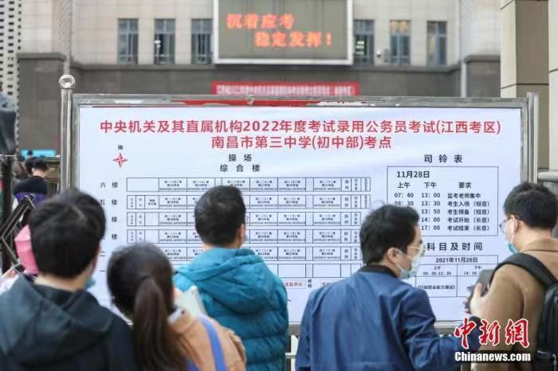
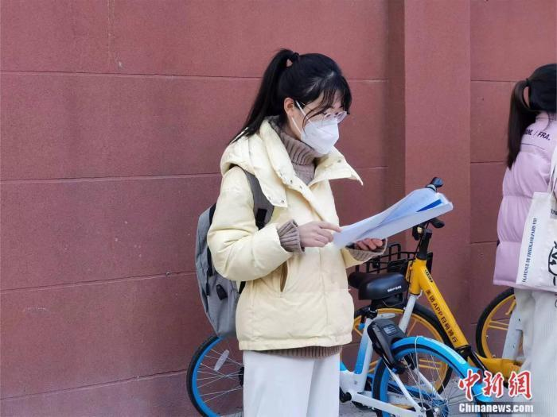

# 20余省份今举行公务员省考：多地扩招增幅超50%，利好应届生

中新网北京2月25日电(刘欢)今日，20余省份将举行2023年公务员招录的笔试。在2023年的招录中，多地公务员岗位面向应届毕业生进一步扩招，并多举措鼓励、引导各类人才投身基层建设。

_资料图：考生参加国考笔试
中新社发 苏阳 摄_

**多省份扩招增幅超50%，推出应届生利好政策**

观察各地2023公务员招录计划，多数省份公务员招录规模都有所扩大，部分地区计划招录人数过万。比如，广东全省各级机关计划招考公务员18258名，湖北2023年度省市县乡计划招录公务员11268名。

从招录增幅上看，甘肃省、云南省、广西壮族自治区、内蒙古自治区4地扩招超过50%，其中甘肃省扩招规模79.7%。

具体来看，部分省份面向应届生扩大公务员的招录幅度。

例如，河南2023年全省计划录用公务员9134人，其中34%的职位不限制专业，98%的职位不要求基层工作经历，对2023年应届硕士、博士研究生(非在职人员)，报考年龄放宽到40周岁以下。

四川省突出服务高校毕业生就业，市级以下机关职位主要招录高校毕业生。“四级联考”中99%的招录计划应届毕业生可报考，其中1958个计划限招高校毕业生。

河北省专设面向普通高校应届毕业生招录计划共3708个，进一步畅通高校毕业生进入党政机关渠道，促进重点群体就业。

“2023年公务员考试政策对高校毕业生有诸多利好，考生应珍惜机会认真应考。”华图教育研究院专家刘有珍指出，今年无论是国考还是多地省考，招录和报考人数都有增长，公务员的扩招有利于丰富高校毕业生的就业选择。

_资料图：2021年11月28日，江西南昌，考生们在查看考场安排表 中新社记者 刘力鑫 摄_

**大力支持基层岗位招录，充实一线人才队伍**

由招录公告可见，2023年公务员岗位多根据地方需求设置，各地多举措鼓励各类人才投身基层一线建设。

例如，陕西全省各级机关面向社会公开考试录用公务员6360名，其中省级机关142名，市、县(市、区)、乡(镇、街道)机关5365名。

四川的“四级联考”中，县乡机关6639名，其中乡镇机关2407名；基层选调生的1016个计划、“定向招考”的726个计划均补充到县乡机关，进一步充实基层治理和乡村振兴工作力量。

“在社会多元化发展的今天，对基层公务员队伍提出更新更高的要求，基层机关需要更现代化的管理方式，需要有新知识、新思路的年轻人到基层一线建功立业。”刘有珍分析。

中央党校(国家行政学院)教授竹立家此前也对媒体分析，近些年，公务员招录政策一直在鼓励大学生到基层岗位建功立业，一方面为大学生提供更多元的就业选择，另一方面，也在不断提高基层公务员队伍的能力素质。

_资料图：2023年1月国考举行。北京一考点外，考生正在复习
刘欢摄_

**人岗匹配度进一步提升，加大紧缺人才招录**

专家表示，从近几年的招录要求来看，公务员招考的专业要求更加细化，进一步提高人岗匹配度。

具体来看，多地招录公告都提出要进一步推进分级分类考试，注重体现不同层级机关的用人需求。

例如河北等地的考试将公共科目申论笔试试卷分为三类命题，对县级及以上综合管理类职位突出测评理论思维、综合分析等方面能力，对行政执法类职位突出测评依法办事、公共服务等方面能力，对乡镇综合管理类职位突出测评贯彻执行、基层工作等方面能力。

四川的省级机关部分职位差异化设置本科研究生专业、按需调整笔试面试成绩占比、进一步提升职位资格条件设置的精准性科学性，补充复合型专业人才。

此外，一些地区还特别提到要根据当地发展需求，加大紧缺人才领域的招录力度。

云南在2023年公务员招录中，县乡两级机关录用计划共4822名，占比84.7%，其一乡镇机关录用计划2117名，占比37.2%。设置450名计划重点补充自然资源、生态环保、道路运输、应急管理等一线执法队伍。

河北则提出要鼓励引导县级以上机关和非艰苦边远地区乡镇结合职位特点和工作需要设置专业条件，加大城乡规划、金融经济、环境科学、信息产业、医药生物等领域紧缺人才招录力度。

对此，中国人民大学公共管理学院组织与人力资源研究所教授刘昕表示，公务员所处的是一个复杂的行政系统，在不同地区、类型和不同层级党政机关中工作的公务员的工作要求以及所处的工作环境实际上差别很大，广大考生应该根据自身情况选择岗位，衡量自己是否能够适应当地机关的工作环境和要求。(完)

来源：中国新闻网

