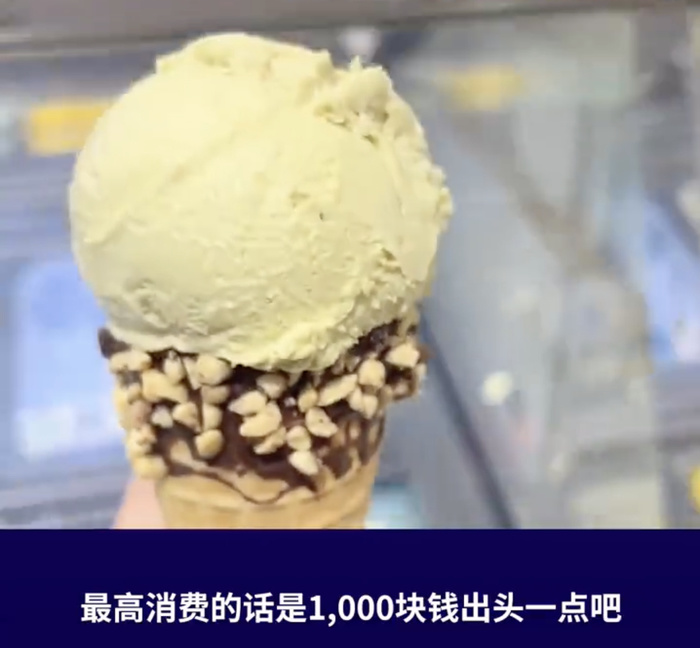
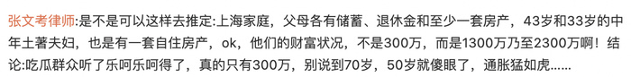
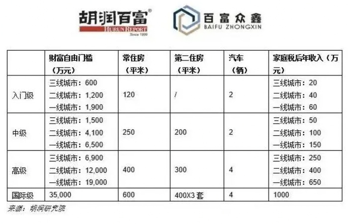

# 上海80后夫妻攒300万决定退休，网友吵翻：存多少钱才能退休？

近日，上海80后夫妻在社交媒体称存款到300万，决定双双“退休”，引发热议。

小陈女士表示，自己今年33岁，丈夫40岁了，去年两人双双失业了，这个年龄出去不好找工作了，索性就不工作了。丈夫之前是做房地产行业的，自己是娱乐游戏行业，300万存款大部分都是丈夫存的。今年她打算把这些存入大额存单，再拿出一部分去炒股或者买基金，每个月理财收入有1万元，她预计300万能用到约70岁。

他们觉得自己责任心不强，所以不想养育孩子。想趁着年轻吃喝玩乐，享受生活。

夫妻双方都只有一位父母了，两位老人都支持他们的决定，因为年事已高也带不动孩子，支持子女做让自己开心的事。

**网友：不敢想**

这对夫妻的决定让很多人感到羡慕，但也有很多人为他们感到担忧。

对于有多少钱存款才能达到财富自由，网友看法不一。

**攒够多少钱能提前退休？**

1994年，麻省理工学院学者威廉·班根（William
Bengen）提出“4%原则”：只要在退休第一年从退休金本金中提取不超过4.2%，之后每年需要提取的金额=总额×（4%+通胀率），即使到过世，退休金都花不完。

根据这个原则，按照你每年需要多少生活费，就可以计算出你要存到多少钱才能提前退休。

那么多少钱能达到财富自由呢？

《2021胡润财富自由门槛》报告。据报告，中国一线城市入门级财富自由门槛1900万元，中级6500万元，高级1.9亿元。报告将财富自由分为入门级、中级、高级和国际级四个阶段，并细分到中国一二三线三类城市，“胡润财富自由门槛”主要考虑常住房、金融投资和家庭税后年收入。

你认为存款多少钱，才能有安全感？

（综合新浪微博、毒财经、潇湘晨报）

