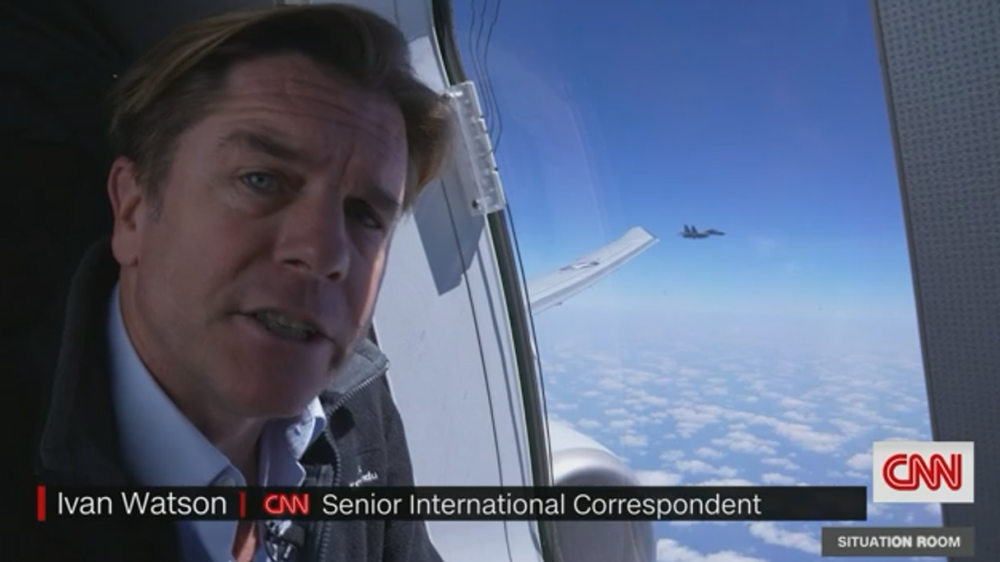

# 美媒曝光美军机带上美记者窜扰南海被解放军战机警告驱离一幕

【环球网报道记者
张晓雅】“中国战机与美国海军军机在南海（上空）对峙。”美国有线电视新闻网（CNN）当地时间24日以此为题进行炒作，曝光美国军机带上美媒记者窜扰中国南海岛礁时受到中国人民解放军无线电警告和驱离一幕。

美国《华尔街日报》称，这一幕发生在周五（2月24日）。根据CNN的描述，美国海军P-8A巡逻机在南海上空21500英尺、距离西沙群岛仅30英里的高空飞行，而获得所谓罕见机会乘坐美军机的CNN记者目睹了美军机受到中方警告一幕。

CNN称，当时，美军巡逻机无线电里传来来自中国人民解放军的警告，“美国军机。（这里距离）中国领空12海里。不要再靠近了，否则你将承担所有责任。”

报道继续称，几分钟后，一架配备空对空导弹的中国战机在距美国军机左侧仅500英尺（约152米）处拦截了这架美国军机。另据《华尔街日报》补充，这是装备有四枚空对空导弹的中国歼-11喷气式战机。

“中国战机离得如此之近，以至于CNN工作人员可以看到（中国）飞行员转头看着他们，还能辨认出（中国军机）尾翼上的红五角星标志和军机装备的导弹，”CNN称。

报道继续说，美国军机飞行员尼基•斯劳特随后应答中方警告，“解放军战机，这里是美国海军P-8A……我请你离开我的左翼，我准备向西飞行。请你也这样做，完毕。”“中国战机没有回应，并在伴飞美军机15分钟后掉头离开，”CNN说。

CNN还渲染称，对于搭乘美军机的CNN工作人员来说，这是南海紧张局势以及美中紧张局势发酵的例证。不过，美国海军此次任务指挥官有不同的看法，美海军中校马克•海恩斯告诉CNN，“我想说，这只是南海的另一个周五下午。”

对于美方舰机在南海的活动，中方多次明确表示，美方舰机对中国岛礁进行抵近侦察的有关举动极易引起误判和引发海空意外事件，是十分危险和不负责任的。

不仅如此，这家美媒还炒作美军机周五试图骚扰中国军舰一幕。报道声称，美国海军P-8侦察机当天在靠近菲律宾飞行时，发现了一艘中国人民解放军导弹驱逐舰，美军机下降到大约1000英尺的高度“抵近观察”，但受到来自中方的警告。

“美国军机。美国军机。这里是中国海军军舰舷号173（长沙舰）。你正在低空接近我。说明你的意图，完毕。”CNN援引美军机收到的无线电警告称。美军飞行员斯劳特对此回应声称，美军机将保持安全距离。

“美国军机。美国军机。这里是中国海军军舰舷号173（长沙舰）。你显然威胁到了我的安全。你显然威胁到了我的安全，”报道援引中方回答称。美军机随后继续声称会保持安全距离，美海军还宣称，美方任务是例行公事。

CNN曝光美军机侵扰一幕的同时，还援引五角大楼的说法为美方辩解称，美国舰船和飞机经常在国际法允许的范围内活动。中国外交部发言人此前表示，美方一些人老提航行自由，只要认真研究相关国际法，比如说《联合国海洋法公约》，就会发现航行和飞越自由绝不等于外国的军舰、军机可以不受限制、无视甚至损害其他国家的主权和合法权利及航行航空安全。

智库“南海战略态势感知”近日发布最新数据称，今年1月，美军共出动64架次侦察机到南海进行抵近侦察。在2月9日的外交部例行记者会上，发言人毛宁表示，美国是全球最大的监控侦察国家，长期在世界各地开展情报活动，美国频繁派舰机在中国周边抵近侦察，严重危害中国国家安全，破坏地区和平稳定。中方已经多次表示严重关切，美方应当立即停止此类挑衅行为。

