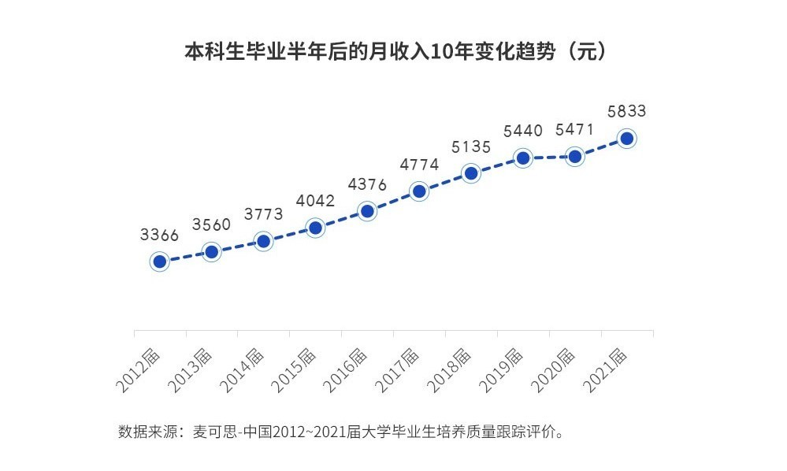

# 仅6.1％应届本科生起薪过万，很幸福但工资不高的工作受欢迎

“金三银四”招聘季即将拉开帷幕，2023应届毕业生加入求职大军。截至目前，2021届应届毕业生已经进入职场满一年，他们的薪资情况与工作满意度给等待进入职场的大学生提供参考。

薪资是求职者最关注的部分，大学毕业生被认为是职场中的高薪人群。中国青年报曾面向全国各大地区大学回收的2700份调查问卷得出的数据，超过20%的大学生认为自己毕业后月薪可以过万。然而，现实与理想之间存在比较大的差距。

根据麦可思曾对大学毕业生的收入分布分析显示，2021届本科毕业生的平均薪资为5833元，为近10年中最高水平。

分区间来看，38.4%的2021应届生毕业起薪集中在4000~6000元之间，月薪6000~8000元的应届毕业生占比23.7%。而近期在网上被频繁讨论的“月入过万”群体，在应届本科生里只占6.1%，该比例高于2020届的（4.3%），但依旧是极少数人群。

即便是一些人们普遍认为的“高薪行业”，应届毕业生也很难做到“一步破万”。2021届本科生从业平均收入较高的行业，包括信息传输、软件和信息技术服务业（6781元），电子电气设备制造业（含计算机、通信、家电等，6508元），运输业（6351元），金融业（6100元），平均月薪均在6000~7000元。

在高薪行业，大学生的涨薪空间较为乐观，但行业仅能涵盖少量职场人。在毕业三年后（2018届），毕业生平均薪资破万的行业是信息传输、软件和信息技术服务业，为10691元。

麦可思研究认为，大学生平均工资水平受行业发展、劳动力供求关系，以及地区经济发展水平等多重因素影响。就业蓝皮书数据显示，在一线城市就业的本科生（2021届）毕业初期月收入为7332元；工作三年后（2018届）的平均薪资可达到11281元。

值得注意的是，当代年轻职场人在注重薪资水平的同时，关注工作与生活的平衡，更加看中工作的幸福感。麦可思就业蓝皮书数据显示，2021届大学毕业生中，担任公检法机关工作人员、法律专业人员、医护人员、研究人员等职业的本科生，拥有较高的就业满意度，分别为82%、78%、77%、77%，但月收入不及高收入行业，较之“月入过万”存在差距。尽管在求职过程中，工资是应聘者最关注的部分，但
“工资不高但幸福度高的工作”在近年来受到欢迎。

界面新闻此前报道，近半数职场人优先选择“钱少、事少、不累”的工作，越来越多的职场人期待投入更多的精力到生活中，对工作时间之外的生活充满期待。

