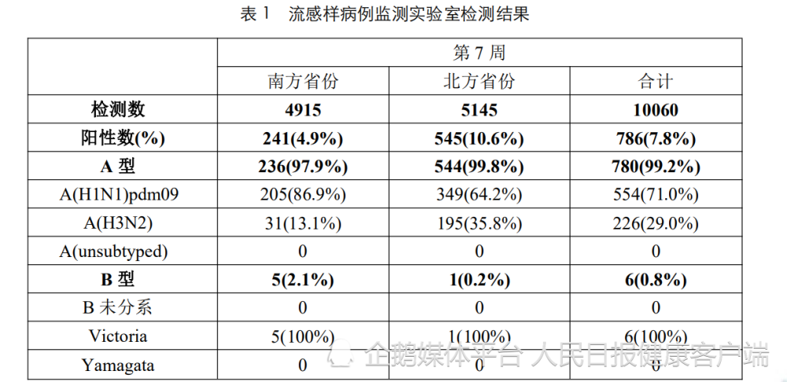

# 北京流感病例数超过新冠，流感是否会与新冠叠加影响？

**人民日报健康客户端记者 刘静怡**

2月22日，北京疾控中心发布最新疫情周报，报告显示，2月13日-2月19日，报告病例数排名第一的为流行性感冒，超过新冠病毒感染病例。2月25日，中日友好医院呼吸科主任医师陈欣告诉人民日报健康客户端记者，初春正值流感发生高峰。

人民日报健康客户端记者统计发现，近期，我国多地报告流感病例增加，天津、浙江杭州等地区中小学出现因流感而停课的情况。2月20日，安徽省疾控中心官微消息称，该省近期流感病毒活动水平明显增强，以甲型H1N1流感为主。

根据国家流感中心2月23日发布的最新一期《流感监测周报》监测数据，我国流感病毒检测阳性率较前一周继续上升，数据表明，甲型H1N1流感病毒在检测样本中占比最高，达到71%。

_《流感监测周报》数据截图。_

“流感发生的高峰一般就是在冬季和初春，每年都是如此。”陈欣告诉人民日报健康客户端记者，去年冬天流感尚不明显的原因可能是被新冠感染掩盖了，度过新冠感染高峰后，流感的表现则更加明显。

陈欣表示，新冠病毒感染和流感病毒感染初期的症状均类似上呼吸道感染症状，包括发热、咽痛等，在症状上不易区分。想要辨别是得了普通感冒、流感还是新冠感染，可以进行抗原检测，“流感也有抗原检测，使用方式与新冠抗原类似，医院和网上均可购买到，检测后就知道自己是什么情况了。”

中国疾控中心发布的《中国流感疫苗预防接种技术指南（2022-2023）》指出，全球新冠疫情流行态势仍在持续，冬春可能会出现新冠与流感等呼吸道传染病叠加流行的情况。流感和新冠是否会导致双重感染，叠加产生影响？陈欣解释，“理论上是这样的，也有发现过双重感染的病人，但这类情况较少。”

如何预防和应对流感？陈欣提醒，在流感早期可及时服用奥司他韦进行治疗，“要早期使用，在出现发热症状48小时之内使用效果最好。”此外，每年秋冬季节都可以注射流感疫苗，对于预防流感效果较好。同时，也要保持良好的个人卫生习惯，避免与流感患者接触，戴口罩、勤洗手，做好防护措施。

