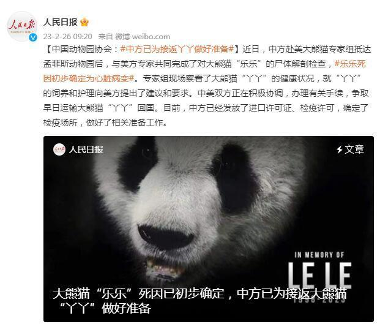
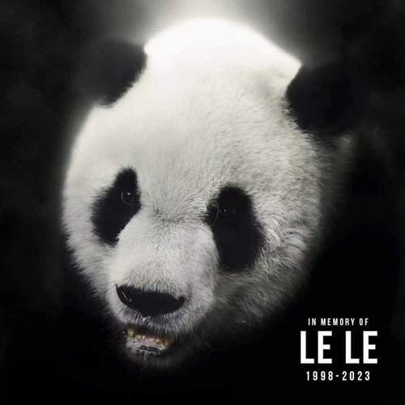
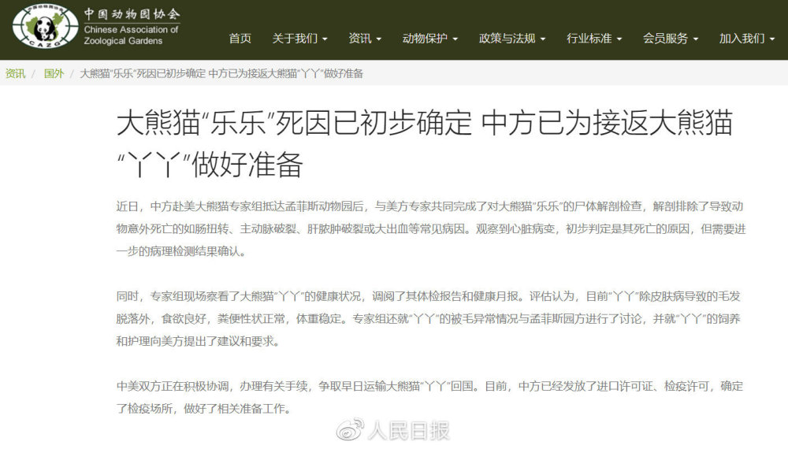

# 大熊猫“乐乐”死因已初步确定，中方已为接返大熊猫“丫丫”做好准备

来源：人民日报微博

近日，中方赴美大熊猫专家组抵达孟菲斯动物园后，与美方专家共同完成了对大熊猫“乐乐”的尸体解剖检查，解剖排除了导致动物意外死亡的如肠扭转、主动脉破裂、肝脓肿破裂或大出血等常见病因。
**观察到心脏病变，初步判定是其死亡的原因，但需要进一步的病理检测结果确认。**

同时，专家组现场察看了大熊猫“丫丫”的健康状况，调阅了其体检报告和健康月报。
**评估认为，目前“丫丫”除皮肤病导致的毛发脱落外，食欲良好，粪便性状正常，体重稳定。专家组还就“丫丫”的被毛异常情况与孟菲斯园方进行了讨论，并就“丫丫”的饲养和护理向美方提出了建议和要求。**

中美双方正在积极协调，办理有关手续，争取早日运输大熊猫“丫丫”回国。目前，中方已经发放了进口许可证、检疫许可，确定了检疫场所，做好了相关准备工作。

**【早前报道】**

2023年2月2日，中国动物园协会接到美国孟菲斯动物园通知，旅美开展大熊猫保护合作研究项目的25岁大熊猫“乐乐”于美国当地时间2月1日早晨被发现死亡。中方对此深表遗憾和惋惜。

中国相关部门对大熊猫“乐乐”突然去世十分关切，已通知美方妥善保存尸体，并及时组建专家组，尽快前往美国孟菲斯动物园，与美方专家共同开展大熊猫死亡原因调查。

大熊猫“乐乐”为1998年7月出生的雄性个体，2003年赴美国孟菲斯动物园开始合作研究，带给美国公众许多欢乐，受到美国人民普遍喜爱，并为促进两国大熊猫保护合作和人民友好交流发挥了重要的桥梁作用。

来源：中国动物园协会​​​​

